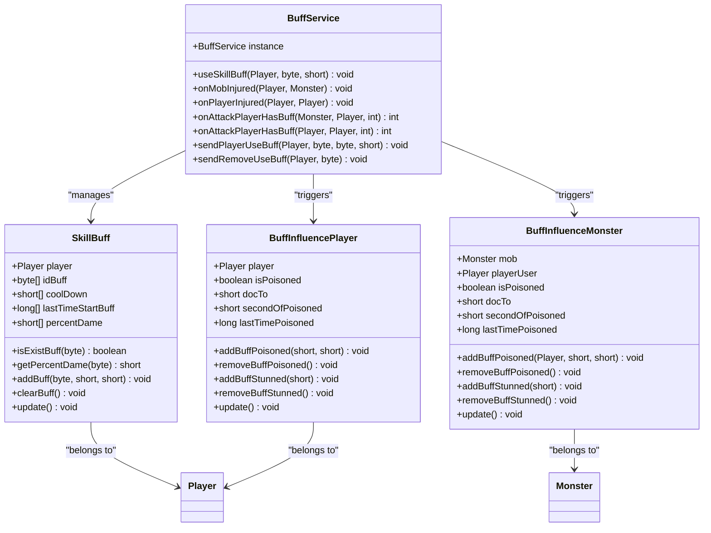
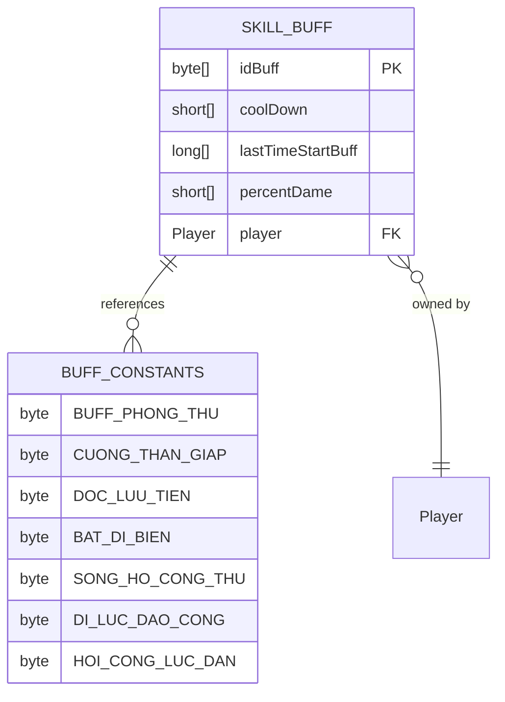
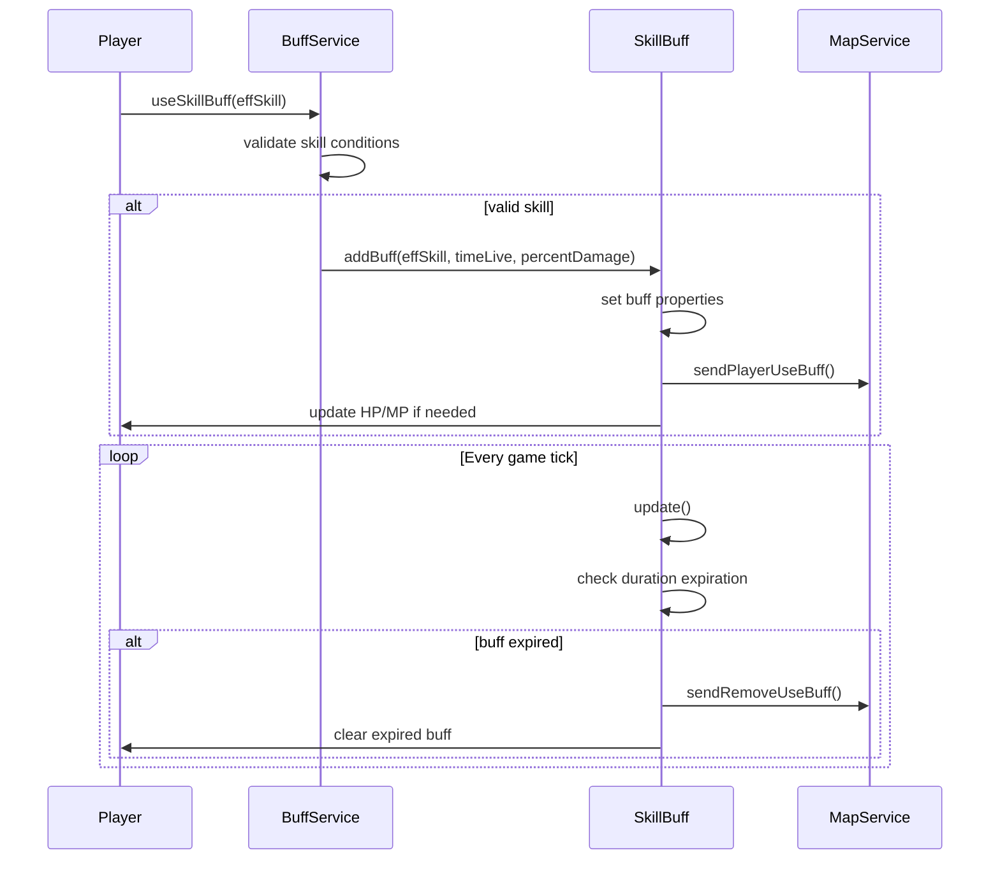
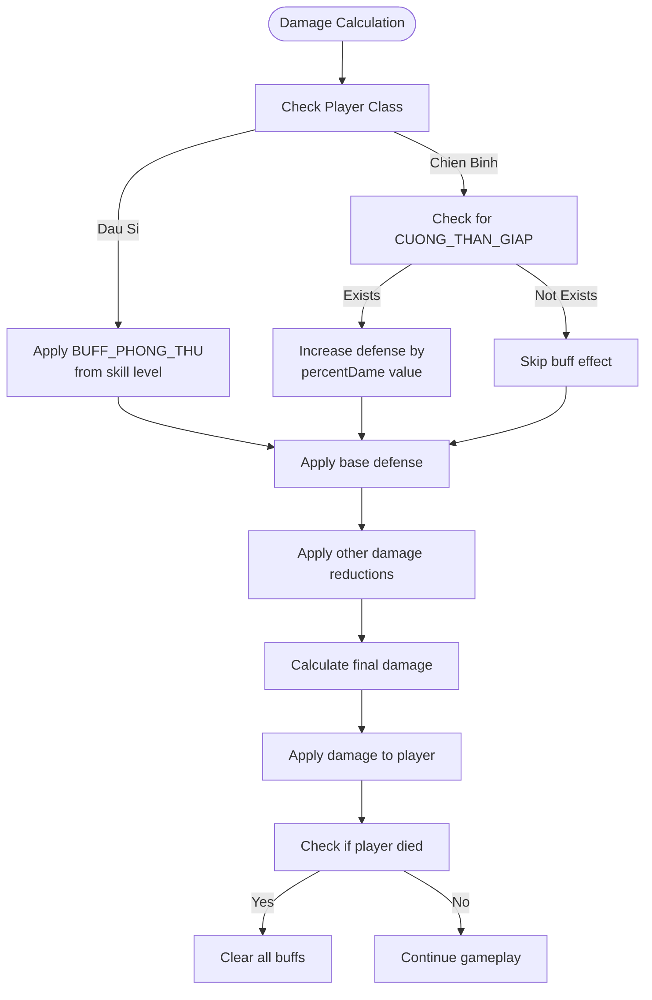
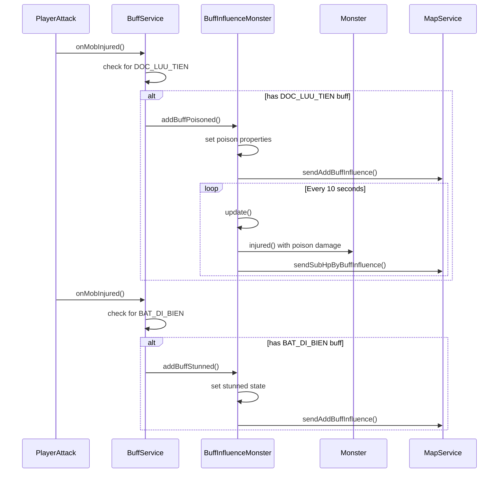
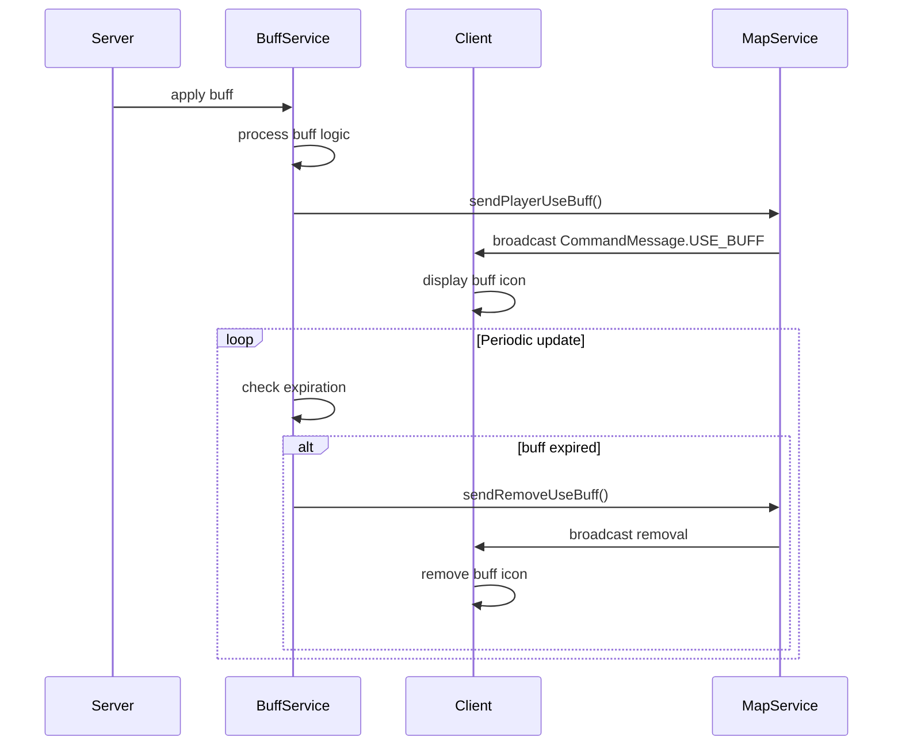

# Buff and Debuff System

<cite>
**Referenced Files in This Document**   
- [BuffConst.java](file://src/main/java/consts/BuffConst.java)
- [BuffService.java](file://src/main/java/services/BuffService.java)
- [SkillBuff.java](file://src/main/java/skill/SkillBuff.java)
- [Player.java](file://src/main/java/player/Player.java)
- [BuffInfluencePlayer.java](file://src/main/java/skill/BuffInfluencePlayer.java)
- [BuffInfluenceMonster.java](file://src/main/java/skill/BuffInfluenceMonster.java)
- [Manager.java](file://src/main/java/manager/Manager.java)
</cite>

## Table of Contents
1. [Introduction](#introduction)
2. [Core Components](#core-components)
3. [Active Buff Data Model](#active-buff-data-model)
4. [Buff Application and Duration Management](#buff-application-and-duration-management)
5. [Effect Resolution in Combat](#effect-resolution-in-combat)
6. [Status Effect Implementation](#status-effect-implementation)
7. [Concurrency and Thread Safety](#concurrency-and-thread-safety)
8. [Client-Server Synchronization](#client-server-synchronization)
9. [Extension Guidelines](#extension-guidelines)
10. [Conclusion](#conclusion)

## Introduction
The Buff and Debuff System governs temporary combat effects in the game, providing dynamic gameplay through skill-based modifiers that alter player and monster behavior. This system implements a comprehensive framework for applying, tracking, and expiring temporary effects such as defense amplification, attack enhancement, poisoning, and stunning. The architecture centers around the SkillBuff and BuffService components, which work in conjunction with player and monster state management to create a responsive combat experience. The system handles both active buffs applied by skills and passive effects triggered by specific conditions, with careful attention to duration management, stacking rules, and effect resolution.

## Core Components

The buff system consists of several interconnected components that work together to manage temporary effects. The primary classes include SkillBuff for managing active player buffs, BuffInfluencePlayer and BuffInfluenceMonster for handling status effects like poison and stun, and BuffService as the central coordinator for buff-related operations.



**Diagram sources**
- [SkillBuff.java](file://src/main/java/skill/SkillBuff.java)
- [BuffInfluencePlayer.java](file://src/main/java/skill/BuffInfluencePlayer.java)
- [BuffInfluenceMonster.java](file://src/main/java/skill/BuffInfluenceMonster.java)
- [BuffService.java](file://src/main/java/services/BuffService.java)

**Section sources**
- [SkillBuff.java](file://src/main/java/skill/SkillBuff.java)
- [BuffInfluencePlayer.java](file://src/main/java/skill/BuffInfluencePlayer.java)
- [BuffInfluenceMonster.java](file://src/main/java/skill/BuffInfluenceMonster.java)
- [BuffService.java](file://src/main/java/services/BuffService.java)

## Active Buff Data Model

The active buff system uses a fixed-size array structure to track up to seven simultaneous buffs per player. The SkillBuff class maintains parallel arrays for buff IDs, cooldown durations, start times, and damage percentages, enabling efficient lookup and management of active effects.



The data model employs a sparse array approach where unused slots are marked with -1 values. This design choice avoids the overhead of dynamic collections while providing O(1) access to buff properties. Each buff slot corresponds to a specific buff type defined in the Manager.BUFF_TYPE array, which maps skill effects to their respective indices in the SkillBuff arrays.

**Diagram sources**
- [SkillBuff.java](file://src/main/java/skill/SkillBuff.java#L18-L92)
- [BuffConst.java](file://src/main/java/consts/BuffConst.java#L6-L29)
- [Manager.java](file://src/main/java/manager/Manager.java#L150-L152)

**Section sources**
- [SkillBuff.java](file://src/main/java/skill/SkillBuff.java#L18-L92)
- [Manager.java](file://src/main/java/manager/Manager.java#L150-L152)

## Buff Application and Duration Management

Buffs are applied through the useSkillBuff method in BuffService, which validates skill usage conditions before applying effects. The system checks player state, skill cooldowns, and MP requirements before adding a buff to the player's SkillBuff instance.



The update method in SkillBuff runs periodically to check for expired buffs. It compares the current time with the start time plus cooldown duration for each active buff, removing effects that have exceeded their time limit. Special handling exists for certain buffs like BuffConst.HOI_CONG_LUC_DAN, which triggers player stat recalculation upon application and removal.

**Diagram sources**
- [BuffService.java](file://src/main/java/services/BuffService.java#L18-L70)
- [SkillBuff.java](file://src/main/java/skill/SkillBuff.java#L60-L92)

**Section sources**
- [BuffService.java](file://src/main/java/services/BuffService.java#L18-L70)
- [SkillBuff.java](file://src/main/java/skill/SkillBuff.java#L60-L92)

## Effect Resolution in Combat

The system modifies damage calculations through various methods in BuffService that intercept combat events. When a player is injured, their active buffs can reduce incoming damage based on class-specific mechanics.



The Player.injured() method demonstrates how buffs modify damage calculations. For Dau Si class players, the defense amplification (BuffConst.BUFF_PHONG_THU) is calculated based on skill level using Manager.getSkillDamPercent(). For Chien Binh class players, the attack enhancement (BuffConst.CUONG_THAN_GIAP) directly increases defense by a percentage value stored in the buff data.

**Diagram sources**
- [Player.java](file://src/main/java/player/Player.java#L31-L308)
- [BuffService.java](file://src/main/java/services/BuffService.java#L72-L135)

**Section sources**
- [Player.java](file://src/main/java/player/Player.java#L31-L308)

## Status Effect Implementation

Status effects such as poison and stun are implemented through the BuffInfluence system, which operates separately from the active buff system. These effects are applied by specific skills and have their own duration and behavior rules.



The BuffInfluence classes handle periodic damage from poison effects, applying damage every 10 seconds (defined by BuffConst.SECOND_SUB_HP_DOC_TO). Stun effects prevent monster actions for a specified duration. Both effects are automatically removed when their duration expires or when the affected entity dies.

**Diagram sources**
- [BuffService.java](file://src/main/java/services/BuffService.java#L72-L135)
- [BuffInfluencePlayer.java](file://src/main/java/skill/BuffInfluencePlayer.java#L17-L105)
- [BuffInfluenceMonster.java](file://src/main/java/skill/BuffInfluenceMonster.java#L17-L113)

**Section sources**
- [BuffService.java](file://src/main/java/services/BuffService.java#L72-L135)
- [BuffInfluencePlayer.java](file://src/main/java/skill/BuffInfluencePlayer.java#L17-L105)
- [BuffInfluenceMonster.java](file://src/main/java/skill/BuffInfluenceMonster.java#L17-L113)

## Concurrency and Thread Safety

The buff system employs synchronized methods to prevent race conditions when multiple threads access buff data simultaneously. This is critical in a multiplayer environment where combat events may occur concurrently.

```mermaid
classDiagram
class SynchronizedMethods {
+isExistBuff(byte) boolean
+getPercentDame(byte) short
+addBuff(byte, short, short) void
+clearBuff() void
+update() void
+addBuffPoisoned(short, short) void
+removeBuffPoisoned() void
+addBuffStunned(short) void
+removeBuffStunned() void
}
note right of SynchronizedMethods
All methods marked with @Synchronized
to ensure thread safety during
concurrent access from multiple
game threads
end note
```

The @Synchronized annotation is used extensively across the buff system to ensure that operations on shared data are atomic. This prevents race conditions when multiple skills are applied simultaneously or when combat events overlap. The synchronization ensures that buff state remains consistent even under high-concurrency scenarios typical in multiplayer combat.

**Diagram sources**
- [SkillBuff.java](file://src/main/java/skill/SkillBuff.java#L18-L92)
- [BuffInfluencePlayer.java](file://src/main/java/skill/BuffInfluencePlayer.java#L17-L105)
- [BuffInfluenceMonster.java](file://src/main/java/skill/BuffInfluenceMonster.java#L17-L113)

**Section sources**
- [SkillBuff.java](file://src/main/java/skill/SkillBuff.java#L18-L92)
- [BuffInfluencePlayer.java](file://src/main/java/skill/BuffInfluencePlayer.java#L17-L105)
- [BuffInfluenceMonster.java](file://src/main/java/skill/BuffInfluenceMonster.java#L17-L113)

## Client-Server Synchronization

The system maintains synchronization between server and client through message broadcasting. When buffs are applied or removed, the server sends notifications to all players in the map to ensure consistent visual representation.



Message serialization follows a specific format where buff information is encoded into byte streams. The USE_BUFF command includes operation type (ADD_BUFF, REMOVE_BUFF, VIEW_BUFF), player ID, buff effect ID, duration, and skill level. This compact representation minimizes network bandwidth while providing all necessary information for client-side display.

**Diagram sources**
- [BuffService.java](file://src/main/java/services/BuffService.java#L200-L286)
- [Player.java](file://src/main/java/player/Player.java#L31-L308)

**Section sources**
- [BuffService.java](file://src/main/java/services/BuffService.java#L200-L286)

## Extension Guidelines

To add new buff types to the system, developers must follow a structured approach that integrates with the existing skill template system. The process involves defining constants, updating configuration data, and implementing appropriate effect handlers.

```mermaid
flowchart TD
A[Define New Buff Constant] --> B[Update Manager Configuration]
B --> C[Implement Effect Logic]
C --> D[Add Skill Template]
D --> E[Update Client Resources]
E --> F[Test Integration]
A --> |In BuffConst.java| A1["public static final byte NEW_BUFF = XX;"]
B --> |In Manager.java| B1["Add to BUFF_TYPE array"]
B --> |In Manager.java| B2["Configure duration, damage, cooldown"]
C --> |In Player.injured()| C1["Add case for new buff effect"]
C --> |In BuffService| C2["Add trigger conditions"]
D --> |In database| D1["Add skill template entry"]
E --> |Client assets| E1["Add icon, animation"]
F --> |Unit tests| F1["Verify duration, stacking, removal"]
F --> |Integration tests| F2["Test combat scenarios"]
```

New buff types must be added to the Manager.BUFF_TYPE array in the correct order to maintain index consistency. Skill templates in the database must specify the appropriate effect ID to trigger the new buff. Client-side resources including icons and animations must be synchronized with server implementation to ensure proper visual feedback.

**Diagram sources**
- [BuffConst.java](file://src/main/java/consts/BuffConst.java#L6-L29)
- [Manager.java](file://src/main/java/manager/Manager.java#L150-L152)
- [Player.java](file://src/main/java/player/Player.java#L31-L308)
- [BuffService.java](file://src/main/java/services/BuffService.java#L18-L286)

**Section sources**
- [BuffConst.java](file://src/main/java/consts/BuffConst.java#L6-L29)
- [Manager.java](file://src/main/java/manager/Manager.java#L150-L152)

## Conclusion

The Buff and Debuff System provides a robust framework for implementing temporary combat effects in the game. Through the coordinated operation of SkillBuff, BuffService, and BuffInfluence components, the system delivers dynamic gameplay experiences with various status effects and stat modifications. The architecture balances performance considerations with gameplay complexity, using fixed-size arrays for efficient buff tracking and synchronized methods for thread safety. The system's integration with the skill template system allows for flexible extension and customization, while client-server synchronization ensures consistent state across all players. By following the established patterns for effect implementation and message broadcasting, developers can extend the system with new buff types that enhance the strategic depth of combat mechanics.