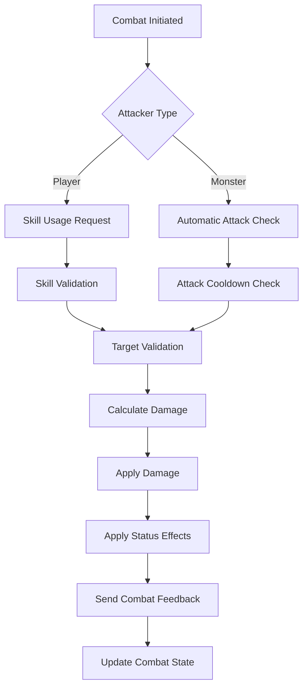
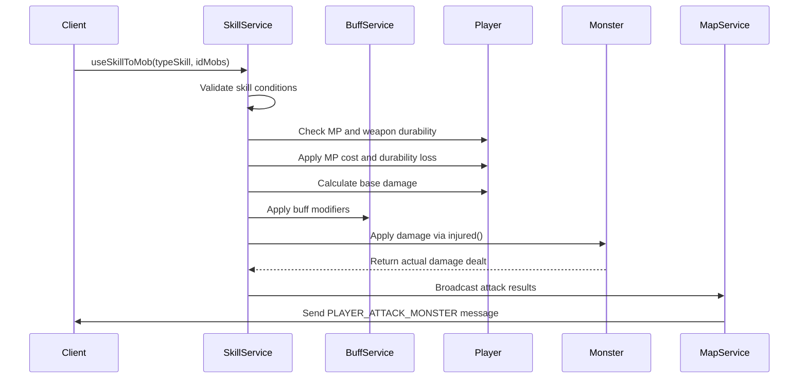
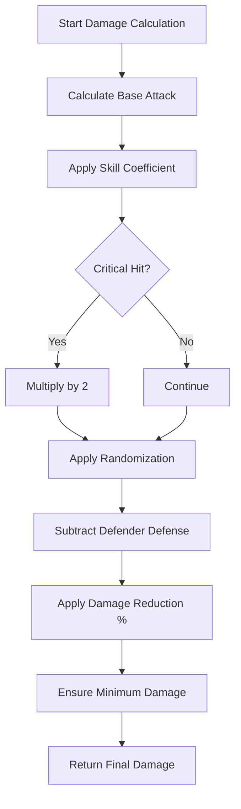
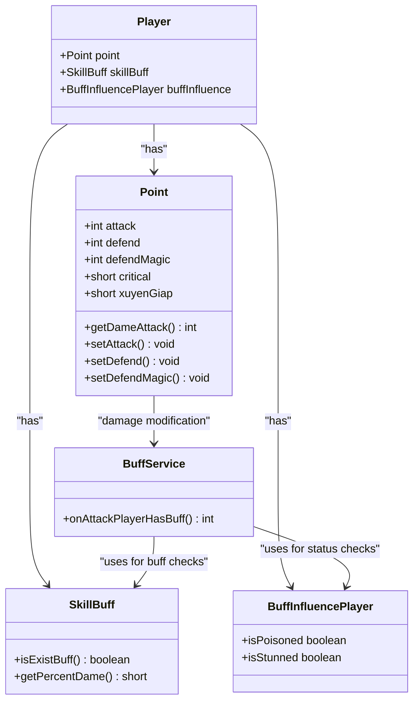
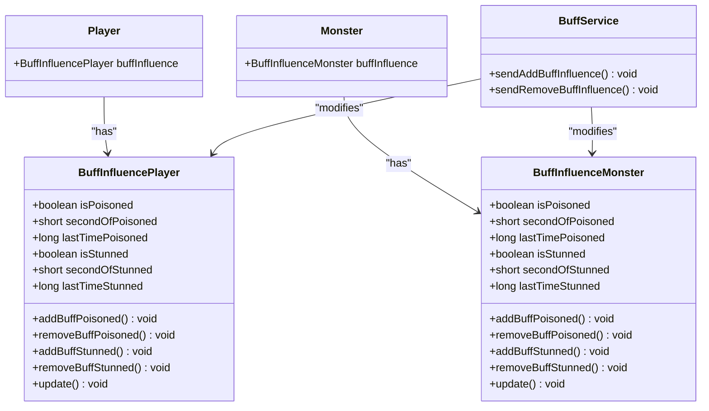
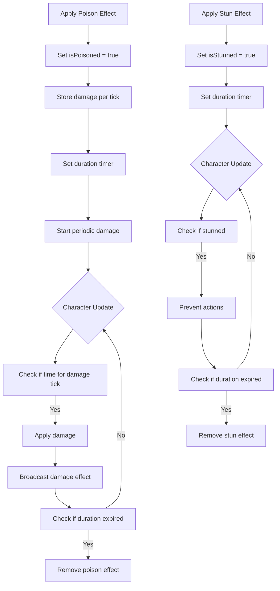
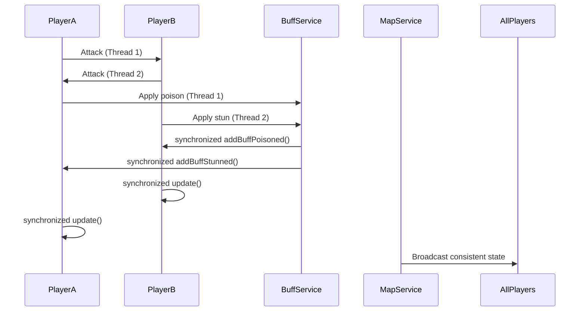

# Combat System

<cite>
**Referenced Files in This Document**   
- [Player.java](file://src/main/java/player/Player.java)
- [Point.java](file://src/main/java/player/Point.java)
- [SkillService.java](file://src/main/java/services/SkillService.java)
- [BuffService.java](file://src/main/java/services/BuffService.java)
- [BuffInfluencePlayer.java](file://src/main/java/skill/BuffInfluencePlayer.java)
- [BuffInfluenceMonster.java](file://src/main/java/skill/BuffInfluenceMonster.java)
- [SkillBuff.java](file://src/main/java/skill/SkillBuff.java)
- [Monster.java](file://src/main/java/map/Monster.java)
- [Const.java](file://src/main/java/consts/Const.java)
- [BuffConst.java](file://src/main/java/consts/BuffConst.java)
- [Util.java](file://src/main/java/utils/Util.java)
</cite>

## Table of Contents
1. [Introduction](#introduction)
2. [Combat Model Overview](#combat-model-overview)
3. [Skill Execution Pipeline](#skill-execution-pipeline)
4. [Damage Calculation System](#damage-calculation-system)
5. [Buff and Debuff System](#buff-and-debuff-system)
6. [Status Effects and Special Mechanics](#status-effects-and-special-mechanics)
7. [Concurrency and Race Condition Handling](#concurrency-and-race-condition-handling)
8. [Combat Examples](#combat-examples)
9. [Conclusion](#conclusion)

## Introduction
The combat system in this game implements a real-time action-based model where players and monsters can initiate attacks through skill usage. The system handles damage calculation, status effects, buff/debuff application, and combat feedback through a well-defined pipeline. This document details the complete combat mechanics from skill activation to damage resolution, including the buff system, damage formulas, and concurrency handling.

## Combat Model Overview
The game employs a real-time combat model where both players and monsters can attack based on cooldown timers and proximity. Players initiate combat by using skills against targets, while monsters automatically attack eligible players within range. The combat system is updated continuously through player and monster update loops, ensuring responsive and dynamic combat interactions.

**Diagram sources**
- [Player.java](file://src/main/java/player/Player.java#L250-L309)
- [Monster.java](file://src/main/java/map/Monster.java#L259-L291)
- [SkillService.java](file://src/main/java/services/SkillService.java#L151-L179)

**Section sources**
- [Player.java](file://src/main/java/player/Player.java#L250-L309)
- [Monster.java](file://src/main/java/map/Monster.java#L259-L291)

## Skill Execution Pipeline
The skill execution pipeline follows a structured flow from client request to effect application. When a player uses a skill, the system validates the action, calculates damage, applies effects, and broadcasts results to all players in the zone.

### Client Request to Server Processing
When a player uses a skill, the request is processed through the SkillService, which validates various conditions before executing the attack. The pipeline ensures that skills cannot be spammed by enforcing cooldown periods and validating resource requirements.

**Diagram sources**
- [SkillService.java](file://src/main/java/services/SkillService.java#L151-L256)
- [BuffService.java](file://src/main/java/services/BuffService.java#L82-L114)
- [Monster.java](file://src/main/java/map/Monster.java#L259-L291)

**Section sources**
- [SkillService.java](file://src/main/java/services/SkillService.java#L151-L256)
- [BuffService.java](file://src/main/java/services/BuffService.java#L82-L114)

### Skill Validation Process
Before executing a skill, the system performs multiple validation checks to ensure the action is legitimate. These include cooldown verification, MP cost assessment, weapon durability check, and target validation. The validation process prevents invalid actions and maintains game balance.

**Section sources**
- [SkillService.java](file://src/main/java/services/SkillService.java#L151-L179)

## Damage Calculation System
The damage calculation system considers multiple factors including attacker stats, defender defenses, skill coefficients, and randomization elements. The system differentiates between physical and magical damage and applies appropriate defense calculations.

### Damage Formula Components
The damage calculation involves several sequential steps that modify the base damage value. The process begins with base attack calculation, applies skill multipliers, considers critical hits, and finally applies randomization to create variation in damage output.

**Diagram sources**
- [Point.java](file://src/main/java/player/Point.java#L95-L129)
- [Player.java](file://src/main/java/player/Player.java#L88-L115)

**Section sources**
- [Point.java](file://src/main/java/player/Point.java#L95-L129)
- [Player.java](file://src/main/java/player/Player.java#L88-L115)

### Attack Stat Calculation
Attack stats are calculated based on the player's class, base attributes, equipment bonuses, and active buffs. Different classes use different primary stats for attack calculation, creating class-specific playstyles.

**Diagram sources**
- [Point.java](file://src/main/java/player/Point.java#L182-L227)
- [Player.java](file://src/main/java/player/Player.java#L88-L115)
- [BuffService.java](file://src/main/java/services/BuffService.java#L82-L114)

**Section sources**
- [Point.java](file://src/main/java/player/Point.java#L182-L227)

## Buff and Debuff System
The buff and debuff system manages temporary status effects that modify character statistics or behavior. The system handles duration tracking, stacking rules, and effect resolution through dedicated classes for players and monsters.

### Buff Duration and Management
Buffs and debuffs have defined durations that are tracked using timestamp comparisons. The system updates active effects during each character update cycle, automatically removing expired effects. Duration management ensures that temporary effects do not persist indefinitely.

**Diagram sources**
- [BuffInfluencePlayer.java](file://src/main/java/skill/BuffInfluencePlayer.java#L0-L106)
- [BuffInfluenceMonster.java](file://src/main/java/skill/BuffInfluenceMonster.java#L0-L113)
- [BuffService.java](file://src/main/java/services/BuffService.java#L220-L274)

**Section sources**
- [BuffInfluencePlayer.java](file://src/main/java/skill/BuffInfluencePlayer.java#L0-L106)
- [BuffInfluenceMonster.java](file://src/main/java/skill/BuffInfluenceMonster.java#L0-L113)

### Stacking Rules and Effect Resolution
The buff system implements specific stacking rules to prevent abuse and maintain game balance. Most debuffs do not stack, with new applications either refreshing the duration or being ignored if already active. The system prioritizes effect resolution to ensure consistent behavior across different combat scenarios.

**Section sources**
- [BuffInfluencePlayer.java](file://src/main/java/skill/BuffInfluencePlayer.java#L50-L80)
- [BuffInfluenceMonster.java](file://src/main/java/skill/BuffInfluenceMonster.java#L50-L80)

## Status Effects and Special Mechanics
The combat system includes various status effects that alter character behavior or stats. These effects create strategic depth by introducing additional considerations beyond simple damage output.

### Poison and Stun Mechanics
Poison and stun are two primary debuffs implemented in the system. Poison deals periodic damage over time, while stun prevents the affected character from taking actions. These effects are applied through specific skills and can be resisted based on character stats.

**Diagram sources**
- [BuffInfluencePlayer.java](file://src/main/java/skill/BuffInfluencePlayer.java#L50-L106)
- [BuffInfluenceMonster.java](file://src/main/java/skill/BuffInfluenceMonster.java#L50-L113)

**Section sources**
- [BuffInfluencePlayer.java](file://src/main/java/skill/BuffInfluencePlayer.java#L50-L106)
- [BuffInfluenceMonster.java](file://src/main/java/skill/BuffInfluenceMonster.java#L50-L113)

## Concurrency and Race Condition Handling
The combat system implements several mechanisms to handle concurrency issues that could arise during combat, particularly when multiple entities attempt to modify health simultaneously.

### Thread Safety and Synchronization
The system uses synchronized methods and atomic operations to prevent race conditions when modifying character state. This ensures that health changes, buff applications, and other combat effects are applied consistently even when multiple events occur simultaneously.

**Diagram sources**
- [BuffInfluencePlayer.java](file://src/main/java/skill/BuffInfluencePlayer.java#L50-L106)
- [Player.java](file://src/main/java/player/Player.java#L250-L309)

**Section sources**
- [BuffInfluencePlayer.java](file://src/main/java/skill/BuffInfluencePlayer.java#L50-L106)
- [Player.java](file://src/main/java/player/Player.java#L250-L309)

### Health Modification Safeguards
The system includes safeguards to prevent invalid health states, such as negative HP or HP exceeding maximum. These safeguards are implemented in the injured() method, which ensures that damage application respects minimum and maximum health boundaries.

**Section sources**
- [Player.java](file://src/main/java/player/Player.java#L88-L115)
- [Point.java](file://src/main/java/player/Point.java#L500-L530)

## Combat Examples
This section illustrates specific combat scenarios to demonstrate how the system handles various situations.

### Skill Combo Example
When a player uses a multi-hit skill (type 3), the system applies the same damage calculation for each hit, with only the first hit triggering the full damage calculation. Subsequent hits reuse the initial damage value for consistency.

**Section sources**
- [SkillService.java](file://src/main/java/services/SkillService.java#L151-L179)

### Critical Hit Example
Critical hits are determined by probability based on the attacker's critical stat. When a critical hit occurs, the damage is doubled before applying randomization and defense calculations.

**Section sources**
- [Point.java](file://src/main/java/player/Point.java#L95-L129)
- [SkillService.java](file://src/main/java/services/SkillService.java#L151-L179)

### Status Effect Example
When a poisoned character takes damage from the poison effect, the system applies the damage and broadcasts the effect to all players in the zone, creating visible feedback of the ongoing damage over time.

**Section sources**
- [BuffInfluencePlayer.java](file://src/main/java/skill/BuffInfluencePlayer.java#L50-L106)
- [BuffService.java](file://src/main/java/services/BuffService.java#L247-L274)

## Conclusion
The combat system implements a comprehensive real-time action model with detailed damage calculation, buff/debuff management, and concurrency safeguards. The system balances complexity with performance by using efficient data structures and synchronization mechanisms. Key features include class-specific damage formulas, duration-based status effects, and robust validation to prevent exploitation. The modular design allows for easy extension with new skills and effects while maintaining consistency across player and monster combat interactions.