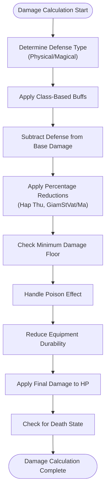
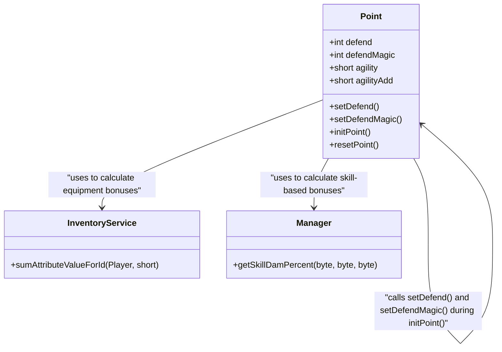
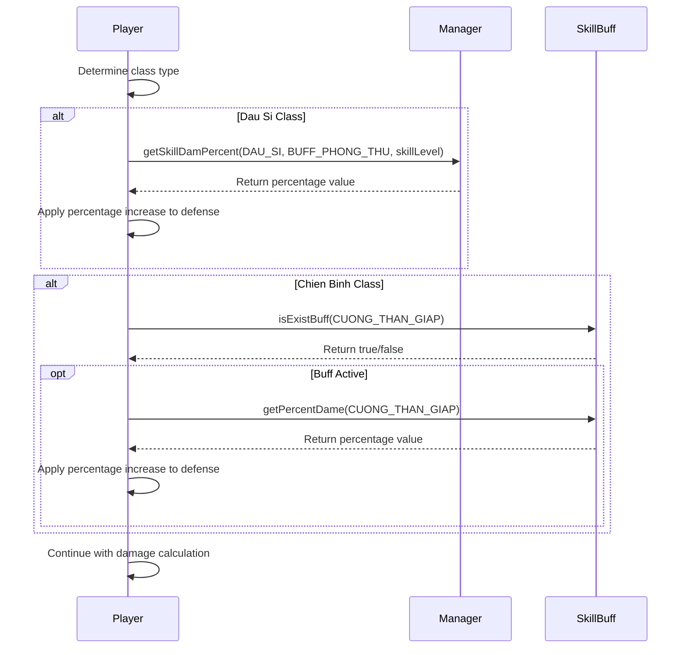
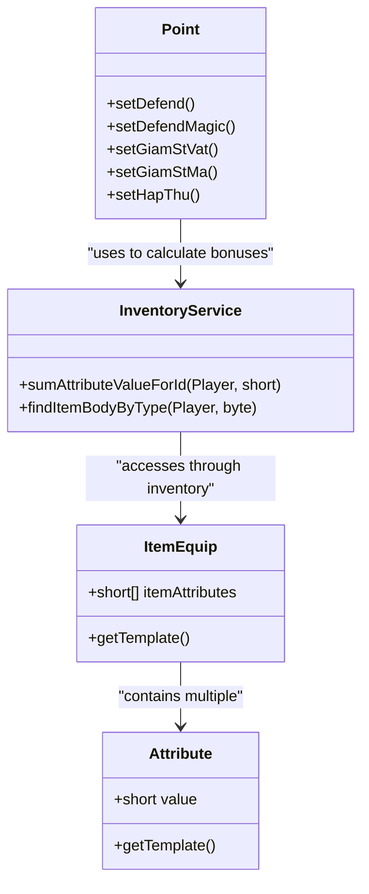
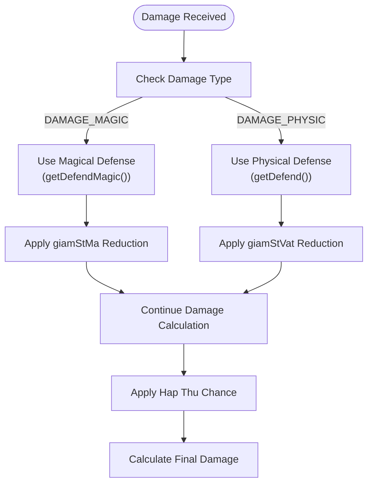
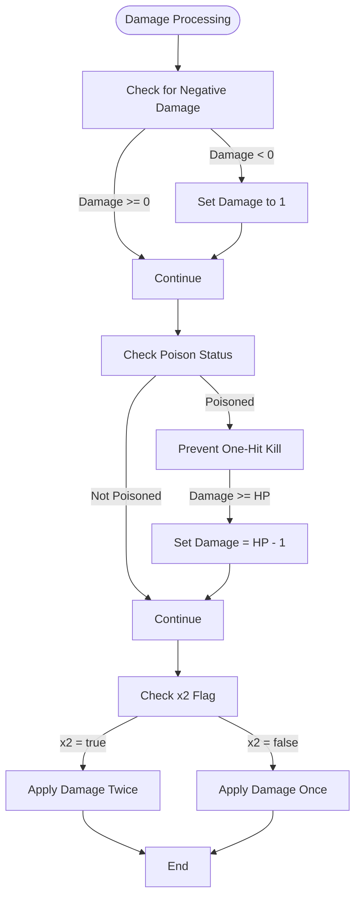
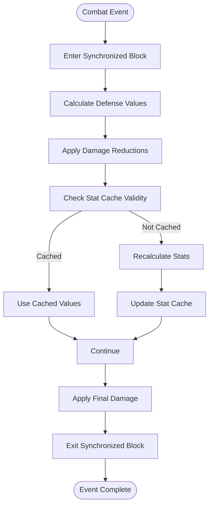

# Damage Calculation

<cite>
**Referenced Files in This Document**   
- [Player.java](file://src/main/java/player/Player.java)
- [Point.java](file://src/main/java/player/Point.java)
- [Monster.java](file://src/main/java/map/Monster.java)
- [ItemEquipConst.java](file://src/main/java/consts/ItemEquipConst.java)
- [BuffConst.java](file://src/main/java/consts/BuffConst.java)
- [InventoryService.java](file://src/main/java/services/InventoryService.java)
- [Manager.java](file://src/main/java/manager/Manager.java)
- [Const.java](file://src/main/java/consts/Const.java)
</cite>

## Table of Contents
1. [Introduction](#introduction)
2. [Core Damage Formula](#core-damage-formula)
3. [Defensive Calculations](#defensive-calculations)
4. [Class-Based Modifiers](#class-based-modifiers)
5. [Equipment and Attribute System](#equipment-and-attribute-system)
6. [Damage Type Handling](#damage-type-handling)
7. [Edge Cases and Special Flags](#edge-cases-and-special-flags)
8. [Performance Considerations](#performance-considerations)
9. [Troubleshooting Guide](#troubleshooting-guide)

## Introduction
This document provides a comprehensive analysis of the damage calculation mechanics in player versus monster and player versus player combat systems. The damage system incorporates multiple factors including base attack values, defensive reductions, class-based modifiers, equipment bonuses, and randomization elements. The core logic is implemented across several key classes, with Player.injured() serving as the primary entry point for damage processing and Point.setDefend() handling defensive stat calculations. The system differentiates between physical and magical damage types using constants from ItemEquipConst and BuffConst, and incorporates various modifiers from skills, equipment, and buffs.

**Section sources**
- [Player.java](file://src/main/java/player/Player.java#L87-L146)
- [Point.java](file://src/main/java/player/Point.java#L21-L591)

## Core Damage Formula
The damage calculation follows a multi-step process that begins with the attacker's base damage and applies various defensive reductions and modifiers. The formula is implemented in the Player.injured() method, which processes incoming damage through several stages of reduction and modification.

The base formula follows this sequence:
1. Determine the appropriate defense value based on damage type (physical or magical)
2. Apply class-specific defensive buffs from skills
3. Subtract defense from base damage
4. Apply percentage-based damage reductions from equipment and buffs
5. Enforce minimum damage floor
6. Handle special conditions like poisoning
7. Apply durability reduction to equipment
8. Deduct final damage from health

**Diagram sources**
- [Player.java](file://src/main/java/player/Player.java#L87-L146)
- [Point.java](file://src/main/java/player/Point.java#L21-L591)

**Section sources**
- [Player.java](file://src/main/java/player/Player.java#L87-L146)

## Defensive Calculations
Defensive calculations are primarily handled by the Point class, which manages all player statistics including defense values. The system maintains separate defense values for physical and magical damage types, which are calculated based on base stats, equipment, and class-specific modifiers.

Physical defense is calculated as:
- Base agility plus agility modifiers
- Plus equipment bonuses from items with THU_VAT (AttributeConst.THU_VAT = 1) attribute
- Plus class-specific bonuses (Dau Si class receives additional percentage-based bonuses)
- Plus equipment bonuses with TANG_THU_VAT (AttributeConst.TANG_THU_VAT = 60) attribute
- Plus bonuses from mounts and companions

Magical defense follows a similar pattern but uses different attribute IDs:
- Base agility plus agility modifiers
- Plus equipment bonuses from items with THU_MA (AttributeConst.THU_MA = 6) attribute
- Plus class-specific bonuses (Dau Si class receives additional percentage-based bonuses)
- Plus equipment bonuses with TANG_THU_MA (AttributeConst.TANG_THU_MA = 59) attribute
- Plus bonuses from mounts and companions

The defensive values are recalculated whenever player stats change through the initPoint() method, which resets all calculated values and rebuilds them from base components.

**Diagram sources**
- [Point.java](file://src/main/java/player/Point.java#L21-L591)
- [InventoryService.java](file://src/main/java/services/InventoryService.java#L0-L713)

**Section sources**
- [Point.java](file://src/main/java/player/Point.java#L21-L591)

## Class-Based Modifiers
The damage calculation system incorporates class-specific defensive modifiers that provide unique advantages to different character classes. These modifiers are implemented through conditional logic in the Player.injured() method and are triggered based on the player's class.

The Dau Si (Defender) class receives a percentage-based defense increase calculated from the PHONG_THU skill (BuffConst.BUFF_PHONG_THU = 5). The bonus is applied to both physical and magical defense and is proportional to the skill level. The formula uses Manager.getSkillDamPercent() to retrieve the appropriate percentage modifier based on class, skill type, and skill level.

The Chien Binh (Warrior) class has a conditional defense boost when the CUONG_THAN_GIAP (BuffConst.CUONG_THAN_GIAP = 20) buff is active. When this buff is present, the player's defense is increased by a percentage determined by the buff's intensity, accessed through skillBuff.getPercentDame().

These class-based modifiers are applied before the base defense subtraction, effectively increasing the defender's resistance to incoming damage. The modifiers are only applied when the player has the appropriate skill level or active buff, making them conditional enhancements to the base defensive capabilities.

**Diagram sources**
- [Player.java](file://src/main/java/player/Player.java#L87-L146)
- [Manager.java](file://src/main/java/manager/Manager.java#L0-L1525)
- [BuffConst.java](file://src/main/java/consts/BuffConst.java#L6-L29)

**Section sources**
- [Player.java](file://src/main/java/player/Player.java#L87-L146)

## Equipment and Attribute System
The equipment system plays a crucial role in damage calculation by providing stat bonuses through various attributes. Equipment bonuses are calculated by summing attribute values from all equipped items, with different attributes affecting different aspects of combat performance.

The system uses the InventoryService.sumAttributeValueForId() method to aggregate attribute values from all equipped items. Each attribute is identified by a constant from AttributeConst, such as TANG_SUC_MANH (10) for strength bonuses or TANG_NHANH_NHEN (11) for agility bonuses. The sum of these values is then applied to the corresponding base stats in the Point class.

Key defensive attributes include:
- THU_VAT (1): Direct physical defense bonus
- THU_MA (6): Direct magical defense bonus
- TANG_THU_VAT (60): Percentage-based physical defense increase
- TANG_THU_MA (59): Percentage-based magical defense increase
- TANG_THU_TRANG_BI (88): Percentage-based defense increase from equipment

The system also supports special defensive attributes:
- HAP_THU_SAT_THUONG (81): Chance-based damage absorption
- GIAM_ST_VAT (28): Percentage reduction of physical damage taken
- GIAM_ST_MA (29): Percentage reduction of magical damage taken

These attributes are processed during the Point.initPoint() method, which recalculates all derived stats whenever player equipment changes. The system ensures that all equipment bonuses are properly accounted for in the final defensive calculations.

**Diagram sources**
- [InventoryService.java](file://src/main/java/services/InventoryService.java#L0-L713)
- [Point.java](file://src/main/java/player/Point.java#L21-L591)
- [AttributeConst.java](file://src/main/java/consts/AttributeConst.java#L0-L132)

**Section sources**
- [InventoryService.java](file://src/main/java/services/InventoryService.java#L0-L713)
- [Point.java](file://src/main/java/player/Point.java#L21-L591)

## Damage Type Handling
The system differentiates between physical and magical damage types using constants defined in ItemEquipConst. The DAMAGE_MAGIC (0) and DAMAGE_PHYSIC (1) constants are used to determine which defensive stat to apply during damage calculation.

When damage is processed in Player.injured(), the method first checks the typeDame parameter to determine whether to use physical defense (getDefend()) or magical defense (getDefendMagic()). This selection occurs at the beginning of the damage calculation process and affects all subsequent defensive calculations.

For magical damage, additional percentage-based reductions are applied using the giamStMa stat, while physical damage uses the giamStVat stat. These stats represent percentage reductions specific to their respective damage types and are calculated from equipment attributes GIAM_ST_MA (29) and GIAM_ST_VAT (28).

The system also handles special defensive mechanics that apply to both damage types:
- Hap Thu (81): A chance-based damage absorption that applies regardless of damage type
- Class-specific buffs: Some class abilities may provide protection against both physical and magical damage

The damage type system ensures that defensive equipment and abilities are appropriately specialized, encouraging players to equip different gear depending on the expected damage types they will face in combat.

**Diagram sources**
- [Player.java](file://src/main/java/player/Player.java#L87-L146)
- [ItemEquipConst.java](file://src/main/java/consts/ItemEquipConst.java#L6-L102)

**Section sources**
- [Player.java](file://src/main/java/player/Player.java#L87-L146)

## Edge Cases and Special Flags
The damage calculation system includes several edge cases and special flags that modify the standard damage processing flow. These include minimum damage floors, armor penetration mechanics, and special conditions like poisoning.

The system enforces a minimum damage floor of 1 after all defensive calculations. If the calculated damage would be negative or zero, it is set to 1 to ensure that successful hits always deal at least minimal damage. This prevents situations where high defense values could completely negate incoming attacks.

The x2 flag is a special modifier that causes damage to be applied twice to the target's health. This effectively doubles the damage output and is used for certain special attacks or effects. When the x2 parameter is true, the system calls point.minusHp() twice with the same damage value.

When a player is poisoned (buffInfluence.isPoisoned()), the system implements a protection mechanism that prevents one-hit kills. If the incoming damage would reduce the player's HP to zero or below, the damage is reduced to leave the player with exactly 1 HP. This allows poisoned players to survive with minimal health, creating strategic gameplay opportunities.

Equipment durability is also affected during damage calculation. When a player takes damage, the durability of certain equipment pieces (armor, pants, hat) is reduced by calling minusDurable() on each relevant item. This creates a resource management aspect to combat, as players must maintain their equipment to remain effective in prolonged battles.

**Diagram sources**
- [Player.java](file://src/main/java/player/Player.java#L87-L146)
- [Point.java](file://src/main/java/player/Point.java#L21-L591)

**Section sources**
- [Player.java](file://src/main/java/player/Player.java#L87-L146)

## Performance Considerations
The damage calculation system is designed to handle high-load scenarios with thousands of combat events per second. Several performance optimizations are implemented to ensure efficient processing of combat mechanics.

The system uses @Synchronized annotations on critical methods like Player.injured() and Point.minusHp() to ensure thread safety without excessive locking overhead. This allows multiple combat events to be processed concurrently while maintaining data integrity.

Stat calculations are optimized through lazy evaluation and caching. The Point class caches calculated values and only recalculates them when necessary through the initPoint() method. This prevents redundant calculations during rapid succession of damage events.

The inventory attribute system uses efficient data structures and algorithms to quickly sum attribute values from equipped items. The InventoryService.sumAttributeValueForId() method iterates through equipped items once per attribute type, minimizing computational overhead.

For monster damage calculations, the system includes logging statements that can be disabled in production to reduce I/O overhead. The Monster.injured() method includes debug prints that would impact performance if left enabled in high-traffic scenarios.

The use of primitive types and arrays for frequently accessed data (such as skill levels and attribute values) reduces memory allocation and garbage collection pressure during intense combat sequences.

**Diagram sources**
- [Player.java](file://src/main/java/player/Player.java#L87-L146)
- [Point.java](file://src/main/java/player/Point.java#L21-L591)
- [Monster.java](file://src/main/java/map/Monster.java#L25-L291)

**Section sources**
- [Player.java](file://src/main/java/player/Player.java#L87-L146)
- [Point.java](file://src/main/java/player/Point.java#L21-L591)

## Troubleshooting Guide
This section provides guidance for diagnosing and resolving common issues related to damage calculation and stat application.

**Incorrect Damage Output**
- Verify that the correct damage type (physical/magical) is being passed to Player.injured()
- Check that defensive stats are properly calculated by examining Point.getDefend() and Point.getDefendMagic() values
- Ensure that equipment bonuses are being applied by verifying InventoryService.sumAttributeValueForId() returns expected values
- Confirm that class-specific buffs are active and at the correct skill level

**Stat Application Bugs**
- Verify that Point.initPoint() is called after any stat changes
- Check that equipment attribute IDs match the expected constants from AttributeConst
- Ensure that Manager.getSkillDamPercent() returns valid percentage values for the given class, skill, and level
- Validate that buff states are properly maintained in SkillBuff and buffInfluence components

**Performance Issues**
- Monitor synchronized method execution time to identify potential bottlenecks
- Check for unnecessary stat recalculation by verifying initPoint() is not called too frequently
- Review inventory attribute calculations for efficiency, especially with large numbers of equipped items
- Consider disabling debug logging in Monster.injured() for production environments

**Edge Case Problems**
- Verify minimum damage floor is correctly enforced (damage should never be zero or negative)
- Test x2 flag behavior to ensure damage is applied the correct number of times
- Check poison protection logic to ensure it prevents one-hit kills as expected
- Validate equipment durability reduction only affects appropriate item types

When debugging damage calculation issues, it is recommended to trace the execution path from the damage source through Player.injured() to the final HP reduction, verifying each step of the calculation produces expected results.

**Section sources**
- [Player.java](file://src/main/java/player/Player.java#L87-L146)
- [Point.java](file://src/main/java/player/Point.java#L21-L591)
- [Monster.java](file://src/main/java/map/Monster.java#L25-L291)
- [InventoryService.java](file://src/main/java/services/InventoryService.java#L0-L713)