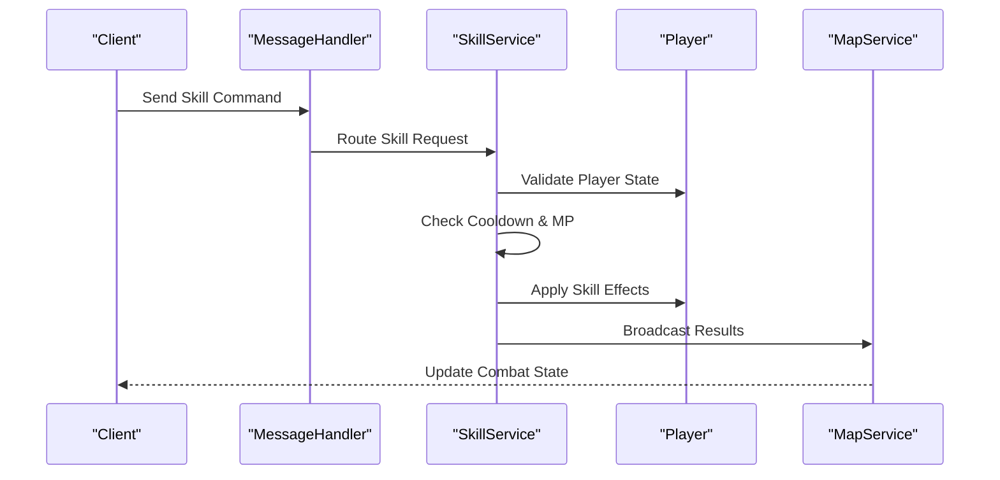
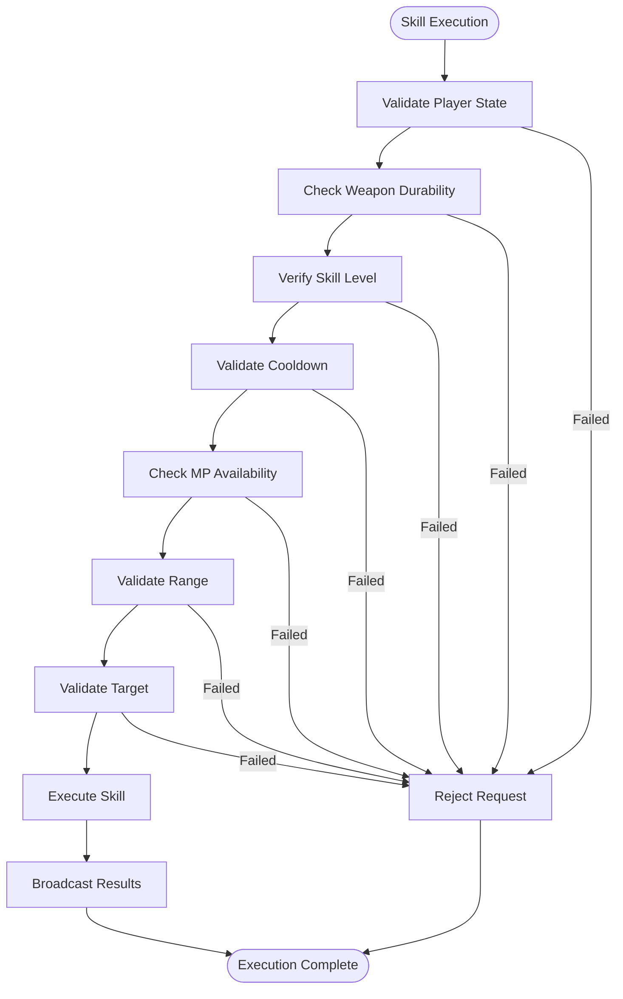
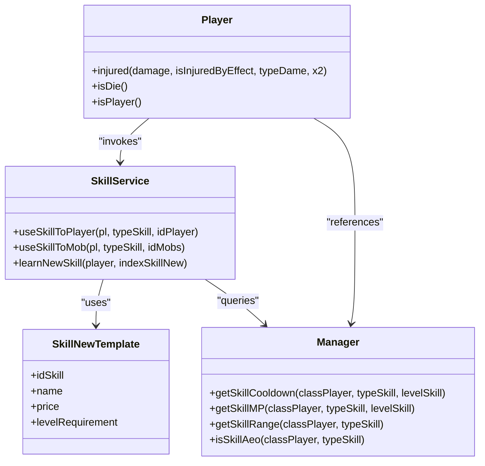

# Skill Execution

<cite>
**Referenced Files in This Document**   
- [MessageHandler.java](file://src/main/java/network/MessageHandler.java)
- [SkillService.java](file://src/main/java/services/SkillService.java)
- [Player.java](file://src/main/java/player/Player.java)
- [Skill.java](file://src/main/java/player/Skill.java)
- [SkillNewTemplate.java](file://src/main/java/template/SkillNewTemplate.java)
- [ExecutorVirtualThread.java](file://src/main/java/manager/ExecutorVirtualThread.java)
</cite>

## Table of Contents
1. [Introduction](#introduction)
2. [Skill Execution Pipeline Overview](#skill-execution-pipeline-overview)
3. [Message Handling and Skill Invocation](#message-handling-and-skill-invocation)
4. [Skill Validation and Pre-Execution Checks](#skill-validation-and-pre-execution-checks)
5. [Skill Type Differentiation and Execution Logic](#skill-type-differentiation-and-execution-logic)
6. [Class-Specific Skill Examples](#class-specific-skill-examples)
7. [Concurrency and Thread Management](#concurrency-and-thread-management)
8. [Extending the Skill System](#extending-the-skill-system)
9. [Conclusion](#conclusion)

## Introduction
The skill execution pipeline in the combat system handles the complete lifecycle of player-initiated skills, from client input to server-side processing and effect application. This document details the flow from message reception in `MessageHandler` through validation, cooldown management, MP consumption, and final execution in `SkillService`. The system supports different skill types (offensive, defensive, support) and class-specific abilities while maintaining thread safety during high-frequency combat scenarios.

## Skill Execution Pipeline Overview

**Diagram sources**
- [MessageHandler.java](file://src/main/java/network/MessageHandler.java#L1-L672)
- [SkillService.java](file://src/main/java/services/SkillService.java#L1-L388)

**Section sources**
- [MessageHandler.java](file://src/main/java/network/MessageHandler.java#L1-L672)
- [SkillService.java](file://src/main/java/services/SkillService.java#L1-L388)

## Message Handling and Skill Invocation

The skill execution begins when the client sends a skill command through the network layer. The `MessageHandler.onMessage` method intercepts these requests and routes them to the appropriate service based on the command type.

For player-vs-player combat, the `PLAYER_ATTACK_PLAYER` command triggers `SkillService.useSkillToPlayer`, while `PLAYER_ATTACK_MONSTER` and `ATTACK_MULTI_MONSTER` handle combat against NPCs. These commands contain the skill type identifier and target information necessary for execution.

The message handling system uses a switch-case structure to efficiently dispatch different command types, ensuring low-latency processing of skill inputs. Each skill command is processed within the context of the player's session, maintaining state consistency throughout the execution pipeline.

**Section sources**
- [MessageHandler.java](file://src/main/java/network/MessageHandler.java#L300-L350)

## Skill Validation and Pre-Execution Checks

Before executing any skill, the system performs comprehensive validation to ensure game integrity and prevent cheating. The `SkillService` conducts several critical checks:

1. **Player State Validation**: Verifies the player is alive and not in a village (where combat is prohibited)
2. **Weapon Durability Check**: Ensures the equipped weapon has sufficient durability
3. **Skill Level Verification**: Confirms the player has learned and leveled the requested skill
4. **Cooldown Management**: Uses `Util.canDoWithTime` to enforce skill cooldowns based on class, skill type, and level
5. **MP Consumption**: Validates sufficient mana points and deducts the appropriate amount
6. **Range Validation**: Calculates distance between player and target using `Util.getDistance`
7. **Target Validation**: Confirms target existence and combat eligibility

These validations occur in sequence, with immediate termination if any check fails. The system prevents race conditions by synchronizing critical sections and using atomic operations for resource modification.

**Diagram sources**
- [SkillService.java](file://src/main/java/services/SkillService.java#L50-L100)
- [Util.java](file://src/main/java/utils/Util.java#L1-L100)

**Section sources**
- [SkillService.java](file://src/main/java/services/SkillService.java#L50-L150)

## Skill Type Differentiation and Execution Logic

The system differentiates skill types through the `typeSkill` parameter and implements distinct execution logic for each category:

- **Offensive Skills**: Direct damage abilities that calculate hit probability, critical strikes, and damage mitigation
- **Area-of-Effect (AoE) Skills**: Multi-target abilities identified by `Manager.isSkillAeo` that affect multiple monsters simultaneously
- **Support Skills**: Buff/debuff abilities handled through `BuffService` that modify player or target attributes
- **Special Mechanics**: Unique skills like the multi-shot mechanic (type 3) that fires multiple projectiles based on skill level

The execution logic varies by target type:
- Player vs Player: Uses `onPlayerAttackPlayer` with PvP-specific rules including PK status checks
- Player vs Monster: Uses `onPlayerAttackMob` with monster-specific mechanics like pickaxe durability for mining
- Multi-Monster: Uses `onPlayerAttackMultiMob` to efficiently handle AoE combat scenarios

Damage calculation incorporates multiple factors including base attack, critical chance, dodge probability, armor penetration, and damage multipliers, providing a rich combat experience.

**Section sources**
- [SkillService.java](file://src/main/java/services/SkillService.java#L150-L300)

## Class-Specific Skill Examples

The system supports class-specific skills through template-based configuration and conditional logic. Two prominent examples illustrate this specialization:

### Dau Si Class Skills
The Dau Si (Warrior) class features defensive capabilities that modify damage calculation:
- **Buff_Phong_Thu**: Increases defense by a percentage based on skill level
- **Damage Reduction**: Applies class-specific mitigation formulas in the `injured` method
- **Class Identifier**: Uses `Const.DAU_SI` to route appropriate skill modifiers

### Chien Binh Class Skills
The Chien Binh (Fighter) class emphasizes offensive buffs:
- **Cuong_Than_Giap**: Enhances defense through active buffs checked via `skillBuff.isExistBuff`
- **Percent-based Damage**: Calculates damage amplification using `getPercentDame`
- **Class-specific Templates**: References class-specific values in `Manager.getListSkillNew`

These class-specific behaviors are implemented through conditional branching in the `Player.injured` method and skill template configuration, allowing for diverse gameplay experiences while maintaining a unified skill framework.

**Diagram sources**
- [Player.java](file://src/main/java/player/Player.java#L1-L310)
- [SkillService.java](file://src/main/java/services/SkillService.java#L1-L388)
- [SkillNewTemplate.java](file://src/main/java/template/SkillNewTemplate.java#L1-L50)
- [Manager.java](file://src/main/java/manager/Manager.java#L1-L100)

**Section sources**
- [Player.java](file://src/main/java/player/Player.java#L100-L200)
- [SkillService.java](file://src/main/java/services/SkillService.java#L200-L300)

## Concurrency and Thread Management

The combat system handles concurrency through a combination of synchronization mechanisms and virtual thread management:

- **Synchronized Methods**: Critical sections like `learnNewSkill` use `@Synchronized` annotation to prevent race conditions during skill acquisition
- **Virtual Threads**: The `ExecutorVirtualThread` manages a pool of lightweight threads for non-blocking skill execution
- **Atomic Operations**: Resource modifications (HP, MP, durability) use thread-safe operations to prevent data corruption
- **State Validation**: Timestamp-based checks ensure actions occur in valid temporal windows

During high-frequency combat scenarios, the system prevents race conditions by:
1. Using fine-grained locking on player-specific operations
2. Implementing cooldown validation with millisecond precision
3. Employing immutable data structures for skill templates
4. Isolating player state modifications to individual thread contexts

The virtual thread executor allows thousands of concurrent skill executions without blocking the main game loop, maintaining performance even during large-scale battles.

**Section sources**
- [SkillService.java](file://src/main/java/services/SkillService.java#L350-L388)
- [ExecutorVirtualThread.java](file://src/main/java/manager/ExecutorVirtualThread.java#L1-L50)
- [Player.java](file://src/main/java/player/Player.java#L250-L300)

## Extending the Skill System

New skills can be integrated into the existing template-based model through the following process:

1. **Template Creation**: Define new skills in `SkillNewTemplate` with properties including ID, name, price, and level requirements
2. **Configuration**: Set skill parameters in `Manager` including cooldown, MP cost, range, and damage percentages
3. **Type Registration**: Add skill type identifiers to the global skill type registry
4. **Class Association**: Link skills to specific classes through `Manager.getListSkillNew`
5. **Effect Implementation**: Create corresponding buff/debuff effects in `BuffService` if needed

The extension framework supports:
- **New Skill Types**: By adding type identifiers and corresponding execution logic
- **Class-Specific Abilities**: Through conditional branching based on `classPlayer` identifier
- **Progressive Leveling**: Via the `LEVEL_ADD_SKILL` matrix that defines level requirements
- **Balancing Parameters**: Through centralized configuration in `Manager` constants

When adding new skills, developers must ensure:
- Cooldown values prevent overpowered combinations
- MP costs balance utility and frequency
- Range parameters match intended gameplay
- Level requirements align with character progression
- Visual effects are properly synchronized with server state

**Section sources**
- [SkillNewTemplate.java](file://src/main/java/template/SkillNewTemplate.java#L1-L50)
- [SkillService.java](file://src/main/java/services/SkillService.java#L300-L350)
- [Manager.java](file://src/main/java/manager/Manager.java#L1-L100)

## Conclusion
The skill execution pipeline provides a robust framework for handling combat mechanics in the game. By combining efficient message handling, comprehensive validation, class-specific specialization, and thread-safe execution, the system delivers responsive and fair combat experiences. The template-based design allows for easy extension while maintaining balance and performance, making it adaptable to various gameplay scenarios and future content additions.