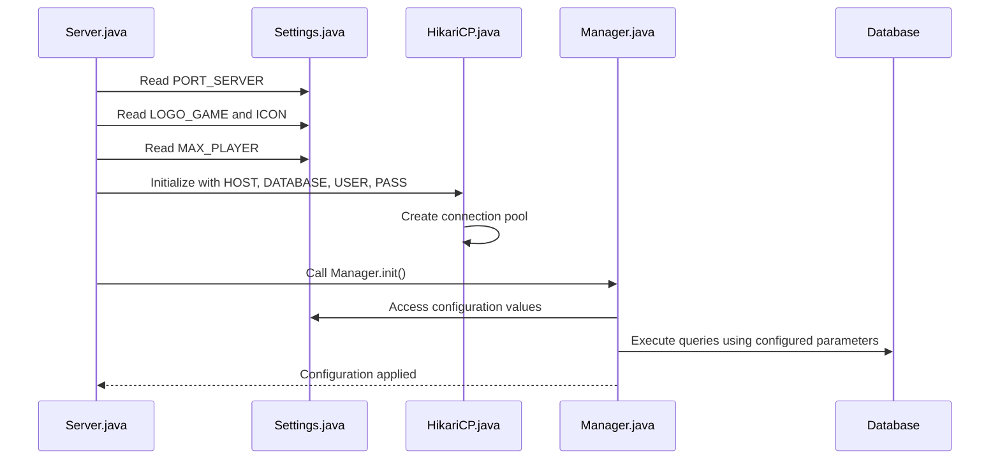

# Configuration

<cite>
**Referenced Files in This Document**   
- [Settings.java](file://src/main/java/manager/Settings.java)
- [Server.java](file://src/main/java/server/Server.java)
- [HikariCP.java](file://src/main/java/database/HikariCP.java)
- [Manager.java](file://src/main/java/manager/Manager.java)
- [README.md](file://README.md)
</cite>

## Table of Contents
1. [Introduction](#introduction)
2. [Configuration Parameters](#configuration-parameters)
3. [Configuration Loading and Application](#configuration-loading-and-application)
4. [Performance Tuning](#performance-tuning)
5. [Environment-Specific Configuration Examples](#environment-specific-configuration-examples)
6. [Security Considerations](#security-considerations)
7. [Best Practices](#best-practices)
8. [Conclusion](#conclusion)

## Introduction
This document provides comprehensive guidance on server configuration management for the KPAH game server. It details all configurable parameters in the Settings.java class, explains how configuration values are loaded and applied at startup, and provides recommendations for performance tuning across different deployment environments. The document also includes configuration examples for development, testing, and production scenarios, along with security considerations for sensitive configuration data and best practices for environment-specific configuration management.

**Section sources**
- [Settings.java](file://src/main/java/manager/Settings.java#L1-L58)

## Configuration Parameters

### Server Port and Network Settings
The server configuration includes parameters that control network connectivity and server identification:

- **PORT_SERVER**: The port number on which the server listens for incoming connections (default: 19129)
- **NAME_SERVER**: The server's display name (default: "KPAH")
- **URL**: The server URL (default: "localhost")
- **HOST**: The database host address with port (default: "127.0.0.1:3306")

### Maximum Player Count
- **MAX_PLAYER**: The maximum number of concurrent players allowed on the server (default: 40,000, with a hard limit of 60,000)

### Database Credentials
The configuration includes database connection parameters for the MySQL database:

- **DATABASE**: The database name (default: "kpah")
- **USER**: The database username (default: "root")
- **PASS**: The database password (default: "password")

### Game Balance Constants
The server includes various game balance constants that affect gameplay mechanics:

- **EXP_DONATE**: Experience multiplier for donations (default: 2, meaning double EXP)
- **PERCENT_EXP_PARTY**: Percentage of experience shared in parties (default: 5%)
- **MAX_PLAYER_IN_PARTY**: Maximum number of players in a party (default: 10)
- **LEVEL_CAN_AUTO_REVIVE**: Minimum level required for auto-revive functionality (default: 10)
- **TIME_LIVE_MOB**: Duration in milliseconds that a mob remains alive (default: 8,000)
- **DISTANCE_MOB_CAN_ATTACK**: Maximum distance at which mobs can attack players (default: 90)

### Session and Player Management
- **MILISECOND_WAIT_LOGIN**: Milliseconds to wait before allowing login attempts (default: 10,000)
- **MILISECOND_REVIVE_PLAYER**: Milliseconds for player revival timer (default: 30,000)
- **MILISECOND_UPDATE_DATABASE**: Milliseconds between database updates (default: 300,000)
- **MILISECOND_WAIT_KICK_SESSION**: Milliseconds of inactivity before kicking a session (default: 60,000)
- **MILISECOND_WAIT_KICK_PLAYER**: Milliseconds of inactivity before kicking a player (default: 600,000)

### Security and Data Management
- **KEYS**: Encryption keys used for secure communication (default: "kpah" converted to bytes)
- **DAY_WAIT_FOR_DELETE**: Number of days to wait before deleting inactive data (default: 7)

### Visual Elements
- **ICON**: ASCII art icon displayed in the console
- **LOGO_GAME**: ASCII art logo displayed at server startup

**Section sources**
- [Settings.java](file://src/main/java/manager/Settings.java#L1-L58)

## Configuration Loading and Application

### Server Startup Process
The server configuration is applied during the startup process in the Server.java class. When the server initializes, it binds to the port specified in Settings.PORT_SERVER and displays the server logo and icon from the configuration constants.



**Diagram sources**
- [Server.java](file://src/main/java/server/Server.java#L41-L43)
- [Settings.java](file://src/main/java/manager/Settings.java#L1-L58)
- [HikariCP.java](file://src/main/java/database/HikariCP.java#L19-L28)
- [Manager.java](file://src/main/java/manager/Manager.java#L1246-L1270)

### Database Connection Initialization
The HikariCP.java class uses the database configuration parameters from Settings.java to establish database connections. The connection URL is constructed using the HOST and DATABASE constants, while the username and password are taken directly from the USER and PASS constants.

The connection pool is configured with the following settings:
- Minimum idle connections: 5
- Maximum pool size: 10
- Connection timeout: 30,000 milliseconds
- Idle timeout: 60,000 milliseconds
- Maximum lifetime: 1,800,000 milliseconds

**Section sources**
- [HikariCP.java](file://src/main/java/database/HikariCP.java#L19-L37)
- [Settings.java](file://src/main/java/manager/Settings.java#L1-L58)

### Runtime Configuration Application
Configuration values are applied throughout the application at runtime. For example:
- The MAX_PLAYER limit is checked when accepting new client connections
- Database credentials are used for all database operations
- Game balance constants are referenced in gameplay logic
- Session timeout values are used to manage inactive connections

**Section sources**
- [Server.java](file://src/main/java/server/Server.java#L70-L73)
- [Settings.java](file://src/main/java/manager/Settings.java#L1-L58)

## Performance Tuning

### Connection Pool Optimization
The HikariCP connection pool settings can be tuned based on the deployment environment:

- **Development**: Reduce maximum pool size to 5 and minimum idle to 2 to conserve resources
- **Testing**: Use moderate settings (minimum idle: 3, maximum pool size: 8) to simulate production without excessive resource usage
- **Production**: Optimize for high concurrency with minimum idle: 10 and maximum pool size: 20

### Player Capacity Planning
The MAX_PLAYER setting should be adjusted based on available server resources:

- **Low-resource environments**: Set MAX_PLAYER to 10,000-15,000
- **Medium-resource environments**: Set MAX_PLAYER to 25,000-35,000
- **High-resource environments**: Set MAX_PLAYER to 40,000 (maximum recommended)

### Database Update Frequency
The MILISECOND_UPDATE_DATABASE parameter controls how frequently player data is persisted:

- **Development**: Set to 60,000 (1 minute) for easier debugging
- **Testing**: Set to 150,000 (2.5 minutes) to balance performance and data safety
- **Production**: Keep at 300,000 (5 minutes) for optimal performance

### Session Management
Adjust session timeout values based on expected player behavior:

- **Development**: Increase MILISECOND_WAIT_KICK_SESSION to 120,000 and MILISECOND_WAIT_KICK_PLAYER to 1,200,000 for debugging
- **Production**: Consider reducing timeouts slightly to free up resources from inactive players

**Section sources**
- [Settings.java](file://src/main/java/manager/Settings.java#L1-L58)
- [HikariCP.java](file://src/main/java/database/HikariCP.java#L30-L37)

## Environment-Specific Configuration Examples

### Development Configuration
```java
public static final int MAX_PLAYER = 5000;
public static final String HOST = "localhost:3306";
public static final String USER = "dev_user";
public static final String PASS = "dev_password";
public static final int PORT_SERVER = 19129;
public static final int MILISECOND_UPDATE_DATABASE = 60000;
public static final int MILISECOND_WAIT_KICK_SESSION = 120000;
public static final int MILISECOND_WAIT_KICK_PLAYER = 1200000;
```

### Testing Configuration
```java
public static final int MAX_PLAYER = 20000;
public static final String HOST = "test-db.example.com:3306";
public static final String USER = "test_user";
public static final String PASS = "test_password";
public static final int PORT_SERVER = 19129;
public static final int MILISECOND_UPDATE_DATABASE = 150000;
public static final int MILISECOND_WAIT_KICK_SESSION = 90000;
public static final int MILISECOND_WAIT_KICK_PLAYER = 900000;
```

### Production Configuration
```java
public static final int MAX_PLAYER = 40000;
public static final String HOST = "prod-db.example.com:3306";
public static final String USER = "prod_user";
public static final String PASS = "secure_password_here";
public static final int PORT_SERVER = 19129;
public static final int MILISECOND_UPDATE_DATABASE = 300000;
public static final int MILISECOND_WAIT_KICK_SESSION = 60000;
public static final int MILISECOND_WAIT_KICK_PLAYER = 600000;
```

**Section sources**
- [Settings.java](file://src/main/java/manager/Settings.java#L1-L58)

## Security Considerations

### Sensitive Configuration Data
The current configuration exposes sensitive information in plain text:

- Database credentials (USER and PASS) are hardcoded
- Encryption keys (KEYS) are visible in the source code
- Database host information is exposed

### Recommended Security Improvements
1. **Externalize sensitive configuration**: Move database credentials and encryption keys to environment variables or a separate configuration file outside the source code
2. **Use encrypted configuration**: Implement configuration encryption for sensitive values
3. **Implement role-based access**: Use different database users with minimal required privileges for different environments
4. **Regular credential rotation**: Establish a process for regularly updating database passwords and encryption keys

### Secure Configuration Pattern
Instead of hardcoding values, consider implementing a configuration loader that reads from environment variables:

```java
public static final String USER = System.getenv("DB_USER");
public static final String PASS = System.getenv("DB_PASSWORD");
public static final String HOST = System.getenv("DB_HOST");
```

**Section sources**
- [Settings.java](file://src/main/java/manager/Settings.java#L1-L58)
- [HikariCP.java](file://src/main/java/database/HikariCP.java#L19-L28)

## Best Practices

### Configuration Management
1. **Separate configuration from code**: Use external configuration files or environment variables for environment-specific settings
2. **Version control configuration**: Track configuration changes in version control while excluding sensitive data
3. **Document configuration changes**: Maintain a changelog for configuration modifications
4. **Implement configuration validation**: Add validation to ensure configuration values are within acceptable ranges

### Environment-Specific Configuration
1. **Use configuration profiles**: Implement different configuration profiles for development, testing, and production
2. **Automate configuration deployment**: Use deployment scripts to apply the correct configuration for each environment
3. **Test configuration changes**: Always test configuration changes in a staging environment before applying to production

### Performance Monitoring
1. **Monitor connection pool metrics**: Track connection pool usage to optimize settings
2. **Log configuration at startup**: Log non-sensitive configuration values at server startup for auditing
3. **Implement configuration reload**: Consider implementing dynamic configuration reloading without server restart

**Section sources**
- [Settings.java](file://src/main/java/manager/Settings.java#L1-L58)
- [README.md](file://README.md#L1-L195)

## Conclusion
The KPAH server's configuration system provides comprehensive control over server behavior, performance, and gameplay mechanics through the Settings.java class. While the current implementation effectively manages configuration, there are opportunities to improve security by externalizing sensitive data and enhancing flexibility through environment-specific configuration management. By following the best practices outlined in this document, administrators can optimize server performance for different deployment scenarios while maintaining security and reliability. Future improvements should focus on implementing secure configuration patterns and dynamic configuration reloading capabilities.

**Section sources**
- [Settings.java](file://src/main/java/manager/Settings.java#L1-L58)
- [Server.java](file://src/main/java/server/Server.java#L1-L118)
- [HikariCP.java](file://src/main/java/database/HikariCP.java#L1-L124)
- [Manager.java](file://src/main/java/manager/Manager.java#L1-L799)
- [README.md](file://README.md#L1-L195)