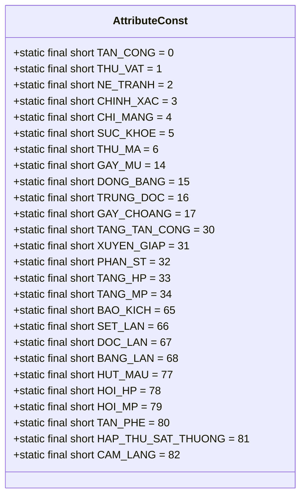
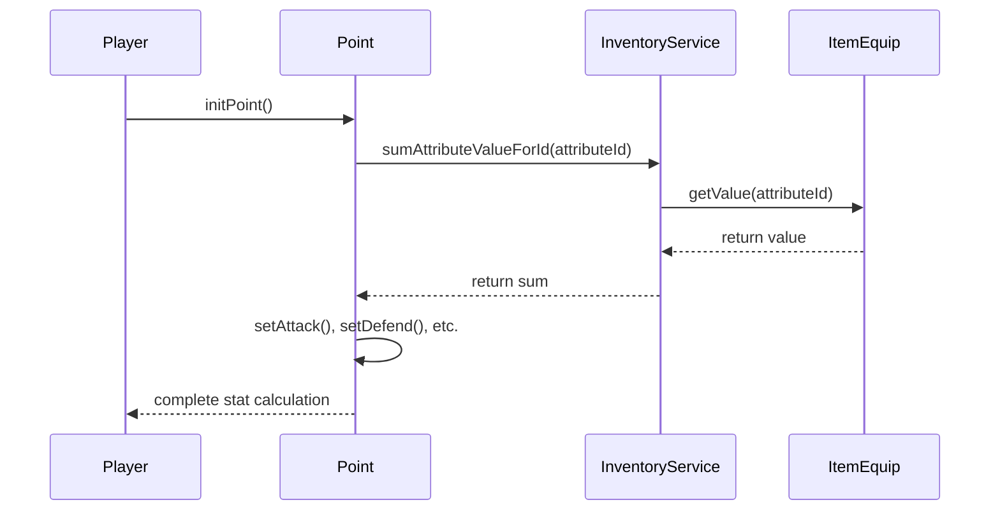

# Attribute Constants

<cite>
**Referenced Files in This Document**   
- [AttributeConst.java](file://src/main/java/consts/AttributeConst.java)
- [Player.java](file://src/main/java/player/Player.java)
- [Point.java](file://src/main/java/player/Point.java)
- [InventoryService.java](file://src/main/java/services/InventoryService.java)
</cite>

## Table of Contents
1. [Introduction](#introduction)
2. [Attribute Constants Overview](#attribute-constants-overview)
3. [Attribute Categories and Usage](#attribute-categories-and-usage)
4. [Integration with Player System](#integration-with-player-system)
5. [Stat Calculation and Progression](#stat-calculation-and-progression)
6. [Gameplay Balance Examples](#gameplay-balance-examples)
7. [Integration with Inventory System](#integration-with-inventory-system)
8. [Best Practices for Game Balancing](#best-practices-for-game-balancing)
9. [Potential Issues and Performance Considerations](#potential-issues-and-performance-considerations)
10. [Conclusion](#conclusion)

## Introduction
The AttributeConst class serves as the central repository for all attribute constants in the game, defining the numerical identifiers and behaviors for player and item attributes. These constants are fundamental to the game's stat system, influencing combat mechanics, character progression, and item effects. This document provides comprehensive documentation of the AttributeConst class and its integration with the Player and Point systems, detailing how these constants drive gameplay mechanics and balance.

## Attribute Constants Overview

The AttributeConst class defines a comprehensive set of constants that represent various attributes in the game. Each constant is assigned a unique short value and includes a comment indicating its percentage behavior and Vietnamese name.



**Diagram sources**
- [AttributeConst.java](file://src/main/java/consts/AttributeConst.java#L1-L132)

**Section sources**
- [AttributeConst.java](file://src/main/java/consts/AttributeConst.java#L1-L132)

## Attribute Categories and Usage

The attributes defined in AttributeConst can be categorized into several functional groups that serve different purposes in gameplay mechanics.

### Offensive Attributes
These attributes enhance a player's offensive capabilities:

- **TAN_CONG (0)**: Base attack power, directly increasing damage output
- **TANG_TAN_CONG (30)**: Percentage-based attack increase from items or effects
- **XUYEN_GIAP (31)**: Armor penetration, reducing enemy defense effectiveness
- **PHAN_ST (32)**: Damage reflection, returning a portion of received damage
- **BAO_KICH (65)**: Critical hit chance, enabling higher damage attacks
- **SET_LAN (66)**: Chain lightning effect, damaging multiple targets
- **DOC_LAN (67)**: Poison spread effect, applying poison to multiple enemies
- **BANG_LAN (68)**: Frost spread effect, freezing multiple enemies

### Defensive Attributes
These attributes improve a player's survivability:

- **THU_VAT (1)**: Physical defense, reducing physical damage taken
- **THU_MA (6)**: Magical defense, reducing magical damage taken
- **NE_TRANH (2)**: Dodge chance, avoiding attacks entirely
- **CHINH_XAC (3)**: Accuracy, counteracting enemy dodge
- **HAP_THU_SAT_THUONG (81)**: Damage absorption, converting received damage to health

### Support and Utility Attributes
These attributes provide various utility effects:

- **SUC_KHOE (5)**: Health points, increasing maximum HP
- **TANG_HP (33)**: Additional HP from items or effects
- **TANG_MP (34)**: Additional MP from items or effects
- **HUT_MAU (77)**: Life steal, converting damage dealt to health gained
- **HOI_HP (78)**: HP regeneration, restoring health over time
- **HOI_MP (79)**: MP regeneration, restoring mana over time
- **CAM_LANG (82)**: Silence effect, preventing skill usage

### Status Effect Attributes
These attributes relate to applying or resisting status effects:

- **GAY_MU (14)**: Blind chance, reducing enemy accuracy
- **DONG_BANG (15)**: Freeze chance, immobilizing enemies
- **TRUNG_DOC (16)**: Poison chance, applying damage over time
- **GAY_CHOANG (17)**: Stun chance, interrupting enemy actions
- **TAN_PHE (80)**: Disable effect, preventing movement and actions

The third comment in each constant declaration (e.g., "isPercent: 0") indicates how the attribute value is interpreted:
- **0**: Absolute value (e.g., +100 HP)
- **1**: Percentage value (e.g., +20% attack)
- **2**: Special percentage format (e.g., 1.5% displayed as 15)

**Section sources**
- [AttributeConst.java](file://src/main/java/consts/AttributeConst.java#L1-L132)

## Integration with Player System

The AttributeConst values are deeply integrated with the Player class through the Point system, which manages all player statistics and their calculations.



**Diagram sources**
- [Player.java](file://src/main/java/player/Player.java#L1-L310)
- [Point.java](file://src/main/java/player/Point.java#L1-L593)
- [InventoryService.java](file://src/main/java/services/InventoryService.java#L1-L714)

**Section sources**
- [Player.java](file://src/main/java/player/Player.java#L1-L310)
- [Point.java](file://src/main/java/player/Point.java#L1-L593)

## Stat Calculation and Progression

The Point class implements the stat calculation system that utilizes AttributeConst values to determine player statistics based on equipment, skills, and base attributes.

### Stat Calculation Process
When a player's stats need to be recalculated (typically when equipping items or leveling up), the Point.initPoint() method is called, which follows this sequence:

1. Reset all calculated stats to zero
2. Calculate attribute bonuses from equipment using InventoryService.sumAttributeValueForId()
3. Apply class-specific stat multipliers
4. Calculate derived stats (HP, MP, attack, defense, etc.)

For example, the attack calculation in Point.setAttack() considers:
- Base strength or spirit depending on class
- Equipment bonuses from TAN_CONG (0) and TANG_TAN_CONG (30) attributes
- Skill bonuses from the player's current skill level
- Mount bonuses from the player's horse or animal

### Class-Specific Stat Formulas
Different player classes have unique stat progression formulas:

- **Swordsmen (KIEM_KHACH)**: Attack scales with strength, HP scales with health × 80
- **Warriors (CHIEN_BINH)**: Attack scales with strength, HP scales with health × 70
- **Paladins (DAU_SI)**: Attack scales with strength, HP scales with health × 70
- **Mages (PHAP_SU)**: Attack scales with spirit × 2, HP scales with health × 60
- **Archers (CUNG_THU)**: Attack scales with agility × 1.8, HP scales with health × 60

These formulas ensure each class has distinct progression characteristics, encouraging different playstyles and equipment choices.

**Section sources**
- [Point.java](file://src/main/java/player/Point.java#L1-L593)

## Gameplay Balance Examples

Changes to AttributeConst values can significantly impact gameplay balance, affecting damage output, survivability, and overall progression speed.

### Damage Output Example
Consider a Warrior with the following base stats:
- Strength: 100
- Equipment attack bonus: +50 (TAN_CONG)
- Equipment attack percentage: +20% (TANG_TAN_CONG)

The total attack calculation would be:
```
Base attack = 100 (strength)
+ 50 (equipment bonus)
= 150

Final attack = 150 + (150 × 0.20)
= 180
```

If the TANG_TAN_CONG multiplier were increased to 30%, the final attack would become 195, representing a 8.3% increase in damage output. This seemingly small change could make the character significantly more powerful against high-defense enemies.

### Defense and Survivability Example
For a Mage with:
- Agility: 80
- Equipment defense: +30 (THU_VAT)
- Equipment defense percentage: +15% (TANG_THU_VAT)

The defense calculation would be:
```
Base defense = 80 (agility)
+ 30 (equipment)
= 110

Final defense = 110 + (110 × 0.15)
= 126.5
```

Increasing the TANG_THU_VAT percentage to 25% would raise defense to 137.5, a 9.7% improvement in damage reduction. This could transform a character from barely surviving boss attacks to comfortably tanking them.

### Critical Hit Mechanics
The critical hit system uses multiple AttributeConst values:
- **CHI_MANG (4)**: Base critical chance from equipment
- **TANG_CHI_MANG (40)**: Additional critical chance
- **TANG_ST_CHI_MANG (41)**: Critical damage multiplier

A character with:
- Luck: 100 (provides 5% critical chance: 100/20)
- Equipment critical chance: +10% (CHI_MANG)
- Equipment critical damage: +50% (TANG_ST_CHI_MANG)

Would have:
- Total critical chance: 15%
- Critical damage multiplier: 2.5× (base 2× + 0.5× from TANG_ST_CHI_MANG)

This creates a high-risk, high-reward playstyle where occasional massive damage spikes can turn the tide of battle.

**Section sources**
- [Point.java](file://src/main/java/player/Point.java#L1-L593)
- [Player.java](file://src/main/java/player/Player.java#L1-L310)

## Integration with Inventory System

The AttributeConst system is tightly integrated with the inventory system through the InventoryService class, which provides methods for calculating attribute values from equipped items.

### Attribute Value Aggregation
The InventoryService.sumAttributeValueForId() method is crucial for stat calculation, as it:
- Iterates through all equipped items in the player's inventory
- Sums the values of a specific attribute across all items
- Returns the total to the Point class for stat calculation

This method enables the game to efficiently calculate the cumulative effect of multiple items with the same attribute, such as several pieces of equipment all providing TANG_HP (33) bonuses.

### Item Attribute Processing
When an item is equipped or unequipped, the following process occurs:
1. The InventoryService updates the player's equipment slots
2. The Player class triggers a stat recalculation
3. The Point class calls InventoryService.sumAttributeValueForId() for each attribute
4. All derived stats are recalculated based on the new attribute totals

This system allows for dynamic stat changes as players swap equipment, ensuring that stat bonuses are immediately reflected in gameplay.

```mermaid
flowchart TD
A[Player Equips Item] --> B[InventoryService Updates Equipment]
B --> C[Player Triggers Stat Recalculation]
C --> D[Point.initPoint() Called]
D --> E[InventoryService.sumAttributeValueForId() for each attribute]
E --> F[Point.setAttack(), setDefend(), etc.]
F --> G[Update Player Stats]
G --> H[Send Updated Stats to Client]
```

**Diagram sources**
- [InventoryService.java](file://src/main/java/services/InventoryService.java#L1-L714)
- [Point.java](file://src/main/java/player/Point.java#L1-L593)

**Section sources**
- [InventoryService.java](file://src/main/java/services/InventoryService.java#L1-L714)
- [Point.java](file://src/main/java/player/Point.java#L1-L593)

## Best Practices for Game Balancing

When tuning AttributeConst values for game balance, several best practices should be followed to maintain a fun and fair gameplay experience.

### Progressive Scaling
Attributes should scale progressively to maintain balance across different levels:
- Early-game items should provide modest bonuses
- Mid-game items should offer significant but not overwhelming improvements
- End-game items should provide powerful but balanced enhancements

For example, TANG_HP (33) values might follow this progression:
- Level 1-10: 1-3 (1,000-3,000 HP)
- Level 11-20: 4-7 (4,000-7,000 HP)  
- Level 21-30: 8-12 (8,000-12,000 HP)

### Class Balance
Ensure that attribute bonuses are balanced across different classes by considering:
- Each class's primary stats and damage scaling
- The relative importance of different attributes for each class
- Synergies between class abilities and attribute bonuses

For instance, a Mage benefits more from TANG_MP (34) and THU_MA (6) than from TANG_HP (33), while a Warrior gains more value from TANG_HP (33) and THU_VAT (1) than from TANG_MP (34).

### Diminishing Returns
Implement diminishing returns for powerful attributes to prevent snowballing:
- High values of critical chance (CHI_MANG) should have reduced effectiveness
- Extreme damage reduction (TANG_THU_VAT) should approach but never reach 100%
- Life steal (HUT_MAU) should be capped to prevent invincibility

### Testing and Iteration
Regularly test attribute balance by:
- Monitoring player progression speed
- Analyzing combat encounter durations
- Gathering player feedback on difficulty
- Adjusting values incrementally based on data

**Section sources**
- [AttributeConst.java](file://src/main/java/consts/AttributeConst.java#L1-L132)
- [Point.java](file://src/main/java/player/Point.java#L1-L593)

## Potential Issues and Performance Considerations

While the AttributeConst system is effective, it presents several potential issues and performance considerations that must be addressed.

### Inconsistent Attribute Scaling
Potential issues include:
- **Attribute Dominance**: One attribute becoming disproportionately powerful compared to others
- **Class Imbalance**: Certain classes benefiting excessively from specific attributes
- **Itemization Problems**: Creating items that are either too weak or too strong

To mitigate these issues:
- Regularly review attribute effectiveness in various gameplay scenarios
- Implement soft caps on powerful attributes
- Ensure diverse itemization that supports different playstyles

### Performance Considerations
The stat recalculation system has performance implications:

**Recalculation Frequency**
The Point.initPoint() method is called whenever stats need to be recalculated, which occurs during:
- Equipment changes
- Leveling up
- Skill upgrades
- Buff application/removal

**Optimization Opportunities**
- Cache frequently accessed attribute sums when they don't change
- Batch multiple stat changes to avoid redundant recalculations
- Use efficient data structures for attribute lookup

**Memory Usage**
The current system creates minimal memory overhead, as:
- AttributeConst contains only static final values
- Point stores only the calculated stats, not the individual attribute contributions
- InventoryService calculates attribute sums on demand rather than storing them

However, in high-concurrency scenarios with many players, the repeated calculation of attribute sums could become a bottleneck. Consider caching attribute sums for short durations when players are not actively changing equipment.

**Section sources**
- [Point.java](file://src/main/java/player/Point.java#L1-L593)
- [InventoryService.java](file://src/main/java/services/InventoryService.java#L1-L714)

## Conclusion
The AttributeConst class forms the foundation of the game's attribute system, providing a comprehensive and flexible framework for defining player and item characteristics. Through its integration with the Player and Point classes, it enables complex stat calculations that drive gameplay mechanics, character progression, and combat balance. The system's design allows for extensive customization and balancing, supporting diverse playstyles and strategic equipment choices. By following best practices for attribute tuning and addressing potential performance considerations, developers can maintain a balanced and engaging gameplay experience. The clear separation of attribute definitions from their implementation enables efficient maintenance and iteration, making the AttributeConst system a robust foundation for the game's mechanics.