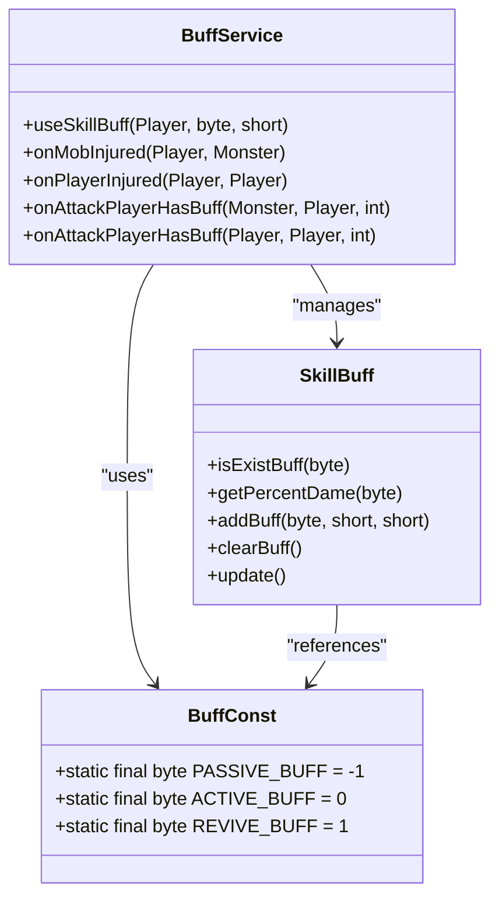
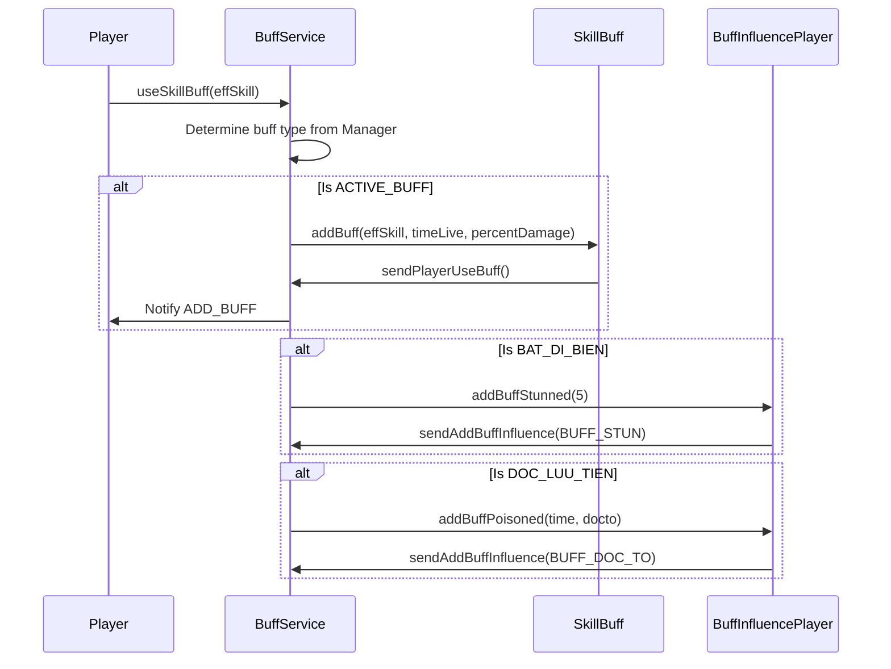
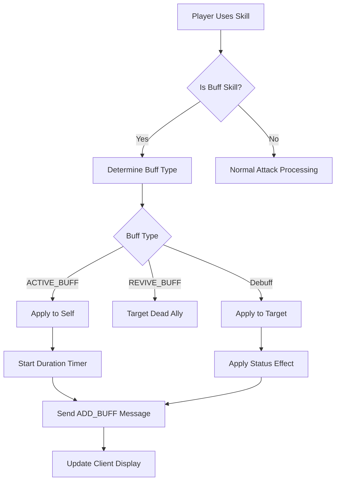
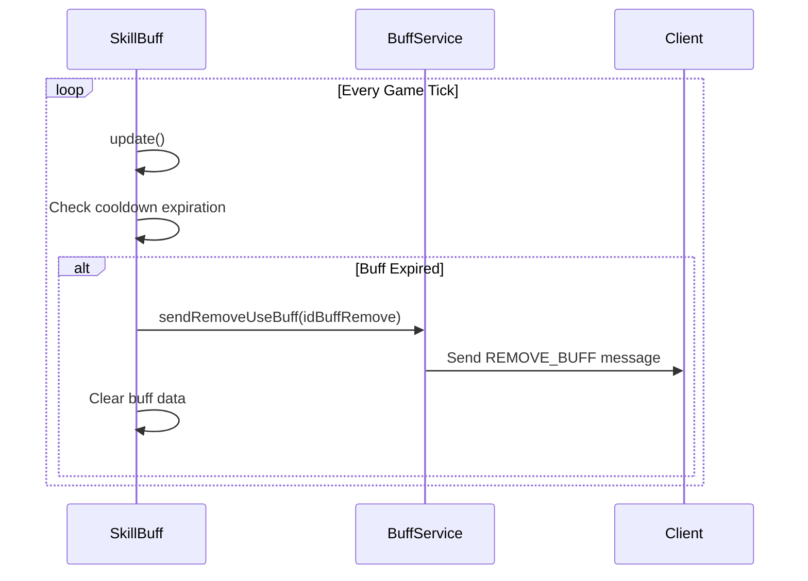

# Buff Constants

<cite>
**Referenced Files in This Document**   
- [BuffConst.java](file://src/main/java/consts/BuffConst.java)
- [BuffService.java](file://src/main/java/services/BuffService.java)
- [SkillBuff.java](file://src/main/java/skill/SkillBuff.java)
- [BuffInfluencePlayer.java](file://src/main/java/skill/BuffInfluencePlayer.java)
- [Manager.java](file://src/main/java/manager/Manager.java)
- [Const.java](file://src/main/java/consts/Const.java)
</cite>

## Table of Contents
1. [Introduction](#introduction)
2. [Buff Type Constants](#buff-type-constants)
3. [Action Constants](#action-constants)
4. [Specific Buff Effect Constants](#specific-buff-effect-constants)
5. [Duration and Timing Constants](#duration-and-timing-constants)
6. [Combat System Integration](#combat-system-integration)
7. [Buff Application and Stacking](#buff-application-and-stacking)
8. [Expiration and Removal Logic](#expiration-and-removal-logic)
9. [Gameplay Examples](#gameplay-examples)
10. [Balance Tuning Guidance](#balance-tuning-guidance)
11. [Common Issues and Troubleshooting](#common-issues-and-troubleshooting)
12. [Performance Considerations](#performance-considerations)

## Introduction
The BuffConst class defines a comprehensive set of constants that govern the mechanics of buffs and debuffs within the game's combat system. These constants control various aspects including buff types, actions, specific effects, durations, and timing parameters. The constants are used extensively by the BuffService, SkillBuff, and BuffInfluencePlayer classes to manage temporary stat modifications, status effects, and combat interactions. This documentation provides a detailed analysis of each constant's role and its integration with the broader combat system.

**Section sources**
- [BuffConst.java](file://src/main/java/consts/BuffConst.java#L1-L30)

## Buff Type Constants
The BuffConst class defines three primary buff types that determine how buffs are applied and function within the game:

- **PASSIVE_BUFF (-1)**: Represents passive abilities that are always active and do not require manual activation. These buffs are automatically applied based on character class, equipment, or permanent status effects.
- **ACTIVE_BUFF (0)**: Represents active buffs that players must consciously activate through skill usage. These buffs have defined durations and cooldown periods.
- **REVIVE_BUFF (1)**: Represents resurrection abilities that bring fallen players back to life, typically with partial health and mana restoration.

These constants are used in conjunction with the Manager class to determine the behavior of skills and their corresponding buff effects based on the player's character class.

**Diagram sources**
- [BuffConst.java](file://src/main/java/consts/BuffConst.java#L4-L6)
- [BuffService.java](file://src/main/java/services/BuffService.java#L18-L286)
- [SkillBuff.java](file://src/main/java/skill/SkillBuff.java#L18-L92)

**Section sources**
- [BuffConst.java](file://src/main/java/consts/BuffConst.java#L4-L6)
- [BuffService.java](file://src/main/java/services/BuffService.java#L25-L32)

## Action Constants
The action constants define the operations that can be performed on buffs within the system:

- **REMOVE_BUFF (0)**: Indicates the removal of a buff from a player or monster. This constant is used in network messages to notify clients when a buff has expired or been dispelled.
- **ADD_BUFF (1)**: Indicates the application of a new buff to a player or monster. This triggers visual effects and status updates on the client side.
- **VIEW_BUFF (2)**: Used for retrieving the current buff state of a player, typically for display purposes or when players inspect each other's status.

These constants are primarily used in the BuffService class to send appropriate messages to clients when buff states change, ensuring synchronization between server and client states.

**Section sources**
- [BuffConst.java](file://src/main/java/consts/BuffConst.java#L8-L10)
- [BuffService.java](file://src/main/java/services/BuffService.java#L270-L286)

## Specific Buff Effect Constants
The BuffConst class defines several constants that represent specific buff and debuff effects in the game:

- **BAT_DI_BIEN (19)**: A debuff applied by the Dau Si class that can stun enemies. When activated, it has a chance to immobilize the target.
- **HOI_CONG_LUC_DAN (25)**: A buff that enhances attack power, typically associated with archer or ranged classes.
- **CUONG_THAN_GIAP (20)**: A defensive buff that increases armor or defense values.
- **DOC_LUU_TIEN (22)**: A poison-based debuff that causes damage over time, used by the Cung Thu (Archer) class.
- **SONG_HO_CONG_THU (23)**: A buff that provides counter-attack capabilities, allowing the player to retaliate when attacked.
- **DI_LUC_DAO_CONG (24)**: A powerful offensive buff that increases damage output, typically used by melee classes.

These constants are referenced in the BuffService class to determine which specific effects to apply based on the player's class and active skills.

**Diagram sources**
- [BuffConst.java](file://src/main/java/consts/BuffConst.java#L12-L18)
- [BuffService.java](file://src/main/java/services/BuffService.java#L45-L65)
- [BuffInfluencePlayer.java](file://src/main/java/skill/BuffInfluencePlayer.java#L17-L105)

**Section sources**
- [BuffConst.java](file://src/main/java/consts/BuffConst.java#L12-L18)
- [BuffService.java](file://src/main/java/services/BuffService.java#L45-L65)

## Duration and Timing Constants
The BuffConst class includes constants that govern the timing and duration of various buff effects:

- **SECOND_SUB_HP_DOC_TO (10)**: Defines the interval in seconds at which poison damage is applied to affected targets. This constant determines how frequently the poison effect ticks, causing damage over time.
- **BUFF_STUN (3)**: Identifier for the stun status effect, used to track and manage stunned targets.
- **BUFF_DOC_TO (4)**: Identifier for the poison status effect, used to track poisoned targets and their remaining duration.
- **BUFF_PHONG_THU (5)**: Identifier for defensive buffs that enhance a player's ability to withstand attacks.

The SECOND_SUB_HP_DOC_TO constant is particularly important as it controls the frequency of poison damage application, directly affecting the potency and gameplay impact of poison-based skills.

**Section sources**
- [BuffConst.java](file://src/main/java/consts/BuffConst.java#L20-L26)
- [BuffInfluencePlayer.java](file://src/main/java/skill/BuffInfluencePlayer.java#L95-L105)

## Combat System Integration
The buff constants are deeply integrated with the combat system through the SkillService and BuffService classes. When a player uses a skill that applies a buff, the system follows this process:

1. The SkillService validates the skill usage, checking MP costs, cooldowns, and range requirements.
2. The BuffService determines the appropriate buff type based on the player's class and skill level.
3. The SkillBuff class manages the active buffs on the player, tracking their duration and effects.
4. The BuffInfluencePlayer class handles debuffs and negative status effects on both players and monsters.

For example, when a Cung Thu (Archer) player attacks while under the effect of DOC_LUU_TIEN, the BuffService applies poison damage to the target through the onPlayerInjured method. Similarly, when a Dau Si (Warrior) lands a successful attack with BAT_DI_BIEN active, there's a chance to stun the target.

**Diagram sources**
- [BuffService.java](file://src/main/java/services/BuffService.java#L20-L65)
- [SkillService.java](file://src/main/java/services/SkillService.java#L24-L386)
- [BuffInfluencePlayer.java](file://src/main/java/skill/BuffInfluencePlayer.java#L17-L105)

**Section sources**
- [BuffService.java](file://src/main/java/services/BuffService.java#L20-L65)
- [SkillService.java](file://src/main/java/services/SkillService.java#L24-L386)

## Buff Application and Stacking
The buff application system follows specific rules for stacking and coexistence of multiple buffs:

- **Single Instance**: Most buffs cannot stack with themselves. The SkillBuff.isExistBuff() method checks if a buff is already active before applying it again.
- **Class-Specific**: Certain buffs are restricted to specific character classes, determined by the Manager class based on the player's class identifier.
- **Mutual Exclusion**: Some buffs cannot coexist. For example, defensive buffs might replace weaker ones rather than stacking.
- **Duration Extension**: In some cases, reapplying a buff extends its duration rather than creating a new instance.

The system prevents infinite buff stacking by checking the existence of a buff before application. When a player attempts to use a buff that is already active, the system typically ignores the request or refreshes the duration based on game design rules.

**Section sources**
- [SkillBuff.java](file://src/main/java/skill/SkillBuff.java#L30-L35)
- [BuffService.java](file://src/main/java/services/BuffService.java#L40-L45)

## Expiration and Removal Logic
The expiration and removal of buffs is managed through a combination of server-side timers and client notifications:

- **Automatic Expiration**: The SkillBuff.update() method checks each active buff's duration and removes it when the time expires.
- **Combat Triggers**: Some buffs are removed when specific combat events occur, such as when a player dies.
- **Client Synchronization**: When a buff is removed, the BuffService sends a REMOVE_BUFF message to all players in the map to ensure visual consistency.
- **Graceful Cleanup**: The clearBuff() method handles the complete removal of all buffs, typically used when a player logs out or changes maps.

The update() methods in both SkillBuff and BuffInfluencePlayer classes are called periodically to check for expired effects and remove them from the player's status.

**Diagram sources**
- [SkillBuff.java](file://src/main/java/skill/SkillBuff.java#L75-L85)
- [BuffInfluencePlayer.java](file://src/main/java/skill/BuffInfluencePlayer.java#L95-L105)
- [BuffService.java](file://src/main/java/services/BuffService.java#L260-L265)

**Section sources**
- [SkillBuff.java](file://src/main/java/skill/SkillBuff.java#L75-L85)
- [BuffInfluencePlayer.java](file://src/main/java/skill/BuffInfluencePlayer.java#L95-L105)

## Gameplay Examples
The buff constants enable various gameplay mechanics that enhance strategic depth:

- **Temporary Stat Boosts**: When a player activates HOI_CONG_LUC_DAN, their attack power increases for a set duration, allowing for burst damage phases.
- **Debuff Resistance**: The CUONG_THAN_GIAP buff provides increased defense, making the player more resilient against enemy attacks.
- **Damage Over Time**: The DOC_LUU_TIEN debuff causes poison damage every 10 seconds (defined by SECOND_SUB_HP_DOC_TO), creating sustained pressure on enemies.
- **Crowd Control**: The BAT_DI_BIEN debuff can stun enemies for 5 seconds, providing crucial control in both PvP and PvE scenarios.
- **Resource Management**: The SONG_HO_CONG_THU buff converts a percentage of incoming damage into MP, enabling sustained spellcasting during prolonged fights.

These examples demonstrate how the constants work together to create meaningful gameplay choices and strategic considerations for players.

**Section sources**
- [BuffConst.java](file://src/main/java/consts/BuffConst.java#L1-L30)
- [BuffService.java](file://src/main/java/services/BuffService.java#L45-L65)
- [BuffInfluencePlayer.java](file://src/main/java/skill/BuffInfluencePlayer.java#L45-L65)

## Balance Tuning Guidance
When modifying buff durations and intensities for balance tuning, consider the following guidelines:

- **Duration Adjustments**: Modify the TIME_LIFE_BUFF_SKILL values in the Manager class rather than changing constants in BuffConst. This allows for per-skill, per-level tuning.
- **Effect Intensity**: Adjust the SKILL_DAM_PERCENT values in Manager to change the potency of buffs without altering the core constants.
- **Cooldown Balancing**: Use the SKILL_COOLDOWN values to balance powerful buffs, ensuring they don't dominate gameplay.
- **Frequency Tuning**: The SECOND_SUB_HP_DOC_TO constant should be changed cautiously, as it affects the fundamental rhythm of poison-based gameplay.
- **Class Balance**: Ensure that buffs are balanced across different character classes by comparing their effectiveness in similar situations.

When making balance changes, test thoroughly to avoid unintended consequences such as infinite duration bugs or overpowered combinations.

**Section sources**
- [Manager.java](file://src/main/java/manager/Manager.java#L31-L1523)
- [BuffConst.java](file://src/main/java/consts/BuffConst.java#L20)
- [BuffService.java](file://src/main/java/services/BuffService.java#L20-L286)

## Common Issues and Troubleshooting
Common issues related to buff constants and their solutions:

- **Buff Conflicts**: When multiple buffs affect the same stat, ensure proper priority rules are implemented. The system should favor more powerful or recently applied buffs.
- **Infinite Duration Bugs**: Verify that all buff removal logic properly resets the cooldown and duration timers to prevent permanent effects.
- **Desynchronization**: Ensure that ADD_BUFF and REMOVE_BUFF messages are sent reliably to all clients to prevent visual discrepancies.
- **Stacking Exploits**: Implement proper checks in the SkillBuff.addBuff() method to prevent unintended stacking of the same buff.
- **Performance Impact**: Monitor the frequency of buff updates, especially for effects that trigger on every attack or damage event.

When troubleshooting, check the BuffService and SkillBuff classes for proper implementation of the buff lifecycle, from application to expiration.

**Section sources**
- [SkillBuff.java](file://src/main/java/skill/SkillBuff.java#L50-L70)
- [BuffService.java](file://src/main/java/services/BuffService.java#L20-L286)
- [BuffInfluencePlayer.java](file://src/main/java/skill/BuffInfluencePlayer.java#L17-L105)

## Performance Considerations
The buff system has several performance implications that should be considered:

- **Update Frequency**: The periodic update checks in SkillBuff and BuffInfluencePlayer should be optimized to minimize CPU usage, especially in high-player-count scenarios.
- **Network Traffic**: Each buff application and removal generates network messages that must be efficiently serialized and transmitted.
- **Memory Usage**: The arrays in SkillBuff (idBuff, coolDown, lastTimeStartBuff, percentDame) consume memory for each player, so their size should be carefully managed.
- **Database Impact**: While the current implementation appears to be memory-based, any persistence of buff states would require consideration of database load.

The system appears designed for efficiency with fixed-size arrays and direct byte indexing, minimizing lookup times and memory overhead.

**Section sources**
- [SkillBuff.java](file://src/main/java/skill/SkillBuff.java#L20-L25)
- [BuffService.java](file://src/main/java/services/BuffService.java#L20-L286)
- [BuffInfluencePlayer.java](file://src/main/java/skill/BuffInfluencePlayer.java#L17-L30)