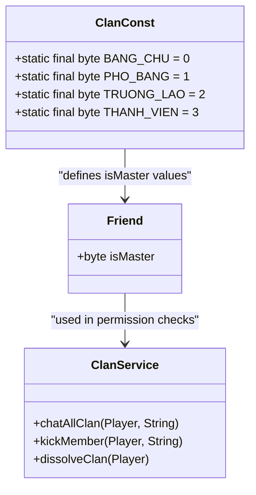
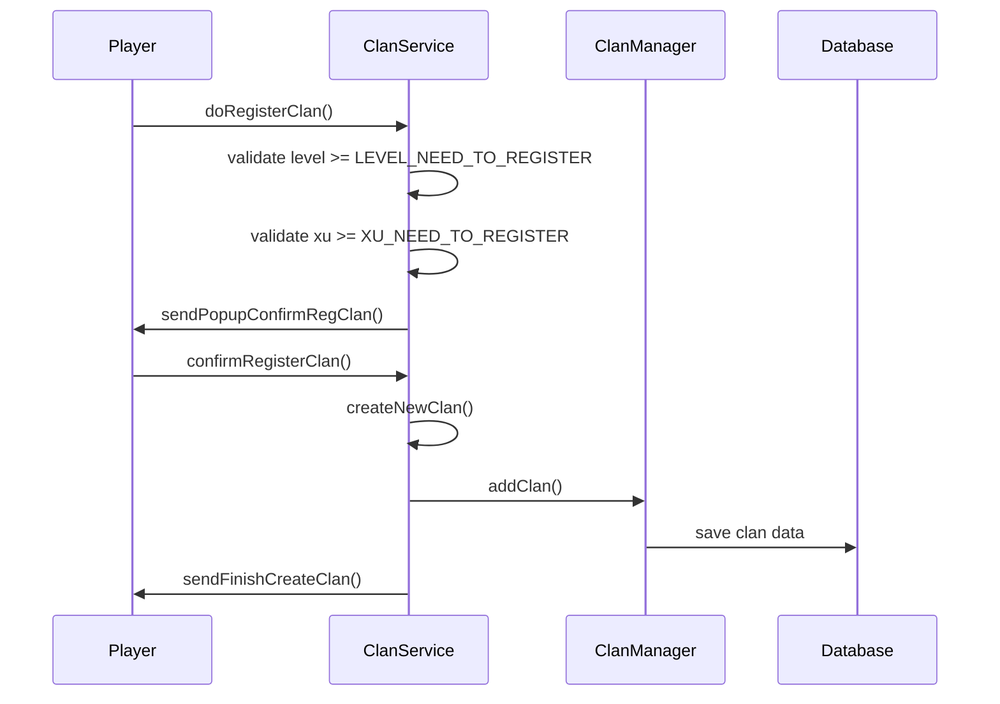
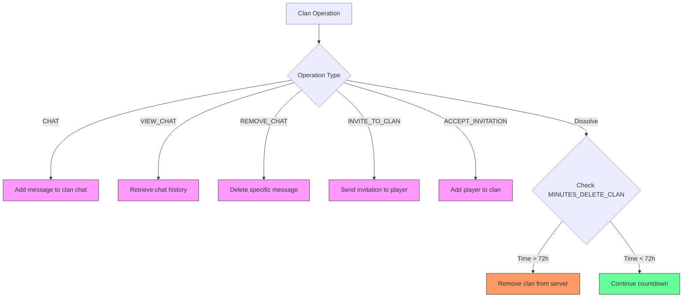
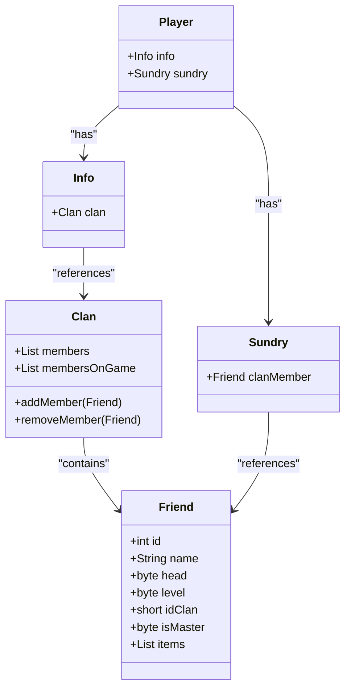
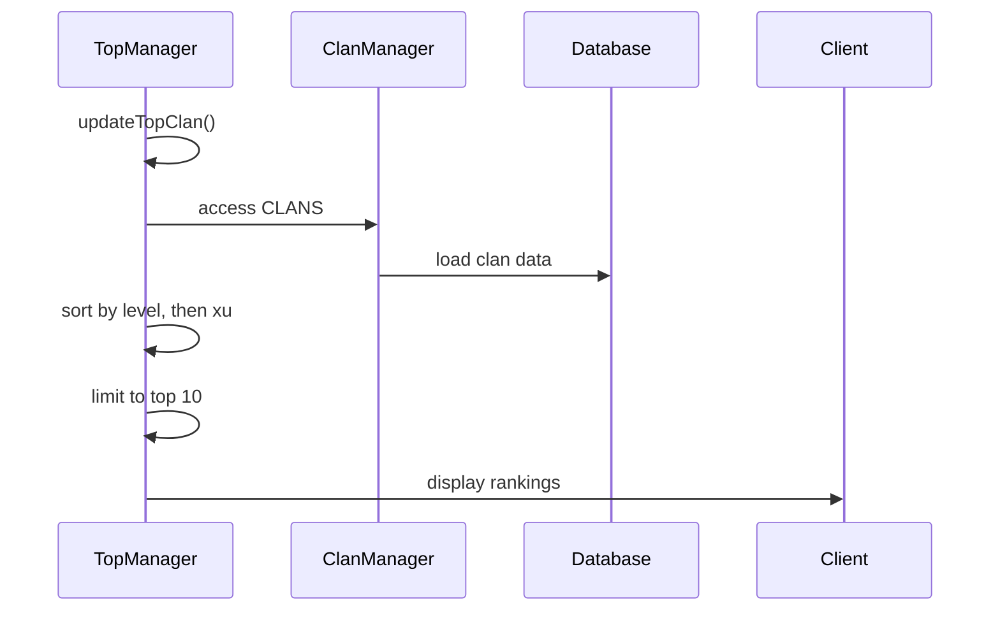
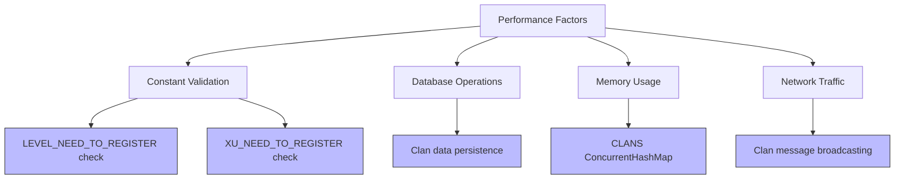
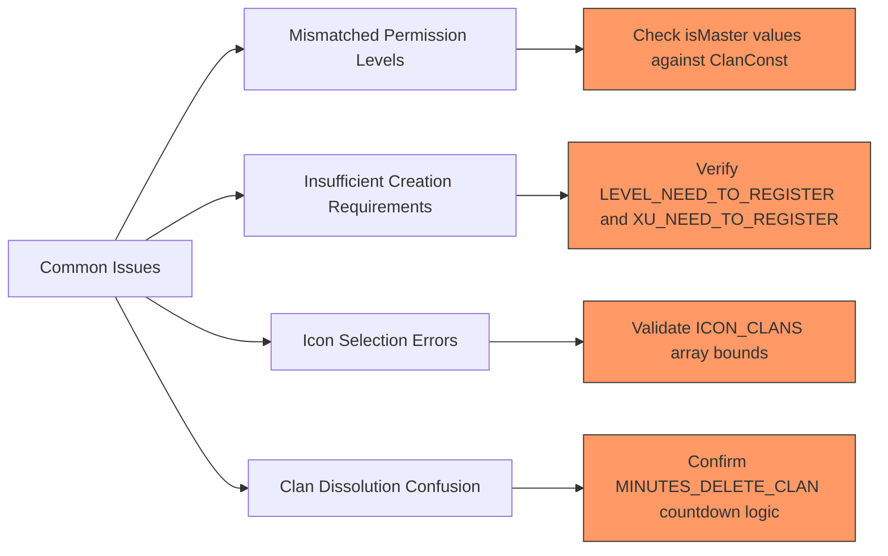

# Clan Constants

<cite>
**Referenced Files in This Document**   
- [ClanConst.java](file://src/main/java/consts/ClanConst.java)
- [Clan.java](file://src/main/java/clan/Clan.java)
- [ClanService.java](file://src/main/java/services/ClanService.java)
- [TopManager.java](file://src/main/java/manager/TopManager.java)
- [ClanManager.java](file://src/main/java/manager/ClanManager.java)
</cite>

## Table of Contents
1. [Introduction](#introduction)
2. [Core Constants Overview](#core-constants-overview)
3. [Permission Levels and Hierarchy](#permission-levels-and-hierarchy)
4. [Clan Creation Requirements](#clan-creation-requirements)
5. [Clan Management and Operations](#clan-management-and-operations)
6. [Integration with Social System](#integration-with-social-system)
7. [TopManager Integration and Clan Rankings](#topmanager-integration-and-clan-rankings)
8. [Configuration and Performance Considerations](#configuration-and-performance-considerations)
9. [Troubleshooting Common Issues](#troubleshooting-common-issues)
10. [Conclusion](#conclusion)

## Introduction
The `ClanConst` class serves as the central configuration hub for all clan-related functionality in the game. It defines critical constants that govern clan creation, member permissions, chat operations, and dissolution rules. These constants are referenced throughout the codebase, particularly in `Clan.java`, `ClanService.java`, and `TopManager.java`, to enforce game rules and maintain balance in the social gameplay system. This document provides a comprehensive analysis of these constants, their implementation, and their impact on clan dynamics and server performance.

## Core Constants Overview

The `ClanConst` class contains several categories of constants that define the fundamental parameters of clan functionality:

- **Creation Requirements**: `XU_NEED_TO_REGISTER` (100,000,000 xu) and `LEVEL_NEED_TO_REGISTER` (level 50) establish the economic and progression barriers for creating a new clan.
- **Permission Levels**: Defines a four-tier hierarchy from `BANG_CHU` (Leader) to `THANH_VIEN` (Member).
- **Operational Constants**: `MINUTES_DELETE_CLAN` (4320 minutes = 72 hours) determines the dissolution grace period.
- **UI Elements**: `ICON_CLANS` array provides 134 selectable clan icons.

These constants are used consistently across the application to maintain rule integrity and prevent hardcoded values from scattering throughout the codebase.

**Section sources**
- [ClanConst.java](file://src/main/java/consts/ClanConst.java#L6-L83)

## Permission Levels and Hierarchy

The clan permission system implements a strict four-level hierarchy that determines access to clan operations:

**Diagram sources**
- [ClanConst.java](file://src/main/java/consts/ClanConst.java#L18-L22)
- [ClanService.java](file://src/main/java/services/ClanService.java#L64-L67)

The permission levels are used in `ClanService.chatAllClan()` to determine chat prefixes (BC for Leader, PB for Vice-Leader, TL for Elder, TV for Member). Only the clan leader (`BANG_CHU`) can dissolve the clan or kick members, while all members can participate in clan chat. This hierarchical structure ensures clear leadership roles and prevents abuse of clan privileges.

**Section sources**
- [ClanConst.java](file://src/main/java/consts/ClanConst.java#L18-L22)
- [ClanService.java](file://src/main/java/services/ClanService.java#L64-L67)

## Clan Creation Requirements

Creating a new clan requires meeting specific economic and progression thresholds defined in `ClanConst`:

**Diagram sources**
- [ClanConst.java](file://src/main/java/consts/ClanConst.java#L7-L8)
- [ClanService.java](file://src/main/java/services/ClanService.java#L186-L193)

The creation process enforces that players must be at least level 50 and possess 100 million xu to register a clan. These requirements prevent premature clan formation and ensure that only committed players can establish clans. The xu cost acts as an economic barrier, while the level requirement ensures sufficient gameplay progression before clan leadership responsibilities are granted.

**Section sources**
- [ClanConst.java](file://src/main/java/consts/ClanConst.java#L7-L8)
- [ClanService.java](file://src/main/java/services/ClanService.java#L186-L193)

## Clan Management and Operations

Clan operations are governed by constants that define chat functionality, invitation systems, and dissolution rules:

**Diagram sources**
- [ClanConst.java](file://src/main/java/consts/ClanConst.java#L10-L16)
- [ClanService.java](file://src/main/java/services/ClanService.java#L33-L41)

The `MINUTES_DELETE_CLAN` constant (4320 minutes = 72 hours) creates a grace period during which a clan can be revived if it falls below 10 members or is intentionally dissolved. This prevents permanent loss of clan data due to temporary inactivity. The chat system uses `CHAT`, `VIEW_CHAT`, and `REMOVE_CHAT` constants to differentiate between chat operations, ensuring proper routing of clan communication events.

**Section sources**
- [ClanConst.java](file://src/main/java/consts/ClanConst.java#L10-L16)
- [ClanService.java](file://src/main/java/services/ClanService.java#L33-L41)

## Integration with Social System

The clan constants are deeply integrated with the game's social system, particularly in member management and player interactions:

**Diagram sources**
- [Clan.java](file://src/main/java/clan/Clan.java#L15-L17)
- [ClanService.java](file://src/main/java/services/ClanService.java#L168)

When a player joins a clan, a `Friend` object is created with `isMaster` set to `THANH_VIEN` (3) and added to the clan's member list. The player's `Info` and `Sundry` components are updated to reference the clan and their member status. This integration allows for real-time tracking of clan members both online and offline, enabling features like clan-wide messaging and status indicators.

**Section sources**
- [Clan.java](file://src/main/java/clan/Clan.java#L15-L17)
- [ClanService.java](file://src/main/java/services/ClanService.java#L168)

## TopManager Integration and Clan Rankings

The `ClanConst` values influence clan visibility and ranking through integration with `TopManager`, which maintains leaderboards for clans and players:

**Diagram sources**
- [TopManager.java](file://src/main/java/manager/TopManager.java#L50-L55)
- [ClanConst.java](file://src/main/java/consts/ClanConst.java#L7-L8)

`TopManager.loadTop()` sorts clans primarily by level and secondarily by xu reserves, making the `XU_NEED_TO_REGISTER` and clan economy mechanics critical factors in ranking success. Higher-ranked clans gain prestige and visibility, creating competitive incentives for clan development. The ranking system updates every 10 minutes, providing near-real-time feedback on clan progression.

**Section sources**
- [TopManager.java](file://src/main/java/manager/TopManager.java#L50-L55)
- [ClanConst.java](file://src/main/java/consts/ClanConst.java#L7-L8)

## Configuration and Performance Considerations

The clan constants impact both gameplay balance and server performance, particularly during validation of clan operations at scale:

**Diagram sources**
- [ClanManager.java](file://src/main/java/manager/ClanManager.java#L5)
- [ClanService.java](file://src/main/java/services/ClanService.java#L186-L191)

The `ClanManager.CLANS` ConcurrentHashMap stores all active clans, with constant lookups during member validation and chat operations. At scale, frequent validation of `LEVEL_NEED_TO_REGISTER` and `XU_NEED_TO_REGISTER` can create performance bottlenecks. The system mitigates this through efficient data structures and batched database operations, but administrators should monitor clan operation frequency during peak hours.

**Section sources**
- [ClanManager.java](file://src/main/java/manager/ClanManager.java#L5)
- [ClanService.java](file://src/main/java/services/ClanService.java#L186-L191)

## Troubleshooting Common Issues

Common configuration issues related to clan constants include mismatched permission levels and creation requirement errors:

**Diagram sources**
- [ClanConst.java](file://src/main/java/consts/ClanConst.java#L7-L8)
- [ClanService.java](file://src/main/java/services/ClanService.java#L186-L193)

The most frequent issue occurs when developers modify `LEVEL_NEED_TO_REGISTER` without updating client-side validation, causing desynchronization. Similarly, changing `XU_NEED_TO_REGISTER` without adjusting the economy can make clan creation impossible or trivial. Administrators should verify that all constants are consistent between server and client configurations, and that database constraints align with the defined values.

**Section sources**
- [ClanConst.java](file://src/main/java/consts/ClanConst.java#L7-L8)
- [ClanService.java](file://src/main/java/services/ClanService.java#L186-L193)

## Conclusion
The `ClanConst` class plays a pivotal role in defining the social and progression systems within the game. Its constants establish the economic, level, and operational parameters that shape clan dynamics and player interactions. Through integration with `ClanService`, `ClanManager`, and `TopManager`, these values enforce consistent rules across clan creation, management, and ranking systems. Proper configuration of these constants is essential for maintaining game balance, preventing exploits, and ensuring a healthy clan ecosystem. Administrators should carefully consider the social and economic implications when modifying these values, as even small changes can significantly impact player behavior and clan sustainability.