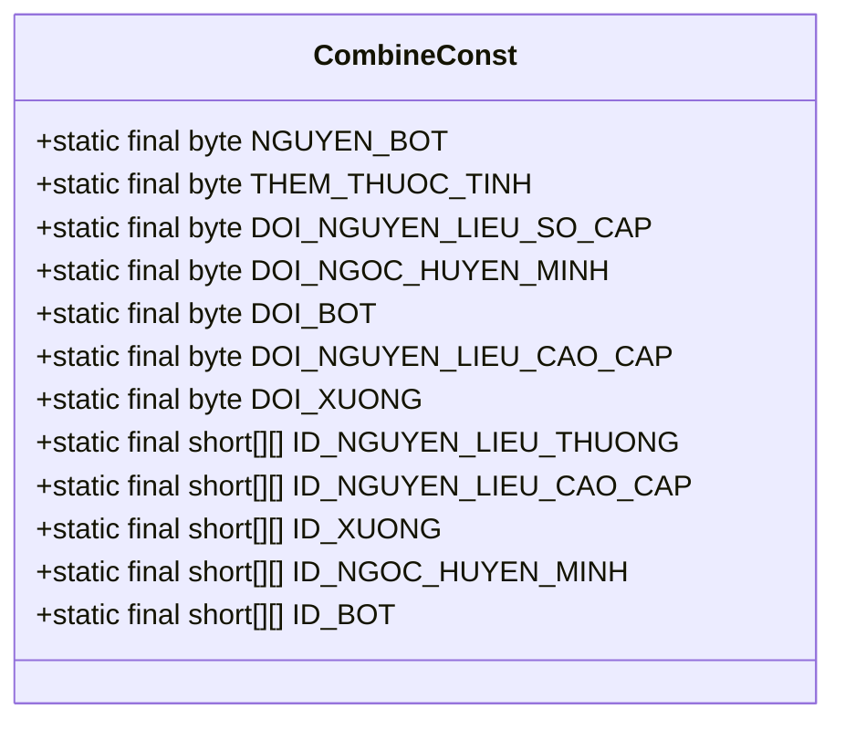
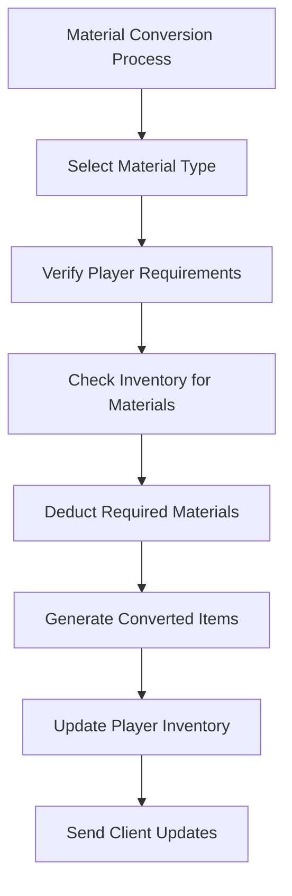
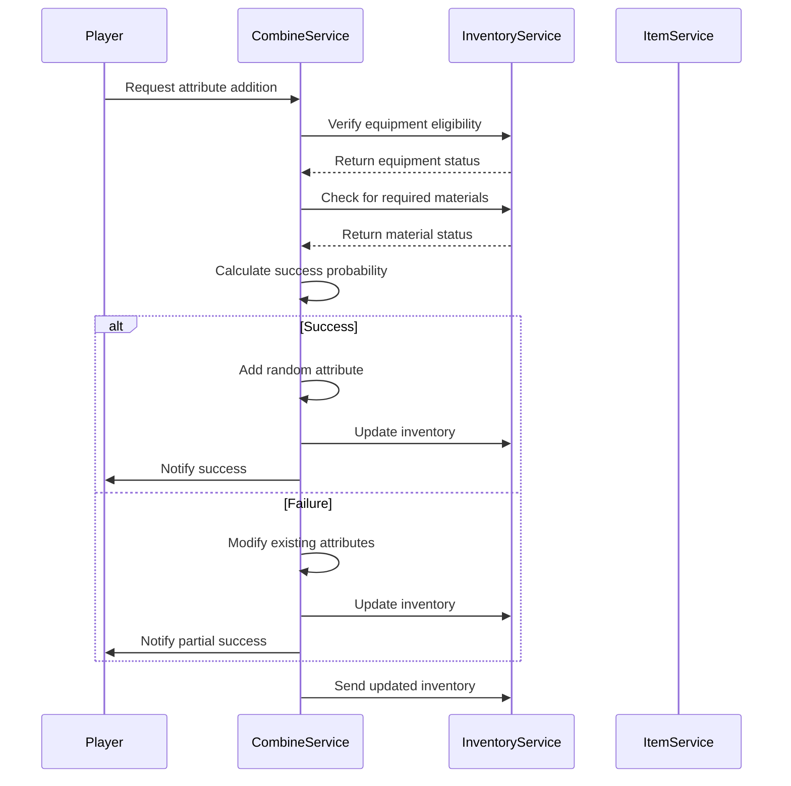
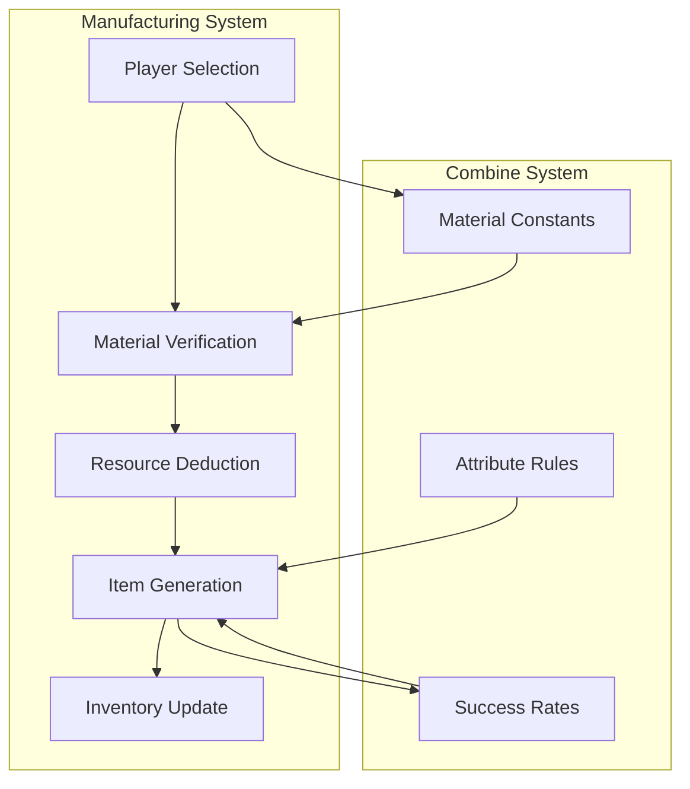

# Combine Constants

<cite>
**Referenced Files in This Document**   
- [CombineConst.java](file://src/main/java/consts/CombineConst.java)
- [CombineService.java](file://src/main/java/services/CombineService.java)
- [ItemService.java](file://src/main/java/services/ItemService.java)
- [MenuOptionService.java](file://src/main/java/services/MenuOptionService.java)
- [ManufactureConst.java](file://src/main/java/consts/ManufactureConst.java)
</cite>

## Table of Contents
1. [Introduction](#introduction)
2. [Core Constants Overview](#core-constants-overview)
3. [Material Requirements and Conversion](#material-requirements-and-conversion)
4. [Item Combination Mechanics](#item-combination-mechanics)
5. [Integration with Manufacturing System](#integration-with-manufacturing-system)
6. [Inventory Management](#inventory-management)
7. [Progression and Rare Item Creation](#progression-and-rare-item-creation)
8. [Probability and Player Engagement](#probability-and-player-engagement)
9. [Common Issues and Performance](#common-issues-and-performance)
10. [Conclusion](#conclusion)

## Introduction
The CombineConst class serves as a central repository for constants governing item combination mechanics in the game system. These constants define success rates, material requirements, enhancement bonuses, and failure penalties that shape the crafting experience. The class works in conjunction with CombineService.java and ItemService.java to implement crafting operations, progression systems, and rare item creation. This documentation provides a comprehensive analysis of how these constants are structured, utilized, and integrated throughout the game's manufacturing and inventory systems.

**Section sources**
- [CombineConst.java](file://src/main/java/consts/CombineConst.java#L1-L105)

## Core Constants Overview
The CombineConst class defines several key constants that govern different aspects of item combination mechanics. These include operation types, material categories, and specific item configurations for crafting processes.

**Diagram sources**
- [CombineConst.java](file://src/main/java/consts/CombineConst.java#L1-L105)

**Section sources**
- [CombineConst.java](file://src/main/java/consts/CombineConst.java#L1-L105)

## Material Requirements and Conversion
The CombineConst class defines comprehensive material requirements for various crafting operations through multi-dimensional arrays that specify item IDs, quantities, and costs. These constants are used in conjunction with the MenuOptionService to facilitate material conversion processes.

The material conversion system includes five primary categories:
- Basic materials (DOI_NGUYEN_LIEU_SO_CAP)
- Mystic gems (DOI_NGOC_HUYEN_MINH)
- Powders (DOI_BOT)
- Advanced materials (DOI_NGUYEN_LIEU_CAO_CAP)
- Bones (DOI_XUONG)

Each category contains specific item configurations with associated costs and quantities required for conversion operations.

**Diagram sources**
- [CombineConst.java](file://src/main/java/consts/CombineConst.java#L1-L105)
- [MenuOptionService.java](file://src/main/java/services/MenuOptionService.java#L839-L865)

**Section sources**
- [CombineConst.java](file://src/main/java/consts/CombineConst.java#L1-L105)
- [MenuOptionService.java](file://src/main/java/services/MenuOptionService.java#L839-L865)

## Item Combination Mechanics
The item combination mechanics are implemented through the interaction between CombineConst and CombineService classes. The system enables players to enhance equipment through various processes, including adding attributes and grinding materials.

The doThemDong method in CombineService.java implements the attribute addition process, requiring specific conditions to be met:
- Equipment must be green-colored, first-rank, and level 50 or higher
- Equipment must not have reached the maximum number of attribute lines
- Required materials (green powder and advancement gem) must be present

The success rate for attribute addition is determined by probability calculations, with different outcomes based on success or failure.

**Diagram sources**
- [CombineService.java](file://src/main/java/services/CombineService.java#L0-L248)
- [CombineConst.java](file://src/main/java/consts/CombineConst.java#L1-L105)

**Section sources**
- [CombineService.java](file://src/main/java/services/CombineService.java#L0-L248)
- [CombineConst.java](file://src/main/java/consts/CombineConst.java#L1-L105)

## Integration with Manufacturing System
The CombineConst class integrates with the manufacturing system through shared constants and coordinated operations. The Manufacturing system utilizes material requirements defined in CombineConst for crafting various equipment types.

The manufacturing process follows a structured workflow:
1. Player selects equipment type to craft
2. System verifies material requirements using CombineConst values
3. Required materials are deducted from inventory
4. Crafted item is generated with random attributes
5. Inventory is updated with the new equipment

This integration ensures consistency between material conversion and equipment crafting systems, creating a cohesive progression path for players.

**Diagram sources**
- [ManufactureConst.java](file://src/main/java/consts/ManufactureConst.java#L0-L249)
- [CombineConst.java](file://src/main/java/consts/CombineConst.java#L1-L105)
- [ManufactureService.java](file://src/main/java/services/ManufactureService.java#L0-L45)

**Section sources**
- [ManufactureConst.java](file://src/main/java/consts/ManufactureConst.java#L0-L249)
- [CombineConst.java](file://src/main/java/consts/CombineConst.java#L1-L105)
- [ManufactureService.java](file://src/main/java/services/ManufactureService.java#L0-L45)

## Inventory Management
Inventory management plays a crucial role in the item combination system, with specific handling for different material types and equipment states. The system distinguishes between locked and unlocked items, with separate inventory slots and management processes.

Key inventory operations include:
- Material verification before combination attempts
- Quantity deduction for consumed materials
- Item addition for successfully crafted equipment
- Inventory synchronization between server and client
- Special handling for locked items to prevent accidental use

The InventoryService class provides the necessary methods to manage these operations, ensuring proper tracking and updating of player inventories throughout the combination process.

**Section sources**
- [InventoryService.java](file://src/main/java/services/InventoryService.java#L0-L713)
- [CombineService.java](file://src/main/java/services/CombineService.java#L0-L248)

## Progression and Rare Item Creation
The combination system serves as a key progression mechanic, enabling players to create increasingly powerful equipment through successive enhancement attempts. The constants defined in CombineConst directly influence the progression curve and rarity of created items.

Rare item creation follows a probability-based model where:
- Success rates decrease as equipment quality improves
- Higher-tier materials yield better enhancement bonuses
- Failure penalties increase with equipment value
- Attribute combinations follow specific probability distributions

This creates a risk-reward balance that encourages strategic decision-making and contributes to the game's long-term engagement.

**Section sources**
- [CombineConst.java](file://src/main/java/consts/CombineConst.java#L1-L105)
- [CombineService.java](file://src/main/java/services/CombineService.java#L0-L248)

## Probability and Player Engagement
The probability values and cost multipliers defined in CombineConst significantly impact player engagement with the crafting system. The carefully balanced success rates create a compelling gameplay loop that combines risk assessment with reward anticipation.

Key probability factors include:
- 2.6% base success rate for attribute addition
- Tiered probability distributions for attribute selection
- Conditional probability based on equipment rank
- Risk mitigation through material investment

These probability mechanics create a psychological engagement pattern similar to variable ratio reinforcement schedules, encouraging continued player investment in the crafting system despite occasional failures.

**Section sources**
- [CombineConst.java](file://src/main/java/consts/CombineConst.java#L1-L105)
- [CombineService.java](file://src/main/java/services/CombineService.java#L0-L248)

## Common Issues and Performance
The combination system faces several common issues that require careful consideration:

1. **Exploit loops**: Potential for players to abuse material conversion processes
2. **Recipe validation complexity**: Performance implications of validating complex crafting recipes
3. **Inventory synchronization**: Ensuring consistency between server and client states
4. **Probability manipulation**: Preventing players from exploiting random number generation

Performance optimization strategies include:
- Caching frequently accessed constants
- Batch processing inventory updates
- Optimizing probability calculations
- Implementing efficient material validation algorithms

These considerations ensure the system remains responsive and secure while handling high volumes of combination operations.

**Section sources**
- [CombineService.java](file://src/main/java/services/CombineService.java#L0-L248)
- [InventoryService.java](file://src/main/java/services/InventoryService.java#L0-L713)

## Conclusion
The CombineConst class and its associated services form a comprehensive system for item combination mechanics that drives player progression and engagement. By defining clear constants for success rates, material requirements, and enhancement bonuses, the system creates a balanced and rewarding crafting experience. The integration with manufacturing and inventory systems ensures a cohesive gameplay loop, while careful attention to probability and performance considerations maintains game balance and technical stability. This documentation provides a foundation for understanding and potentially enhancing the item combination mechanics in future development.