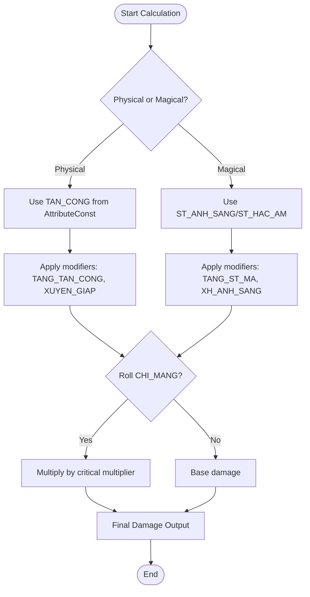
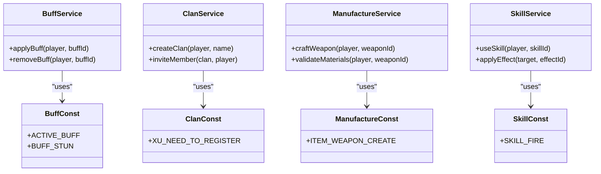

# Constants

<cite>
**Referenced Files in This Document**   
- [AttributeConst.java](file://src/main/java/consts/AttributeConst.java)
- [BuffConst.java](file://src/main/java/consts/BuffConst.java)
- [ClanConst.java](file://src/main/java/consts/ClanConst.java)
- [CombineConst.java](file://src/main/java/consts/CombineConst.java)
- [Const.java](file://src/main/java/consts/Const.java)
- [HorseConst.java](file://src/main/java/consts/HorseConst.java)
- [ItemEquipConst.java](file://src/main/java/consts/ItemEquipConst.java)
- [ManufactureConst.java](file://src/main/java/consts/ManufactureConst.java)
- [NpcConst.java](file://src/main/java/consts/NpcConst.java)
- [SkillConst.java](file://src/main/java/consts/SkillConst.java)
</cite>

## Table of Contents
1. [Introduction](#introduction)
2. [Constants Organization by Domain](#constants-organization-by-domain)
3. [Core Game Mechanics and Formula Usage](#core-game-mechanics-and-formula-usage)
4. [Balancing Guidelines and Implications of Changes](#balancing-guidelines-and-implications-of-changes)
5. [Usage in Service Classes and Code Consistency](#usage-in-service-classes-and-code-consistency)
6. [Conclusion](#conclusion)

## Introduction
The constants system in this game serves as the foundational framework for defining and maintaining game balance across all gameplay mechanics. These constants are organized into domain-specific classes within the `consts` package, each responsible for a distinct aspect of the game such as attributes, buffs, clans, crafting, items, NPCs, and skills. By centralizing these values, the system ensures consistency, simplifies balancing, and enables efficient modifications without scattering magic numbers throughout the codebase. This document provides a comprehensive overview of how these constants are structured, used in gameplay calculations, and maintained across the application.

## Constants Organization by Domain

The constants are modularly organized into separate Java classes based on functional domains, promoting clarity and maintainability. Each class contains static final fields that represent immutable game parameters.

```mermaid
graph TD
A[Constants System] --> B[AttributeConst]
A --> C[BuffConst]
A --> D[ClanConst]
A --> E[CombineConst]
A --> F[Const]
A --> G[HorseConst]
A --> H[ItemEquipConst]
A --> I[ManufactureConst]
A --> J[NpcConst]
A --> K[SkillConst]
B --> B1["TAN_CONG (Attack)", "THU_VAT (Defense)", "NE_TRANH (Dodge)", "CHI_MANG (Critical)", "BUFF-related stats"]
C --> C1["PASSIVE_BUFF", "ACTIVE_BUFF", "BUFF_STUN", "BUFF_DOC_TO"]
D --> D1["XU_NEED_TO_REGISTER", "LEVEL_NEED_TO_REGISTER", "BANG_CHU (Clan Leader)"]
E --> E1["DOI_NGUYEN_LIEU_SO_CAP", "ID_NGUYEN_LIEU_THUONG", "MATERIAL arrays"]
F --> F1["XU_START", "LUONG_START", "KIEM_KHACH (Class IDs)", "HE (Elements)"]
G --> G1["HORSE types", "IMAGE mappings"]
H --> H1["Ranks (NHAT_PHAM to NGU_PHAM)", "Item types", "GROUP_KICH"]
I --> I1["CHE_TAO_VU_KHI", "ITEM_WEAPON_CREATE", "MATERIAL_CREATE_WEAPON"]
J --> J1["NPC types", "Special NPC IDs"]
K --> K1["Skill types and effects"]
```

**Diagram sources**
- [AttributeConst.java](file://src/main/java/consts/AttributeConst.java)
- [BuffConst.java](file://src/main/java/consts/BuffConst.java)
- [ClanConst.java](file://src/main/java/consts/ClanConst.java)
- [CombineConst.java](file://src/main/java/consts/CombineConst.java)
- [Const.java](file://src/main/java/consts/Const.java)
- [HorseConst.java](file://src/main/java/consts/HorseConst.java)
- [ItemEquipConst.java](file://src/main/java/consts/ItemEquipConst.java)
- [ManufactureConst.java](file://src/main/java/consts/ManufactureConst.java)
- [NpcConst.java](file://src/main/java/consts/NpcConst.java)
- [SkillConst.java](file://src/main/java/consts/SkillConst.java)

**Section sources**
- [AttributeConst.java](file://src/main/java/consts/AttributeConst.java)
- [BuffConst.java](file://src/main/java/consts/BuffConst.java)
- [ClanConst.java](file://src/main/java/consts/ClanConst.java)
- [CombineConst.java](file://src/main/java/consts/CombineConst.java)
- [Const.java](file://src/main/java/consts/Const.java)
- [HorseConst.java](file://src/main/java/consts/HorseConst.java)
- [ItemEquipConst.java](file://src/main/java/consts/ItemEquipConst.java)
- [ManufactureConst.java](file://src/main/java/consts/ManufactureConst.java)
- [NpcConst.java](file://src/main/java/consts/NpcConst.java)
- [SkillConst.java](file://src/main/java/consts/SkillConst.java)

## Core Game Mechanics and Formula Usage

Gameplay formulas rely heavily on constants to compute damage, stat progression, cooldowns, and crafting outcomes. These values are referenced in service classes to ensure accurate and consistent calculations.

### Damage Calculation
Damage output is determined by base stats, weapon type, elemental affinity, and attribute modifiers defined in `AttributeConst.java` and `ItemEquipConst.java`. For example:
- Physical damage uses `TAN_CONG` (Attack) and `GIAM_ST_VAT` (Reduce Physical Damage)
- Magical damage uses `ST_ANH_SANG` or `ST_HAC_AM` (Light/Dark damage)
- Critical hits are influenced by `CHI_MANG` and `TANG_CHI_MANG`

### Stat Progression
Player and NPC stats scale using constants from `Const.java` and `AttributeConst.java`. Starting values like `XU_START` and `LUONG_START` define initial resources, while attribute indices control stat growth per level.

### Cooldown and Buff Mechanics
`BuffConst.java` defines buff types (`ACTIVE_BUFF`, `PASSIVE_BUFF`) and effect IDs (`BUFF_STUN`, `BUFF_DOC_TO`) used in skill systems. These constants determine duration, stacking behavior, and visual effects in `BuffService.java`.

### Crafting and Combination
`ManufactureConst.java` and `CombineConst.java` define material requirements and output mappings for crafting systems. For example:
- `MATERIAL_CREATE_WEAPON` maps gem IDs and quantities to weapon creation tiers
- `ID_NGUYEN_LIEU_THUONG` defines exchange rates for basic materials



**Diagram sources**
- [AttributeConst.java](file://src/main/java/consts/AttributeConst.java#L0-L132)
- [ItemEquipConst.java](file://src/main/java/consts/ItemEquipConst.java#L0-L103)
- [BuffConst.java](file://src/main/java/consts/BuffConst.java#L0-L30)

**Section sources**
- [AttributeConst.java](file://src/main/java/consts/AttributeConst.java#L0-L132)
- [ItemEquipConst.java](file://src/main/java/consts/ItemEquipConst.java#L0-L103)
- [BuffConst.java](file://src/main/java/consts/BuffConst.java#L0-L30)
- [ManufactureConst.java](file://src/main/java/consts/ManufactureConst.java#L0-L249)
- [CombineConst.java](file://src/main/java/consts/CombineConst.java#L0-L105)

## Balancing Guidelines and Implications of Changes

Modifying constants directly impacts game balance and player experience. Careful consideration is required before making changes.

### Key Balancing Parameters
| Constant | File | Purpose | Sensitivity |
|--------|------|---------|-----------|
| `XU_NEED_TO_REGISTER` | ClanConst.java | Clan creation cost | High |
| `MATERIAL_CREATE_WEAPON` | ManufactureConst.java | Weapon crafting cost | Medium |
| `TAN_CONG` | AttributeConst.java | Base attack value | Critical |
| `XU_START` | Const.java | Starting currency | Medium |
| `BUFF_STUN` | BuffConst.java | Stun effect ID | Low (identifier) |

### Implications of Changes
- **Economic Constants**: Adjusting `XU_START` or crafting costs affects inflation and progression speed
- **Combat Constants**: Modifying `TAN_CONG`, `CHI_MANG`, or `PHAN_ST` alters combat balance between classes
- **Crafting Constants**: Changing material requirements in `ManufactureConst.java` impacts resource sinks and player engagement
- **Clan Constants**: Altering `MINUTES_DELETE_CLAN` affects social persistence and commitment

### Best Practices for Modification
1. **Test in Staging**: Always test balance changes in a non-production environment
2. **Monitor Metrics**: Track player progression, kill times, and economy after deployment
3. **Use Version Control**: Document rationale for changes with commit messages
4. **Coordinate with Team**: Ensure designers and QA are aware of balance adjustments

**Section sources**
- [ClanConst.java](file://src/main/java/consts/ClanConst.java#L0-L84)
- [Const.java](file://src/main/java/consts/Const.java#L0-L114)
- [ManufactureConst.java](file://src/main/java/consts/ManufactureConst.java#L0-L249)
- [AttributeConst.java](file://src/main/java/consts/AttributeConst.java#L0-L132)

## Usage in Service Classes and Code Consistency

Constants are extensively referenced in service classes to maintain consistency and avoid hardcoded values.

### Example Service References
- `BuffService.java` uses `BuffConst.ACTIVE_BUFF` to determine buff activation logic
- `ClanService.java` references `ClanConst.XU_NEED_TO_REGISTER` for clan creation validation
- `ManufactureService.java` utilizes `ManufactureConst.ITEM_WEAPON_CREATE` and `MATERIAL_CREATE_WEAPON` for crafting validation
- `SkillService.java` relies on `SkillConst` values for skill effect application

### Importance of Consistent Values
Using centralized constants ensures:
- **Uniform Behavior**: All systems use the same value for a given parameter
- **Easy Updates**: Change a value once, propagate everywhere
- **Reduced Bugs**: Eliminates discrepancies from hardcoded numbers
- **Clear Intent**: Named constants improve code readability



**Diagram sources**
- [services/BuffService.java](file://src/main/java/services/BuffService.java)
- [services/ClanService.java](file://src/main/java/services/ClanService.java)
- [services/ManufactureService.java](file://src/main/java/services/ManufactureService.java)
- [services/SkillService.java](file://src/main/java/services/SkillService.java)
- [consts/BuffConst.java](file://src/main/java/consts/BuffConst.java)
- [consts/ClanConst.java](file://src/main/java/consts/ClanConst.java)
- [consts/ManufactureConst.java](file://src/main/java/consts/ManufactureConst.java)
- [consts/SkillConst.java](file://src/main/java/consts/SkillConst.java)

**Section sources**
- [services/BuffService.java](file://src/main/java/services/BuffService.java)
- [services/ClanService.java](file://src/main/java/services/ClanService.java)
- [services/ManufactureService.java](file://src/main/java/services/ManufactureService.java)
- [services/SkillService.java](file://src/main/java/services/SkillService.java)
- [consts/BuffConst.java](file://src/main/java/consts/BuffConst.java)
- [consts/ClanConst.java](file://src/main/java/consts/ClanConst.java)
- [consts/ManufactureConst.java](file://src/main/java/consts/ManufactureConst.java)
- [consts/SkillConst.java](file://src/main/java/consts/SkillConst.java)

## Conclusion

The constants system is a critical component of the game's architecture, providing a centralized, maintainable source of truth for all balance parameters. By organizing constants by domain and referencing them consistently across service classes, the system enables precise control over gameplay mechanics while minimizing errors and inconsistencies. Proper management of these constants is essential for maintaining game balance, ensuring fair progression, and delivering a polished player experience. Developers should treat constant modifications with care, understanding their far-reaching implications across combat, economy, and social systems.