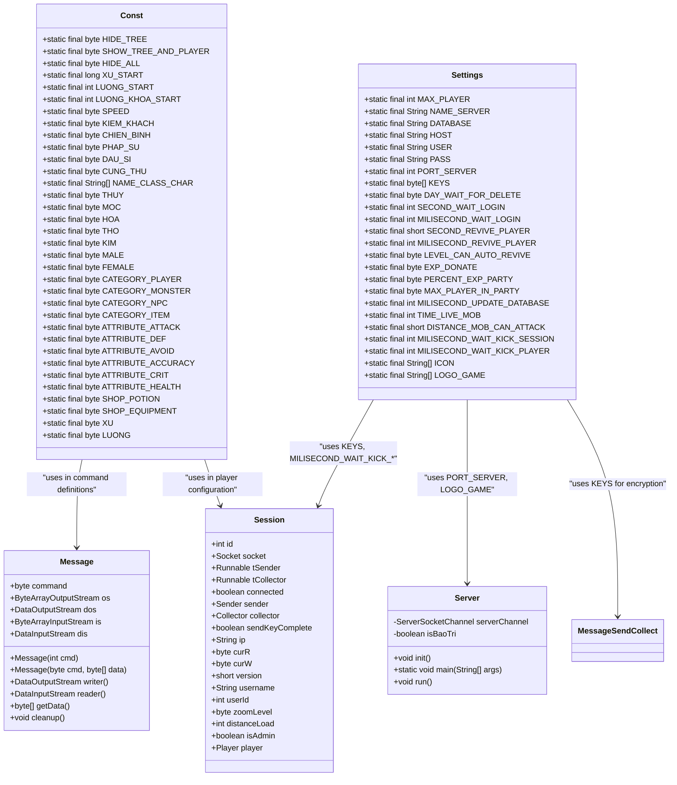
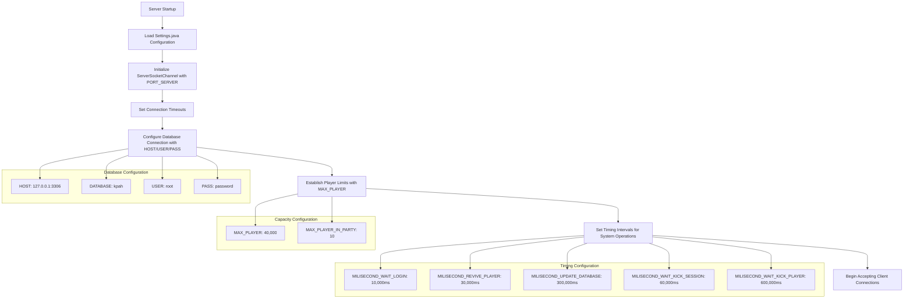
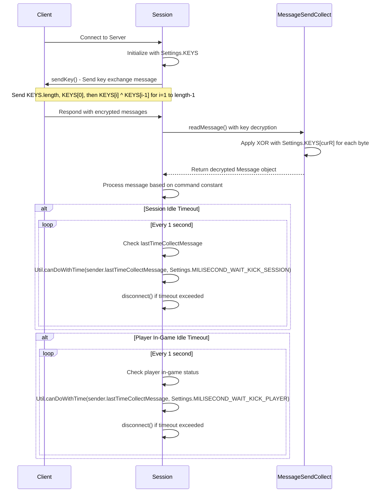
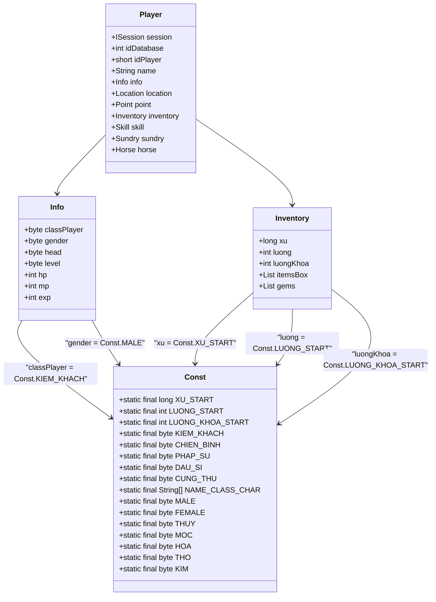
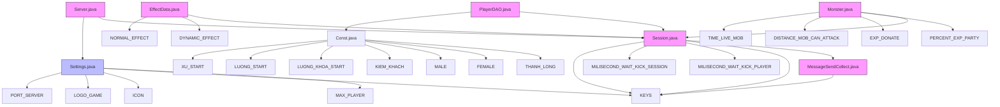

# Core Constants

<cite>
**Referenced Files in This Document**   
- [Const.java](file://src/main/java/consts/Const.java)
- [Settings.java](file://src/main/java/manager/Settings.java)
- [Server.java](file://src/main/java/server/Server.java)
- [Message.java](file://src/main/java/network/Message.java)
- [Session.java](file://src/main/java/network/Session.java)
- [Manager.java](file://src/main/java/manager/Manager.java)
- [CommandMessage.java](file://src/main/java/utils/CommandMessage.java)
</cite>

## Table of Contents
1. [Introduction](#introduction)
2. [Core Constants Overview](#core-constants-overview)
3. [System-Wide Configuration Values](#system-wide-configuration-values)
4. [Message Protocol and Communication](#message-protocol-and-communication)
5. [Player and Character Configuration](#player-and-character-configuration)
6. [Integration with Server Components](#integration-with-server-components)
7. [Performance and Stability Implications](#performance-and-stability-implications)
8. [Common Configuration Issues](#common-configuration-issues)
9. [Conclusion](#conclusion)

## Introduction
The `Const` class serves as the central repository for fundamental game-wide constants that define the core behavior, limits, and configurations of the game server. These constants establish critical parameters for server operation, player attributes, message protocols, and system stability. This document analyzes how these constants are defined, referenced, and utilized across key components including `Server.java`, `Message.java`, and `Manager.java`. The values defined in `Const.java` and `Settings.java` form the backbone of system compatibility, performance tuning, and protocol synchronization between client and server.

## Core Constants Overview

The `Const` class contains a comprehensive set of static final constants that define game mechanics, player attributes, item categories, and system behaviors. These constants are organized into logical groups including player configuration, attribute definitions, category identifiers, and shop parameters. The class works in conjunction with `Settings.java`, which contains server-level configuration values such as maximum player counts, port numbers, and timing intervals.

**Diagram sources**
- [Const.java](file://src/main/java/consts/Const.java)
- [Settings.java](file://src/main/java/manager/Settings.java)
- [Message.java](file://src/main/java/network/Message.java)
- [Session.java](file://src/main/java/network/Session.java)
- [Server.java](file://src/main/java/server/Server.java)

**Section sources**
- [Const.java](file://src/main/java/consts/Const.java)
- [Settings.java](file://src/main/java/manager/Settings.java)

## System-Wide Configuration Values

The `Settings.java` class defines critical server-wide configuration parameters that govern system capacity, network behavior, and operational timing. The `MAX_PLAYER` constant sets the upper limit for concurrent players at 40,000, establishing a hard boundary for server scalability. Network configuration is defined through constants like `PORT_SERVER` (19129) and database connection parameters (`HOST`, `USER`, `PASS`), which determine how the server connects to external services.

Timing and performance parameters are crucial for system stability. The `MILISECOND_WAIT_KICK_SESSION` (60,000ms) and `MILISECOND_WAIT_KICK_PLAYER` (600,000ms) constants define idle timeout thresholds for disconnecting inactive sessions and players, preventing resource exhaustion. The `MILISECOND_UPDATE_DATABASE` (300,000ms) interval controls how frequently player data is persisted to the database, balancing data integrity with performance overhead.

**Diagram sources**
- [Settings.java](file://src/main/java/manager/Settings.java)
- [Server.java](file://src/main/java/server/Server.java)

**Section sources**
- [Settings.java](file://src/main/java/manager/Settings.java)

## Message Protocol and Communication

The message protocol system relies heavily on constants from both `Const.java` and `CommandMessage.java` to maintain client-server synchronization. The `KEYS` array in `Settings.java` contains the encryption key "kpah" used for message obfuscation, with each byte XOR'd with the previous byte during transmission to prevent simple packet sniffing.

The `Session.java` class implements the key exchange protocol using these constants. During the `sendKey()` method execution, the session sends the length of the `KEYS` array followed by the first key byte and subsequent XOR'd values. This establishes a shared secret for message encryption between client and server.

**Diagram sources**
- [Settings.java](file://src/main/java/manager/Settings.java)
- [Session.java](file://src/main/java/network/Session.java)
- [MessageSendCollect.java](file://src/main/java/network/MessageSendCollect.java)

**Section sources**
- [Settings.java](file://src/main/java/manager/Settings.java)
- [Session.java](file://src/main/java/network/Session.java)
- [MessageSendCollect.java](file://src/main/java/network/MessageSendCollect.java)

## Player and Character Configuration

The `Const.java` class defines essential player and character parameters that shape gameplay mechanics and character progression. Starting resources are established through constants like `XU_START` (1,000,000,000), `LUONG_START` (1,000,000), and `LUONG_KHOA_START` (1,000,000), providing new characters with substantial initial wealth.

Character classes are defined with byte constants for each archetype: `KIEM_KHACH` (0), `CHIEN_BINH` (1), `PHAP_SU` (2), `DAU_SI` (3), and `CUNG_THU` (4). These values are used throughout the codebase to determine class-specific behavior, skills, and attributes. The `NAME_CLASS_CHAR` string array provides localized names for these classes in the user interface.

Gender and elemental attributes are also standardized through constants. `MALE` (1) and `FEMALE` (2) define character gender, while the五行 elements `THUY` (0), `MOC` (1), `HOA` (2), `THO` (3), and `KIM` (4) establish the game's elemental system that likely affects combat interactions and character builds.

**Diagram sources**
- [Const.java](file://src/main/java/consts/Const.java)
- [Player.java](file://src/main/java/player/Player.java)

**Section sources**
- [Const.java](file://src/main/java/consts/Const.java)
- [Player.java](file://src/main/java/player/Player.java)

## Integration with Server Components

The core constants are deeply integrated across the server architecture, with various components depending on these values for proper operation. The `Server.java` class uses `Settings.PORT_SERVER` to bind the server socket, establishing the network endpoint for client connections. It also displays the `Settings.LOGO_GAME` and `Settings.ICON` during startup, providing visual identification of the server instance.

The `Manager.java` class, while not directly referencing `Const.java`, works in conjunction with the constant system by managing game entities that are categorized using constants from `Const.java`. For example, the `CATEGORY_PLAYER`, `CATEGORY_MONSTER`, and `CATEGORY_NPC` constants are used to distinguish between different entity types in the game world.

The `Message.java` class interacts with the constant system through command codes defined in `CommandMessage.java`, which contains over 200 command constants that correspond to specific game actions and communications. These command values are transmitted as the `command` byte in each `Message` object, allowing the server and client to coordinate complex interactions.

**Diagram sources**
- [Server.java](file://src/main/java/server/Server.java)
- [Settings.java](file://src/main/java/manager/Settings.java)
- [Session.java](file://src/main/java/network/Session.java)
- [MessageSendCollect.java](file://src/main/java/network/MessageSendCollect.java)
- [PlayerDAO.java](file://src/main/java/daos/PlayerDAO.java)
- [EffectData.java](file://src/main/java/effects/EffectData.java)
- [Monster.java](file://src/main/java/map/Monster.java)

**Section sources**
- [Server.java](file://src/main/java/server/Server.java)
- [Manager.java](file://src/main/java/manager/Manager.java)
- [Message.java](file://src/main/java/network/Message.java)

## Performance and Stability Implications

The core constants have significant implications for system performance and stability. The server tick rate and timing intervals defined in `Settings.java` directly affect game responsiveness and resource utilization. The `MILISECOND_WAIT_KICK_SESSION` (60 seconds) and `MILISECOND_WAIT_KICK_PLAYER` (10 minutes) values represent a careful balance between preventing connection hijacking and accommodating legitimate player latency.

Adjusting the `MILISECOND_UPDATE_DATABASE` interval (5 minutes) has direct performance consequences. A shorter interval increases data safety but creates more frequent database load, potentially impacting server responsiveness. A longer interval reduces database pressure but increases the risk of data loss in case of server crashes.

The `MAX_PLAYER` limit of 40,000 is a critical stability parameter that prevents the server from exceeding memory and CPU capacity. This value was likely determined through stress testing to ensure stable operation under maximum load. Similarly, the `TIME_LIVE_MOB` (8,000ms) and `DISTANCE_MOB_CAN_ATTACK` (90 units) constants affect combat performance by controlling monster behavior and AI processing frequency.

Message protocol versioning, while not explicitly defined in the provided constants, is implied by the `version` field in `Session.java`. This allows for backward compatibility when updating client-server communication protocols, enabling gradual client updates without disrupting service for players on older versions.

## Common Configuration Issues

Several common configuration issues can arise from improper handling of core constants:

1. **Version Mismatches**: When client and server use different `KEYS` arrays or command constants, communication fails completely. This typically manifests as connection timeouts or immediate disconnections after login.

2. **Timing Parameter Conflicts**: Inconsistent timing values between client and server can cause desynchronization. For example, if the client expects a 30-second revive timer but the server uses `MILISECOND_REVIVE_PLAYER` (30,000ms), players may experience unexpected behavior during resurrection.

3. **Resource Limit Exceedances**: Modifying constants like `MAX_PLAYER` without corresponding hardware upgrades can lead to server instability, increased latency, and crashes under load.

4. **Database Configuration Errors**: Incorrect `HOST`, `USER`, or `PASS` values in `Settings.java` prevent database connectivity, resulting in failed player logins and data persistence issues.

5. **Key Exchange Failures**: Corruption or modification of the `KEYS` array can break the encryption protocol, preventing successful message decryption and causing all communications to fail.

These issues highlight the importance of maintaining consistency across all instances of the server configuration and ensuring that any changes to core constants are thoroughly tested in a staging environment before deployment.

## Conclusion

The `Const` and `Settings` classes serve as the foundational configuration layer for the game server, defining critical parameters that govern system behavior, performance, and compatibility. These constants are not merely arbitrary values but carefully chosen parameters that balance gameplay experience, system stability, and technical constraints. Their integration across `Server.java`, `Message.java`, and related components demonstrates a well-structured approach to centralized configuration management. Understanding these core constants is essential for maintaining system stability, troubleshooting configuration issues, and implementing controlled modifications to game mechanics and server behavior.