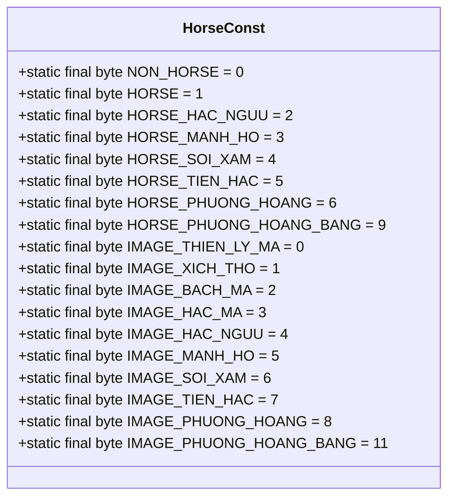
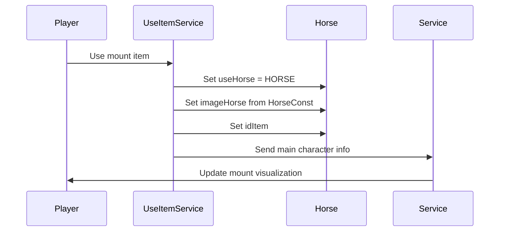
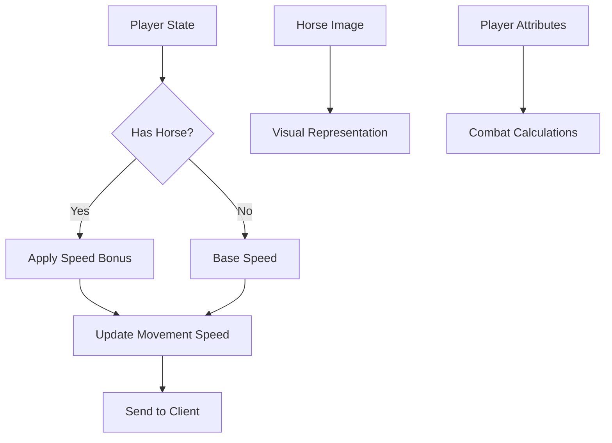

# Horse Constants

<cite>
**Referenced Files in This Document**   
- [HorseConst.java](file://src/main/java/consts/HorseConst.java)
- [Horse.java](file://src/main/java/player/Horse.java)
- [ChangeMapService.java](file://src/main/java/services/ChangeMapService.java)
- [Point.java](file://src/main/java/player/Point.java)
- [UseItemService.java](file://src/main/java/services/UseItemService.java)
- [Manager.java](file://src/main/java/manager/Manager.java)
- [Const.java](file://src/main/java/consts/Const.java)
</cite>

## Table of Contents
1. [Introduction](#introduction)
2. [Horse Constants Overview](#horse-constants-overview)
3. [Mount Mechanics Implementation](#mount-mechanics-implementation)
4. [Integration with Movement and Combat Systems](#integration-with-movement-and-combat-systems)
5. [Gameplay Strategy Implications](#gameplay-strategy-implications)
6. [Performance and Security Considerations](#performance-and-security-considerations)
7. [Conclusion](#conclusion)

## Introduction
The HorseConst class defines a comprehensive set of constants that govern mount mechanics in the game system. These constants control various aspects of horse functionality including mount types, visual representations, and state management. The implementation integrates with player movement, combat systems, and map navigation to provide enhanced mobility and strategic gameplay options. This document details how these constants are used across the codebase to control mount functionality and influence gameplay mechanics.

## Horse Constants Overview

The HorseConst class provides static constants for managing horse states, types, and visual representations. These constants serve as identifiers for different horse variants and their corresponding image assets.

**Diagram sources**
- [HorseConst.java](file://src/main/java/consts/HorseConst.java#L1-L36)

**Section sources**
- [HorseConst.java](file://src/main/java/consts/HorseConst.java#L1-L36)

## Mount Mechanics Implementation

The Horse class represents the player's mount state, storing information about the currently used horse including its type, visual representation, and associated item. The HorseConst constants are used to determine the horse state and appearance.

The mount system is implemented through integration between the UseItemService and Horse classes. When a player uses a mount item, the UseItemService validates the current state and applies the appropriate horse configuration using constants from HorseConst. The system prevents mounting when already on a horse by checking the useHorse field against HorseConst.NON_HORSE.

**Section sources**
- [Horse.java](file://src/main/java/player/Horse.java#L1-L36)
- [UseItemService.java](file://src/main/java/services/UseItemService.java#L105-L128)

## Integration with Movement and Combat Systems

The horse constants integrate with core gameplay systems to modify player attributes and movement capabilities. The Point class utilizes horse state to adjust character statistics, while the movement system accounts for mount status in navigation.

The integration with the Point class shows that horse ownership affects character statistics. When a player has a horse, their speed is increased as defined in the setSpeed method. Additionally, specific horse images provide stat bonuses - for example, players with imageHorse == 1 receive attribute bonuses to strength, agility, spirit, and health.

The ChangeMapService utilizes horse state during map transitions, ensuring proper player state management when changing locations. This integration maintains consistency between the player's mount state and their position in the game world.

**Section sources**
- [Point.java](file://src/main/java/player/Point.java#L422-L475)
- [Point.java](file://src/main/java/player/Point.java#L127-L155)
- [ChangeMapService.java](file://src/main/java/services/ChangeMapService.java#L1-L82)

## Gameplay Strategy Implications

The horse constants enable strategic gameplay decisions by providing different mount options with varying visual and statistical benefits. Players must consider both exploration efficiency and combat mobility when selecting and upgrading their mounts.

The speed values defined in the constants directly impact exploration efficiency, allowing players to traverse the game world more quickly when mounted. This creates strategic advantages in resource gathering, quest completion, and player versus player engagements. The durability limits and upgrade costs associated with mounts (managed through external configuration in Manager) create resource management challenges that affect long-term progression.

Different horse types offer distinct advantages:
- **Thiên Lý Mã (Heavenly Horse)**: Basic mount with standard speed increase
- **Xích Thỏ (Red Rabbit)**: Alternative mount option with unique visual representation
- **Phượng Hoàng (Phoenix)**: Advanced mount with enhanced capabilities

Players must balance the costs of acquiring and maintaining mounts against the mobility benefits they provide. The summoning cooldowns and upgrade requirements create strategic decision points about when to use mounts and how to allocate resources for mount improvements.

**Section sources**
- [HorseConst.java](file://src/main/java/consts/HorseConst.java#L1-L36)
- [Manager.java](file://src/main/java/manager/Manager.java#L1-L1524)
- [Const.java](file://src/main/java/consts/Const.java#L1-L114)

## Performance and Security Considerations

The horse system implementation addresses performance and security concerns related to mount functionality. The constants-based approach ensures efficient state management and helps prevent common exploits.

Speed hacking vulnerabilities are mitigated through server-side validation of mount states. The system verifies player actions and state changes on the server, preventing clients from manipulating mount speed values. When using mount items, the UseItemService validates that the player is not already mounted before applying the horse state.

Performance implications are managed through efficient state synchronization. The mount state is only updated when necessary, reducing network traffic and server processing load. The visual representation of horses is handled through pre-defined constants and image mappings, minimizing computational overhead during gameplay.

The integration with the Movement system ensures that mount state changes are properly synchronized across all clients, maintaining game state consistency. This prevents desynchronization issues that could lead to gameplay advantages or visual glitches.

**Section sources**
- [UseItemService.java](file://src/main/java/services/UseItemService.java#L105-L128)
- [ChangeMapService.java](file://src/main/java/services/ChangeMapService.java#L1-L82)
- [Point.java](file://src/main/java/player/Point.java#L422-L475)

## Conclusion
The HorseConst class provides a foundational framework for mount mechanics in the game system. Through its integration with the Horse, Point, and ChangeMapService classes, it enables enhanced mobility and strategic gameplay options. The constants define various horse types and their visual representations, which are used to control player movement speed, combat attributes, and visual appearance. The system balances gameplay benefits with resource management requirements, creating meaningful strategic decisions for players. Security measures prevent common exploits like speed hacking, while performance optimizations ensure efficient state synchronization across the network.