# Item Equipment Constants

<cite>
**Referenced Files in This Document**   
- [ItemEquipConst.java](file://src/main/java/consts/ItemEquipConst.java)
- [ItemEquip.java](file://src/main/java/item/ItemEquip.java)
- [InventoryService.java](file://src/main/java/services/InventoryService.java)
- [ItemEquipTemplate.java](file://src/main/java/template/ItemEquipTemplate.java)
- [AttributeConst.java](file://src/main/java/consts/AttributeConst.java)
</cite>

## Table of Contents
1. [Introduction](#introduction)
2. [Core Constants Overview](#core-constants-overview)
3. [Equipment Properties and Stat Modifiers](#equipment-properties-and-stat-modifiers)
4. [Durability and Repair Mechanics](#durability-and-repair-mechanics)
5. [Enhancement and Rank System](#enhancement-and-rank-system)
6. [Elemental Affinities and Five Elements Activation](#elemental-affinities-and-five-elements-activation)
7. [Socket and Jewelry Configuration](#socket-and-jewelry-configuration)
8. [Integration with Template System](#integration-with-template-system)
9. [Validation and Business Logic in InventoryService](#validation-and-business-logic-in-inventoryservice)
10. [Character Build Implications](#character-build-implications)
11. [Manufacturing and Item Creation](#manufacturing-and-item-creation)
12. [Common Issues and Performance Considerations](#common-issues-and-performance-considerations)

## Introduction
The `ItemEquipConst` class serves as a central repository for all equipment-related constants in the game system. It defines enumerations and configuration values that govern equipment behavior, including stat modifiers, durability, enhancement limits, socket configurations, elemental affinities, and item rarity. These constants are integral to the equipment system, influencing how items are created, validated, and applied to player characters through the `ItemEquip` and `InventoryService` classes. This documentation provides a comprehensive analysis of these constants and their role in shaping gear progression, character builds, and gameplay mechanics.

**Section sources**
- [ItemEquipConst.java](file://src/main/java/consts/ItemEquipConst.java#L1-L103)

## Core Constants Overview
The `ItemEquipConst` class defines several categories of constants that establish the foundational rules for equipment systems. These include rank classifications, elemental affinities, damage types, color codes, and equipment categories. The constants provide a type-safe way to reference equipment properties throughout the codebase, ensuring consistency in item behavior and validation rules.

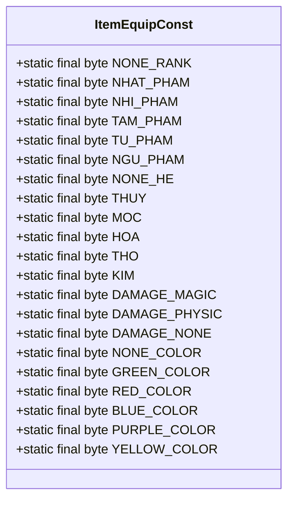

**Diagram sources**
- [ItemEquipConst.java](file://src/main/java/consts/ItemEquipConst.java#L1-L40)

**Section sources**
- [ItemEquipConst.java](file://src/main/java/consts/ItemEquipConst.java#L1-L40)

## Equipment Properties and Stat Modifiers
Equipment properties are governed by constants that define item categories, types, and their associated stat modifiers. The `ItemEquipConst` class contains type identifiers for armor, weapons, jewelry, and accessories, which are used to determine valid equipment slots and stat calculations. These constants work in conjunction with `AttributeConst` to define how equipment affects character stats.

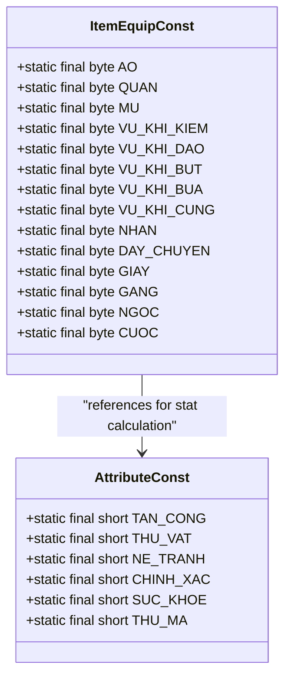

**Diagram sources**
- [ItemEquipConst.java](file://src/main/java/consts/ItemEquipConst.java#L58-L78)
- [AttributeConst.java](file://src/main/java/consts/AttributeConst.java#L1-L15)

**Section sources**
- [ItemEquipConst.java](file://src/main/java/consts/ItemEquipConst.java#L58-L78)
- [AttributeConst.java](file://src/main/java/consts/AttributeConst.java#L1-L15)

## Durability and Repair Mechanics
The durability system is controlled by constants that define repair types and their application scope. The `REPAIR_WEAPON`, `REPAIR_EQUIP`, and `REPAIR_ALL` constants determine which items can be repaired through the `InventoryService`. These constants are used in conditional logic to apply durability restoration to specific equipment categories, ensuring that weapons and armor can be maintained according to game rules.

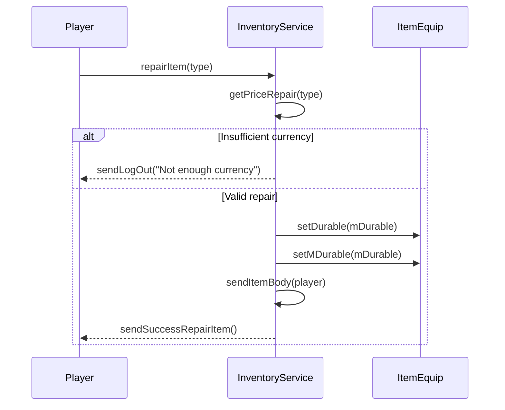

**Diagram sources**
- [ItemEquipConst.java](file://src/main/java/consts/ItemEquipConst.java#L54-L57)
- [InventoryService.java](file://src/main/java/services/InventoryService.java#L100-L140)
- [ItemEquip.java](file://src/main/java/item/ItemEquip.java#L20-L25)

**Section sources**
- [ItemEquipConst.java](file://src/main/java/consts/ItemEquipConst.java#L54-L57)
- [InventoryService.java](file://src/main/java/services/InventoryService.java#L100-L140)

## Enhancement and Rank System
The enhancement system is built around a rank classification system defined by constants from `NONE_RANK` to `NGU_PHAM`. These ranks determine the enhancement limits, stat bonuses, and visual appearance of equipment. The rank system is integral to gear progression, with higher ranks providing greater stat modifiers and enabling advanced features like Five Elements activation. The constants establish the hierarchy that governs equipment power scaling and player progression.

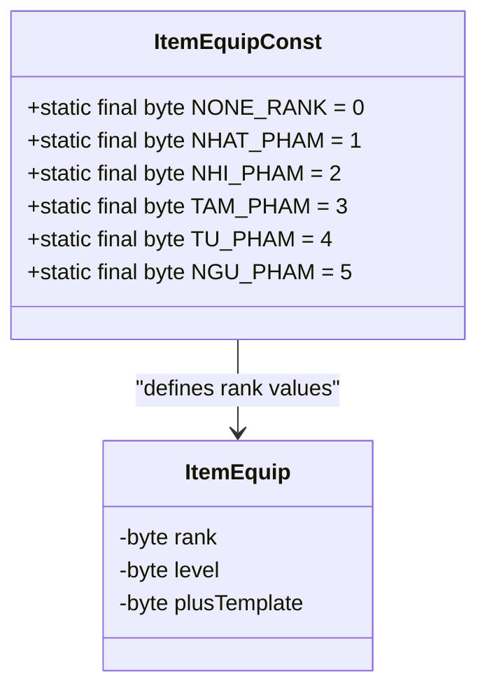

**Diagram sources**
- [ItemEquipConst.java](file://src/main/java/consts/ItemEquipConst.java#L3-L9)
- [ItemEquip.java](file://src/main/java/item/ItemEquip.java#L15-L18)

**Section sources**
- [ItemEquipConst.java](file://src/main/java/consts/ItemEquipConst.java#L3-L9)
- [ItemEquip.java](file://src/main/java/item/ItemEquip.java#L15-L18)

## Elemental Affinities and Five Elements Activation
The Five Elements (Wu Xing) system is implemented through elemental affinity constants (`THUY`, `MOC`, `HOA`, `THO`, `KIM`) and activation rules defined in `GROUP_KICH` and `KICH_HE` arrays. These constants determine how equipment pieces interact with each other to create elemental synergies. When specific equipment combinations are worn, they trigger the "Kich Ngu Hanh" (Five Elements Activation) effect, providing additional stat bonuses. The system uses position-based rules to determine valid combinations.

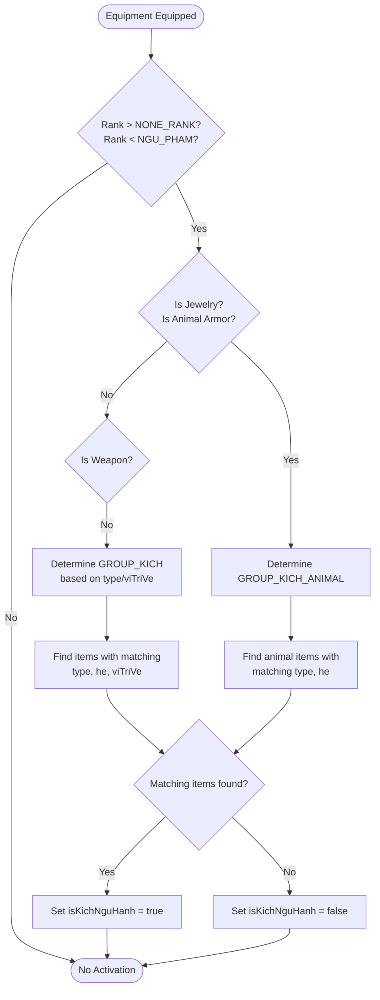

**Diagram sources**
- [ItemEquipConst.java](file://src/main/java/consts/ItemEquipConst.java#L11-L16)
- [ItemEquipConst.java](file://src/main/java/consts/ItemEquipConst.java#L79-L94)
- [ItemEquip.java](file://src/main/java/item/ItemEquip.java#L50-L90)

**Section sources**
- [ItemEquipConst.java](file://src/main/java/consts/ItemEquipConst.java#L11-L16)
- [ItemEquipConst.java](file://src/main/java/consts/ItemEquipConst.java#L79-L94)
- [ItemEquip.java](file://src/main/java/item/ItemEquip.java#L50-L90)

## Socket and Jewelry Configuration
Jewelry and socketed items are defined by specific type constants (`NHAN`, `DAY_CHUYEN`, `NGOC`) and attribute randomization arrays. The system supports different attribute pools for various equipment tiers, with `ATTRIBUTE_RANDOM_TIEN_GIAI` and `ATTRIBUTE_RANDOM_TIEN_GIAI_VU_KHI` providing stat ranges for advanced gear. These constants ensure that jewelry items receive appropriate stat modifiers and participate in the broader equipment enhancement system.

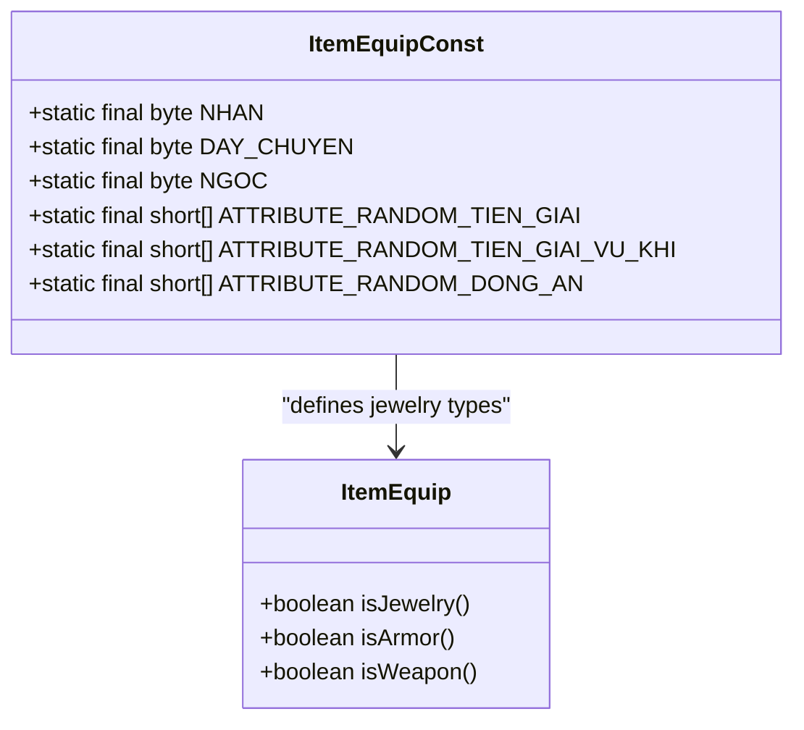

**Diagram sources**
- [ItemEquipConst.java](file://src/main/java/consts/ItemEquipConst.java#L73-L78)
- [ItemEquipConst.java](file://src/main/java/consts/ItemEquipConst.java#L96-L100)
- [ItemEquip.java](file://src/main/java/item/ItemEquip.java#L100-L115)

**Section sources**
- [ItemEquipConst.java](file://src/main/java/consts/ItemEquipConst.java#L73-L78)
- [ItemEquipConst.java](file://src/main/java/consts/ItemEquipConst.java#L96-L100)
- [ItemEquip.java](file://src/main/java/item/ItemEquip.java#L100-L115)

## Integration with Template System
Equipment templates are defined in `ItemEquipTemplate` and instantiated using constants from `ItemEquipConst`. The template system uses type, level, and durability values from the constants to create consistent equipment definitions. When new items are created, the template system references these constants to ensure that all equipment adheres to the defined rules for stat progression, durability, and enhancement limits.

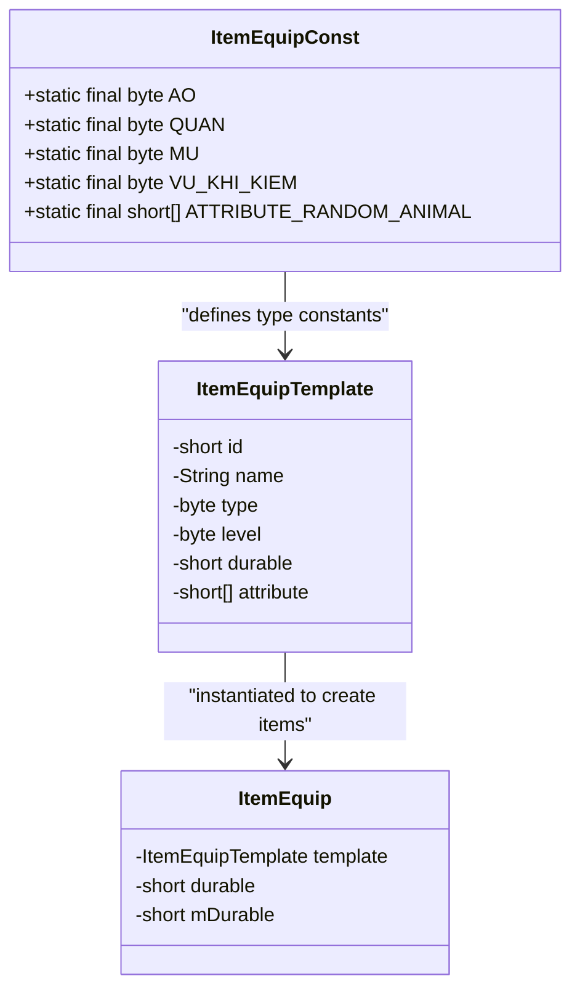

**Diagram sources**
- [ItemEquipTemplate.java](file://src/main/java/template/ItemEquipTemplate.java#L1-L15)
- [ItemEquipConst.java](file://src/main/java/consts/ItemEquipConst.java#L1-L103)
- [ItemEquip.java](file://src/main/java/item/ItemEquip.java#L1-L20)

**Section sources**
- [ItemEquipTemplate.java](file://src/main/java/template/ItemEquipTemplate.java#L1-L15)
- [ItemEquipConst.java](file://src/main/java/consts/ItemEquipConst.java#L1-L103)

## Validation and Business Logic in InventoryService
The `InventoryService` class implements business logic that validates and applies equipment rules defined by `ItemEquipConst`. Methods like `repairItem`, `findItemBodyByTypeHe`, and `sumAttributeValueForId` use the constants to enforce game rules. The service layer ensures that equipment interactions follow the defined constraints for durability, repair costs, and stat calculation, providing a consistent experience across all player actions.

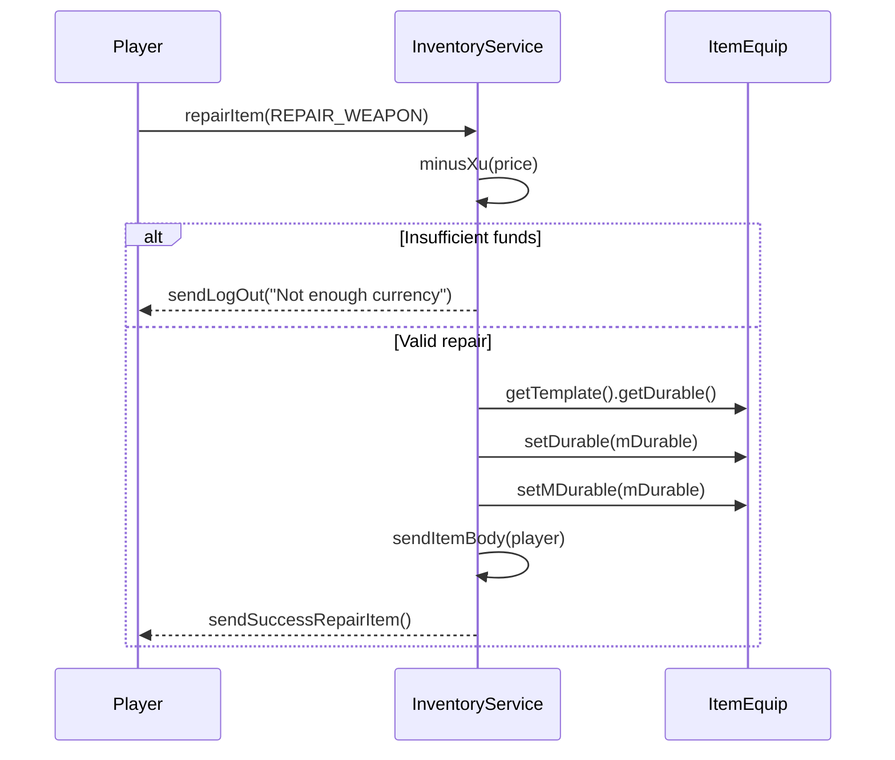

**Diagram sources**
- [InventoryService.java](file://src/main/java/services/InventoryService.java#L100-L140)
- [ItemEquipConst.java](file://src/main/java/consts/ItemEquipConst.java#L54-L57)
- [ItemEquip.java](file://src/main/java/item/ItemEquip.java#L20-L25)

**Section sources**
- [InventoryService.java](file://src/main/java/services/InventoryService.java#L100-L140)

## Character Build Implications
The equipment constants directly influence character build strategies by defining stat caps, enhancement limits, and synergy opportunities. Players must consider rank progression, elemental affinities, and equipment combinations when optimizing their builds. The `isKichNguHanh` method in `ItemEquip` demonstrates how the constants enable complex build mechanics, where specific equipment combinations trigger additional effects that significantly impact character performance.

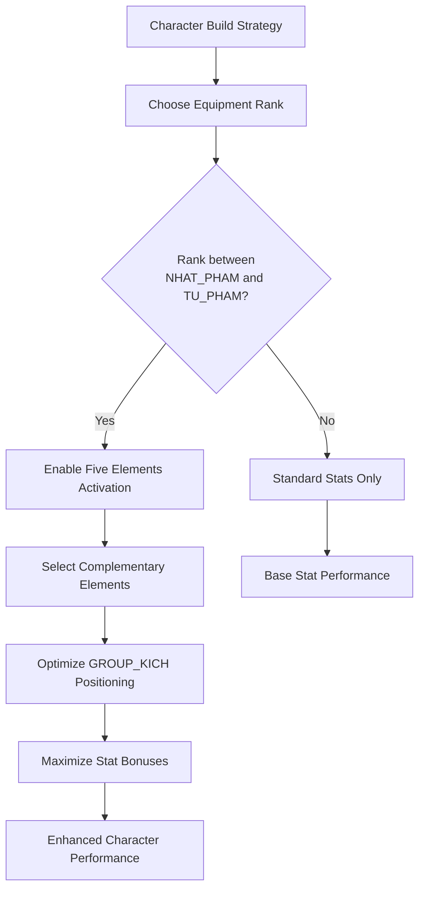

**Diagram sources**
- [ItemEquip.java](file://src/main/java/item/ItemEquip.java#L50-L90)
- [ItemEquipConst.java](file://src/main/java/consts/ItemEquipConst.java#L3-L9)
- [ItemEquipConst.java](file://src/main/java/consts/ItemEquipConst.java#L79-L94)

**Section sources**
- [ItemEquip.java](file://src/main/java/item/ItemEquip.java#L50-L90)

## Manufacturing and Item Creation
The manufacturing system uses `ItemEquipConst` values to validate and create new equipment. When players craft items through `ManufactureService`, the system references the constants to ensure that generated equipment adheres to the defined rules for type, durability, and stat ranges. The constants provide the boundary conditions for item generation, preventing invalid or overpowered equipment from entering the game economy.

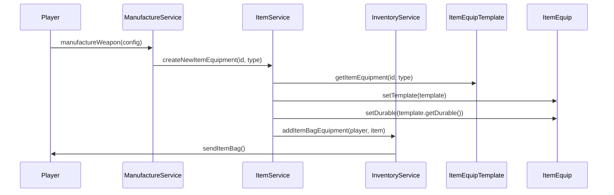

**Diagram sources**
- [ItemEquipConst.java](file://src/main/java/consts/ItemEquipConst.java#L1-L103)
- [ItemEquipTemplate.java](file://src/main/java/template/ItemEquipTemplate.java#L1-L15)
- [ItemEquip.java](file://src/main/java/item/ItemEquip.java#L1-L20)
- [InventoryService.java](file://src/main/java/services/InventoryService.java#L300-L320)

**Section sources**
- [ItemEquipConst.java](file://src/main/java/consts/ItemEquipConst.java#L1-L103)
- [ItemEquipTemplate.java](file://src/main/java/template/ItemEquipTemplate.java#L1-L15)

## Common Issues and Performance Considerations
When applying equipment effects at scale, several performance considerations arise. The `getValue` method in `ItemEquip` iterates through attributes for each stat lookup, which can become costly when calculating total stats for a character. Additionally, the Five Elements activation check performs multiple stream operations on player inventory, potentially impacting performance during equipment changes. Overflow in enhancement calculations is prevented by the rank limits defined in `ItemEquipConst`, ensuring that enhancement levels cannot exceed the `NGU_PHAM` threshold.

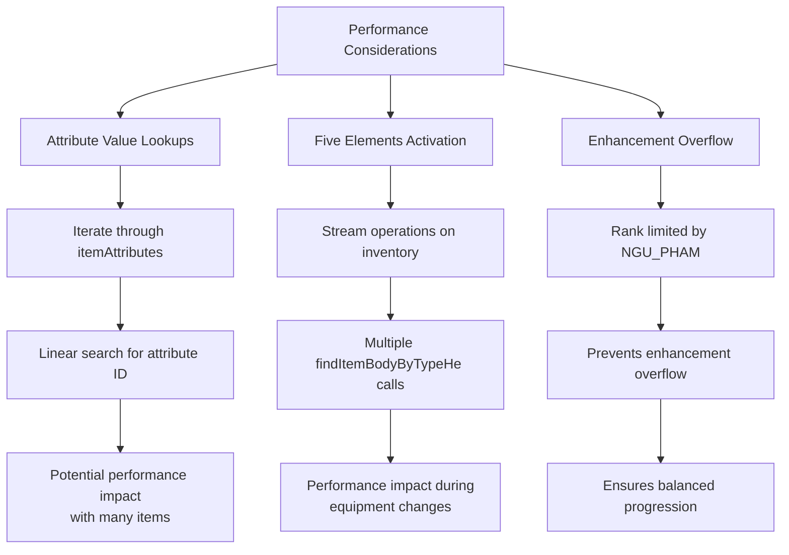

**Diagram sources**
- [ItemEquip.java](file://src/main/java/item/ItemEquip.java#L130-L150)
- [ItemEquip.java](file://src/main/java/item/ItemEquip.java#L50-L90)
- [ItemEquipConst.java](file://src/main/java/consts/ItemEquipConst.java#L3-L9)

**Section sources**
- [ItemEquip.java](file://src/main/java/item/ItemEquip.java#L130-L150)
- [ItemEquip.java](file://src/main/java/item/ItemEquip.java#L50-L90)
- [ItemEquipConst.java](file://src/main/java/consts/ItemEquipConst.java#L3-L9)