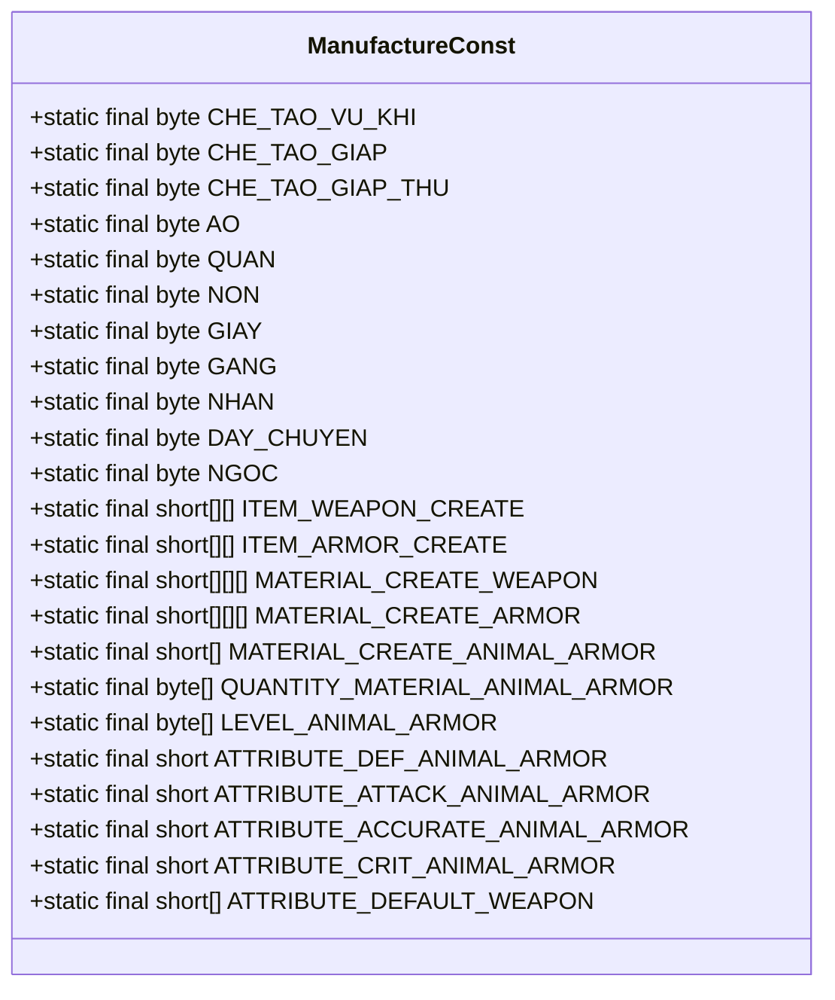
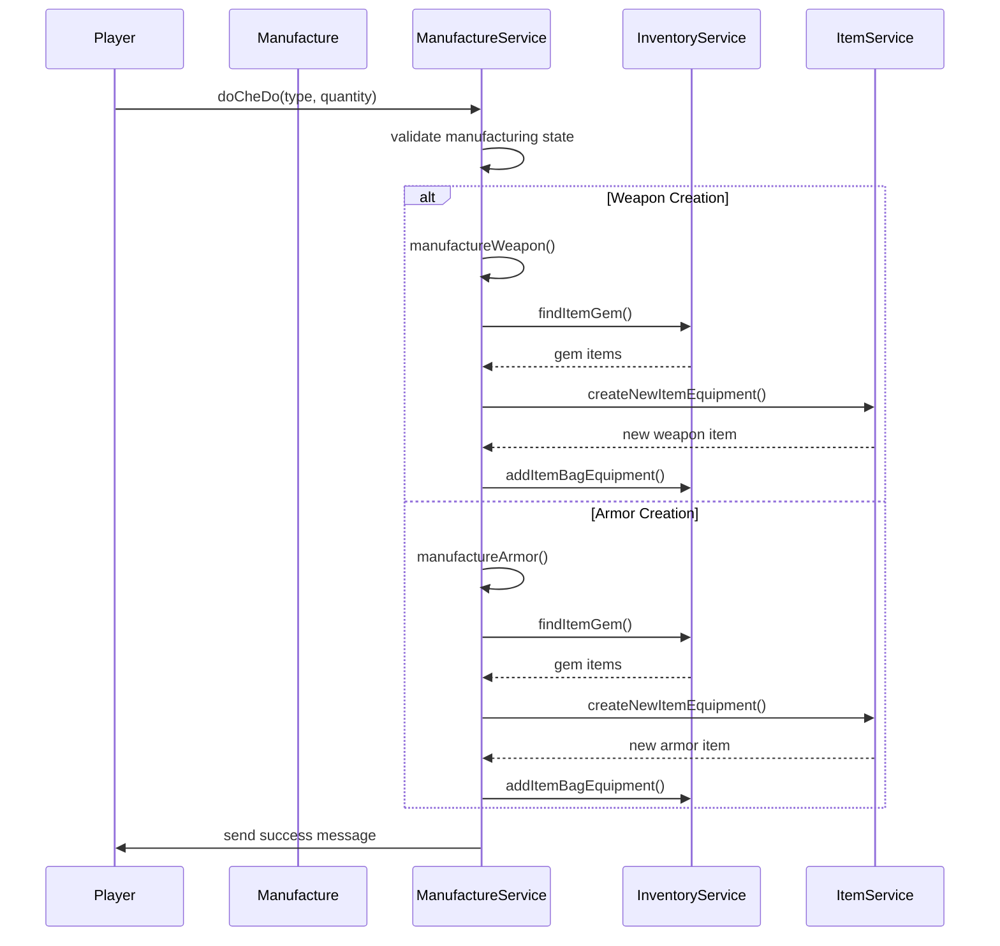
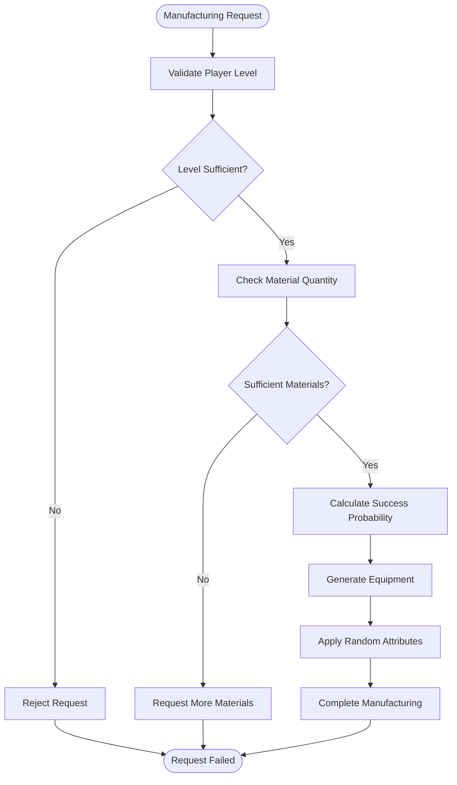
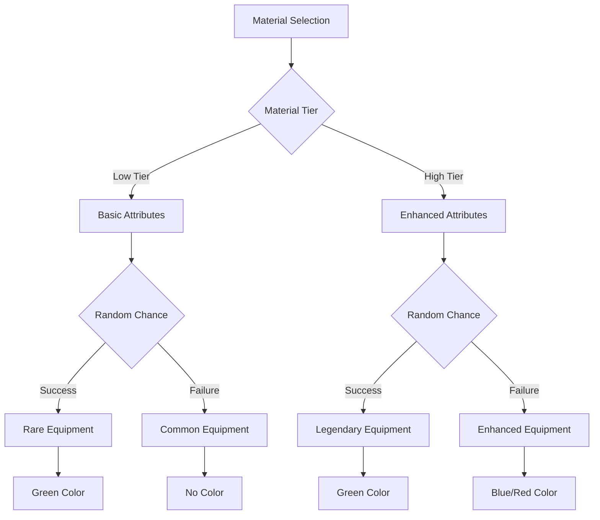
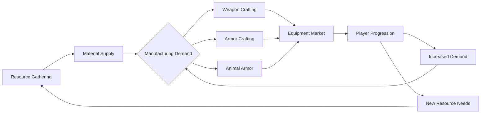
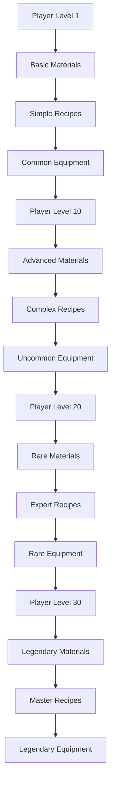
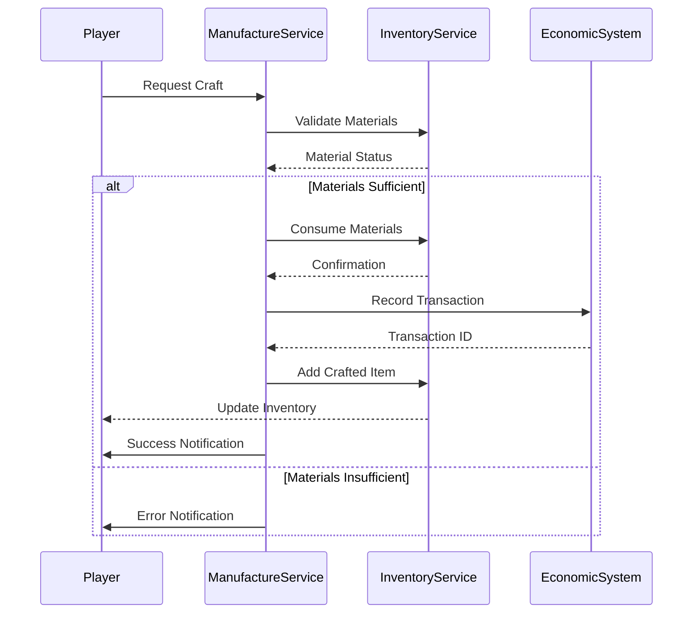
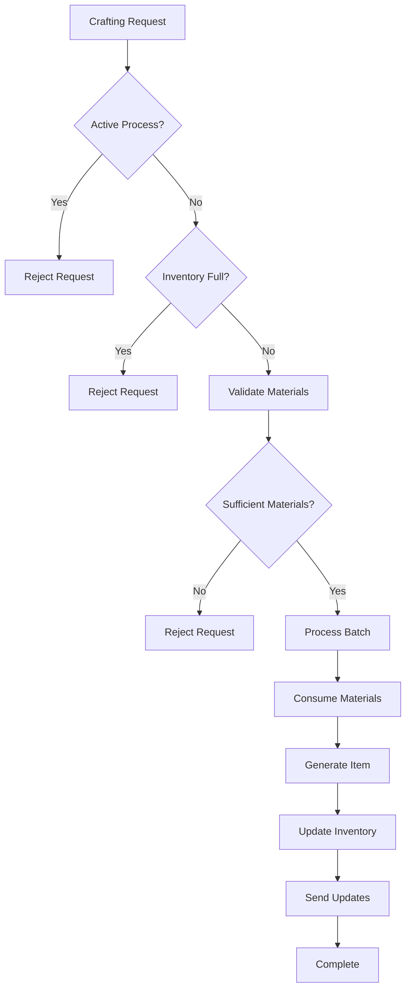

# Manufacture Constants

<cite>
**Referenced Files in This Document**   
- [ManufactureConst.java](file://src/main/java/consts/ManufactureConst.java)
- [Manufacture.java](file://src/main/java/player/Manufacture.java)
- [ManufactureService.java](file://src/main/java/services/ManufactureService.java)
- [Player.java](file://src/main/java/player/Player.java)
- [InventoryService.java](file://src/main/java/services/InventoryService.java)
</cite>

## Table of Contents
1. [Introduction](#introduction)
2. [Core Constants Overview](#core-constants-overview)
3. [Manufacturing System Architecture](#manufacturing-system-architecture)
4. [Recipe Complexity and Material Requirements](#recipe-complexity-and-material-requirements)
5. [Skill Level and Production Time](#skill-level-and-production-time)
6. [Material Yield Rates and Success Probability](#material-yield-rates-and-success-probability)
7. [Profession Balance and Resource Economy](#profession-balance-and-resource-economy)
8. [Manufacturing Difficulty Curves](#manufacturing-difficulty-curves)
9. [Integration with Inventory and Economic Systems](#integration-with-inventory-and-economic-systems)
10. [Common Issues and Performance Considerations](#common-issues-and-performance-considerations)

## Introduction
The ManufactureConst class serves as the central configuration hub for the game's crafting system, defining constants that govern weapon and armor creation, material requirements, and production outcomes. This documentation provides a comprehensive analysis of how these constants shape the manufacturing experience, balance professions, and influence the game's economy. The system is tightly integrated with player progression, inventory management, and economic mechanics, creating a complex interplay between player choices and resource availability.

**Section sources**
- [ManufactureConst.java](file://src/main/java/consts/ManufactureConst.java#L1-L250)

## Core Constants Overview
The ManufactureConst class defines a comprehensive set of constants that govern the manufacturing system, including crafting modes, equipment types, and item creation parameters. These constants serve as the foundation for all crafting operations in the game.



**Diagram sources**
- [ManufactureConst.java](file://src/main/java/consts/ManufactureConst.java#L1-L250)

**Section sources**
- [ManufactureConst.java](file://src/main/java/consts/ManufactureConst.java#L1-L250)

## Manufacturing System Architecture
The manufacturing system is implemented through a coordinated interaction between the ManufactureConst class, the Manufacture data object, and the ManufactureService business logic handler. This architecture separates configuration data from player state and processing logic, enabling a clean and maintainable design.



**Diagram sources**
- [ManufactureService.java](file://src/main/java/services/ManufactureService.java#L1-L634)
- [Manufacture.java](file://src/main/java/player/Manufacture.java#L1-L36)
- [Player.java](file://src/main/java/player/Player.java#L1-L310)

**Section sources**
- [ManufactureService.java](file://src/main/java/services/ManufactureService.java#L1-L634)
- [Manufacture.java](file://src/main/java/player/Manufacture.java#L1-L36)

## Recipe Complexity and Material Requirements
The manufacturing system implements a sophisticated recipe complexity model through multi-dimensional arrays that map items to their required materials. This structure enables progressive difficulty scaling and strategic material planning for players.

The ITEM_WEAPON_CREATE and ITEM_ARMOR_CREATE arrays define the catalog of craftable items, organized by equipment type and tier. Each entry corresponds to a specific item template ID, creating a direct mapping between manufacturing choices and resulting equipment.

The MATERIAL_CREATE_WEAPON and MATERIAL_CREATE_ARMOR arrays implement the core recipe system, specifying the gem types and quantities required for each craftable item. These three-dimensional arrays organize materials by equipment category, specific item, and material components, enabling precise control over crafting requirements.

```mermaid
erDiagram
EQUIPMENT_TYPE ||--o{ RECIPE : "has"
RECIPE ||--o{ MATERIAL_REQUIREMENT : "requires"
MATERIAL ||--o{ MATERIAL_REQUIREMENT : "used in"
class EQUIPMENT_TYPE {
byte type
string name
}
class RECIPE {
short itemId
byte equipmentType
byte tier
}
class MATERIAL_REQUIREMENT {
short materialId
short quantity
byte materialTier
}
class MATERIAL {
short id
string name
byte tier
}
```

**Diagram sources**
- [ManufactureConst.java](file://src/main/java/consts/ManufactureConst.java#L1-L250)
- [ManufactureService.java](file://src/main/java/services/ManufactureService.java#L1-L634)

**Section sources**
- [ManufactureConst.java](file://src/main/java/consts/ManufactureConst.java#L1-L250)

## Skill Level and Production Time
The manufacturing system incorporates skill level requirements and production time mechanics through tiered material requirements and procedural generation rules. While explicit production time constants are not defined, the system implements time-based progression through material tiering and success probability mechanics.

The LEVEL_ANIMAL_ARMOR array defines the level requirements for animal armor creation, establishing a progression curve that aligns with player advancement. This creates a natural gating mechanism that prevents low-level players from accessing high-tier equipment.

The QUANTITY_MATERIAL_ANIMAL_ARMOR array implements a progressive difficulty curve by increasing material requirements at higher tiers. This creates a non-linear resource investment pattern that rewards specialization and long-term planning.



**Diagram sources**
- [ManufactureConst.java](file://src/main/java/consts/ManufactureConst.java#L1-L250)
- [ManufactureService.java](file://src/main/java/services/ManufactureService.java#L1-L634)

**Section sources**
- [ManufactureConst.java](file://src/main/java/consts/ManufactureConst.java#L1-L250)

## Material Yield Rates and Success Probability
The manufacturing system implements material yield rates and success probability mechanics through procedural generation algorithms that consider material quality and player choices. The system uses tiered materials (SoCap and CaoCap) to influence the outcome quality and rarity of crafted items.

The manufacturing process evaluates both low-tier (SoCap) and high-tier (CaoCap) materials to determine the final equipment rank and color. This creates a risk-reward dynamic where players must balance material investment against potential outcomes.

Success probability is influenced by material composition, with higher-tier materials increasing the chance of obtaining rare equipment colors like green (GREEN_COLOR). The system implements probabilistic outcomes through Util.isTrue() calls with specific percentage chances.



**Diagram sources**
- [ManufactureService.java](file://src/main/java/services/ManufactureService.java#L1-L634)
- [ManufactureConst.java](file://src/main/java/consts/ManufactureConst.java#L1-L250)

**Section sources**
- [ManufactureService.java](file://src/main/java/services/ManufactureService.java#L1-L634)

## Profession Balance and Resource Economy
The manufacturing constants play a crucial role in maintaining profession balance and shaping the game's resource economy. By carefully calibrating material requirements and output quality, the system creates interdependencies between different player professions and economic activities.

The tiered material system creates a natural progression that prevents early-game inflation of high-tier equipment. By requiring increasingly rare materials for advanced items, the system ensures that powerful equipment remains scarce and valuable.

Resource economy is influenced through the MATERIAL_CREATE_ANIMAL_ARMOR and related arrays, which establish demand for specific gem types across different equipment categories. This creates market dynamics where certain materials become more valuable based on crafting trends and player specialization.



**Diagram sources**
- [ManufactureConst.java](file://src/main/java/consts/ManufactureConst.java#L1-L250)
- [ManufactureService.java](file://src/main/java/services/ManufactureService.java#L1-L634)

**Section sources**
- [ManufactureConst.java](file://src/main/java/consts/ManufactureConst.java#L1-L250)

## Manufacturing Difficulty Curves
The manufacturing system implements carefully designed difficulty curves that influence player specialization choices and progression paths. These curves are encoded in the constant arrays and processing logic, creating a non-linear advancement system that rewards focused development.

The difficulty curve is evident in the MATERIAL_CREATE_WEAPON and MATERIAL_CREATE_ARMOR arrays, where material requirements increase disproportionately with item tier. This creates a natural specialization incentive, as players who focus on specific equipment types can optimize their material acquisition and crafting efficiency.

Player specialization choices are further influenced by the class-specific weapon creation system (ITEM_WEAPON_CREATE), which ties crafting capabilities to character class. This creates distinct crafting professions that align with combat roles, encouraging players to specialize in complementary manufacturing skills.



**Diagram sources**
- [ManufactureConst.java](file://src/main/java/consts/ManufactureConst.java#L1-L250)
- [ManufactureService.java](file://src/main/java/services/ManufactureService.java#L1-L634)

**Section sources**
- [ManufactureConst.java](file://src/main/java/consts/ManufactureConst.java#L1-L250)

## Integration with Inventory and Economic Systems
The manufacturing system is deeply integrated with the inventory and economic systems, creating a cohesive gameplay loop that connects resource management, crafting, and equipment usage. This integration is facilitated through service dependencies and data flow between components.

The InventoryService handles material validation and consumption during the manufacturing process, ensuring that players have the required gems before crafting begins. It also manages the addition of newly created equipment to the player's inventory, maintaining inventory limits and item tracking.

Economic integration is achieved through the use of gem-based materials that have value in the game economy. The system creates economic activity by requiring specific gem types for different equipment categories, establishing market demand and enabling player-driven trade.



**Diagram sources**
- [ManufactureService.java](file://src/main/java/services/ManufactureService.java#L1-L634)
- [InventoryService.java](file://src/main/java/services/InventoryService.java#L1-L714)

**Section sources**
- [ManufactureService.java](file://src/main/java/services/ManufactureService.java#L1-L634)
- [InventoryService.java](file://src/main/java/services/InventoryService.java#L1-L714)

## Common Issues and Performance Considerations
The manufacturing system addresses common issues such as crafting speed exploits and performance bottlenecks through validation checks and optimized processing. These considerations are critical for maintaining game balance and server stability during high-volume crafting operations.

Crafting speed exploits are prevented through state validation in the doCheDo method, which checks for active manufacturing processes before allowing new requests. Inventory capacity checks prevent players from exploiting the system to generate infinite items.

Performance considerations are addressed through batch processing optimizations in the manufacturing methods. The system processes material requirements in bulk rather than individual transactions, reducing database operations and network overhead during crafting sequences.



**Diagram sources**
- [ManufactureService.java](file://src/main/java/services/ManufactureService.java#L1-L634)
- [Manufacture.java](file://src/main/java/player/Manufacture.java#L1-L36)

**Section sources**
- [ManufactureService.java](file://src/main/java/services/ManufactureService.java#L1-L634)