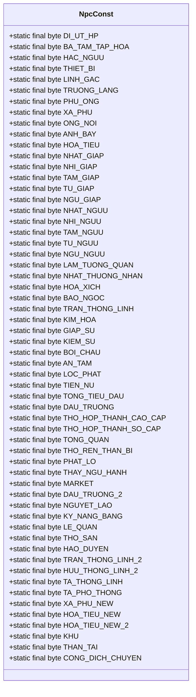
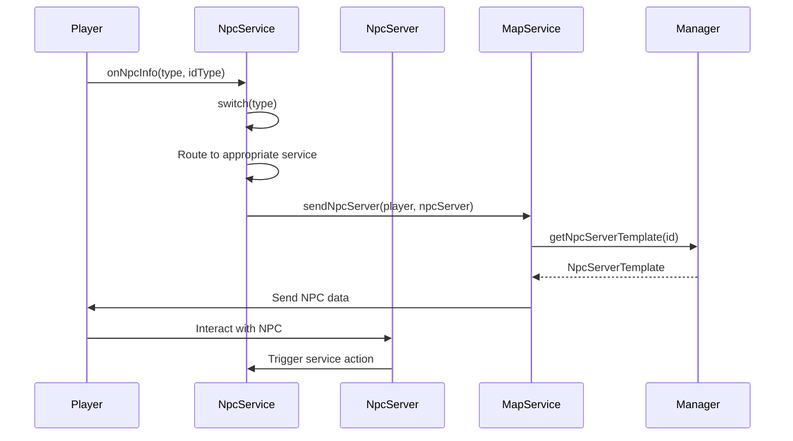
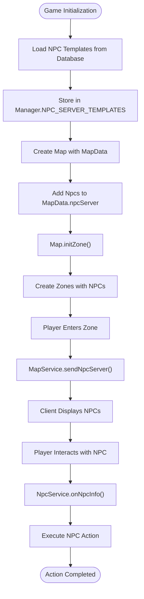

# NPC Constants

<cite>
**Referenced Files in This Document**   
- [NpcConst.java](file://src/main/java/consts/NpcConst.java)
- [NpcService.java](file://src/main/java/services/NpcService.java)
- [NpcServer.java](file://src/main/java/map/NpcServer.java)
- [MapService.java](file://src/main/java/services/MapService.java)
- [Manager.java](file://src/main/java/manager/Manager.java)
- [MapData.java](file://src/main/java/map/MapData.java)
- [Map.java](file://src/main/java/map/Map.java)
</cite>

## Table of Contents
1. [Introduction](#introduction)
2. [NpcConst Class Overview](#npcconst-class-overview)
3. [Core NPC Constants and Their Roles](#core-npc-constants-and-their-roles)
4. [Integration with NpcService and NpcServer](#integration-with-npcservice-and-npcserver)
5. [NPC Behavior and Interaction Mechanics](#npc-behavior-and-interaction-mechanics)
6. [Quest System and World Immersion](#quest-system-and-world-immersion)
7. [Shop Availability and Economic Impact](#shop-availability-and-economic-impact)
8. [World System Integration](#world-system-integration)
9. [Performance Considerations and Optimization](#performance-considerations-and-optimization)
10. [Common Issues and Troubleshooting](#common-issues-and-troubleshooting)
11. [Conclusion](#conclusion)

## Introduction
The NpcConst class serves as a central repository for defining NPC behavior, spawn rates, interaction ranges, and dialogue triggers within the game world. This documentation provides a comprehensive analysis of how these constants control NPC functionality across maps through integration with NpcServer.java and NpcService.java. The document explains their critical role in quest systems, shop availability, and world immersion, while also addressing performance implications and common issues related to NPC management.

**Section sources**
- [NpcConst.java](file://src/main/java/consts/NpcConst.java#L1-L70)

## NpcConst Class Overview
The NpcConst class defines a comprehensive set of constants that govern NPC behavior and functionality throughout the game world. These constants are organized into logical groups that represent different NPC types, services, and special functions. The class uses byte values to efficiently represent NPC identifiers, enabling quick comparisons and lookups within the game engine.

The constants are divided into three main categories: positive values for standard NPCs, negative values for special NPCs and services, and specific negative values for system-level NPCs. This organization allows for efficient categorization and processing of NPC interactions, with each constant serving as a unique identifier for specific NPC behaviors and services.

**Diagram sources**
- [NpcConst.java](file://src/main/java/consts/NpcConst.java#L1-L70)

**Section sources**
- [NpcConst.java](file://src/main/java/consts/NpcConst.java#L1-L70)

## Core NPC Constants and Their Roles
The NpcConst class defines several key categories of NPC constants that serve different purposes within the game world. The positive constants (0-31) represent standard NPCs that provide various services to players, including equipment shops (NHAT_GIAP, NHI_GIAP, etc.), gem shops (PHU_ONG, BOI_CHAU), and special NPCs like HOA_TIEU and XA_PHU. These NPCs are typically found in villages and towns, providing essential services to players.

The negative constants (-2 to -25) represent special NPCs and services that offer unique functionality. These include quest-related NPCs (TIEN_NU, TONG_TIEU_DAU), crafting NPCs (THO_HOP_THANH_CAO_CAP, THO_HOP_THANH_SO_CAP), and special event NPCs (HOA_TIEU_NEW, XA_PHU_NEW). These NPCs often have specific interaction requirements and provide access to advanced game features.

The system-level constants (-70 to -72) represent core game mechanics and services. These include special NPCs that handle transportation (CONG_DICH_CHUYEN), world events (KHU), and other system-level functions. These constants are critical for maintaining the game's core functionality and ensuring smooth player progression through the world.

**Section sources**
- [NpcConst.java](file://src/main/java/consts/NpcConst.java#L1-L70)

## Integration with NpcService and NpcServer
The NpcConst class is tightly integrated with both NpcService.java and NpcServer.java to provide a cohesive NPC management system. NpcService.java uses the constants defined in NpcConst to determine which NPC service should be activated when a player interacts with an NPC. The onNpcInfo method in NpcService.java uses a switch statement to route player interactions to the appropriate service based on the NPC type constant.

NpcServer.java represents the actual NPC entities in the game world, with each NPC having a reference to its template and position. The NpcServer class works in conjunction with MapService.java to spawn and manage NPCs on specific maps. When a player enters a map, the MapService sends information about all NPCs on that map to the player, using the constants from NpcConst to identify each NPC's type and functionality.

The integration between these components ensures that NPCs are properly instantiated, positioned, and functional within the game world. The Manager class maintains a collection of NpcServerTemplate objects that define the appearance and properties of each NPC type, which are then used by NpcServer to create actual NPC instances on maps.

**Diagram sources**
- [NpcService.java](file://src/main/java/services/NpcService.java#L1-L74)
- [NpcServer.java](file://src/main/java/map/NpcServer.java#L1-L19)
- [MapService.java](file://src/main/java/services/MapService.java#L1-L799)
- [Manager.java](file://src/main/java/manager/Manager.java#L1-L1525)

**Section sources**
- [NpcService.java](file://src/main/java/services/NpcService.java#L1-L74)
- [NpcServer.java](file://src/main/java/map/NpcServer.java#L1-L19)

## NPC Behavior and Interaction Mechanics
NPC behavior and interaction mechanics are governed by the constants defined in NpcConst and implemented through the NpcService and NpcServer classes. When a player interacts with an NPC, the system uses the NPC type constant to determine the appropriate response and service to activate. This interaction model allows for a wide variety of NPC behaviors while maintaining a consistent and predictable interface.

The interaction range for NPCs is determined by the map's zone system and the player's distance load settings. When a player enters a zone containing NPCs, the MapService sends information about all visible NPCs to the player's client. The client then renders these NPCs and enables interaction when the player is within a certain distance, typically defined by the game's visual and network constraints.

Dialogue triggers are implemented through the onNpcInfo method in NpcService.java, which uses the NPC type and ID to determine which dialogue or menu should be displayed. For example, interacting with a HOA_TIEU NPC triggers the sendMenuHoaTieu method, while interacting with a XA_PHU NPC triggers the sendMenuXaPhuNew method. This modular approach allows for easy addition of new NPC types and services without modifying the core interaction logic.

**Section sources**
- [NpcService.java](file://src/main/java/services/NpcService.java#L1-L74)
- [MapService.java](file://src/main/java/services/MapService.java#L1-L799)

## Quest System and World Immersion
NPC constants play a crucial role in the quest system and world immersion by providing access points for quest-related activities and creating a sense of a living, interactive world. NPCs with constants like TIEN_NU, TONG_TIEU_DAU, and THAY_NGU_HANH serve as quest givers and completers, allowing players to progress through storylines and earn rewards.

The placement and behavior of NPCs contribute significantly to world immersion. For example, NPCs like HOA_TIEU and XA_PHU are placed in specific locations that make sense within the game world's lore and geography. Their presence in these locations reinforces the game's narrative and creates a more believable and engaging environment for players.

Changing NPC constants can have a significant impact on gameplay pacing and player engagement. For instance, increasing the spawn rate of quest-related NPCs can accelerate quest progression, while reducing their numbers can create a sense of scarcity and challenge. Similarly, adjusting the interaction range of NPCs can affect how players explore the world, with larger ranges encouraging more passive exploration and smaller ranges promoting more deliberate and focused gameplay.

**Section sources**
- [NpcConst.java](file://src/main/java/consts/NpcConst.java#L1-L70)
- [NpcService.java](file://src/main/java/services/NpcService.java#L1-L74)

## Shop Availability and Economic Impact
NPC constants directly influence shop availability and the game's economic system by defining which NPCs provide access to different types of shops. Constants like KIEM_SU, BAO_NGOC, and PHU_ONG represent different shop types that offer various items and services to players. These NPCs serve as the primary interface between players and the game's economy, allowing them to buy, sell, and trade items.

The economic impact of NPC constants is significant, as they determine the availability and distribution of resources throughout the game world. For example, the presence of multiple PHU_ONG NPCs in a region can create a hub of economic activity, while the scarcity of BAO_NGOC NPCs can make certain items rare and valuable. This distribution affects player behavior, encouraging exploration and trade between different regions.

The integration between NPC constants and the shop system is implemented through the ShopService class, which uses the NPC type constant to determine which shop should be opened when a player interacts with an NPC. This modular approach allows for easy addition of new shop types and services, enabling the game's economy to evolve over time without requiring major changes to the core codebase.

**Section sources**
- [NpcConst.java](file://src/main/java/consts/NpcConst.java#L1-L70)
- [NpcService.java](file://src/main/java/services/NpcService.java#L1-L74)
- [ShopService.java](file://src/main/java/services/ShopService.java#L1-L100)

## World System Integration
The integration of NPC constants with the World System is critical for maintaining a cohesive and functional game world. NPCs are instantiated on maps through the MapData class, which contains a list of NpcServer objects that define the position and type of each NPC on a given map. The Map class uses this data to initialize NPCs when a map is loaded, ensuring that they are properly positioned and functional.

The Manager class plays a central role in world system integration by maintaining a collection of NpcServerTemplate objects that define the appearance and properties of each NPC type. These templates are loaded from the database during initialization and are used by the MapService to create actual NPC instances on maps. This separation of template data from instance data allows for efficient memory usage and easy modification of NPC properties.

The Zone class manages the interaction between players and NPCs within a specific area of a map. When a player enters a zone containing NPCs, the Zone class ensures that the player receives information about all visible NPCs and can interact with them appropriately. This zone-based approach optimizes network traffic and ensures that players only receive information about NPCs that are relevant to their current location.

**Diagram sources**
- [Manager.java](file://src/main/java/manager/Manager.java#L1-L1525)
- [MapData.java](file://src/main/java/map/MapData.java#L1-L44)
- [Map.java](file://src/main/java/map/Map.java#L1-L173)
- [MapService.java](file://src/main/java/services/MapService.java#L1-L799)

**Section sources**
- [Manager.java](file://src/main/java/manager/Manager.java#L1-L1525)
- [MapData.java](file://src/main/java/map/MapData.java#L1-L44)
- [Map.java](file://src/main/java/map/Map.java#L1-L173)

## Performance Considerations and Optimization
The implementation of NPC constants and their integration with the game systems has several performance implications that require careful consideration and optimization. One of the primary concerns is the memory usage associated with storing and managing NPC data, particularly in areas with high NPC density. The use of byte constants in NpcConst helps minimize memory usage, while the separation of template data from instance data in the Manager and Map classes reduces redundancy.

Network performance is another critical consideration, as the system must efficiently transmit NPC data to players without overwhelming the network connection. The zone-based approach used by the Map and Zone classes helps optimize network traffic by only sending information about NPCs that are relevant to a player's current location. This reduces the amount of data transmitted and improves overall game performance.

CPU usage is also a concern, particularly in areas with many active NPCs. The update method in the Zone class is responsible for updating all NPCs in a zone, which can be computationally expensive if not optimized properly. The use of efficient data structures and algorithms in the Mob and Player collections helps minimize the performance impact of NPC updates, while the virtual thread executor in the Manager class ensures that updates are processed efficiently without blocking other game operations.

**Section sources**
- [NpcConst.java](file://src/main/java/consts/NpcConst.java#L1-L70)
- [Map.java](file://src/main/java/map/Map.java#L1-L173)
- [Zone.java](file://src/main/java/map/Zone.java#L1-L115)
- [Manager.java](file://src/main/java/manager/Manager.java#L1-L1525)

## Common Issues and Troubleshooting
Several common issues can arise when working with NPC constants and their integration with the game systems. One frequent problem is NPC pathing conflicts, where multiple NPCs occupy the same space or block player movement. This can be addressed by carefully designing map layouts and NPC placement to ensure adequate space for both NPCs and players.

Another common issue is performance degradation in areas with high NPC density. This can be mitigated by optimizing the update logic for NPCs, reducing the frequency of updates for distant or inactive NPCs, and using efficient data structures to manage NPC collections. Monitoring CPU and memory usage in high-density areas can help identify and address performance bottlenecks.

Synchronization issues between the server and client can also occur, particularly when NPCs are added or removed from a map. Ensuring that NPC data is properly synchronized between the server and client, and that updates are transmitted reliably, is critical for maintaining a consistent game state. Implementing robust error handling and recovery mechanisms can help minimize the impact of synchronization issues on gameplay.

**Section sources**
- [NpcServer.java](file://src/main/java/map/NpcServer.java#L1-L19)
- [MapService.java](file://src/main/java/services/MapService.java#L1-L799)
- [Zone.java](file://src/main/java/map/Zone.java#L1-L115)

## Conclusion
The NpcConst class and its integration with NpcService.java and NpcServer.java form a critical component of the game's NPC management system. By defining a comprehensive set of constants for NPC behavior, spawn rates, interaction ranges, and dialogue triggers, the system provides a flexible and efficient framework for creating a rich and immersive game world. The careful integration of these components with the World System, quest mechanics, and economic systems ensures that NPCs play a vital role in player engagement and gameplay progression. Addressing performance considerations and common issues is essential for maintaining a smooth and enjoyable player experience, particularly in areas with high NPC density or complex interactions.

**Section sources**
- [NpcConst.java](file://src/main/java/consts/NpcConst.java#L1-L70)
- [NpcService.java](file://src/main/java/services/NpcService.java#L1-L74)
- [NpcServer.java](file://src/main/java/map/NpcServer.java#L1-L19)