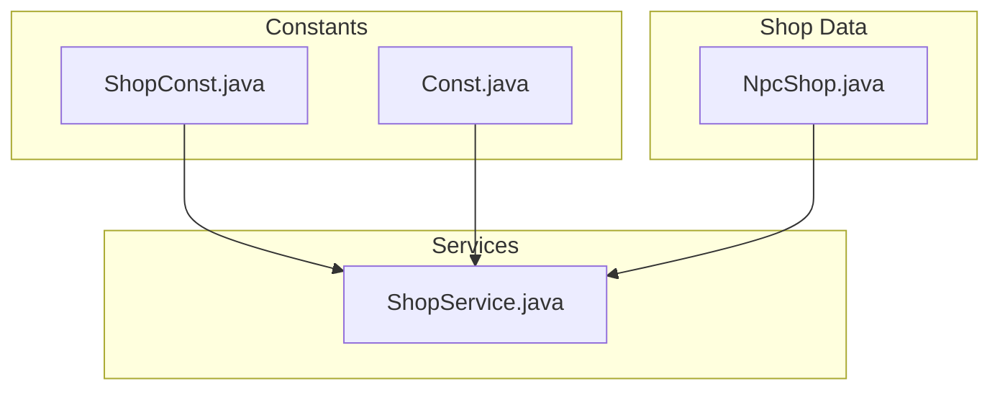
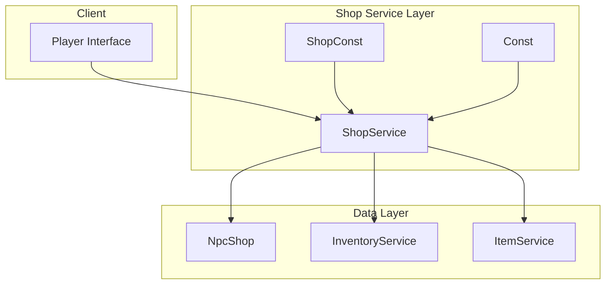
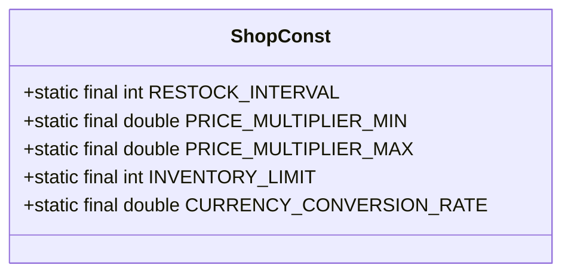
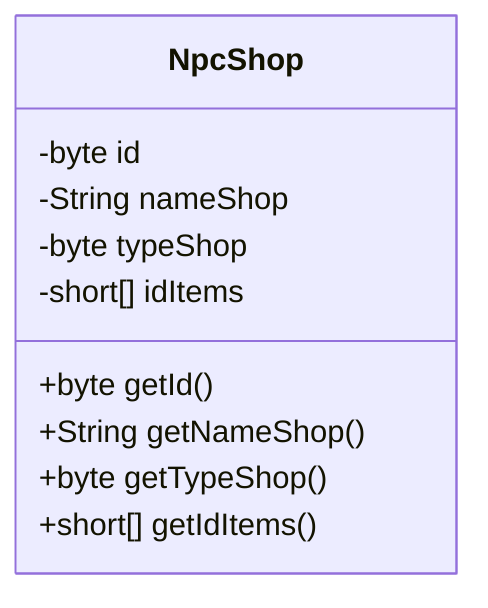
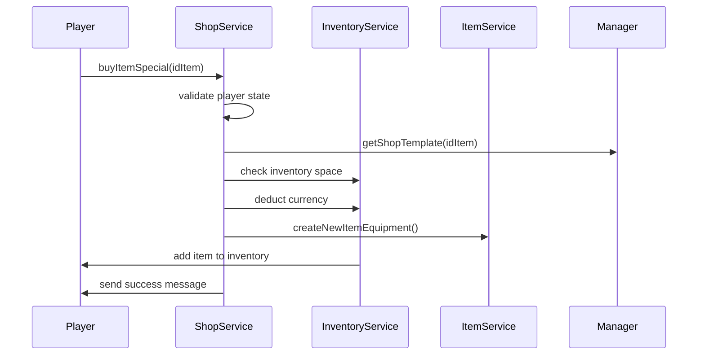
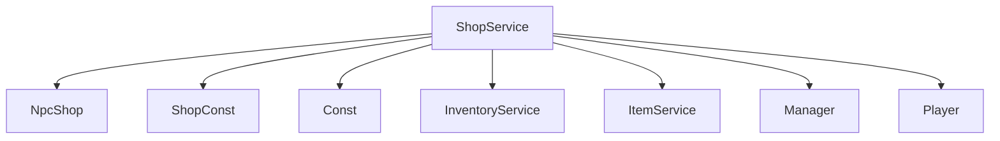

# Shop Constants

<cite>
**Referenced Files in This Document**   
- [ShopConst.java](file://src/main/java/consts/ShopConst.java)
- [NpcShop.java](file://src/main/java/shop/NpcShop.java)
- [ShopService.java](file://src/main/java/services/ShopService.java)
- [Const.java](file://src/main/java/consts/Const.java)
</cite>

## Table of Contents
1. [Introduction](#introduction)
2. [Project Structure](#project-structure)
3. [Core Components](#core-components)
4. [Architecture Overview](#architecture-overview)
5. [Detailed Component Analysis](#detailed-component-analysis)
6. [Dependency Analysis](#dependency-analysis)
7. [Performance Considerations](#performance-considerations)
8. [Troubleshooting Guide](#troubleshooting-guide)
9. [Conclusion](#conclusion)

## Introduction
This document provides a comprehensive analysis of the `ShopConst` class and its integration with `NpcShop.java` and `ShopService.java` in managing shop mechanics within the game. It explores how constants related to restock intervals, price multipliers, inventory limits, and currency conversion rates influence the game economy and player trading behavior. The documentation also covers integration with the Economic System, player currency tracking, and addresses common issues such as infinite stock exploits and performance during bulk transactions.

## Project Structure
The project follows a modular structure with distinct packages for constants, services, shop management, and data models. The core shop-related components are organized under `consts`, `shop`, and `services` packages, enabling clear separation of configuration, business logic, and data representation.

**Diagram sources**
- [ShopConst.java](file://src/main/java/consts/ShopConst.java)
- [NpcShop.java](file://src/main/java/shop/NpcShop.java)
- [ShopService.java](file://src/main/java/services/ShopService.java)
- [Const.java](file://src/main/java/consts/Const.java)

**Section sources**
- [ShopConst.java](file://src/main/java/consts/ShopConst.java)
- [NpcShop.java](file://src/main/java/shop/NpcShop.java)
- [ShopService.java](file://src/main/java/services/ShopService.java)

## Core Components
The core components include `ShopConst` for defining shop mechanics constants, `NpcShop` for representing NPC shop data structures, and `ShopService` for handling all shop-related operations such as buying, selling, and inventory management. These components work together to enforce economic rules and maintain balance in the game's marketplace.

**Section sources**
- [ShopConst.java](file://src/main/java/consts/ShopConst.java#L1-L10)
- [NpcShop.java](file://src/main/java/shop/NpcShop.java#L1-L18)
- [ShopService.java](file://src/main/java/services/ShopService.java#L1-L429)

## Architecture Overview
The shop system architecture centers around the `ShopService` class, which acts as the primary interface for all shop operations. It utilizes constants from `ShopConst` and `Const` to enforce business rules and interacts with `NpcShop` to manage shop inventory and configuration. The service layer integrates with inventory, currency, and player systems to ensure consistent state management.

**Diagram sources**
- [ShopService.java](file://src/main/java/services/ShopService.java#L1-L429)
- [ShopConst.java](file://src/main/java/consts/ShopConst.java#L1-L10)
- [Const.java](file://src/main/java/consts/Const.java#L1-L115)

## Detailed Component Analysis

### ShopConst Analysis
The `ShopConst` class is designed to centralize all constants related to shop mechanics, although currently empty. It is intended to define values for restock intervals, price multipliers, inventory limits, and currency conversion rates that govern economic balance in the game.

**Diagram sources**
- [ShopConst.java](file://src/main/java/consts/ShopConst.java#L1-L10)

**Section sources**
- [ShopConst.java](file://src/main/java/consts/ShopConst.java#L1-L10)

### NpcShop Analysis
The `NpcShop` class represents the data structure for NPC-managed shops, containing essential information such as shop ID, name, type, and available items. It uses Lombok annotations for boilerplate code reduction and follows a builder pattern for object creation.

**Diagram sources**
- [NpcShop.java](file://src/main/java/shop/NpcShop.java#L1-L18)

**Section sources**
- [NpcShop.java](file://src/main/java/shop/NpcShop.java#L1-L18)

### ShopService Analysis
The `ShopService` class implements comprehensive shop functionality including item purchasing, selling, deposit transactions, and ticket buying. It enforces economic rules by validating inventory space, currency availability, and transaction limits. The service integrates with player inventory, currency tracking, and messaging systems to maintain consistent game state.

**Diagram sources**
- [ShopService.java](file://src/main/java/services/ShopService.java#L1-L429)

**Section sources**
- [ShopService.java](file://src/main/java/services/ShopService.java#L1-L429)

## Dependency Analysis
The shop system has well-defined dependencies between components. `ShopService` depends on `NpcShop` for shop configuration and uses constants from both `ShopConst` and `Const` for business rules. The service layer integrates with inventory, item creation, and player management systems to execute transactions.

**Diagram sources**
- [ShopService.java](file://src/main/java/services/ShopService.java#L1-L429)
- [NpcShop.java](file://src/main/java/shop/NpcShop.java#L1-L18)
- [ShopConst.java](file://src/main/java/consts/ShopConst.java#L1-L10)
- [Const.java](file://src/main/java/consts/Const.java#L1-L115)

**Section sources**
- [ShopService.java](file://src/main/java/services/ShopService.java#L1-L429)
- [NpcShop.java](file://src/main/java/shop/NpcShop.java#L1-L18)

## Performance Considerations
The shop system handles bulk transactions efficiently through batch processing in methods like `buyItemNpcShop`. However, potential performance bottlenecks exist during high-frequency transactions due to synchronous inventory updates and message sending. The current implementation lacks explicit restock timers or price cap enforcement, which could lead to economic imbalance if not properly implemented in `ShopConst`.

**Section sources**
- [ShopService.java](file://src/main/java/services/ShopService.java#L116-L143)
- [ShopService.java](file://src/main/java/services/ShopService.java#L402-L427)

## Troubleshooting Guide
Common issues in the shop system include infinite stock exploits and currency duplication vulnerabilities. The current implementation prevents some exploits through inventory checks and transaction validation, but additional safeguards are needed. Issues may arise from:
- Missing restock interval enforcement
- Lack of price cap validation
- Insufficient transaction rate limiting
- Inadequate inventory synchronization during concurrent transactions

**Section sources**
- [ShopService.java](file://src/main/java/services/ShopService.java#L1-L429)
- [InventoryService.java](file://src/main/java/services/InventoryService.java)

## Conclusion
The shop system provides a solid foundation for managing in-game commerce but requires completion of the `ShopConst` class to fully implement economic balancing features. The current architecture supports essential shop operations with proper integration between services, though additional work is needed to implement restock timers, price controls, and enhanced security measures to prevent exploits. Future development should focus on populating `ShopConst` with appropriate values and enhancing the economic model to create a balanced and engaging player trading experience.