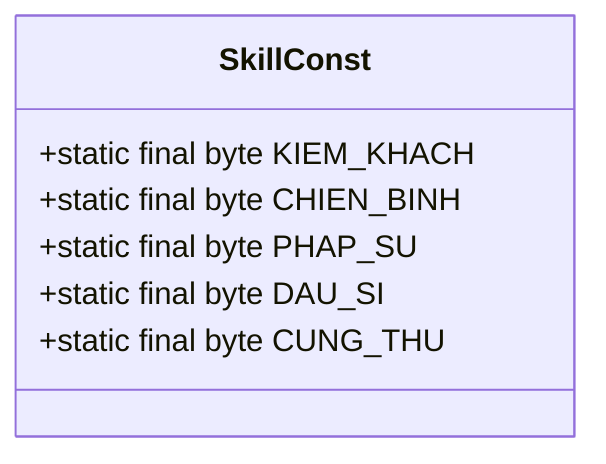
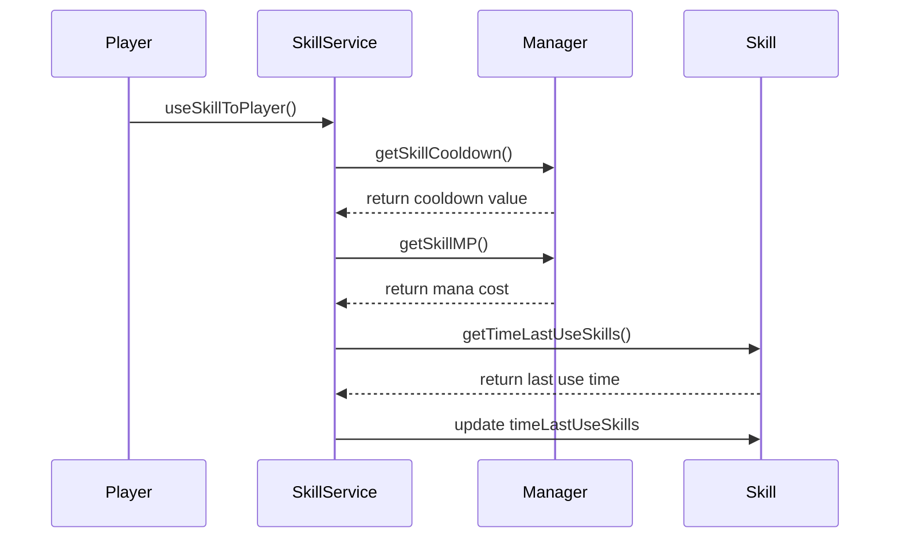

# Skill Constants

<cite>
**Referenced Files in This Document**   
- [SkillConst.java](file://src/main/java/consts/SkillConst.java)
- [Skill.java](file://src/main/java/player/Skill.java)
- [SkillService.java](file://src/main/java/services/SkillService.java)
- [Manager.java](file://src/main/java/manager/Manager.java)
- [SkillNewTemplate.java](file://src/main/java/template/SkillNewTemplate.java)
</cite>

## Table of Contents
1. [Introduction](#introduction)
2. [Skill Constants Definition](#skill-constants-definition)
3. [Skill Mechanics and Execution](#skill-mechanics-and-execution)
4. [Combat Balance and Player Build Diversity](#combat-balance-and-player-build-diversity)
5. [Skill Parameter Adjustment and Class Balancing](#skill-parameter-adjustment-and-class-balancing)
6. [Common Issues and Performance Implications](#common-issues-and-performance-implications)

## Introduction
This document provides a comprehensive analysis of the skill constants system in the game, focusing on how skill mechanics are defined, executed, and balanced. The SkillConst class and related components define the foundational parameters for all skills in the game, including cooldown values, mana costs, casting times, and skill tree requirements. These constants are critical for maintaining combat balance and enabling diverse player builds across different character classes.

## Skill Constants Definition

The SkillConst class defines character class identifiers used throughout the game system. These constants are used to differentiate between various character classes when applying skill mechanics and balancing parameters.

**Diagram sources**
- [SkillConst.java](file://src/main/java/consts/SkillConst.java#L1-L18)

The actual skill parameters (cooldown, mana cost, damage percentage, range) are stored in the Manager class as multidimensional arrays, indexed by character class, skill type, and skill level. These arrays are initialized from database configurations during server startup.

**Section sources**
- [SkillConst.java](file://src/main/java/consts/SkillConst.java#L1-L18)
- [Manager.java](file://src/main/java/manager/Manager.java#L287-L325)

## Skill Mechanics and Execution

Skill execution is managed through the interaction between Skill.java, SkillService.java, and the constants defined in Manager.java. The Skill class maintains player-specific skill state including level and last usage time.

**Diagram sources**
- [Skill.java](file://src/main/java/player/Skill.java#L1-L30)
- [SkillService.java](file://src/main/java/services/SkillService.java#L0-L44)
- [Manager.java](file://src/main/java/manager/Manager.java#L287-L325)

When a player attempts to use a skill, SkillService validates several conditions:
1. The player has sufficient MP (checked via Manager.getSkillMP)
2. The skill is not on cooldown (checked via Manager.getSkillCooldown and Skill.getTimeLastUseSkills)
3. The target is within range (checked via Manager.getSkillRange)
4. The weapon has sufficient durability

The SkillNewTemplate class defines new skills that can be learned by players, including their name, description, and purchase price.

**Section sources**
- [Skill.java](file://src/main/java/player/Skill.java#L1-L30)
- [SkillService.java](file://src/main/java/services/SkillService.java#L66-L98)
- [Manager.java](file://src/main/java/manager/Manager.java#L287-L325)
- [SkillNewTemplate.java](file://src/main/java/template/SkillNewTemplate.java#L1-L19)

## Combat Balance and Player Build Diversity

The skill constants system enables diverse combat strategies and player builds by providing different parameter configurations for each character class. The five character classes (Kiem Khach, Chien Binh, Phap Su, Dau Si, Cung Thu) have distinct skill profiles that encourage different playstyles.

For example, the Phap Su (Mage) class typically has higher damage percentages but longer cooldowns, encouraging strategic skill rotation. In contrast, the Cung Thu (Archer) class may have shorter cooldowns but lower mana costs, enabling more frequent skill usage.

Specific constants control skill viability through:
- **Cooldown values**: Determine how frequently a skill can be used
- **Mana costs**: Limit sustained skill usage
- **Damage percentages**: Define offensive power
- **Range values**: Affect positioning and engagement strategies

These parameters create distinct rotation strategies for each class, where players must balance resource management with combat effectiveness.

**Section sources**
- [Manager.java](file://src/main/java/manager/Manager.java#L630-L654)
- [SkillService.java](file://src/main/java/services/SkillService.java#L338-L368)

## Skill Parameter Adjustment and Class Balancing

Adjusting skill parameters for class balancing requires modifying the multidimensional arrays in the Manager class. These arrays are populated from database configurations, allowing for dynamic balance adjustments without code changes.

The key arrays for balancing are:
- SKILL_DAM_PERCENT: Controls damage output scaling with skill level
- SKILL_COOLDOWN: Determines skill availability frequency
- SKILL_MP: Manages mana consumption and resource sustainability
- SKILL_RANGE: Influences positioning and engagement mechanics

When adjusting parameters, developers should consider the interplay between these values to maintain balanced gameplay. For example, reducing cooldown should typically be accompanied by increasing mana cost or reducing damage to prevent overpowered combinations.

**Section sources**
- [Manager.java](file://src/main/java/manager/Manager.java#L630-L654)
- [SkillService.java](file://src/main/java/services/SkillService.java#L338-L368)

## Common Issues and Performance Implications

### Negative Cooldown Exploits
A potential security issue exists if skill cooldown values are not properly validated. Negative cooldown values could allow skills to be spammed without restriction. This should be prevented by:
1. Validating all skill data during initialization
2. Implementing server-side cooldown enforcement
3. Using absolute value checks when calculating remaining cooldown time

### Performance Implications
Frequent skill state checks during combat can impact server performance, particularly in high-intensity battles with multiple players. The current implementation performs several operations for each skill use:
1. Database lookups for skill parameters (via Manager methods)
2. Player state validation (MP, cooldown, range)
3. Weapon durability checks
4. Target validation

To optimize performance:
1. Cache frequently accessed skill parameters
2. Batch validation checks when possible
3. Implement efficient data structures for skill state tracking
4. Minimize database queries during combat sequences

The Skill class's timeLastUseSkills array and the Manager class's static skill parameter arrays represent the primary data structures involved in skill execution and should be optimized for fast access.

**Section sources**
- [Skill.java](file://src/main/java/player/Skill.java#L1-L30)
- [SkillService.java](file://src/main/java/services/SkillService.java#L0-L387)
- [Manager.java](file://src/main/java/manager/Manager.java#L0-L799)