# Data Management

<cite>
**Referenced Files in This Document**   
- [HikariCP.java](file://src/main/java/database/HikariCP.java)
- [PlayerDAO.java](file://src/main/java/daos/PlayerDAO.java)
- [ReadData.java](file://src/main/java/server/ReadData.java)
- [Manager.java](file://src/main/java/manager/Manager.java)
- [ItemEquipTemplate.java](file://src/main/java/template/ItemEquipTemplate.java)
- [MonsterTemplate.java](file://src/main/java/template/MonsterTemplate.java)
- [SkillNewTemplate.java](file://src/main/java/template/SkillNewTemplate.java)
- [HoaTieuTemplate.java](file://src/main/java/template/HoaTieuTemplate.java)
</cite>

## Table of Contents
1. [Introduction](#introduction)
2. [Project Structure](#project-structure)
3. [Core Components](#core-components)
4. [Architecture Overview](#architecture-overview)
5. [Detailed Component Analysis](#detailed-component-analysis)
6. [Dependency Analysis](#dependency-analysis)
7. [Performance Considerations](#performance-considerations)
8. [Troubleshooting Guide](#troubleshooting-guide)
9. [Conclusion](#conclusion)

## Introduction
This document provides comprehensive documentation for the data management system of the game server, focusing on the persistence layer using HikariCP connection pooling and PlayerDAO data access patterns. It details the template system architecture where game entities such as items, monsters, and skills are defined in configuration files and loaded into memory at startup. The document explains the relationship between templates and runtime instances, the data lifecycle from database storage to in-memory caching, and periodic persistence mechanisms. Performance considerations for template loading, query optimization, and connection pool tuning are also addressed.

## Project Structure
The project follows a modular structure with clear separation of concerns. The core components are organized into packages based on their functionality, including database access, data access objects, game templates, player management, and server initialization.

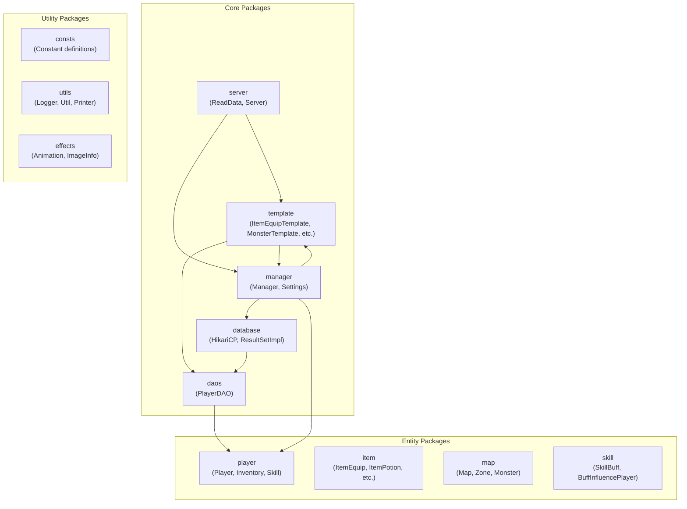

**Diagram sources**
- [HikariCP.java](file://src/main/java/database/HikariCP.java)
- [PlayerDAO.java](file://src/main/java/daos/PlayerDAO.java)
- [Manager.java](file://src/main/java/manager/Manager.java)

**Section sources**
- [HikariCP.java](file://src/main/java/database/HikariCP.java)
- [PlayerDAO.java](file://src/main/java/daos/PlayerDAO.java)
- [Manager.java](file://src/main/java/manager/Manager.java)

## Core Components
The data management system consists of three main components: the database connection pool using HikariCP, the data access layer implemented in PlayerDAO, and the template system managed by the Manager class. These components work together to provide efficient data persistence and retrieval for player data and game configuration.

**Section sources**
- [HikariCP.java](file://src/main/java/database/HikariCP.java)
- [PlayerDAO.java](file://src/main/java/daos/PlayerDAO.java)
- [Manager.java](file://src/main/java/manager/Manager.java)

## Architecture Overview
The data management architecture follows a layered approach with clear separation between data access, business logic, and configuration management. The system uses HikariCP for efficient database connection pooling, PlayerDAO for player data operations, and a comprehensive template system for game entity definitions.

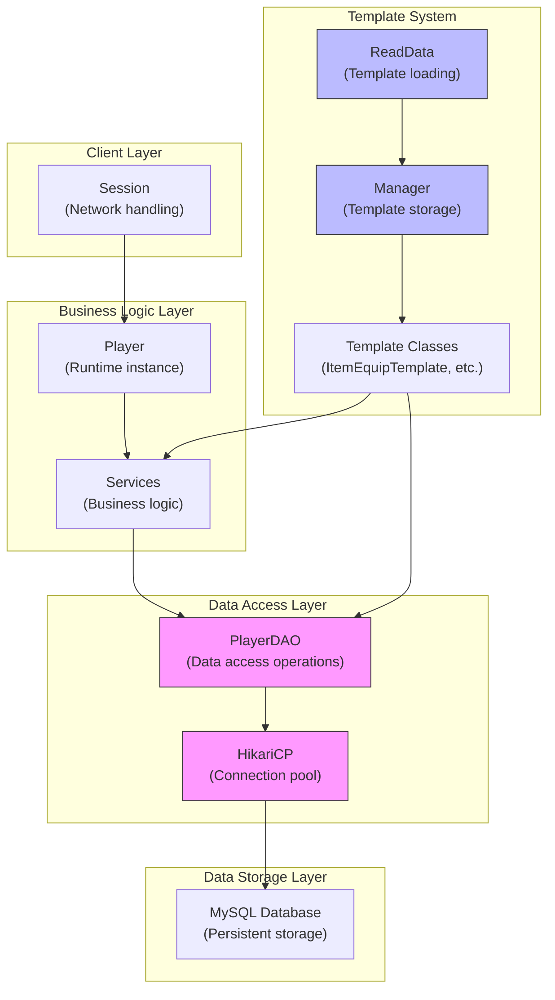

**Diagram sources**
- [HikariCP.java](file://src/main/java/database/HikariCP.java)
- [PlayerDAO.java](file://src/main/java/daos/PlayerDAO.java)
- [Manager.java](file://src/main/java/manager/Manager.java)
- [ReadData.java](file://src/main/java/server/ReadData.java)

## Detailed Component Analysis

### Database Connection Pooling with HikariCP
The HikariCP class provides a robust database connection pooling implementation that manages MySQL connections efficiently. It is configured with optimal settings for the game server's requirements, including connection timeout, idle timeout, and statement caching.

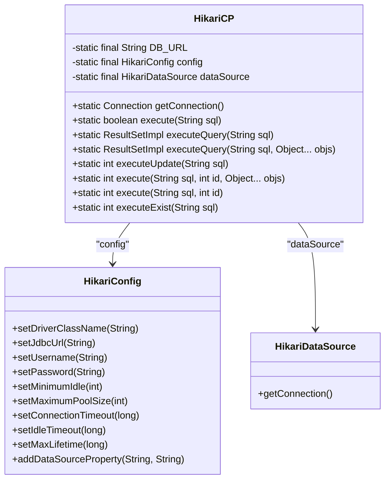

**Diagram sources**
- [HikariCP.java](file://src/main/java/database/HikariCP.java#L1-L124)

**Section sources**
- [HikariCP.java](file://src/main/java/database/HikariCP.java#L1-L124)

### Player Data Access with PlayerDAO
The PlayerDAO class implements data access patterns for player data, providing methods to create, read, update, and delete player information. It handles the serialization and deserialization of complex player objects to and from database records.

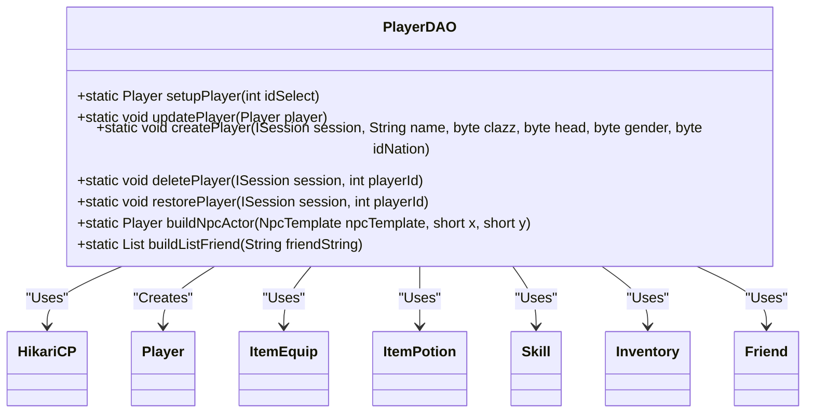

**Diagram sources**
- [PlayerDAO.java](file://src/main/java/daos/PlayerDAO.java#L1-L555)

**Section sources**
- [PlayerDAO.java](file://src/main/java/daos/PlayerDAO.java#L1-L555)

### Template System Architecture
The template system loads game entity definitions from the database at startup and stores them in memory for efficient access during gameplay. This includes templates for items, monsters, skills, and other game entities that define their properties and behavior.

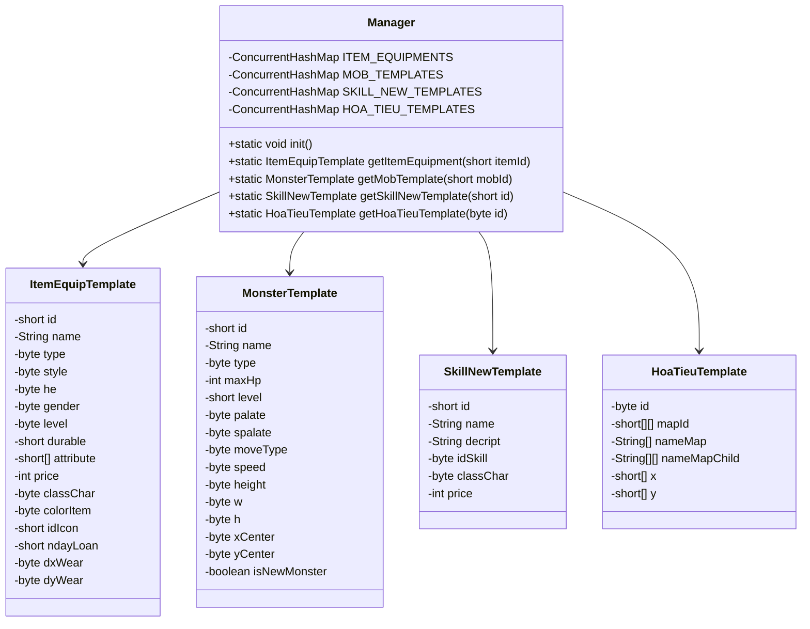

**Diagram sources**
- [ItemEquipTemplate.java](file://src/main/java/template/ItemEquipTemplate.java#L1-L30)
- [MonsterTemplate.java](file://src/main/java/template/MonsterTemplate.java#L1-L31)
- [SkillNewTemplate.java](file://src/main/java/template/SkillNewTemplate.java#L1-L20)
- [HoaTieuTemplate.java](file://src/main/java/template/HoaTieuTemplate.java#L1-L19)
- [Manager.java](file://src/main/java/manager/Manager.java#L1-L1525)

**Section sources**
- [ItemEquipTemplate.java](file://src/main/java/template/ItemEquipTemplate.java#L1-L30)
- [MonsterTemplate.java](file://src/main/java/template/MonsterTemplate.java#L1-L31)
- [SkillNewTemplate.java](file://src/main/java/template/SkillNewTemplate.java#L1-L20)
- [HoaTieuTemplate.java](file://src/main/java/template/HoaTieuTemplate.java#L1-L19)
- [Manager.java](file://src/main/java/manager/Manager.java#L1-L1525)

### Data Lifecycle and Caching
The data lifecycle begins with template data stored in the database, which is loaded into memory at server startup by the Manager class. Player data follows a different pattern, with persistent storage in the database and in-memory representation during gameplay.

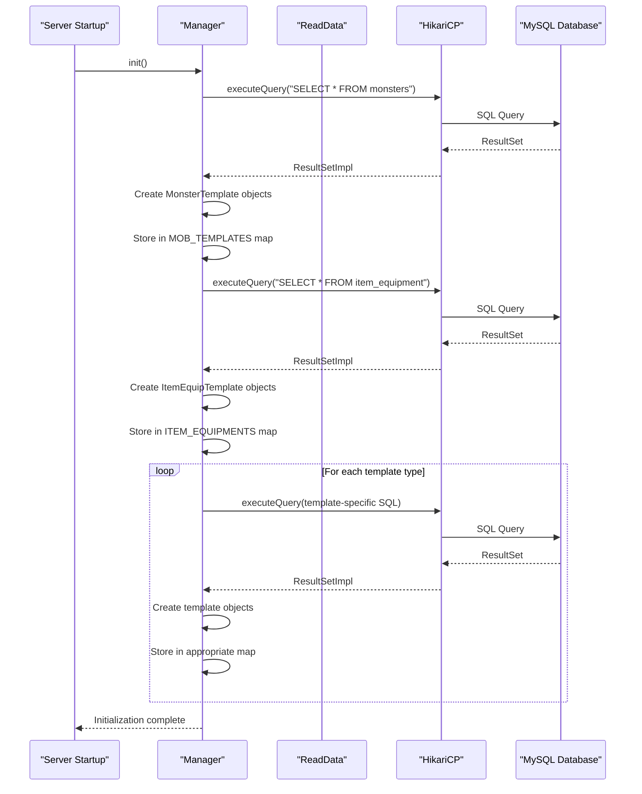

**Diagram sources**
- [Manager.java](file://src/main/java/manager/Manager.java#L1-L1525)
- [ReadData.java](file://src/main/java/server/ReadData.java#L1-L792)
- [HikariCP.java](file://src/main/java/database/HikariCP.java#L1-L124)

**Section sources**
- [Manager.java](file://src/main/java/manager/Manager.java#L1-L1525)

## Dependency Analysis
The data management components have well-defined dependencies that follow a clear hierarchy. The HikariCP connection pool is a foundational dependency used by both PlayerDAO and Manager. PlayerDAO depends on template classes to properly instantiate player items and equipment. The Manager class serves as a central registry for all template types and is depended upon by various service classes.

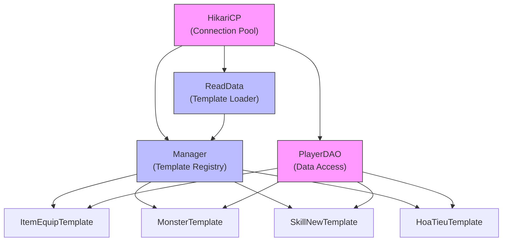

**Diagram sources**
- [HikariCP.java](file://src/main/java/database/HikariCP.java)
- [PlayerDAO.java](file://src/main/java/daos/PlayerDAO.java)
- [Manager.java](file://src/main/java/manager/Manager.java)
- [ReadData.java](file://src/main/java/server/ReadData.java)

**Section sources**
- [HikariCP.java](file://src/main/java/database/HikariCP.java)
- [PlayerDAO.java](file://src/main/java/daos/PlayerDAO.java)
- [Manager.java](file://src/main/java/manager/Manager.java)

## Performance Considerations
The data management system includes several performance optimizations to ensure efficient operation under load. These include connection pooling configuration, prepared statement caching, and in-memory storage of frequently accessed template data.

### Connection Pool Tuning
The HikariCP connection pool is configured with parameters that balance resource usage and performance:

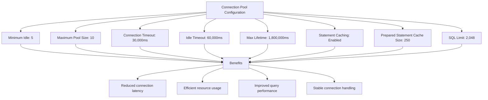

**Diagram sources**
- [HikariCP.java](file://src/main/java/database/HikariCP.java#L1-L124)

**Section sources**
- [HikariCP.java](file://src/main/java/database/HikariCP.java#L1-L124)

### Template Loading Optimization
The template loading process is optimized to minimize database queries and maximize in-memory access speed:

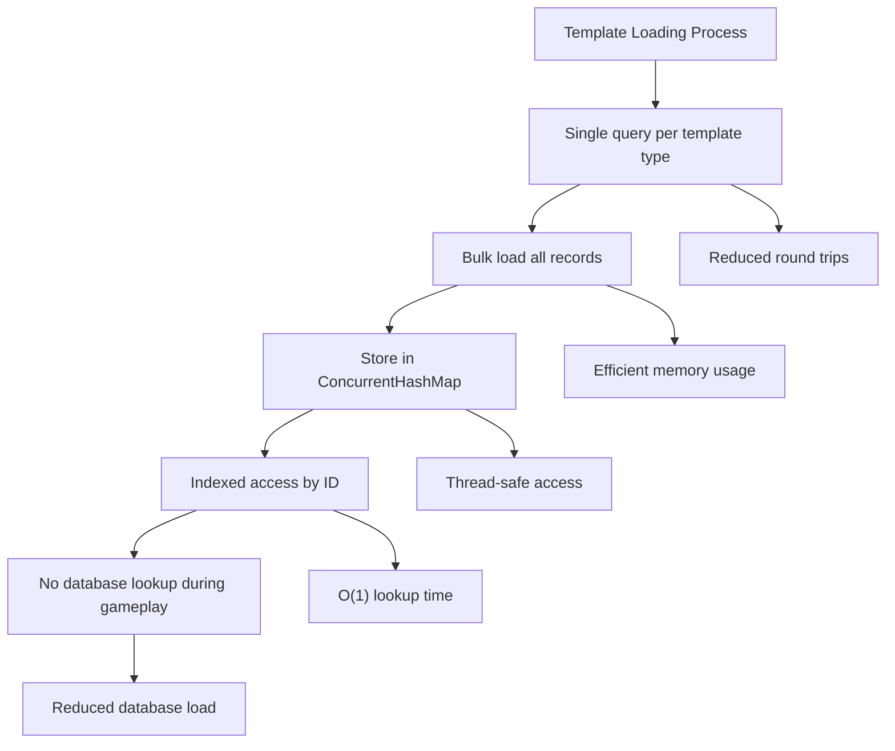

**Diagram sources**
- [Manager.java](file://src/main/java/manager/Manager.java#L1-L1525)

**Section sources**
- [Manager.java](file://src/main/java/manager/Manager.java#L1-L1525)

## Troubleshooting Guide
This section provides guidance for common issues related to data management and their solutions.

### Database Connection Issues
When experiencing database connection problems, check the following:

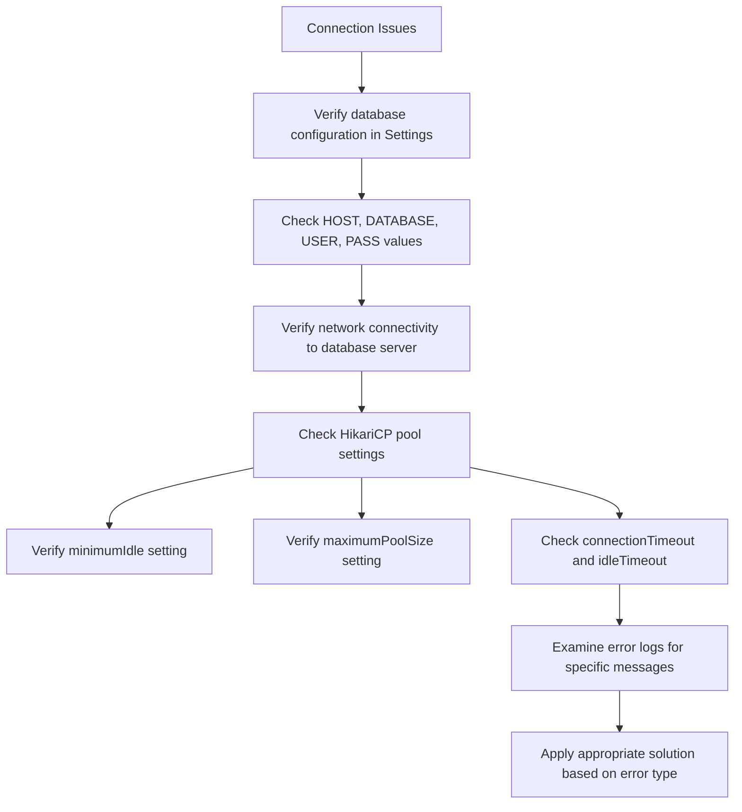

**Section sources**
- [HikariCP.java](file://src/main/java/database/HikariCP.java#L1-L124)
- [Settings.java](file://src/main/java/manager/Settings.java)

### Template Loading Failures
If templates fail to load properly, investigate these areas:

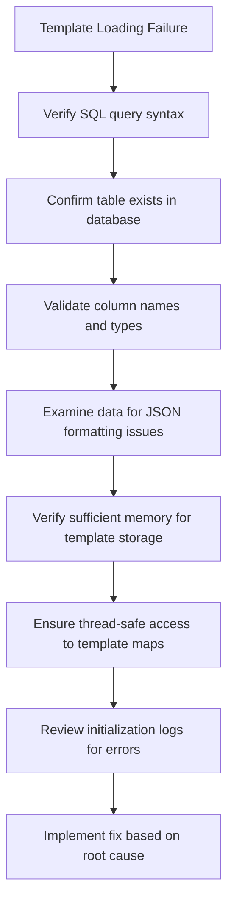

**Section sources**
- [Manager.java](file://src/main/java/manager/Manager.java#L1-L1525)
- [ReadData.java](file://src/main/java/server/ReadData.java#L1-L792)

## Conclusion
The data management system provides a robust foundation for the game server's persistence and configuration needs. The HikariCP connection pool ensures efficient database access with optimized settings for connection reuse and statement caching. The PlayerDAO class implements reliable data access patterns for player information, handling the complex serialization of player state to and from the database.

The template system architecture effectively separates game configuration from runtime instances, loading all template data into memory at startup for fast access during gameplay. This approach eliminates the need for database queries during normal operation, significantly improving performance. The Manager class serves as a central registry for all template types, providing indexed access to game entity definitions.

Performance considerations have been addressed through careful configuration of the connection pool, optimization of database queries, and efficient in-memory storage of template data. The system is designed to handle the demands of a multiplayer game environment with multiple concurrent players accessing and modifying data.

Overall, the data management implementation demonstrates a well-architected approach to handling both persistent player data and static game configuration, providing a solid foundation for the game server's operation.