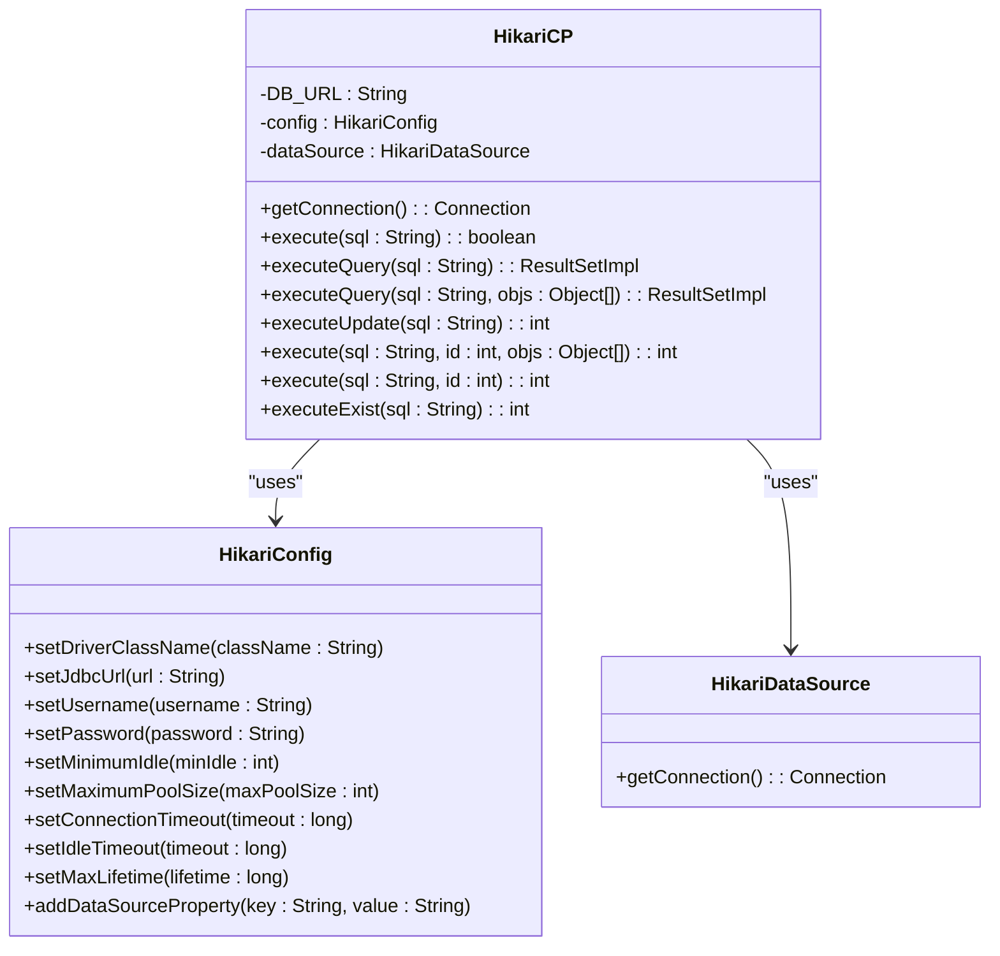
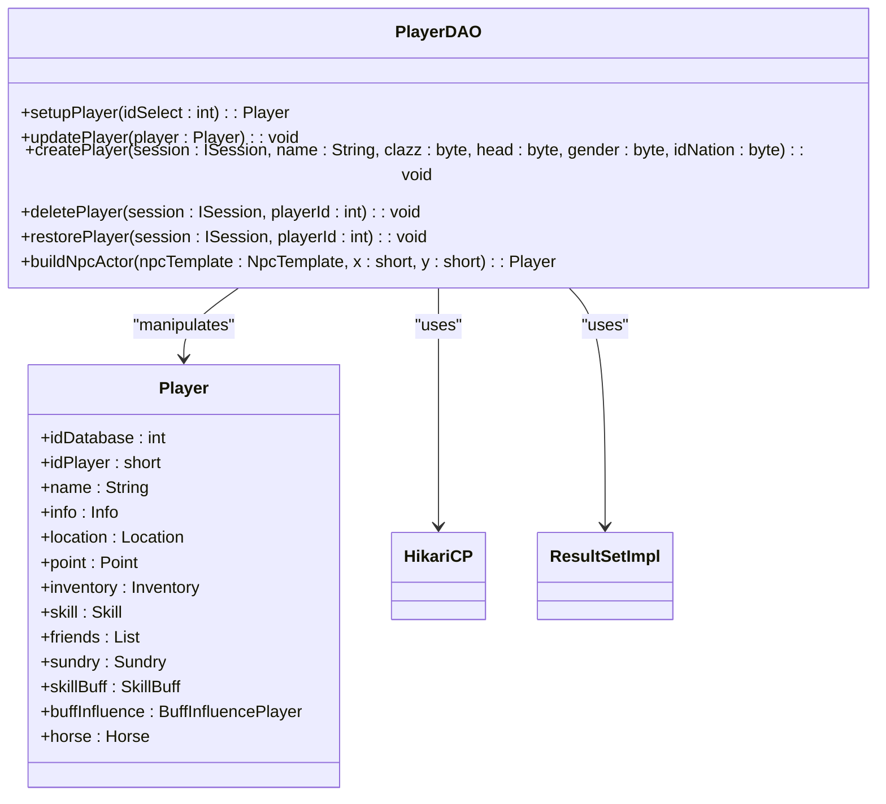
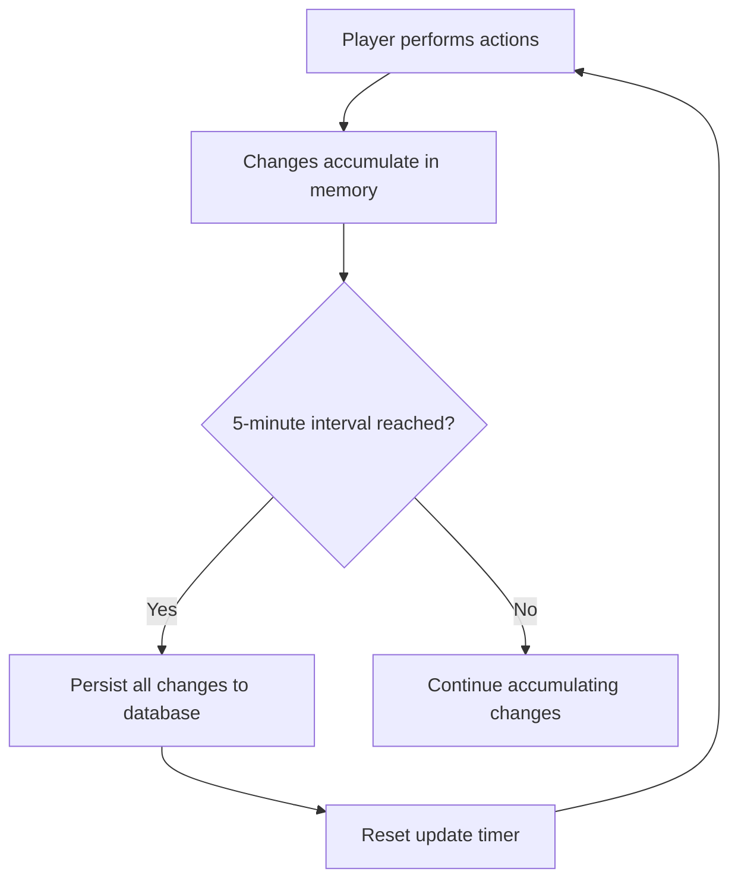
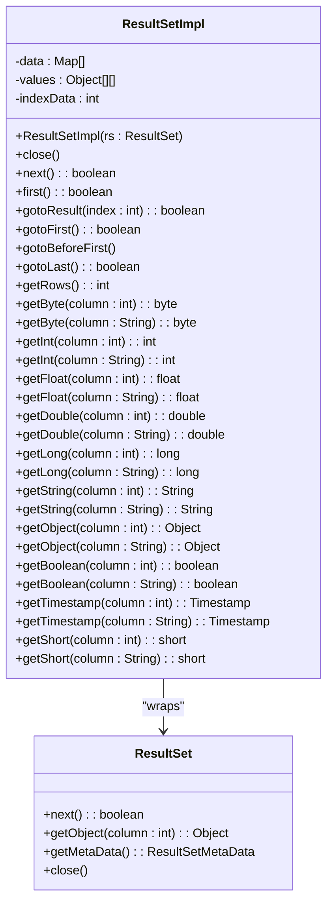

# Database Integration

<cite>
**Referenced Files in This Document**   
- [HikariCP.java](file://src/main/java/database/HikariCP.java)
- [ResultSetImpl.java](file://src/main/java/database/ResultSetImpl.java)
- [PlayerDAO.java](file://src/main/java/daos/PlayerDAO.java)
- [Settings.java](file://src/main/java/manager/Settings.java)
</cite>

## Table of Contents
1. [Introduction](#introduction)
2. [HikariCP Configuration and Connection Pooling](#hikaricp-configuration-and-connection-pooling)
3. [PlayerDAO Implementation and CRUD Operations](#playerdao-implementation-and-crud-operations)
4. [Data Access Patterns](#data-access-patterns)
5. [Performance Considerations](#performance-considerations)
6. [Troubleshooting Guide](#troubleshooting-guide)
7. [Conclusion](#conclusion)

## Introduction
This document provides comprehensive documentation for the database integration layer of the KPAH game server. It details the implementation of HikariCP for high-performance database connection pooling, the PlayerDAO class for managing player data, and the associated data access patterns. The system is designed to support up to 40,000 concurrent players with optimized database interactions, periodic persistence, and efficient result set handling. The documentation covers configuration parameters, CRUD operations, prepared statement usage, transaction handling, and performance optimization strategies.

## HikariCP Configuration and Connection Pooling

The database connection pooling is implemented using HikariCP, a high-performance JDBC connection pool. The configuration is statically initialized with parameters optimized for the game server's requirements.

**Diagram sources**
- [HikariCP.java](file://src/main/java/database/HikariCP.java#L1-L124)

**Section sources**
- [HikariCP.java](file://src/main/java/database/HikariCP.java#L1-L124)
- [Settings.java](file://src/main/java/manager/Settings.java#L1-L58)

### Connection Pool Configuration
The HikariCP connection pool is configured with the following parameters:

- **Maximum Pool Size**: 10 connections
- **Minimum Idle**: 5 connections
- **Connection Timeout**: 30,000 milliseconds (30 seconds)
- **Idle Timeout**: 60,000 milliseconds (60 seconds)
- **Max Lifetime**: 1,800,000 milliseconds (30 minutes)
- **Prepared Statement Caching**: Enabled with cache size of 250 and SQL limit of 2048

The database URL is constructed using settings from the `Settings` class, connecting to a MySQL database with UTF-8 character encoding. While the current configuration sets a maximum pool size of 10, the system is designed to support up to 40,000 concurrent players as defined in `Settings.MAX_PLAYER`. This suggests that either the database operations are highly optimized with minimal connection holding time, or additional connection pool instances may be used for different database operations.

### Prepared Statement Caching
The configuration includes prepared statement caching with a cache size of 250 statements and a SQL limit of 2048 characters. This optimization reduces parsing overhead for frequently executed queries, improving performance for common database operations such as player data retrieval and updates.

## PlayerDAO Implementation and CRUD Operations

The PlayerDAO class provides data access operations for player entities, implementing CRUD (Create, Read, Update, Delete) functionality for player data persistence.

**Diagram sources**
- [PlayerDAO.java](file://src/main/java/daos/PlayerDAO.java#L1-L555)
- [HikariCP.java](file://src/main/java/database/HikariCP.java#L1-L124)
- [ResultSetImpl.java](file://src/main/java/database/ResultSetImpl.java#L1-L346)

**Section sources**
- [PlayerDAO.java](file://src/main/java/daos/PlayerDAO.java#L1-L555)

### CRUD Operations
The PlayerDAO class implements the following CRUD operations:

#### Create Operation
The `createPlayer` method creates a new player record in the database. It first checks if a player with the given name already exists, then generates a unique player ID by querying the maximum existing ID. The player is inserted with default values for various attributes including equipment, inventory, skills, and location based on the character class and nation.

#### Read Operation
The `setupPlayer` method retrieves player data from the database and constructs a Player object. It executes a SELECT query to fetch all player data, then parses the JSON-formatted fields to build the complete player state including inventory, skills, location, and friends. If the player has a deletion timer active, it checks whether the waiting period has expired and deletes the player if necessary.

#### Update Operation
The `updatePlayer` method persists changes to a player's state. It converts various player components to their string representations and executes an UPDATE statement with all player data. The method includes validation to ensure all string representations are valid before attempting the update, preventing data corruption.

#### Delete Operation
The `deletePlayer` method implements a soft delete mechanism by setting a deletion timer rather than immediately removing the player record. The player's `lastTimeEndDelete` field is set to a future timestamp based on `Settings.DAY_WAIT_FOR_DELETE`, after which the player will be permanently removed during the next load attempt.

#### Restore Operation
The `restorePlayer` method cancels a pending deletion by resetting the `lastTimeEndDelete` field to zero, effectively restoring a player who was marked for deletion.

## Data Access Patterns

The database integration layer implements several key data access patterns to ensure efficient and reliable data persistence.

### Periodic Persistence
Player data is periodically persisted to the database at regular intervals. The persistence interval is defined in `Settings.MILISECOND_UPDATE_DATABASE` with a value of 300,000 milliseconds (5 minutes). This pattern balances data safety with performance by reducing the frequency of database writes while ensuring player progress is not lost in case of server crashes.

**Diagram sources**
- [Settings.java](file://src/main/java/manager/Settings.java#L33)
- [PlayerDAO.java](file://src/main/java/daos/PlayerDAO.java#L104-L118)

**Section sources**
- [Settings.java](file://src/main/java/manager/Settings.java#L33)
- [PlayerDAO.java](file://src/main/java/daos/PlayerDAO.java#L104-L118)

### Lazy Loading
The system implements lazy loading for player state components. When a player is loaded, only the core data is retrieved immediately, while some components may be loaded on-demand when accessed. This reduces the initial load time and memory usage, especially important when handling thousands of concurrent players.

### Prepared Statement Usage
The HikariCP class provides multiple methods for executing SQL statements, including parameterized queries that use prepared statements. The `executeQuery` method with varargs parameters allows for safe parameter binding, preventing SQL injection attacks and improving performance through statement caching.

### Transaction Handling
While explicit transaction management is not implemented in the provided code, the atomic nature of individual database operations ensures data consistency. Each player update is performed as a single UPDATE statement, ensuring that either all player data is updated or none is, maintaining data integrity.

### Result Set Mapping
The ResultSetImpl class provides a wrapper around JDBC ResultSet objects, implementing efficient result set mapping to application objects. It reads all result data into memory during construction, allowing the underlying database resources to be closed immediately.

**Diagram sources**
- [ResultSetImpl.java](file://src/main/java/database/ResultSetImpl.java#L1-L346)

**Section sources**
- [ResultSetImpl.java](file://src/main/java/database/ResultSetImpl.java#L1-L346)

The ResultSetImpl constructor reads all data from the ResultSet into memory, storing it in both a Map array (for named access) and an Object array (for indexed access). Column names are stored in lowercase to ensure case-insensitive access. This approach allows for multiple iterations over the result set without requiring a database round-trip, at the cost of increased memory usage.

## Performance Considerations

The database integration layer incorporates several performance optimizations to handle the demands of a high-concurrency game server.

### Query Optimization
The system uses parameterized queries and prepared statement caching to reduce SQL parsing overhead. Queries are designed to retrieve all necessary data in a single operation, minimizing database round-trips. For example, the `setupPlayer` method retrieves all player data with a single SELECT * query rather than multiple queries for different components.

### Index Usage
Although specific database schema details are not provided, the query patterns suggest that appropriate indexes should be created on frequently queried columns such as:
- `players.id` (primary key)
- `players.name` (unique constraint for name checking)
- `players.idPlayer` (for ID generation)
- `users.username` and `users.chars` (for JSON containment queries)

### Connection Leak Prevention
The implementation uses try-with-resources statements in the HikariCP utility methods to ensure that database connections, statements, and result sets are properly closed after use. This prevents connection leaks that could exhaust the connection pool. The ResultSetImpl class also implements a close method that explicitly clears its internal data structures.

### Pool Metrics Monitoring
While the current implementation does not include explicit monitoring of pool metrics, HikariCP provides built-in metrics that could be exposed for monitoring. Key metrics to monitor include:
- Active connections
- Idle connections
- Connection acquisition time
- Connection timeout rate
- Deadlock detection

### Data Serialization Optimization
Player data components are stored as JSON strings in the database, which reduces the number of columns and simplifies schema management. However, this approach should be monitored for performance, as large JSON strings can impact query performance. The system could benefit from periodically analyzing the size of these JSON fields and considering normalization for frequently queried attributes.

## Troubleshooting Guide

This section provides guidance for diagnosing and resolving common database integration issues.

### Connection Timeouts
Connection timeouts may occur when the connection pool is exhausted or the database is unresponsive.

**Symptoms:**
- Players unable to log in
- Character creation failures
- Server log messages indicating connection timeouts

**Solutions:**
1. Check database server health and connectivity
2. Monitor connection pool metrics for exhaustion
3. Consider increasing `maximumPoolSize` if consistently hitting limits
4. Optimize long-running queries that hold connections
5. Verify network connectivity between game server and database

**Section sources**
- [HikariCP.java](file://src/main/java/database/HikariCP.java#L30)
- [Settings.java](file://src/main/java/manager/Settings.java#L1-L58)

### Deadlocks
Deadlocks can occur when multiple transactions attempt to modify the same player records simultaneously.

**Symptoms:**
- Intermittent database errors during player updates
- Players experiencing save failures
- Database logs showing deadlock exceptions

**Solutions:**
1. Implement retry logic for deadlock exceptions
2. Minimize transaction duration by reducing the scope of database operations
3. Ensure consistent ordering of database operations across the application
4. Consider using optimistic concurrency control with version numbers

**Section sources**
- [PlayerDAO.java](file://src/main/java/daos/PlayerDAO.java#L104-L118)

### Database Overload
Database overload can occur during peak player activity periods.

**Symptoms:**
- Increased query response times
- Connection pool exhaustion
- High database CPU or I/O utilization

**Solutions:**
1. Implement query caching for frequently accessed read operations
2. Optimize slow queries using database query plans
3. Consider read/write splitting with database replication
4. Scale database infrastructure to handle peak loads
5. Review and optimize the 5-minute persistence interval based on actual load patterns

**Section sources**
- [HikariCP.java](file://src/main/java/database/HikariCP.java#L1-L124)
- [PlayerDAO.java](file://src/main/java/daos/PlayerDAO.java#L1-L555)

### Data Corruption
Data corruption can occur if JSON serialization/deserialization fails.

**Symptoms:**
- Players with missing equipment or skills
- Inventory items not appearing correctly
- JSONException in server logs

**Solutions:**
1. Implement data validation before saving
2. Add error handling and fallback mechanisms for corrupted data
3. Implement regular data integrity checks
4. Consider adding database constraints to validate JSON structure

**Section sources**
- [PlayerDAO.java](file://src/main/java/daos/PlayerDAO.java#L50-L74)

## Conclusion
The database integration layer of the KPAH game server demonstrates a well-structured approach to handling player data persistence at scale. The use of HikariCP provides a high-performance connection pool with sensible default configurations, while the PlayerDAO class implements comprehensive CRUD operations for player management. The system incorporates important data access patterns such as periodic persistence and lazy loading to balance performance and data safety.

Key strengths include the use of prepared statement caching, proper resource management with try-with-resources, and a clean separation of database access logic. The implementation of soft deletes and periodic persistence aligns well with the requirements of a game server where player experience and data safety are paramount.

For future improvements, consider implementing more sophisticated monitoring of pool metrics, adding retry logic for transient database errors, and exploring database sharding or replication strategies to support the full 40,000 concurrent player capacity. Additionally, evaluating the performance impact of JSON storage versus normalized tables could yield further optimization opportunities.