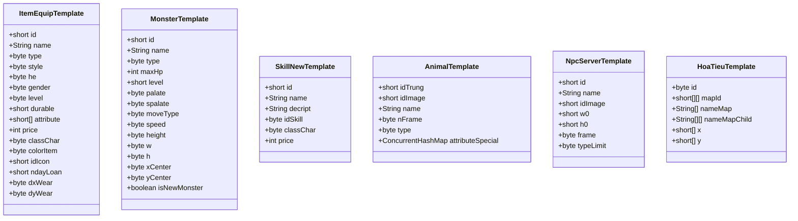
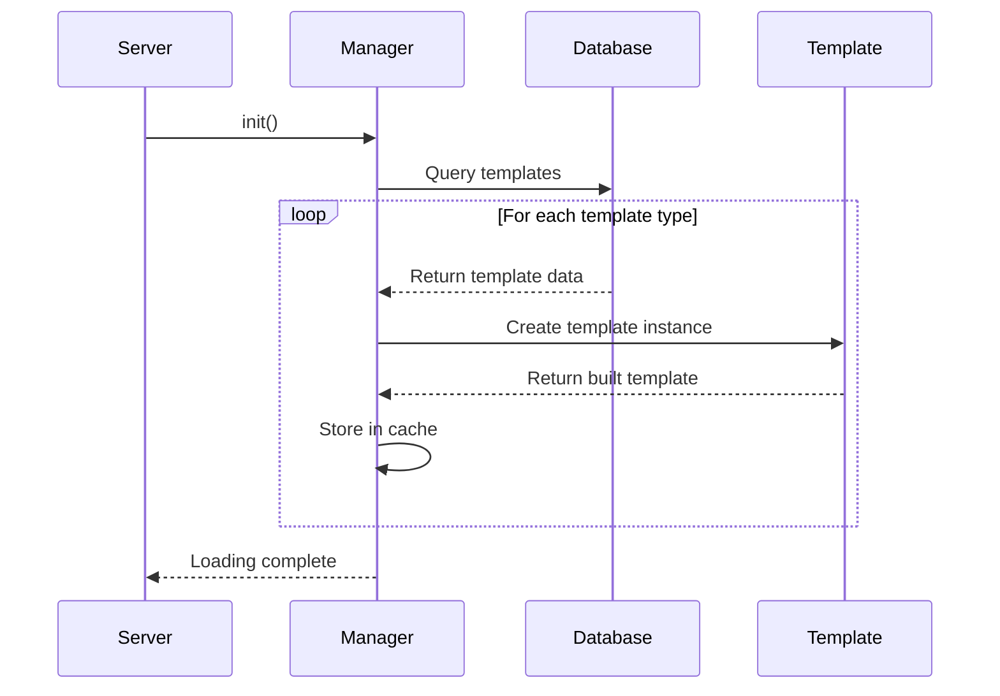
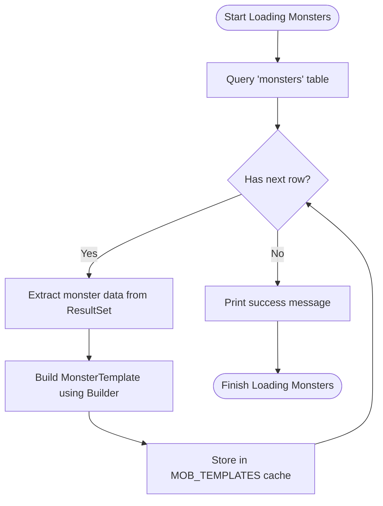
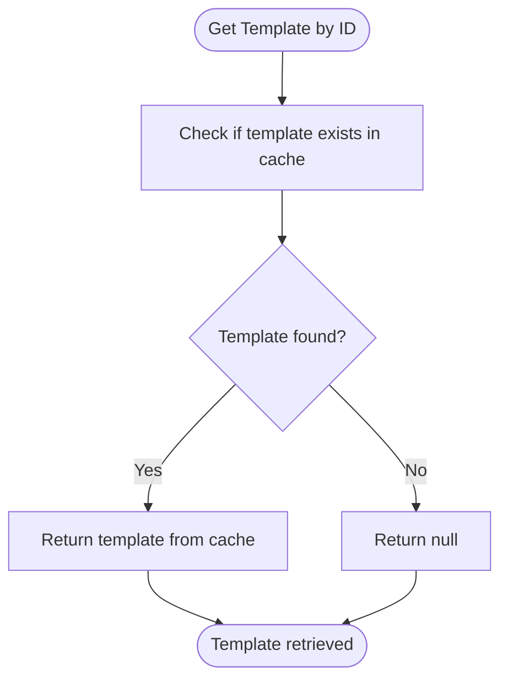
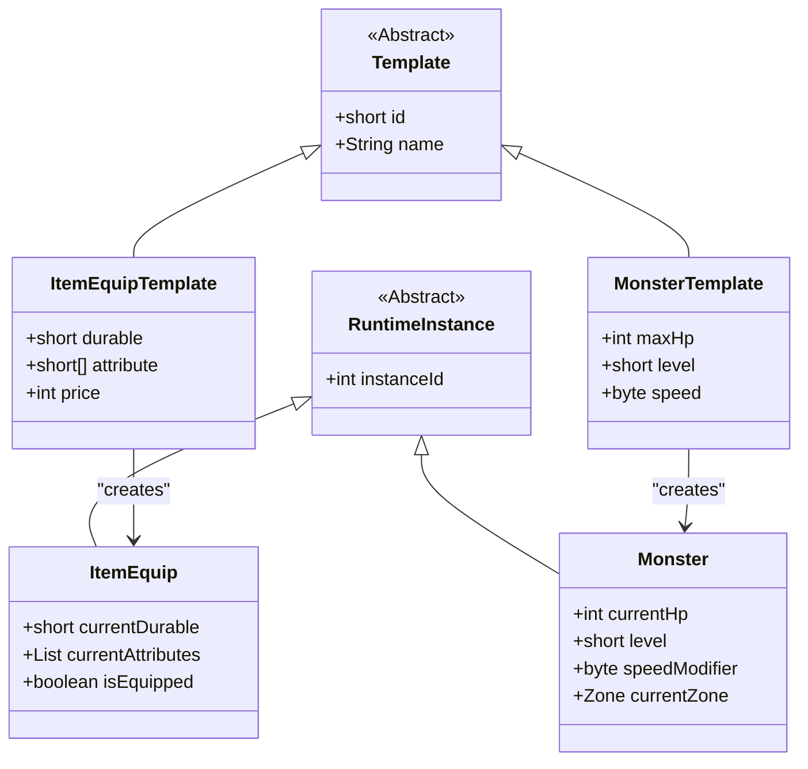
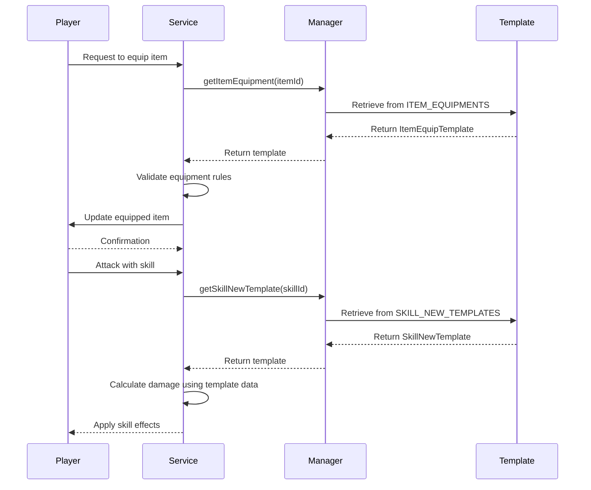
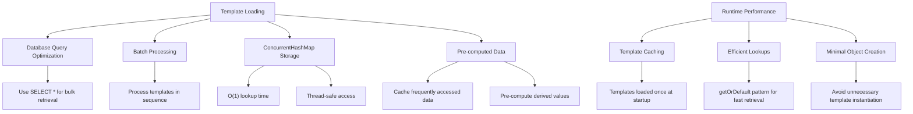

# Templates System

<cite>
**Referenced Files in This Document**   
- [Manager.java](file://src/main/java/manager/Manager.java)
- [ItemEquipTemplate.java](file://src/main/java/template/ItemEquipTemplate.java)
- [MonsterTemplate.java](file://src/main/java/template/MonsterTemplate.java)
- [SkillNewTemplate.java](file://src/main/java/template/SkillNewTemplate.java)
- [Server.java](file://src/main/java/server/Server.java)
- [ReadData.java](file://src/main/java/server/ReadData.java)
- [AnimalTemplate.java](file://src/main/java/template/AnimalTemplate.java)
- [NpcServerTemplate.java](file://src/main/java/template/NpcServerTemplate.java)
- [HoaTieuTemplate.java](file://src/main/java/template/HoaTieuTemplate.java)
</cite>

## Table of Contents
1. [Introduction](#introduction)
2. [Template Structure and Common Patterns](#template-structure-and-common-patterns)
3. [Template Loading and Initialization](#template-loading-and-initialization)
4. [Template Caching and Lookup Mechanisms](#template-caching-and-lookup-mechanisms)
5. [Relationship Between Templates and Runtime Instances](#relationship-between-templates-and-runtime-instances)
6. [Template Access During Gameplay](#template-access-during-gameplay)
7. [Performance Considerations](#performance-considerations)
8. [Troubleshooting Guide](#troubleshooting-guide)
9. [Conclusion](#conclusion)

## Introduction
The Templates System in the game server architecture serves as the foundation for defining and managing game entities such as items, monsters, NPCs, and skills. This system uses template files to define blueprints for these entities, which are then loaded into memory at server startup. The templates provide a consistent structure for entity definition, enabling efficient creation of runtime instances during gameplay. This documentation provides a comprehensive overview of the templates system, detailing its architecture, implementation, and usage patterns.

## Template Structure and Common Patterns

The template system follows a consistent design pattern across different entity types, with each template class defining the blueprint for a specific type of game entity. These templates are implemented as Java classes with Lombok annotations for code generation, providing a clean and maintainable structure.

### Core Template Classes

The system includes several template classes that define different types of game entities:



**Diagram sources**
- [ItemEquipTemplate.java](file://src/main/java/template/ItemEquipTemplate.java)
- [MonsterTemplate.java](file://src/main/java/template/MonsterTemplate.java)
- [SkillNewTemplate.java](file://src/main/java/template/SkillNewTemplate.java)
- [AnimalTemplate.java](file://src/main/java/template/AnimalTemplate.java)
- [NpcServerTemplate.java](file://src/main/java/template/NpcServerTemplate.java)
- [HoaTieuTemplate.java](file://src/main/java/template/HoaTieuTemplate.java)

### Common Template Patterns

All template classes follow a consistent pattern with several common elements:

- **ID**: A unique identifier for the template, typically a short integer
- **Name**: A human-readable name for the entity
- **Icon/Visual Properties**: References to visual assets such as icons or images
- **Property Definitions**: Arrays or collections defining specific attributes of the entity
- **Type Classification**: Categorization of the entity (e.g., by class, gender, or functional type)

The templates use the Builder pattern (via Lombok's @Builder annotation) for object creation, allowing for flexible and readable instantiation. This pattern enables the creation of template instances with only the necessary properties specified, with others taking default values.

**Section sources**
- [ItemEquipTemplate.java](file://src/main/java/template/ItemEquipTemplate.java)
- [MonsterTemplate.java](file://src/main/java/template/MonsterTemplate.java)
- [SkillNewTemplate.java](file://src/main/java/template/SkillNewTemplate.java)

## Template Loading and Initialization

The template loading process is a critical part of the server startup sequence, ensuring that all game entity blueprints are available before players can interact with the game world.

### Server Startup Sequence

The server initialization begins in the Server class, which creates and starts the main server thread. During this process, the Manager class is initialized, triggering the loading of all templates from the database.



**Diagram sources**
- [Server.java](file://src/main/java/server/Server.java#L0-L118)
- [Manager.java](file://src/main/java/manager/Manager.java#L0-L1524)

### Template Loading Process

The template loading process is implemented in the Manager.init() method, which performs the following steps:

1. Load configuration data from the "others" table
2. Load templates for each entity type from their respective database tables
3. Process and validate the loaded data
4. Store templates in appropriate ConcurrentHashMap instances for efficient access

For example, monster templates are loaded from the "monsters" table using the following pattern:



**Diagram sources**
- [Manager.java](file://src/main/java/manager/Manager.java#L0-L1524)

The loading process follows a consistent pattern across all template types:
- Execute a SQL query to retrieve all records from the template table
- Iterate through the ResultSet
- For each row, extract the relevant fields and build a template instance using the Builder pattern
- Store the template in a static ConcurrentHashMap using the ID as the key
- Print a success message indicating the number of templates loaded

This process ensures that all templates are loaded into memory at startup, making them readily available for gameplay operations.

**Section sources**
- [Manager.java](file://src/main/java/manager/Manager.java#L0-L1524)
- [Server.java](file://src/main/java/server/Server.java#L0-L118)

## Template Caching and Lookup Mechanisms

The templates system employs an efficient caching strategy using ConcurrentHashMap instances to store template data, enabling thread-safe access and fast lookups during gameplay.

### Template Storage Architecture

The Manager class maintains static ConcurrentHashMap fields for each template type, providing a centralized repository for all template data:

```mermaid
erDiagram
MANAGER ||--o{ ITEM_EQUIPMENTS : "contains"
MANAGER ||--o{ MOB_TEMPLATES : "contains"
MANAGER ||--o{ SKILL_NEW_TEMPLATES : "contains"
MANAGER ||--o{ NPC_SERVER_TEMPLATES : "contains"
MANAGER ||--o{ ANIMAL_TEMPLATES : "contains"
ITEM_EQUIPMENTS }|--|| ITEM_EQUIP_TEMPLATE : "instances of"
MOB_TEMPLATES }|--|| MONSTER_TEMPLATE : "instances of"
SKILL_NEW_TEMPLATES }|--|| SKILL_NEW_TEMPLATE : "instances of"
NPC_SERVER_TEMPLATES }|--|| NPC_SERVER_TEMPLATE : "instances of"
ANIMAL_TEMPLATES }|--|| ANIMAL_TEMPLATE : "instances of"
class ITEM_EQUIPMENTS {
+short id
+ItemEquipTemplate template
}
class MOB_TEMPLATES {
+short id
+MonsterTemplate template
}
class SKILL_NEW_TEMPLATES {
+short id
+SkillNewTemplate template
}
class NPC_SERVER_TEMPLATES {
+short id
+NpcServerTemplate template
}
class ANIMAL_TEMPLATES {
+short id
+AnimalTemplate template
}
```

**Diagram sources**
- [Manager.java](file://src/main/java/manager/Manager.java#L0-L1524)

### Lookup Methods

The Manager class provides static getter methods for retrieving templates by ID, implementing the getOrDefault pattern to handle cases where a template with the specified ID does not exist:



**Diagram sources**
- [Manager.java](file://src/main/java/manager/Manager.java#L170-L215)

The lookup mechanism is implemented consistently across all template types:

- **getItemEquipment(short itemId)**: Retrieves an item equipment template by its ID
- **getMobTemplate(short mobId)**: Retrieves a monster template by its ID
- **getSkillNewTemplate(short id)**: Retrieves a skill template by its ID
- **getNpcServerTemplate(short id)**: Retrieves an NPC server template by its ID
- **getAnimalTemplate(short id)**: Retrieves an animal template by its ID

These methods use the ConcurrentHashMap.getOrDefault() method to safely retrieve templates, returning null if the specified ID is not found. This approach ensures thread-safe access to the template cache while providing a simple and consistent API for template retrieval.

The caching strategy provides several benefits:
- **Thread Safety**: ConcurrentHashMap ensures safe concurrent access from multiple threads
- **Performance**: O(1) average time complexity for lookups
- **Memory Efficiency**: Templates are loaded once and shared across all game instances
- **Consistency**: All code accesses the same template data, ensuring consistency

**Section sources**
- [Manager.java](file://src/main/java/manager/Manager.java#L170-L215)

## Relationship Between Templates and Runtime Instances

The templates system establishes a clear distinction between blueprints (templates) and actual game entities (runtime instances), following the prototype pattern to efficiently create and manage game objects.

### Template vs. Instance Architecture



**Diagram sources**
- [template/ItemEquipTemplate.java](file://src/main/java/template/ItemEquipTemplate.java)
- [template/MonsterTemplate.java](file://src/main/java/template/MonsterTemplate.java)
- [item/ItemEquip.java](file://src/main/java/item/ItemEquip.java)
- [map/Monster.java](file://src/main/java/map/Monster.java)

### Blueprint-Instance Relationship

Templates serve as immutable blueprints that define the default properties of game entities, while runtime instances represent the actual objects in the game world with mutable state. This separation provides several advantages:

1. **Memory Efficiency**: Templates are loaded once and shared, while instances only store state that differs from the template
2. **Consistency**: All instances of a template type share the same base properties
3. **Flexibility**: Instances can modify their state without affecting the template or other instances
4. **Maintainability**: Changes to template properties automatically propagate to all future instances

For example, when a player equips an item:
- The ItemEquipTemplate provides the base properties (durability, attributes, price)
- The ItemEquip instance tracks the current state (current durability, whether it's equipped)
- Multiple players can have instances of the same template with different states

Similarly, when a monster is spawned:
- The MonsterTemplate defines the base properties (max HP, level, speed)
- The Monster instance maintains the current state (current HP, position, AI state)
- Multiple monsters can be spawned from the same template with independent states

This architecture enables efficient game object management while maintaining the flexibility needed for dynamic gameplay.

**Section sources**
- [template/ItemEquipTemplate.java](file://src/main/java/template/ItemEquipTemplate.java)
- [item/ItemEquip.java](file://src/main/java/item/ItemEquip.java)
- [template/MonsterTemplate.java](file://src/main/java/template/MonsterTemplate.java)
- [map/Monster.java](file://src/main/java/map/Monster.java)

## Template Access During Gameplay

Templates are accessed throughout the gameplay lifecycle for various operations, from character creation to combat mechanics. The system provides efficient access patterns to retrieve template data when needed.

### Gameplay Access Patterns



**Diagram sources**
- [Manager.java](file://src/main/java/manager/Manager.java#L170-L215)
- [services/SkillService.java](file://src/main/java/services/SkillService.java)
- [services/ItemService.java](file://src/main/java/services/ItemService.java)

### Common Access Scenarios

#### Equipping an Item
When a player equips an item, the system follows this process:
1. Retrieve the ItemEquipTemplate using Manager.getItemEquipment(itemId)
2. Validate that the player meets the requirements (level, class)
3. Apply the template's attributes to the player's character
4. Update the client with the new equipment state

#### Spawning a Monster
When a monster is spawned in a zone:
1. Retrieve the MonsterTemplate using Manager.getMobTemplate(mobId)
2. Create a new Monster instance with the template's base properties
3. Set the monster's initial position and AI state
4. Add the monster to the zone's entity collection

#### Using a Skill
When a player uses a skill:
1. Retrieve the SkillNewTemplate using Manager.getSkillNewTemplate(skillId)
2. Validate that the player has sufficient MP and is not in cooldown
3. Apply the skill's effects based on the template's properties
4. Update the client with the skill animation and results

These access patterns demonstrate how templates serve as the authoritative source of truth for entity properties, ensuring consistency across the game world while enabling dynamic gameplay mechanics.

**Section sources**
- [Manager.java](file://src/main/java/manager/Manager.java#L170-L215)
- [services/ItemService.java](file://src/main/java/services/ItemService.java)
- [services/MonsterService.java](file://src/main/java/services/MonsterService.java)
- [services/SkillService.java](file://src/main/java/services/SkillService.java)

## Performance Considerations

The templates system is designed with performance in mind, addressing memory footprint, loading time, and runtime access efficiency to ensure smooth gameplay.

### Memory and Loading Optimization



**Diagram sources**
- [Manager.java](file://src/main/java/manager/Manager.java#L0-L1524)

### Memory Footprint

The system minimizes memory usage through several strategies:

- **Single Instance Storage**: Each template is stored only once in memory, regardless of how many times it's referenced
- **Primitive Arrays**: Properties like attributes and coordinates use primitive arrays rather than object collections
- **ConcurrentHashMap**: Efficient key-value storage with minimal overhead
- **Static Fields**: Template caches are stored as static fields, ensuring they are shared across all instances

### Loading Time Optimization

Template loading is optimized through:

- **Sequential Processing**: Templates are loaded in a specific order to minimize database round trips
- **Bulk Queries**: Each template type is retrieved with a single SELECT * query
- **Efficient Parsing**: JSON data is parsed directly from ResultSet without intermediate objects
- **Batched Operations**: Related templates are processed together to reduce overhead

### Thread-Safe Access

The system ensures thread-safe access to templates through:

- **ConcurrentHashMap**: All template caches use ConcurrentHashMap, which provides thread-safe operations without explicit synchronization
- **Immutable Templates**: Template objects are effectively immutable after creation, preventing race conditions
- **State Separation**: Runtime state is stored separately from template data, allowing concurrent access to templates while instances are modified

These performance considerations ensure that the templates system can handle the demands of a multiplayer game server, providing fast access to entity data while minimizing resource usage.

**Section sources**
- [Manager.java](file://src/main/java/manager/Manager.java#L0-L1524)

## Troubleshooting Guide

This section provides guidance for diagnosing and resolving common issues related to template loading, access, and usage.

### Template Loading Failures

If templates fail to load at startup, check the following:

1. **Database Connection**: Verify that the database is accessible and the HikariCP connection pool is functioning
2. **Table Structure**: Ensure that all template tables exist with the correct schema
3. **Data Integrity**: Check for missing or malformed data in template tables
4. **File Permissions**: Verify that the server has read access to database files

Error messages in the log can help identify specific issues:
- "Lỗi Tải Dữ Liệu" indicates a general template loading error
- SQLExceptions may indicate database connectivity or query issues
- JSONException may indicate malformed JSON data in template fields

### Missing References

When a template cannot be found by ID, consider these potential causes:

1. **ID Mismatch**: The requested ID may not exist in the template cache
2. **Loading Order**: The template may not have been loaded due to an error in the initialization sequence
3. **Data Synchronization**: The template data may be out of sync between the server and client

To diagnose missing references:
- Verify the ID being requested matches the template's ID in the database
- Check the startup logs for success messages indicating the number of templates loaded
- Use the appropriate Manager.get*Template() method to test template retrieval

### Version Mismatches

Version mismatches can occur when template data differs between server and client. To prevent these issues:

1. **Synchronize Data**: Ensure that template data is consistent across all server instances
2. **Version Control**: Use version numbers or timestamps to track template data changes
3. **Validation**: Implement validation checks to detect version mismatches at startup

When troubleshooting version issues:
- Compare template counts between server logs and expected values
- Verify that all template types are being loaded successfully
- Check for any errors during the template loading process

By following this troubleshooting guide, developers can quickly identify and resolve common template system issues, ensuring a stable and reliable game server.

**Section sources**
- [Manager.java](file://src/main/java/manager/Manager.java#L0-L1524)
- [Server.java](file://src/main/java/server/Server.java#L0-L118)
- [Logger.java](file://src/main/java/utils/Logger.java)

## Conclusion

The Templates System provides a robust foundation for defining and managing game entities in the server architecture. By using template files as blueprints for items, monsters, NPCs, and skills, the system enables efficient creation and management of game objects while maintaining consistency across the game world.

Key aspects of the system include:
- A consistent template structure with common patterns across entity types
- Efficient loading and initialization during server startup
- Thread-safe caching and fast lookup mechanisms
- Clear separation between immutable templates and mutable runtime instances
- Optimized performance for memory usage and access speed

The system's design enables scalable gameplay mechanics while providing a maintainable architecture for game development. By following the patterns and practices outlined in this documentation, developers can effectively utilize the templates system to create engaging and dynamic game experiences.