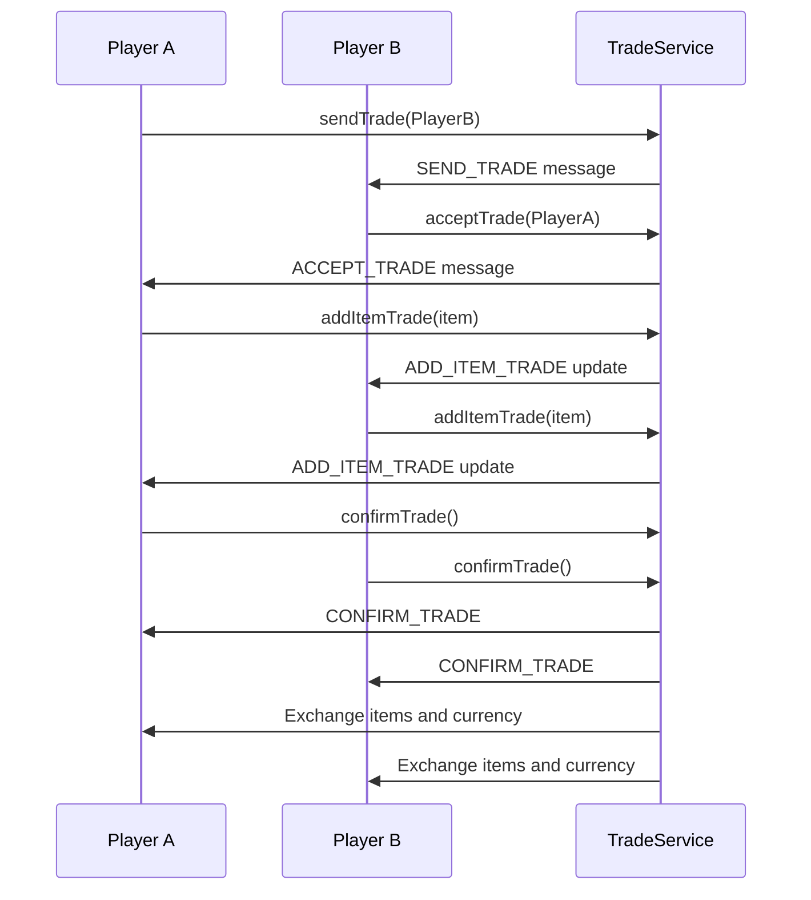
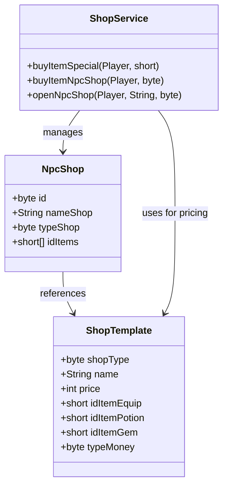
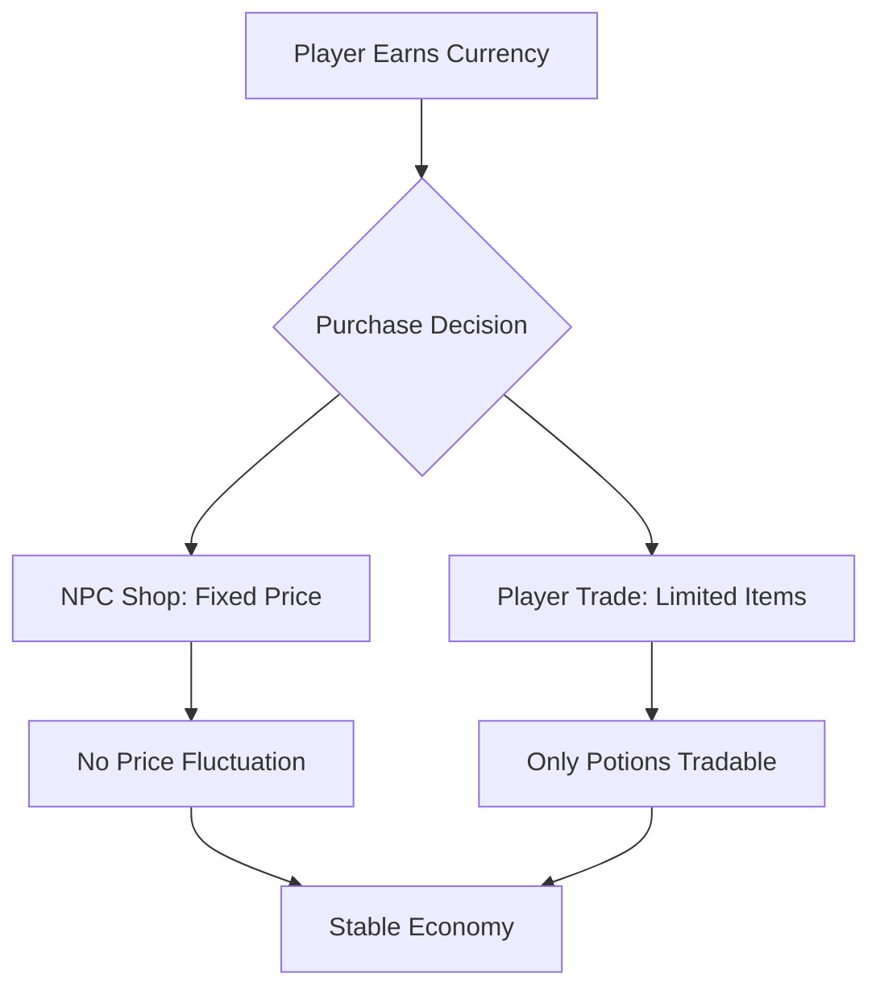
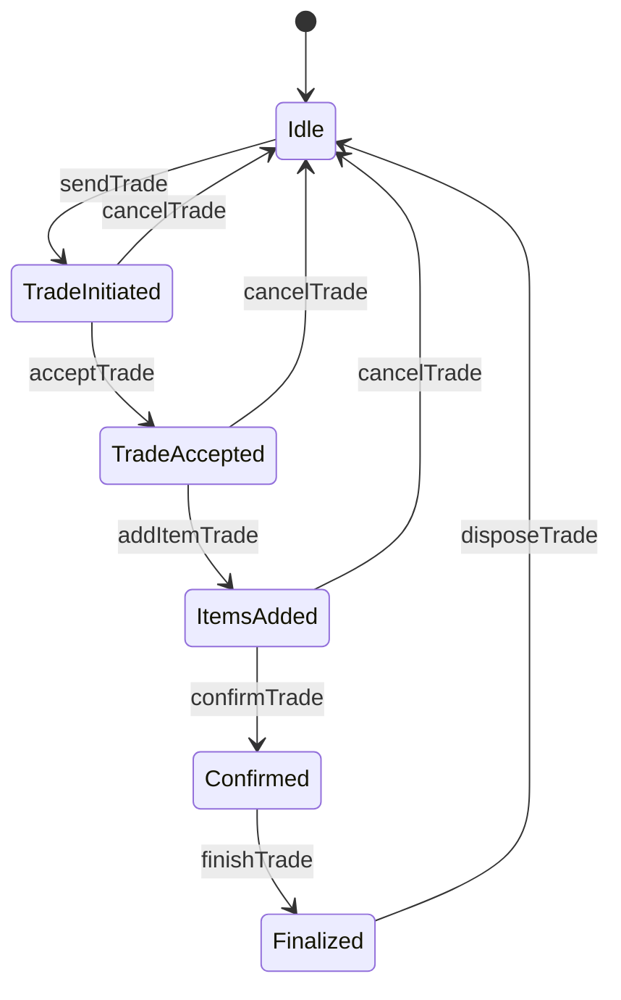

# Economic System

<cite>
**Referenced Files in This Document**   
- [TradeService.java](file://src/main/java/services/TradeService.java)
- [ShopService.java](file://src/main/java/services/ShopService.java)
- [ShopTemplate.java](file://src/main/java/template/ShopTemplate.java)
- [Player.java](file://src/main/java/player/Player.java)
- [Sundry.java](file://src/main/java/player/Sundry.java)
- [Inventory.java](file://src/main/java/player/Inventory.java)
- [NpcShop.java](file://src/main/java/shop/NpcShop.java)
- [DepositeService.java](file://src/main/java/services/DepositeService.java)
</cite>

## Table of Contents
1. [Introduction](#introduction)
2. [Player-to-Player Trading System](#player-to-player-trading-system)
3. [NPC Shop System](#npc-shop-system)
4. [Currency System and Anti-Inflation Measures](#currency-system-and-anti-inflation-measures)
5. [Common Economic Transactions and Security Considerations](#common-economic-transactions-and-security-considerations)
6. [Exploit Prevention and Security Measures](#exploit-prevention-and-security-measures)
7. [Shop Configuration and Templates](#shop-configuration-and-templates)

## Introduction
The in-game economy is built around a robust trading and shop system that enables both player-to-player exchanges and NPC-based commerce. The system supports multiple currencies, secure transaction workflows, and structured inventory management. This document details the implementation of trading mechanics, shop operations, currency handling, and security measures designed to maintain economic balance and prevent exploitation.

## Player-to-Player Trading System

The player-to-player trading system allows two players to exchange items and currency through a secure, step-by-step workflow. Trading is initiated by one player sending a request to another, which must be accepted before proceeding.

### Trading Workflow
The trading process follows a strict sequence to ensure fairness and prevent race conditions:

1. **Trade Initiation**: A player sends a trade request to another player.
2. **Acceptance**: The receiving player must accept the request.
3. **Item/Currency Addition**: Both players add items or currency to their respective trade offers.
4. **Confirmation**: Both players confirm their offers.
5. **Finalization**: Once both confirm, items and currency are exchanged.

The system prevents trading while already engaged in another trade and validates inventory space before finalizing transactions.

**Diagram sources**
- [TradeService.java](file://src/main/java/services/TradeService.java#L0-L313)

**Section sources**
- [TradeService.java](file://src/main/java/services/TradeService.java#L0-L313)
- [Sundry.java](file://src/main/java/player/Sundry.java#L0-L168)

### Item and Currency Exchange Mechanics
Only consumable items (potion-type) can be traded; equipment items are non-tradable. Each player can add up to 15 items to a trade. Currency is not directly tradable—only items with monetary value can be exchanged.

When an item is added to a trade:
- It is removed from the player's inventory.
- A temporary trade record is created.
- The other player is notified of the update.

If a player cancels or disconnects during trading, all items are returned to their original inventories.

## NPC Shop System

The NPC shop system allows players to buy items using in-game currencies. Shops are managed through templates and support different item categories including equipment, potions, and gems.

### Inventory Management
NPC shops have predefined inventories defined by `NpcShop` objects, which contain arrays of item IDs. Shop data is retrieved from configuration templates and sent to the client upon interaction.

**Diagram sources**
- [NpcShop.java](file://src/main/java/shop/NpcShop.java#L0-L17)
- [ShopTemplate.java](file://src/main/java/template/ShopTemplate.java#L0-L27)
- [ShopService.java](file://src/main/java/services/ShopService.java#L0-L428)

### Pricing Strategies
Pricing is defined in `ShopTemplate` and varies by currency type:
- **Xu (Coins)**: Standard currency for basic items.
- **Luong (Gold)**: Premium currency for rare items.
- **Luong Khoa (Locked Gold)**: Non-tradable premium currency.

Prices are fixed per template, and discounts are not supported. Some items are gender-locked and refund currency if purchased by the wrong gender.

### Purchase Validation
Before a purchase is completed, the system validates:
- Trader status (cannot trade while shopping)
- Inventory space
- Sufficient currency
- Item availability and sell status

If validation fails, the transaction is aborted and an error message is sent.

**Section sources**
- [ShopService.java](file://src/main/java/services/ShopService.java#L0-L428)
- [ShopTemplate.java](file://src/main/java/template/ShopTemplate.java#L0-L27)

## Currency System and Anti-Inflation Measures

### Supported Currencies
The game supports three currencies:
- **Xu**: Earned through gameplay, used for common items.
- **Luong**: Obtained via premium purchases or events, used for rare items.
- **Luong Khoa**: Non-tradable, used for exclusive content.

Currency balances are stored in the `Inventory` class and modified through atomic operations to prevent race conditions.

### Anti-Inflation Measures
To prevent inflation:
- NPC shops sell items at fixed prices.
- Player-to-player trading is limited to consumables only.
- Equipment cannot be sold to NPCs; only decommissioned items can be sold back at 20% value.
- High-value items require locked currency, reducing circulation.

**Section sources**
- [Inventory.java](file://src/main/java/player/Inventory.java#L0-L245)
- [ShopService.java](file://src/main/java/services/ShopService.java#L0-L428)

## Common Economic Transactions and Security Considerations

### Transaction Examples
1. **Buying a Potion from NPC**:
   - Player selects item.
   - System checks Xu balance.
   - On success, item is added, Xu deducted.

2. **Selling Equipment**:
   - Player selects item from inventory.
   - System validates non-locked, non-loaned status.
   - Item moved to sold list, 20% Xu value credited.

3. **Player Trade**:
   - Trade request sent and accepted.
   - Items added, confirmed, and exchanged atomically.

### Security Considerations
- All transactions are server-validated.
- Currency modification uses atomic methods (`minusXu`, `plusXu`).
- Trade state is cleared on disconnect.
- Inventory limits prevent overflow.

**Section sources**
- [Inventory.java](file://src/main/java/player/Inventory.java#L0-L245)
- [TradeService.java](file://src/main/java/services/TradeService.java#L0-L313)
- [ShopService.java](file://src/main/java/services/ShopService.java#L0-L428)

## Exploit Prevention and Security Measures

### Duping Prevention
- Trade items are removed from inventory immediately upon addition.
- On trade cancellation, items are restored only if still valid.
- Server maintains authoritative state; client cannot force item duplication.

### Gold Farming Mitigation
- No automated farming mechanics.
- Currency drops are limited and monitored.
- Selling items yields only 20% return, discouraging mass resale.

### Race Condition Handling
- Trade confirmation requires both players to finish simultaneously.
- Inventory checks occur at finalization.
- Trade state is locked during processing using synchronized methods.

**Section sources**
- [TradeService.java](file://src/main/java/services/TradeService.java#L0-L313)
- [Sundry.java](file://src/main/java/player/Sundry.java#L0-L168)

## Shop Configuration and Templates

### Template-Based Shop Design
Shops are configured using `ShopTemplate`, which defines:
- Item type (equipment, potion, gem)
- Price and currency type
- Visual ID and description
- Sell status

Templates are loaded at startup and referenced by ID during gameplay.

### Configuring Shop Inventories
Shop inventories are defined in `NpcShop.idItems`, an array of item IDs. To configure:
1. Define items in `ShopTemplate`.
2. Assign IDs to `NpcShop.idItems` array.
3. Register shop with `Manager.getItemsNpcShop()`.

Multiple shop types are supported:
- **Potion Shops**: Byte-indexed item lists.
- **Equipment Shops**: Short-indexed with damage type support.

**Section sources**
- [ShopTemplate.java](file://src/main/java/template/ShopTemplate.java#L0-L27)
- [NpcShop.java](file://src/main/java/shop/NpcShop.java#L0-L17)
- [ShopService.java](file://src/main/java/services/ShopService.java#L0-L428)