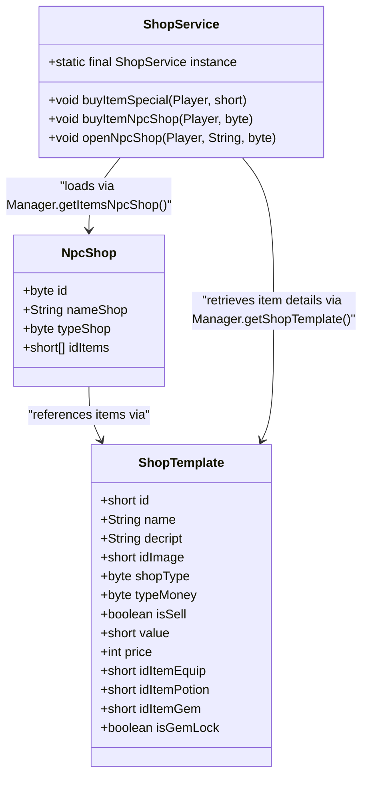
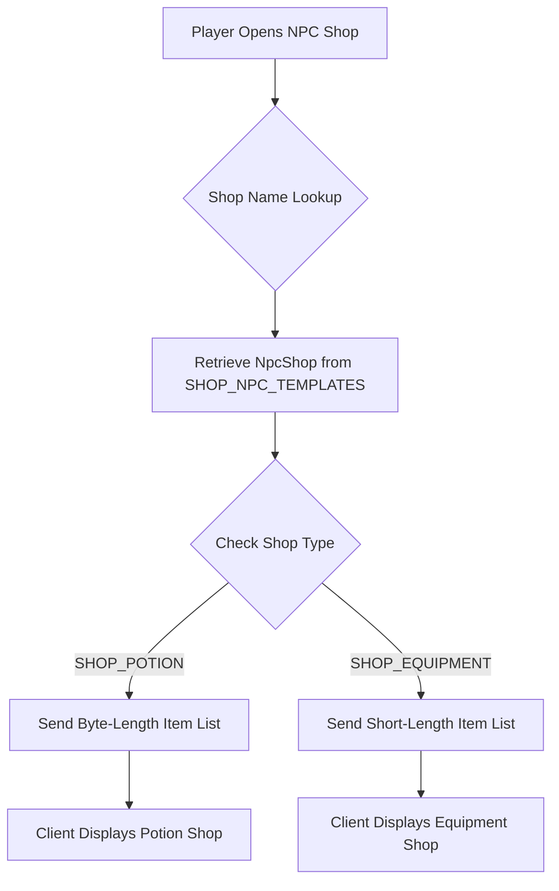
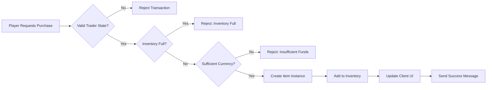

# NPC Shop System

<cite>
**Referenced Files in This Document**  
- [NpcShop.java](file://src/main/java/shop/NpcShop.java)
- [ShopService.java](file://src/main/java/services/ShopService.java)
- [ShopTemplate.java](file://src/main/java/template/ShopTemplate.java)
- [Manager.java](file://src/main/java/manager/Manager.java)
- [Const.java](file://src/main/java/consts/Const.java)
</cite>

## Table of Contents
1. [Introduction](#introduction)
2. [Shop Initialization and Configuration](#shop-initialization-and-configuration)
3. [Inventory Management and Template Data](#inventory-management-and-template-data)
4. [Pricing Logic and Currency Handling](#pricing-logic-and-currency-handling)
5. [Purchase Validation and Transaction Flow](#purchase-validation-and-transaction-flow)
6. [Anti-Exploit Measures](#anti-exploit-measures)
7. [Configuration Guide for New NPC Shops](#configuration-guide-for-new-npc-shops)
8. [Economic Balancing and Best Practices](#economic-balancing-and-best-practices)

## Introduction
The NPC Shop System enables dynamic in-game commerce through non-player characters (NPCs) that offer items for sale based on predefined templates and server configurations. This system supports multiple shop types including potion shops, equipment shops, and special item vendors. The core functionality is managed by the `ShopService` class, which orchestrates interactions between player requests, shop data, inventory systems, and currency validation. Shops are initialized from database templates and dynamically loaded based on NPC type and server state, ensuring flexibility in gameplay design and economic balance.

## Shop Initialization and Configuration

The NPC shop system initializes shops using template data loaded from the database during server startup. Each NPC shop is represented by the `NpcShop` class, which contains essential metadata such as shop ID, name, type, and a list of available item IDs.



**Diagram sources**  
- [NpcShop.java](file://src/main/java/shop/NpcShop.java#L1-L17)
- [ShopTemplate.java](file://src/main/java/template/ShopTemplate.java#L1-L26)
- [ShopService.java](file://src/main/java/services/ShopService.java#L1-L428)

**Section sources**  
- [NpcShop.java](file://src/main/java/shop/NpcShop.java#L1-L17)
- [ShopService.java](file://src/main/java/services/ShopService.java#L402-L427)
- [Manager.java](file://src/main/java/manager/Manager.java#L800-L1524)

## Inventory Management and Template Data

Shop inventories are dynamically loaded from database records and stored in memory using the `Manager` class. The `SHOP_NPC_TEMPLATES` ConcurrentHashMap maps shop names to their respective `NpcShop` instances, enabling fast lookup during gameplay.

When a player interacts with an NPC, the `openNpcShop` method in `ShopService` retrieves the appropriate `NpcShop` instance by name and sends its item list to the client. The shop type determines how items are serialized—potion shops use byte-length encoding while equipment shops use short-length encoding to accommodate larger item IDs.

Shop items are defined in the `shop_template` database table and loaded into the `SHOP_TEMPLATES` map during initialization. Each `ShopTemplate` entry specifies whether the item is sellable, its price, currency type, and references to specific equipment, potion, or gem templates.



**Diagram sources**  
- [Manager.java](file://src/main/java/manager/Manager.java#L800-L1524)
- [ShopService.java](file://src/main/java/services/ShopService.java#L402-L427)

**Section sources**  
- [Manager.java](file://src/main/java/manager/Manager.java#L800-L1524)
- [ShopService.java](file://src/main/java/services/ShopService.java#L402-L427)

## Pricing Logic and Currency Handling

Pricing logic is implemented within the `buyItemSpecial` and `buyItemNpcShop` methods of `ShopService`. Each shop item has a defined currency type specified in `typeMoney`, where 0 represents "xu" and 1 represents "luong" (standard and premium currencies respectively).

For equipment shops, pricing is determined by the `ItemEquipTemplate.getPrice()` method, while special items use prices defined directly in `ShopTemplate`. The system validates sufficient funds before proceeding with the transaction, automatically deducting the appropriate currency from the player's inventory.

```mermaid
sequenceDiagram
participant Player
participant ShopService
participant InventoryService
participant ItemService
Player->>ShopService : buyItemSpecial(idItem)
ShopService->>Manager : getShopTemplate(idItem)
Manager-->>ShopService : ShopTemplate
ShopService->>ShopService : Validate currency type
alt Insufficient Funds
ShopService->>Player : Send error message
deactivate Player
else Sufficient Funds
ShopService->>InventoryService : minusXu() or minusLuong()
InventoryService-->>ShopService : Success/Failure
alt Purchase Successful
ShopService->>ItemService : createNewItemEquipment()
ItemService-->>ShopService : ItemEquip
ShopService->>InventoryService : addItemBagEquipment()
InventoryService->>Player : Update inventory UI
ShopService->>Player : Send success message
end
end
```

**Diagram sources**  
- [ShopService.java](file://src/main/java/services/ShopService.java#L47-L73)
- [ShopTemplate.java](file://src/main/java/template/ShopTemplate.java#L1-L26)

**Section sources**  
- [ShopService.java](file://src/main/java/services/ShopService.java#L47-L73)
- [Const.java](file://src/main/java/consts/Const.java#L1-L114)

## Purchase Validation and Transaction Flow

The transaction flow begins when a player selects an item from an NPC shop interface. The `ShopService` validates multiple conditions before completing the purchase:

1. **Trader Status Check**: Players cannot make purchases while trading
2. **Inventory Space Verification**: Ensures the player has space in their inventory
3. **Currency Validation**: Confirms sufficient funds based on `typeMoney`
4. **Item Existence**: Verifies the requested item exists in templates
5. **Gender Restrictions**: Applies to certain cosmetic items

Upon successful validation, the system creates the appropriate item instance using `ItemService`, adds it to the player's inventory via `InventoryService`, and updates the client interface. The entire process is atomic—failure at any step rolls back the transaction and refunds currency if partially processed.



**Diagram sources**  
- [ShopService.java](file://src/main/java/services/ShopService.java#L402-L427)
- [InventoryService.java](file://src/main/java/services/InventoryService.java)

**Section sources**  
- [ShopService.java](file://src/main/java/services/ShopService.java#L402-L427)

## Anti-Exploit Measures

The system implements several safeguards against exploitation:

- **Duplicate Purchase Prevention**: The `getSundry().getTrader()` check prevents purchases during active trades
- **Inventory Overflow Protection**: Validates inventory space before currency deduction
- **Price Manipulation Defense**: Prices are server-side only and never trusted from client input
- **Ownership Validation**: In player-to-player transactions, verifies buyer and seller identities
- **Item State Validation**: Prevents selling locked or time-limited items

Additionally, the system includes rate limiting through server-side transaction queuing and validation of all item states before transfer. The `minusXu`, `minusLuong`, and `minusLuongKhoa` methods return boolean success indicators that must be validated before proceeding.

**Section sources**  
- [ShopService.java](file://src/main/java/services/ShopService.java#L402-L427)
- [DepositeService.java](file://src/main/java/services/DepositeService.java#L40-L69)

## Configuration Guide for New NPC Shops

To configure a new NPC shop:

1. **Add Shop Template**: Insert a record into the `shop_template` database table with:
   - Unique `id`
   - Appropriate `shopType` (0=POTION, 1=EQUIPMENT)
   - `typeMoney` (0=xu, 1=luong)
   - `isSell=true`
   - Reference to item template via `idItemEquip`, `idItemPotion`, or `idItemGem`

2. **Create NPC Shop Entry**: Add to `npc_shop` table:
   - `nameShop` (must match NPC interaction trigger)
   - `typeShop` (matches Const.SHOP_* values)
   - JSON array of item IDs in `items` field

3. **Server Restart**: Templates are loaded once at startup via `Manager.init()`

Example configuration for a potion shop:
```sql
INSERT INTO npc_shop (id, nameShop, typeShop, items) 
VALUES (1, 'AP_TEACHER', 0, '[1,2,3,4]');
```

**Section sources**  
- [Manager.java](file://src/main/java/manager/Manager.java#L800-L1524)
- [ShopTemplate.java](file://src/main/java/template/ShopTemplate.java#L1-L26)

## Economic Balancing and Best Practices

When designing NPC shops for balanced gameplay:

- **Tiered Pricing**: Align prices with item level and utility
- **Currency Distribution**: Use "xu" for common items, "luong" for rare/powerful items
- **Supply Limits**: Consider implementing stack limits (e.g., max 1000 potions)
- **Progression Gates**: Restrict high-tier items behind level or quest requirements
- **Inflation Control**: Monitor currency sinks vs. sources across the economy

The system supports three currency types: xu (standard), luong (premium), and luong_khoa (locked premium). Use these strategically to create meaningful economic choices and progression paths.

For optimal performance, ensure all shop templates are preloaded and cached in memory. Avoid frequent database queries during gameplay by leveraging the `Manager` class's static collections.

**Section sources**  
- [ShopService.java](file://src/main/java/services/ShopService.java#L47-L73)
- [Const.java](file://src/main/java/consts/Const.java#L1-L114)