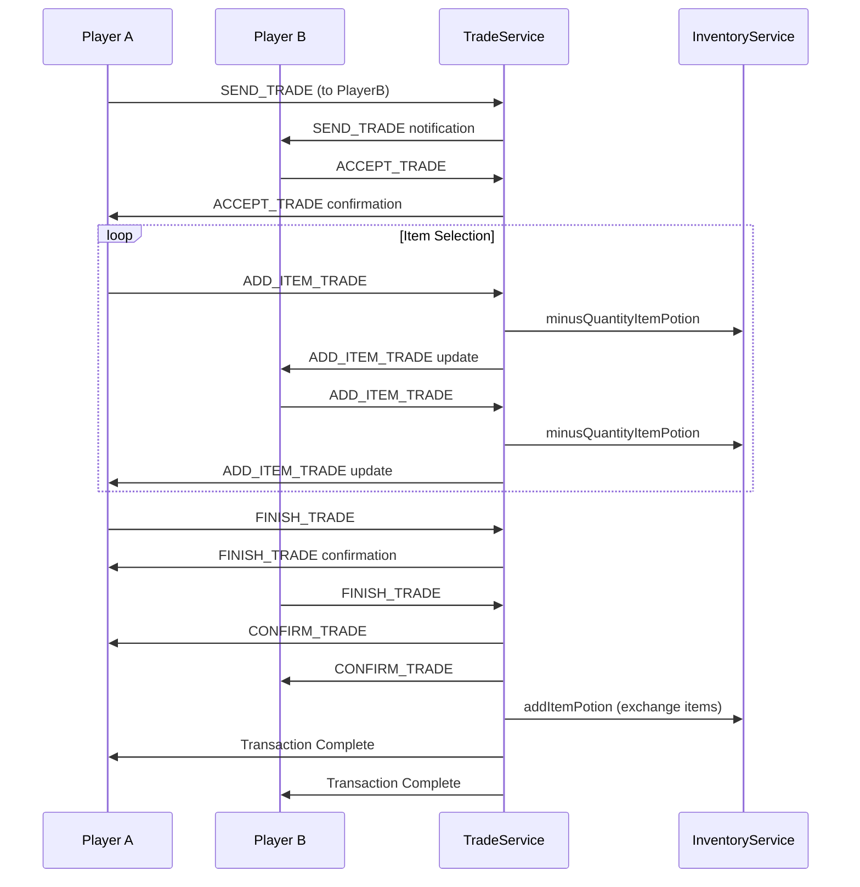
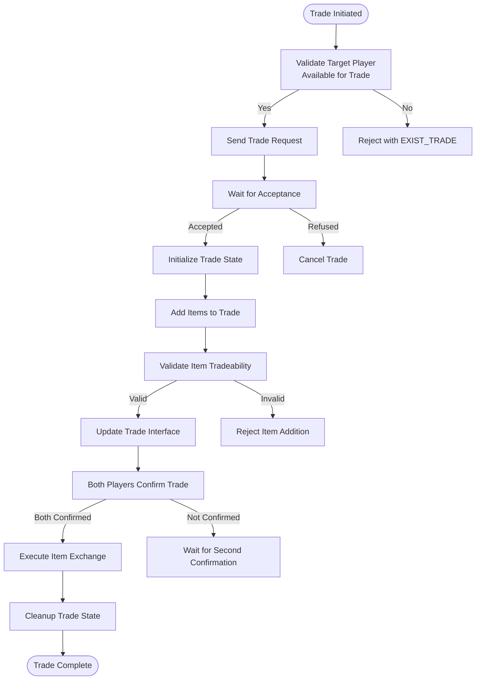
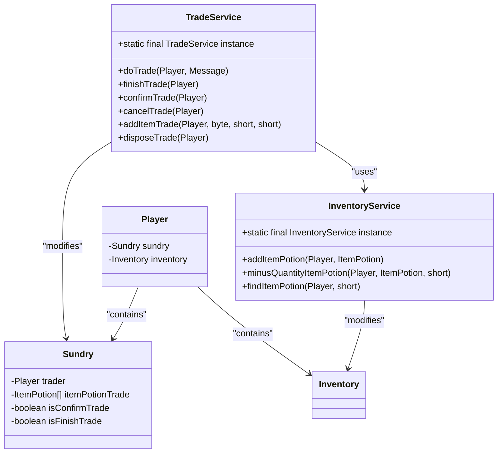
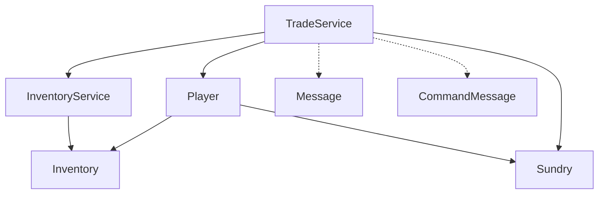

# Player Trading System

<cite>
**Referenced Files in This Document**   
- [TradeService.java](file://src/main/java/services/TradeService.java)
- [Sundry.java](file://src/main/java/player/Sundry.java)
- [InventoryService.java](file://src/main/java/services/InventoryService.java)
- [Player.java](file://src/main/java/player/Player.java)
- [Inventory.java](file://src/main/java/player/Inventory.java)
</cite>

## Table of Contents
1. [Introduction](#introduction)
2. [Project Structure](#project-structure)
3. [Core Components](#core-components)
4. [Architecture Overview](#architecture-overview)
5. [Detailed Component Analysis](#detailed-component-analysis)
6. [Dependency Analysis](#dependency-analysis)
7. [Performance Considerations](#performance-considerations)
8. [Troubleshooting Guide](#troubleshooting-guide)
9. [Conclusion](#conclusion)

## Introduction
This document provides a comprehensive analysis of the player-to-player trading system in the game server. It details the complete workflow from trade initiation to finalization, including inventory management, message handling, and transaction security. The system is designed to ensure data consistency, prevent race conditions, and handle disconnections gracefully. Special attention is given to the TradeService implementation, state synchronization, and conflict resolution mechanisms.

## Project Structure
The trading system is implemented across multiple packages with clear separation of concerns. The core trading logic resides in the services package, while player state and inventory management are handled by player-related classes. The system follows a modular architecture with well-defined interfaces between components.

```mermaid
graph TD
subgraph "Services"
TradeService[TradeService]
InventoryService[InventoryService]
end
subgraph "Player"
Player[Player]
Sundry[Sundry]
Inventory[Inventory]
end
TradeService --> Player
TradeService --> Sundry
InventoryService --> Player
InventoryService --> Inventory
Player --> Sundry
Player --> Inventory
```

**Diagram sources**
- [TradeService.java](file://src/main/java/services/TradeService.java#L1-L314)
- [Sundry.java](file://src/main/java/player/Sundry.java#L1-L169)
- [InventoryService.java](file://src/main/java/services/InventoryService.java#L1-L714)
- [Player.java](file://src/main/java/player/Player.java#L1-L310)
- [Inventory.java](file://src/main/java/player/Inventory.java)

**Section sources**
- [TradeService.java](file://src/main/java/services/TradeService.java#L1-L314)
- [Sundry.java](file://src/main/java/player/Sundry.java#L1-L169)

## Core Components
The player trading system consists of several key components that work together to facilitate secure and reliable item exchanges between players. The TradeService acts as the central coordinator, managing the entire trading workflow from initiation to completion. Player state is maintained through the Sundry class, which holds temporary trade data including the trading partner reference and items selected for trade. Inventory operations are handled by the InventoryService, which provides thread-safe methods for adding and removing items.

The system implements a two-phase commit pattern for trade finalization, requiring mutual confirmation from both parties before completing the transaction. This prevents unilateral trade completion and ensures both players agree to the exchange terms. Inventory locking is achieved by moving items to a temporary trade container in the Sundry object, preventing concurrent modifications during the trading process.

**Section sources**
- [TradeService.java](file://src/main/java/services/TradeService.java#L1-L314)
- [Sundry.java](file://src/main/java/player/Sundry.java#L1-L169)
- [InventoryService.java](file://src/main/java/services/InventoryService.java#L1-L714)

## Architecture Overview
The trading system follows a request-response architecture where all trading operations are initiated by client messages and processed by the server. The system maintains trading state in memory using the Sundry component attached to each player, ensuring that trade data is isolated and protected from concurrent access.



**Diagram sources**
- [TradeService.java](file://src/main/java/services/TradeService.java#L1-L314)
- [InventoryService.java](file://src/main/java/services/InventoryService.java#L1-L714)

## Detailed Component Analysis

### Trade Workflow Analysis
The trading system implements a multi-step workflow that ensures both players have opportunity to review and confirm the trade contents before finalization. The process begins with one player sending a trade request to another player in the same zone. The system validates that the target player is available for trading by checking their current trade status.



**Diagram sources**
- [TradeService.java](file://src/main/java/services/TradeService.java#L1-L314)
- [Sundry.java](file://src/main/java/player/Sundry.java#L1-L169)

**Section sources**
- [TradeService.java](file://src/main/java/services/TradeService.java#L1-L314)
- [Sundry.java](file://src/main/java/player/Sundry.java#L1-L169)

### Security and Consistency Mechanisms
The trading system implements several security mechanisms to prevent race conditions and ensure data consistency. The @Synchronized annotation on critical methods ensures thread-safe access to shared resources during trading operations. The system uses a temporary holding area in the Sundry object to store items during the trade process, effectively locking them from other operations.

When a player adds an item to the trade, the system immediately removes it from their inventory using InventoryService.minusQuantityItemPotion, but keeps a reference in the trade container. If the trade is cancelled or the player disconnects, these items are automatically returned to the inventory during the cleanup process. This approach prevents double-spending and ensures that items cannot be used in multiple concurrent transactions.

The two-phase confirmation process (FINISH_TRADE followed by CONFIRM_TRADE) ensures that both players must explicitly agree to the final trade contents. The system validates inventory space before finalizing the trade, preventing situations where one player cannot receive the items due to a full inventory.



**Diagram sources**
- [TradeService.java](file://src/main/java/services/TradeService.java#L1-L314)
- [Sundry.java](file://src/main/java/player/Sundry.java#L1-L169)
- [InventoryService.java](file://src/main/java/services/InventoryService.java#L1-L714)
- [Player.java](file://src/main/java/player/Player.java#L1-L310)

**Section sources**
- [TradeService.java](file://src/main/java/services/TradeService.java#L1-L314)
- [Sundry.java](file://src/main/java/player/Sundry.java#L1-L169)
- [InventoryService.java](file://src/main/java/services/InventoryService.java#L1-L714)

## Dependency Analysis
The trading system has well-defined dependencies between components, following the principle of dependency inversion. The TradeService depends on higher-level abstractions rather than concrete implementations, allowing for easier testing and maintenance. The system uses a service locator pattern with static instance fields to provide global access to service objects.



**Diagram sources**
- [TradeService.java](file://src/main/java/services/TradeService.java#L1-L314)
- [InventoryService.java](file://src/main/java/services/InventoryService.java#L1-L714)
- [Player.java](file://src/main/java/player/Player.java#L1-L310)
- [Sundry.java](file://src/main/java/player/Sundry.java#L1-L169)

**Section sources**
- [TradeService.java](file://src/main/java/services/TradeService.java#L1-L314)
- [InventoryService.java](file://src/main/java/services/InventoryService.java#L1-L714)

## Performance Considerations
The trading system is designed with performance in mind, particularly for high-concurrency environments. The use of @Synchronized annotations on critical methods ensures thread safety without requiring external synchronization mechanisms. However, this approach may create bottlenecks under heavy load as it synchronizes on the entire method.

The system limits trade items to 15 potion items, which helps control memory usage and network bandwidth. The direct manipulation of inventory collections (ArrayList) provides good performance for typical use cases, though it may benefit from more sophisticated data structures for larger inventories.

Message processing is optimized by using primitive types and avoiding unnecessary object creation. The system uses short identifiers for items and players, reducing network payload size. However, the current implementation processes each trade operation synchronously, which could lead to latency issues during peak usage periods.

Potential optimizations include:
- Implementing asynchronous trade processing
- Using concurrent collections instead of synchronization
- Adding caching for frequently accessed item templates
- Implementing batch processing for trade confirmations

**Section sources**
- [TradeService.java](file://src/main/java/services/TradeService.java#L1-L314)
- [InventoryService.java](file://src/main/java/services/InventoryService.java#L1-L714)

## Troubleshooting Guide
Common issues in the trading system typically involve state inconsistencies, network interruptions, or inventory conflicts. When diagnosing trading problems, check the following:

1. **Trade Initiation Failures**: Verify that both players are in the same zone and that the target player is not already trading. The EXIST_TRADE response indicates the target is busy.

2. **Item Addition Failures**: Ensure items are tradeable (template.isTrade() returns true) and that the player has sufficient quantity. The system blocks non-tradeable items and prevents adding items that would exceed the 15-item limit.

3. **Finalization Issues**: Check that both players have sufficient inventory space before trade confirmation. The system automatically cancels trades if either player's inventory is full.

4. **Disconnection Handling**: When a player disconnects during a trade, the system automatically cancels the trade and returns items to inventories through the Player.dispose() method.

5. **Race Conditions**: The @Synchronized methods should prevent most race conditions, but monitor for deadlocks in high-concurrency scenarios.

The system includes several safeguards against common failure scenarios:
- Automatic trade cancellation on disconnection
- Inventory validation before finalization
- Two-phase commit for mutual agreement
- Item return on trade cancellation

**Section sources**
- [TradeService.java](file://src/main/java/services/TradeService.java#L1-L314)
- [Player.java](file://src/main/java/player/Player.java#L1-L310)
- [Sundry.java](file://src/main/java/player/Sundry.java#L1-L169)

## Conclusion
The player trading system provides a robust framework for secure item exchanges between players. It implements proper state management, concurrency control, and error handling to ensure data consistency and prevent common issues like race conditions and inventory duplication. The system's modular design allows for easy maintenance and extension.

Key strengths include the two-phase confirmation process, automatic cleanup on disconnection, and immediate inventory locking during trades. Potential areas for improvement include performance optimization for high-concurrency scenarios and enhanced error reporting for users.

The system could be extended to support additional item types beyond potions by modifying the addItemTrade method and updating the message protocol. Currency trading could be implemented by adding xu (gold) fields to the trade state and updating the finalization logic accordingly.