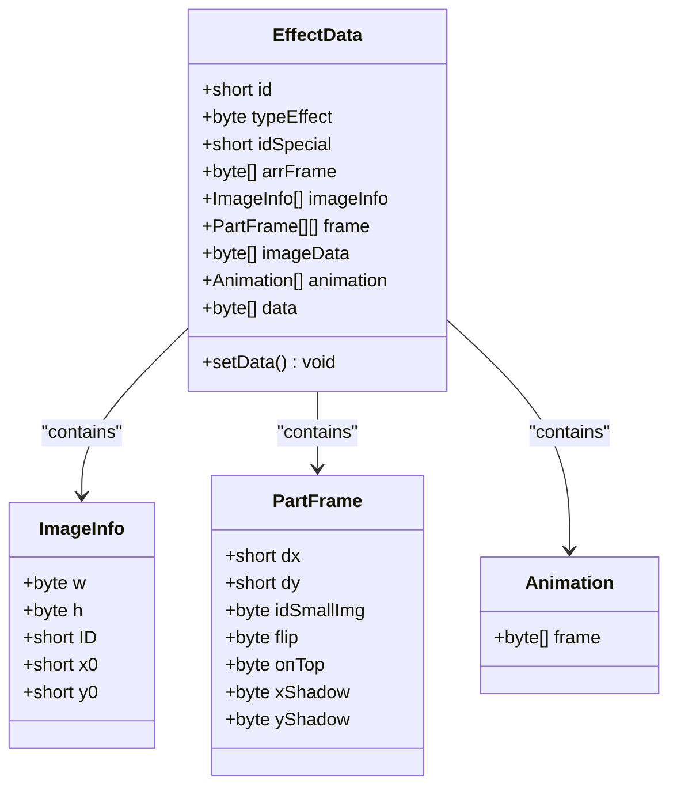
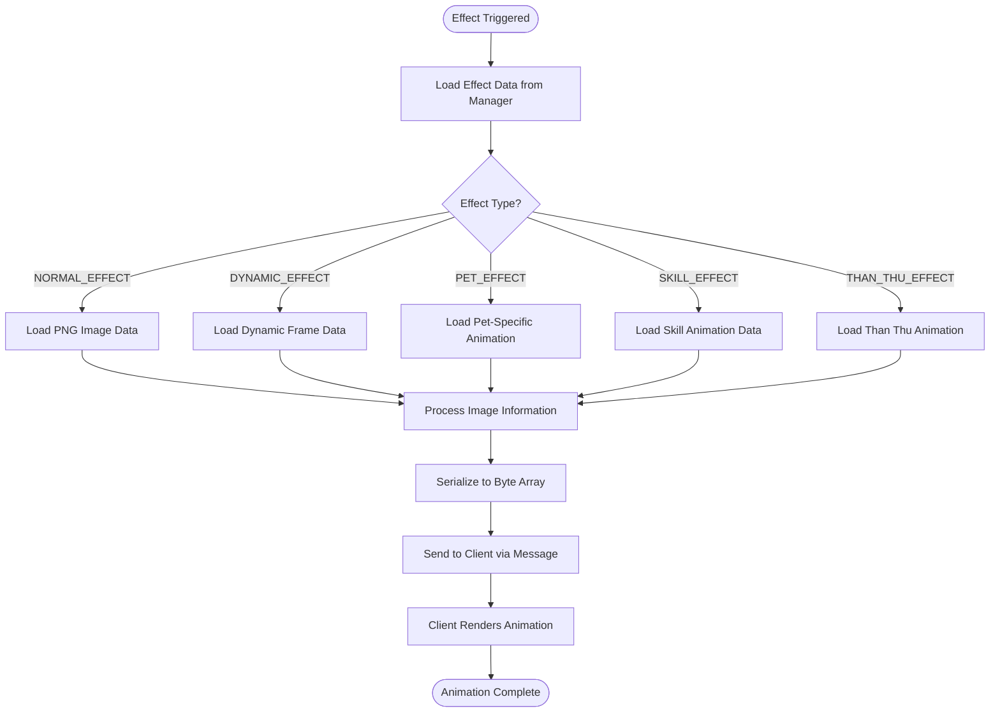
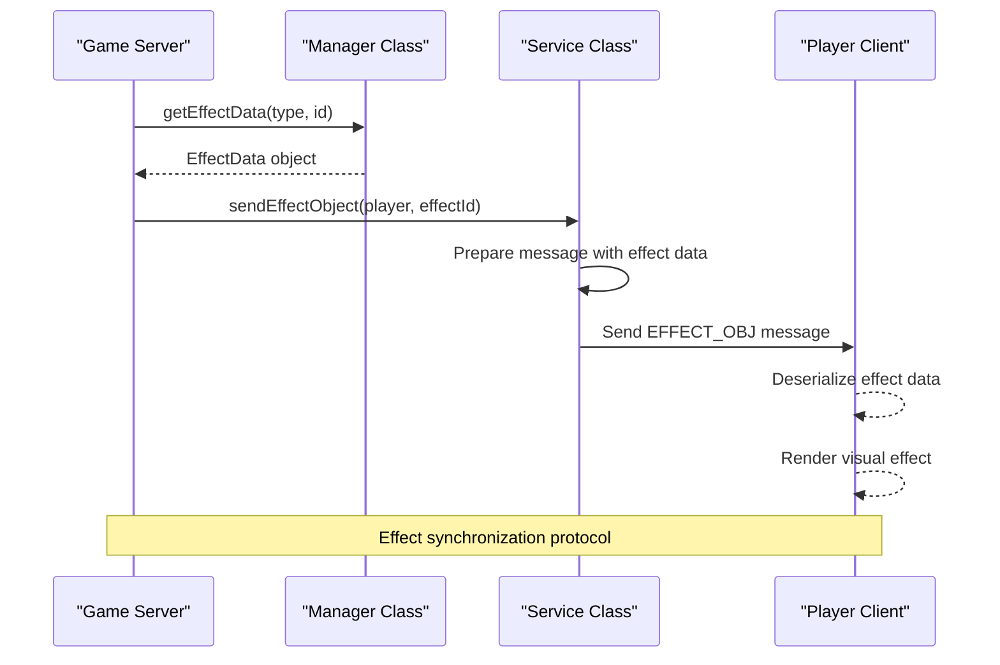
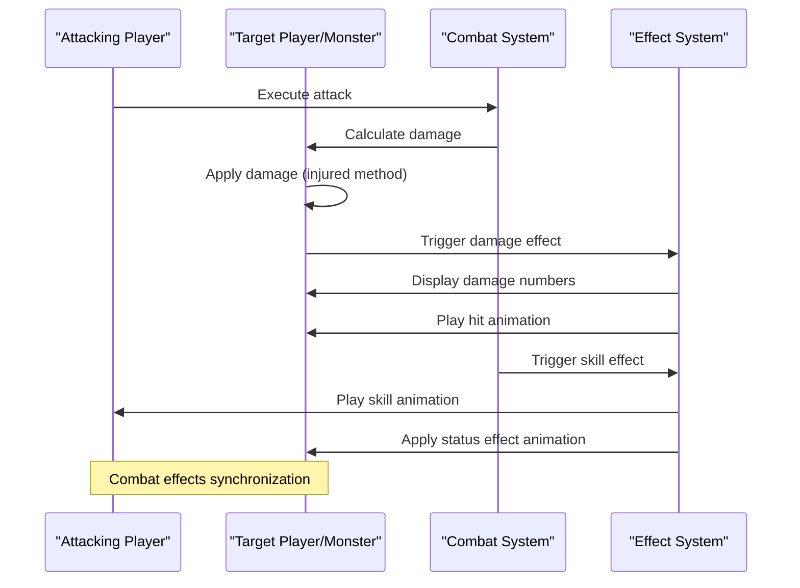
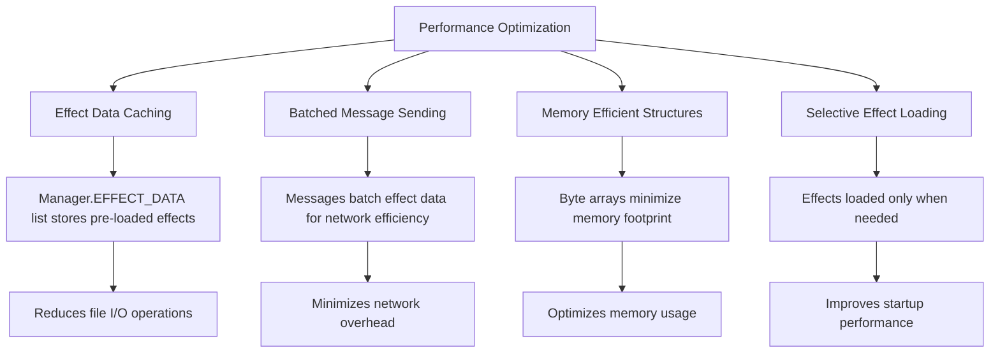
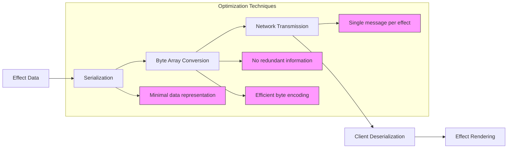

# Effects and Animation

<cite>
**Referenced Files in This Document**   
- [EffectData.java](file://src/main/java/effects/EffectData.java)
- [Animation.java](file://src/main/java/effects/Animation.java)
- [PartFrame.java](file://src/main/java/effects/PartFrame.java)
- [ImageInfo.java](file://src/main/java/effects/ImageInfo.java)
- [Manager.java](file://src/main/java/manager/Manager.java)
- [Service.java](file://src/main/java/services/Service.java)
- [Player.java](file://src/main/java/player/Player.java)
- [Const.java](file://src/main/java/consts/Const.java)
</cite>

## Table of Contents
1. [Introduction](#introduction)
2. [Effect Data Structure](#effect-data-structure)
3. [Animation System](#animation-system)
4. [Effect Types and Classification](#effect-types-and-classification)
5. [Server-Client Synchronization](#server-client-synchronization)
6. [Particle System Components](#particle-system-components)
7. [Combat Action Integration](#combat-action-integration)
8. [Performance Considerations](#performance-considerations)
9. [Network Bandwidth Implications](#network-bandwidth-implications)

## Introduction
The visual effects and character animation system in this game provides a comprehensive framework for rendering dynamic visual phenomena including spells, damage indicators, status effects, and character animations. The system is designed to synchronize visual effects between server and client while maintaining performance efficiency. This documentation details the architecture, data structures, and operational mechanics of the effects and animation subsystem.

## Effect Data Structure

The core of the visual effects system is the `EffectData` class, which encapsulates all necessary information for rendering visual effects. Each effect contains metadata, image data, frame information, and animation sequences that define its visual representation.



**Diagram sources**
- [EffectData.java](file://src/main/java/effects/EffectData.java#L1-L43)
- [ImageInfo.java](file://src/main/java/effects/ImageInfo.java#L1-L40)
- [PartFrame.java](file://src/main/java/effects/PartFrame.java#L1-L46)
- [Animation.java](file://src/main/java/effects/Animation.java#L1-L27)

**Section sources**
- [EffectData.java](file://src/main/java/effects/EffectData.java#L1-L145)

## Animation System

The animation system manages the sequence and timing of visual effects through frame-based animation data. Each animation consists of a series of frames that are rendered in sequence to create the illusion of motion. The system supports different animation types for various effect categories.



**Diagram sources**
- [EffectData.java](file://src/main/java/effects/EffectData.java#L45-L145)
- [Manager.java](file://src/main/java/manager/Manager.java#L1-L799)

**Section sources**
- [EffectData.java](file://src/main/java/effects/EffectData.java#L45-L145)

## Effect Types and Classification

The system categorizes effects into distinct types, each with specific rendering characteristics and data structures. These types determine how the effect data is serialized and interpreted by the client.

```mermaid
stateDiagram-v2
[*] --> NORMAL_EFFECT
[*] --> DYNAMIC_EFFECT
[*] --> PET_EFFECT
[*] --> SKILL_EFFECT
[*] --> THAN_THU_EFFECT
NORMAL_EFFECT --> "Static Image Effect"
DYNAMIC_EFFECT --> "Animated Effect with Multiple Parts"
PET_EFFECT --> "Pet-Specific Animation"
SKILL_EFFECT --> "Skill Execution Animation"
THAN_THU_EFFECT --> "Special Character Animation"
NORMAL_EFFECT : typeEffect = 0
DYNAMIC_EFFECT : typeEffect = 1
PET_EFFECT : typeEffect = 2
SKILL_EFFECT : typeEffect = 3
THAN_THU_EFFECT : typeEffect = 4
```

**Diagram sources**
- [EffectData.java](file://src/main/java/effects/EffectData.java#L45-L145)
- [Const.java](file://src/main/java/consts/Const.java)

**Section sources**
- [EffectData.java](file://src/main/java/effects/EffectData.java#L45-L145)

## Server-Client Synchronization

The effects system employs a client-server architecture where the server manages effect state and triggers, while the client handles rendering. Effects are synchronized through dedicated message protocols that transmit effect data from server to client.



**Diagram sources**
- [Service.java](file://src/main/java/services/Service.java#L30-L67)
- [Manager.java](file://src/main/java/manager/Manager.java#L1-L799)

**Section sources**
- [Service.java](file://src/main/java/services/Service.java#L30-L67)
- [Manager.java](file://src/main/java/manager/Manager.java#L1-L799)

## Particle System Components

The particle system is implemented through the `PartFrame` class, which defines individual components of composite visual effects. Each part frame represents a visual element with position, image reference, and rendering properties.

```mermaid
classDiagram
class PartFrame {
+short dx
+short dy
+byte idSmallImg
+byte flip
+byte onTop
+byte xShadow
+byte yShadow
}
class ImageInfo {
+byte w
+byte h
+short ID
+short x0
+short y0
}
class Animation {
+byte[] frame
}
EffectData {
+short id
+byte typeEffect
+PartFrame[][] frame
+Animation[] animation
}
EffectData --> PartFrame : "has multiple"
EffectData --> ImageInfo : "references"
EffectData --> Animation : "contains"
PartFrame --> ImageInfo : "uses image"
```

**Diagram sources**
- [PartFrame.java](file://src/main/java/effects/PartFrame.java#L1-L46)
- [EffectData.java](file://src/main/java/effects/EffectData.java#L1-L43)

**Section sources**
- [PartFrame.java](file://src/main/java/effects/PartFrame.java#L1-L46)

## Combat Action Integration

Visual effects are tightly integrated with combat mechanics, where specific actions trigger corresponding animations and effects. Damage calculations and status effects are accompanied by visual feedback to enhance player experience.



**Diagram sources**
- [Player.java](file://src/main/java/player/Player.java#L88-L115)
- [EffectData.java](file://src/main/java/effects/EffectData.java#L1-L43)

**Section sources**
- [Player.java](file://src/main/java/player/Player.java#L88-L115)

## Performance Considerations

The effects system is designed with performance optimization in mind, particularly for rendering multiple effects simultaneously. The architecture minimizes redundant data processing and leverages efficient data structures for effect management.



**Diagram sources**
- [Manager.java](file://src/main/java/manager/Manager.java#L1-L799)
- [EffectData.java](file://src/main/java/effects/EffectData.java#L1-L43)

**Section sources**
- [Manager.java](file://src/main/java/manager/Manager.java#L1-L799)

## Network Bandwidth Implications

The effect synchronization system is designed to minimize network bandwidth usage while maintaining visual fidelity. Effect data is compressed and transmitted efficiently between server and client.



**Diagram sources**
- [Service.java](file://src/main/java/services/Service.java#L30-L67)
- [EffectData.java](file://src/main/java/effects/EffectData.java#L45-L145)

**Section sources**
- [Service.java](file://src/main/java/services/Service.java#L30-L67)