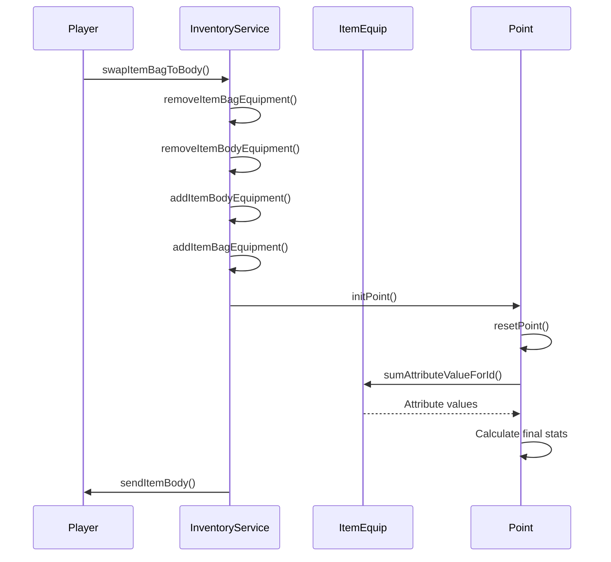

# Equipment Management

<cite>
**Referenced Files in This Document**   
- [Inventory.java](file://src/main/java/player/Inventory.java)
- [ItemEquip.java](file://src/main/java/item/ItemEquip.java)
- [InventoryService.java](file://src/main/java/services/InventoryService.java)
- [Point.java](file://src/main/java/player/Point.java)
- [ItemEquipConst.java](file://src/main/java/consts/ItemEquipConst.java)
</cite>

## Table of Contents
1. [Equipment Slot Structure](#equipment-slot-structure)
2. [Equipping and Unequipping Process](#equipping-and-unequipping-process)
3. [ItemEquip Class Structure](#itemequip-class-structure)
4. [Stat Calculation and Point System](#stat-calculation-and-point-system)
5. [Common Issues and Concurrency](#common-issues-and-concurrency)

## Equipment Slot Structure

The equipment management subsystem organizes player gear through the `Inventory` class, which maintains separate collections for different types of items. Equipment currently worn by the player is stored in the `itemBody` list, which serves as the primary equipment slot container.

The system supports multiple equipment categories through type-based identification rather than separate slot fields. The `ItemEquipConst` class defines constants for various equipment types that determine their placement and functionality:

- **Weapon types**: VU_KHI_KIEM (sword), VU_KHI_DAO (dagger), VU_KHI_BUT (brush), VU_KHI_BUA (mace), VU_KHI_CUNG (bow)
- **Armor types**: AO (armor), QUAN (pants), MU (hat), GIAY (shoes), GANG (gloves)
- **Accessory types**: NHAN (ring), DAY_CHUYEN (necklace), NGOC (jewel)

Each equipment type is identified by a byte constant, and the system uses these type identifiers to determine which items can occupy specific visual and functional slots on the character. The inventory structure allows multiple items of the same type to exist in the bag (`itemBag`), but only one item per type can be equipped in the `itemBody` at any given time.

The inventory also maintains separate collections for other item types including `itemPotion`, `itemGem`, `itemQuest`, and `itemAnimal`, ensuring clear separation between equipment and consumable or companion items.

**Section sources**
- [Inventory.java](file://src/main/java/player/Inventory.java#L18-L244)
- [ItemEquipConst.java](file://src/main/java/consts/ItemEquipConst.java#L6-L102)

## Equipping and Unequipping Process

The equipment management process is handled through the `InventoryService` class, which provides synchronized methods for adding, removing, and swapping equipment items. The core operations follow a transactional pattern to ensure data consistency during equipment changes.

When equipping an item, the process begins with validation checks to ensure the player meets requirements such as class restrictions, level requirements, and equipment compatibility. The `addItemBodyEquipment` method adds an item to the equipped collection, while `removeItemBodyEquipment` removes an item from the equipped state.

The system implements a swap operation through the `swapItemBagToBody` method, which performs the following sequence:
1. Remove the item from the bag (`removeItemBagEquipment`)
2. Remove the currently equipped item (`removeItemBodyEquipment`)
3. Add the new item to equipment (`addItemBodyEquipment`)
4. Add the old equipment to the bag (`addItemBagEquipment`)

This atomic swap prevents inventory corruption during equipment changes. The methods are annotated with `@Synchronized` to prevent race conditions in the virtual thread environment, ensuring that only one equipment operation can modify a player's inventory at a time.

After successful equipment changes, the system recalculates player stats through the `initPoint` method in the `Point` class and broadcasts the updated equipment state to clients via the `sendItemBody` method, which constructs a network message containing the current equipment configuration.

**Section sources**
- [InventoryService.java](file://src/main/java/services/InventoryService.java#L27-L712)
- [Inventory.java](file://src/main/java/player/Inventory.java#L18-L244)

## ItemEquip Class Structure

The `ItemEquip` class represents equipped items with a comprehensive set of attributes that define their functionality and appearance. Key attributes include:

- **idItem**: Unique identifier for tracking the item instance
- **template**: Reference to `ItemEquipTemplate` defining base properties
- **plusTemplate**: Enhancement level of the equipment
- **classChar**: Character class restriction (0-4)
- **isLock**: Boolean indicating if the item is locked
- **durable/mDurable**: Current and maximum durability values
- **level**: Equipment level
- **colorName**: Visual color designation
- **viTriVe**: Position variant for visual representation
- **he**: Elemental affinity (thủy, mộc, hỏa, thổ, kim)
- **rank**: Quality rank (nhất phẩm to ngũ phẩm)
- **damageType**: PHYSIC, MAGIC, or NONE
- **nameCharSeal**: Sealed character name
- **itemAttributes**: List of `Attribute` objects providing stat bonuses
- **dayUse**: Duration of use in days
- **timeCreateItem**: Timestamp of item creation
- **isKichNguHanh**: Flag indicating elemental activation status

The class provides utility methods for determining equipment categories:
- `isWeapon()`: Checks if the item is a weapon type
- `isArmor()`: Checks if the item is an armor type  
- `isJewelry()`: Checks if the item is an accessory
- `isAnimalArmor()`: Checks if the item is for mount equipment

Durability management is handled through the `minusDurable()` method, which decrements both maximum and current durability values according to a 10:1 ratio, providing a gradual degradation system.

**Section sources**
- [ItemEquip.java](file://src/main/java/item/ItemEquip.java#L21-L182)
- [ItemEquipConst.java](file://src/main/java/consts/ItemEquipConst.java#L6-L102)

## Stat Calculation and Point System

The equipment system integrates with the `Point` class to modify player statistics through the attribute system. When equipment is changed, the `initPoint()` method recalculates all player stats by summing attribute values from equipped items.

The stat calculation process follows this workflow:
1. Reset all calculated stats to base values
2. Sum attribute values from all equipped items using `sumAttributeValueForId()`
3. Apply class-specific multipliers and bonuses
4. Update final stat values

Key stat modifications include:
- **Attack**: Modified by strength, spirit, or agility based on class, plus attack bonuses from equipment
- **Defense**: Increased by agility and defense attributes from armor
- **HP/MP**: Scaled by health and spirit stats with equipment bonuses
- **Critical rate**: Enhanced by luck and critical chance attributes
- **Accuracy and dodge**: Modified by agility and corresponding attributes

The `getValue(short idAtt)` method in `ItemEquip` retrieves attribute values, applying special rules such as disabling certain attributes when elemental activation (`kichNguHanh`) conditions are not met. Percentage-based attributes are properly scaled (divided by 10) when necessary.

Stat recalculation is triggered automatically after equipment changes, ensuring that player capabilities reflect their current gear. The system also handles special cases like mount equipment, which provides additional stat bonuses when a player's mount is equipped with appropriate gear.

**Diagram sources**
- [InventoryService.java](file://src/main/java/services/InventoryService.java#L27-L712)
- [Point.java](file://src/main/java/player/Point.java#L21-L591)
- [ItemEquip.java](file://src/main/java/item/ItemEquip.java#L21-L182)

**Section sources**
- [Point.java](file://src/main/java/player/Point.java#L21-L591)
- [InventoryService.java](file://src/main/java/services/InventoryService.java#L27-L712)

## Common Issues and Concurrency

The equipment management system addresses several common issues through validation and synchronization mechanisms.

**Stat desync** can occur when client and server states diverge after equipment changes. The system prevents this by broadcasting the complete equipment state after each change operation and recalculating stats server-side before sending updates. The `sendItemBody()` method ensures clients receive the authoritative equipment configuration.

**Invalid equipment combinations** are prevented through multiple validation layers:
- Class restrictions via the `classChar` field
- Type-specific equipment rules enforced in the swap methods
- Elemental compatibility checks in `isKichNguHanh()`
- Rank and quality constraints defined in `ItemEquipConst`

**Concurrency issues** in the virtual thread environment are mitigated through:
- `@Synchronized` annotations on all inventory modification methods
- Atomic swap operations that maintain inventory consistency
- Proper ordering of remove/add operations to prevent temporary invalid states
- Thread-safe collection modifications

The system also handles edge cases such as inventory overflow (checking `isFullInventory()`), durability exhaustion, and proper cleanup of equipment references when items are removed. The virtual thread implementation in `ExecutorVirtualThread` ensures that equipment operations are processed efficiently without blocking other game systems.

**Section sources**
- [InventoryService.java](file://src/main/java/services/InventoryService.java#L27-L712)
- [Inventory.java](file://src/main/java/player/Inventory.java#L18-L244)
- [manager/ExecutorVirtualThread.java](file://src/main/java/manager/ExecutorVirtualThread.java)