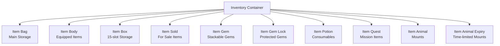
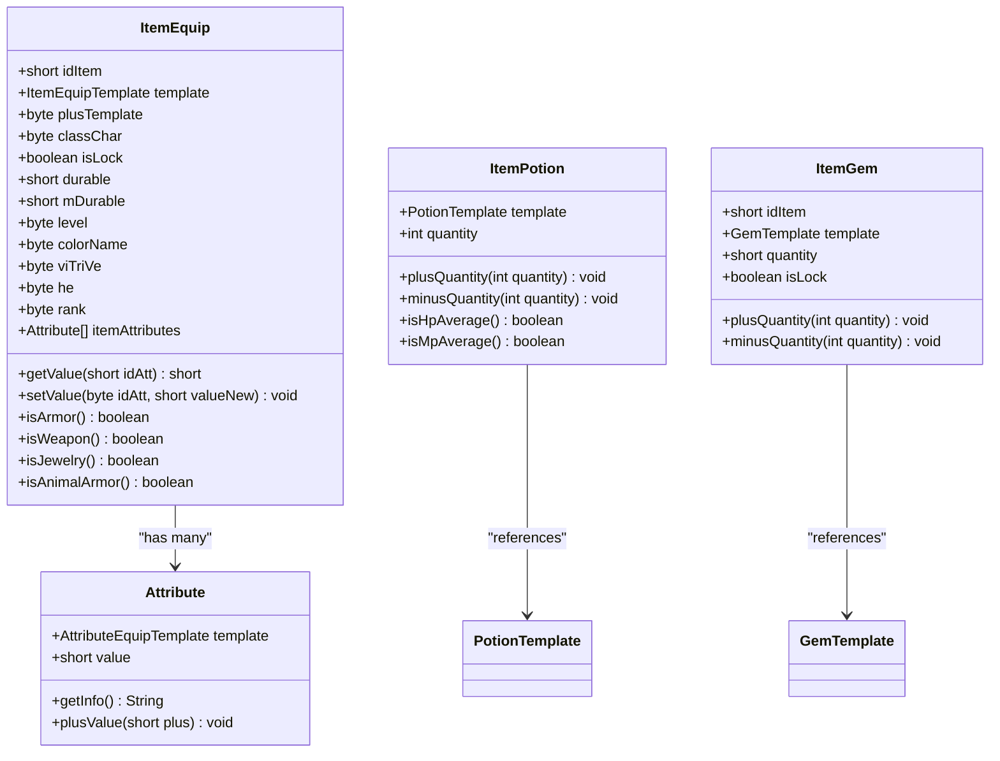
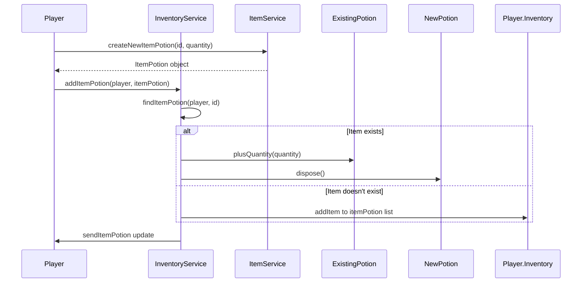
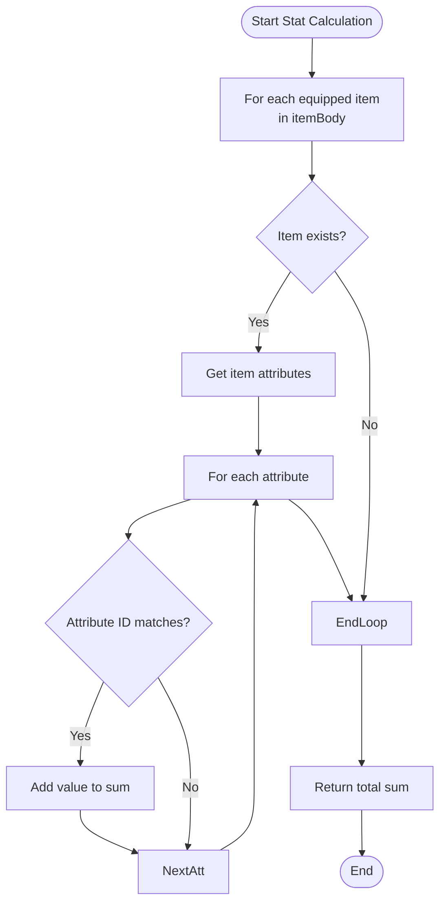
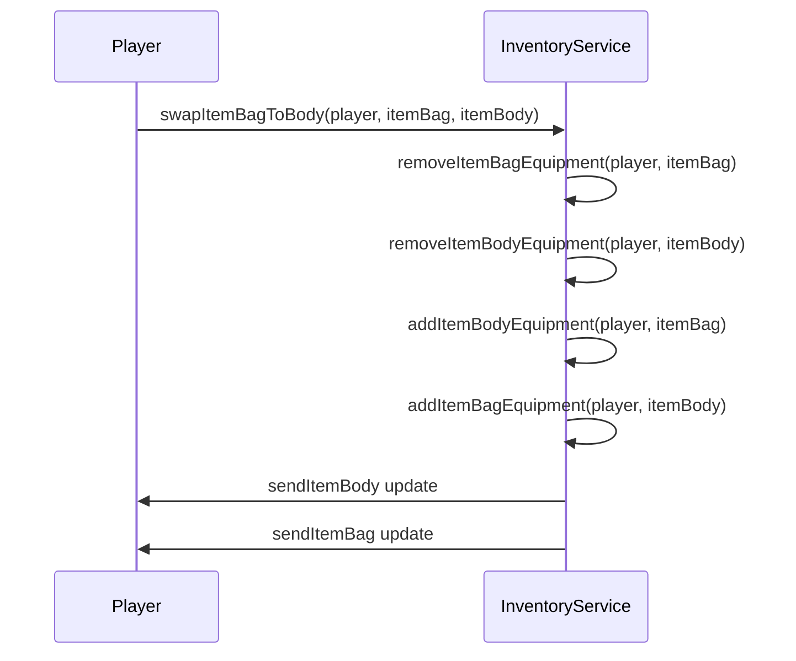
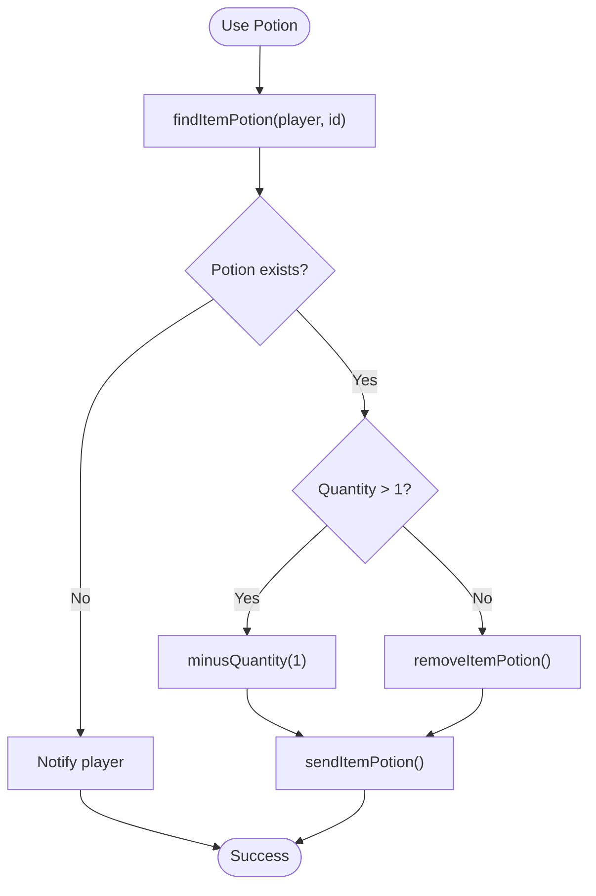
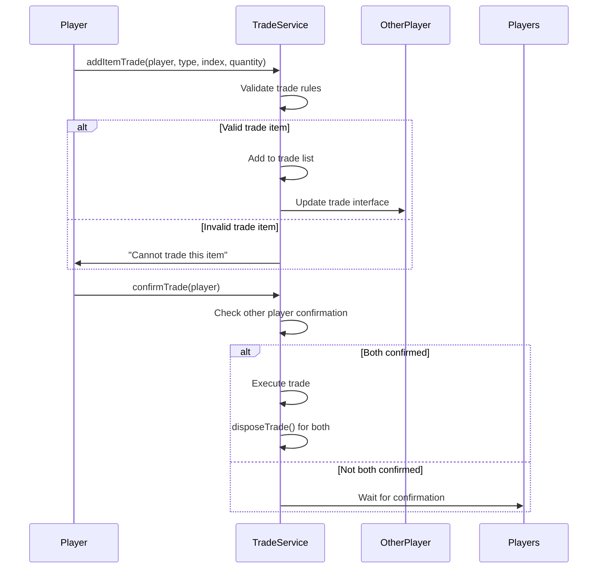

# Inventory System

<cite>
**Referenced Files in This Document**   
- [Inventory.java](file://src/main/java/player/Inventory.java)
- [InventoryService.java](file://src/main/java/services/InventoryService.java)
- [ItemEquip.java](file://src/main/java/item/ItemEquip.java)
- [Point.java](file://src/main/java/player/Point.java)
- [ItemPotion.java](file://src/main/java/item/ItemPotion.java)
- [ItemGem.java](file://src/main/java/item/ItemGem.java)
- [Attribute.java](file://src/main/java/item/Attribute.java)
- [ManufactureService.java](file://src/main/java/services/ManufactureService.java)
- [TradeService.java](file://src/main/java/services/TradeService.java)
- [DepositeService.java](file://src/main/java/services/DepositeService.java)
</cite>

## Table of Contents
1. [Introduction](#introduction)
2. [Inventory Structure](#inventory-structure)
3. [Item Hierarchy and Types](#item-hierarchy-and-types)
4. [Item Acquisition and Usage](#item-acquisition-and-usage)
5. [Equipment Stat Calculation System](#equipment-stat-calculation-system)
6. [Common Operations](#common-operations)
7. [Storage and Transfer Mechanisms](#storage-and-transfer-mechanisms)
8. [Error Handling and Security](#error-handling-and-security)
9. [Conclusion](#conclusion)

## Introduction
The inventory system in this game manages all player-held items, including equipment, consumables, gems, and special items. It supports multiple storage areas, dynamic stat calculation based on equipped items, and secure trading mechanisms. The system is designed to handle item stacking, durability, repair, and attribute bonuses while preventing common issues like overflow and duplication.

**Section sources**
- [Inventory.java](file://src/main/java/player/Inventory.java#L0-L49)
- [InventoryService.java](file://src/main/java/services/InventoryService.java#L0-L45)

## Inventory Structure
The inventory system consists of multiple storage compartments, each serving a specific purpose:

- **Item Bag**: Main inventory space for equipment and items
- **Equipment Slots (ItemBody)**: Worn equipment affecting player stats
- **Box Storage (ItemBox)**: Limited-size storage (max 15 items)
- **Gem Inventory (ItemGem)**: Stackable gem storage
- **Locked Gems (ItemGemLock)**: Protected gem storage
- **Potions (ItemPotion)**: Consumable items with stackable quantities
- **Quest Items (ItemQuest)**: Mission-specific items
- **Sold Items (ItemSold)**: Temporary storage for items offered for sale

The system uses a `limItemBag` multiplier to determine maximum inventory capacity, calculated as `42 * limItemBag`. When checking for full inventory, the system sums all non-equipment item counts.

**Diagram sources**
- [Inventory.java](file://src/main/java/player/Inventory.java#L0-L49)
- [InventoryService.java](file://src/main/java/services/InventoryService.java#L0-L45)

**Section sources**
- [Inventory.java](file://src/main/java/player/Inventory.java#L0-L49)
- [Inventory.java](file://src/main/java/player/Inventory.java#L128-L177)

## Item Hierarchy and Types
The system implements a hierarchical item classification with distinct behaviors:

### Equipment Items
Equipment items (ItemEquip) include weapons, armor, jewelry, and animal armor. Each has:
- Durability system with repair functionality
- Attribute bonuses through embedded attributes
- Color coding and ranking system
- Elemental affinity (he) and enhancement tracking
- Position-specific wear slots

### Potions
Potion items (ItemPotion) are consumables with:
- Stackable quantities
- Automatic merging when adding duplicates
- Quantity management with automatic removal when depleted
- Special handling for HP/MP recovery potions

### Gems
Gem items (ItemGem) feature:
- Stackable quantities
- Lock/unlock state management
- Separate storage for locked and unlocked gems
- Automatic merging of same-type gems

### Other Item Types
- **Quest Items**: Mission-specific items with quantity tracking
- **Animal Items**: Mounts with temporary and permanent variants
- **Currency**: Xu, Luong, and LuongKhoa with dedicated balance tracking

**Diagram sources**
- [ItemEquip.java](file://src/main/java/item/ItemEquip.java#L0-L183)
- [ItemPotion.java](file://src/main/java/item/ItemPotion.java#L0-L59)
- [ItemGem.java](file://src/main/java/item/ItemGem.java#L0-L52)
- [Attribute.java](file://src/main/java/item/Attribute.java#L0-L54)

**Section sources**
- [ItemEquip.java](file://src/main/java/item/ItemEquip.java#L0-L183)
- [ItemPotion.java](file://src/main/java/item/ItemPotion.java#L0-L59)
- [ItemGem.java](file://src/main/java/item/ItemGem.java#L0-L52)

## Item Acquisition and Usage
The system handles item acquisition through various methods:

### Item Creation
Items are created through the ItemService with specific templates:
- Equipment: `createNewItemEquipment(short id, byte classChar, byte... typeDamages)`
- Potions: `createNewItemPotion(short id, int quantity)`
- Gems: `createNewItemGem(short id, short quantity)`
- Animals: `createNewItemAnimal(short id)`

### Item Addition
When adding items to inventory:
- Potions and gems are automatically merged if they already exist
- New items are assigned unique IDs through the `initIdItem` system
- Equipment items are added to appropriate containers (bag, body, box)

### Item Usage
Consumable items like potions are used through dedicated service methods:
- Quantity is decremented on use
- Items are automatically removed when quantity reaches zero
- Usage is tracked through `lastTimeUsePotion` array

**Diagram sources**
- [InventoryService.java](file://src/main/java/services/InventoryService.java#L162-L196)
- [ItemService.java](file://src/main/java/services/ItemService.java#L82-L114)

**Section sources**
- [InventoryService.java](file://src/main/java/services/InventoryService.java#L162-L196)
- [ItemService.java](file://src/main/java/services/ItemService.java#L82-L114)

## Equipment Stat Calculation System
The system calculates player attributes based on equipped items through a comprehensive stat summation process:

### Stat Aggregation
The `sumAttributeValueForId` method in InventoryService aggregates attribute values from all equipped items:

**Diagram sources**
- [InventoryService.java](file://src/main/java/services/InventoryService.java#L225-L262)

### Player Attribute Calculation
The Point class calculates final player stats by combining:
- Base attributes (strength, agility, spirit, health, luck)
- Equipment bonuses from `sumAttributeValueForId`
- Class-specific multipliers
- Mount and pet bonuses

Key calculations include:
- **Attack**: Based on class (strength for warriors, spirit for mages)
- **Defense**: Agility-based with equipment bonuses
- **HP Max**: Health × class multiplier + equipment bonuses
- **MP Max**: Spirit × class multiplier + equipment bonuses
- **Critical Chance**: Luck/20 + equipment bonuses

**Section sources**
- [Point.java](file://src/main/java/player/Point.java#L127-L288)
- [InventoryService.java](file://src/main/java/services/InventoryService.java#L225-L262)

## Common Operations
The system supports several common inventory operations:

### Equipping Armor
When equipping armor, the system swaps items between bag and body slots:

**Diagram sources**
- [InventoryService.java](file://src/main/java/services/InventoryService.java#L0-L45)

### Using Potions
Potion usage follows a stack-aware pattern:

**Diagram sources**
- [InventoryService.java](file://src/main/java/services/InventoryService.java#L162-L196)

### Combining Items
Item combination occurs through the ManufactureService, which handles crafting operations including weapon and armor creation using specified materials and recipes.

**Section sources**
- [InventoryService.java](file://src/main/java/services/InventoryService.java#L0-L45)
- [InventoryService.java](file://src/main/java/services/InventoryService.java#L162-L196)
- [ManufactureService.java](file://src/main/java/services/ManufactureService.java#L412-L434)

## Storage and Transfer Mechanisms
The system implements several storage and transfer features:

### Box Storage
Players can store up to 15 items in a personal box:
- Items moved from bag to box with `addItemBoxEquipment`
- Maximum capacity enforced at 15 items
- Items retrieved with `getItemEquipmentFromBox`

### Trading System
The TradeService manages secure item transfers:
- Items cannot be directly traded (ADD_ITEM_EQUIP blocked)
- Trade confirmation required from both parties
- Secure transaction completion with proper cleanup

### Depositing Items
Items can be deposited for sale through DepositeService:
- Items placed in temporary sale inventory
- Purchase handled through ShopService
- Secure removal after sale completion

**Diagram sources**
- [InventoryService.java](file://src/main/java/services/InventoryService.java#L42-L75)
- [TradeService.java](file://src/main/java/services/TradeService.java#L128-L168)
- [DepositeService.java](file://src/main/java/services/DepositeService.java#L88-L114)

**Section sources**
- [InventoryService.java](file://src/main/java/services/InventoryService.java#L42-L75)
- [TradeService.java](file://src/main/java/services/TradeService.java#L128-L168)
- [DepositeService.java](file://src/main/java/services/DepositeService.java#L88-L114)

## Error Handling and Security
The system includes several safeguards against common issues:

### Inventory Overflow
- Box storage limited to 15 items with "Rương đầy" message
- Full inventory check before retrieving items from box
- Dynamic inventory size based on `limItemBag` multiplier

### Item Duplication Prevention
- Proper disposal of temporary item objects
- Synchronized access to inventory modification methods
- Unique ID assignment system for items
- Proper cleanup during trade cancellation

### Secure Transfer
- Trade confirmation required from both parties
- Validation of item existence before transfer
- Proper error handling for insufficient funds or space
- Session-based security checks

### Repair System
- Cost calculation based on item prices
- Currency validation before repair
- Full or partial repair options
- Durability restoration to maximum values

**Section sources**
- [InventoryService.java](file://src/main/java/services/InventoryService.java#L42-L75)
- [InventoryService.java](file://src/main/java/services/InventoryService.java#L126-L163)
- [TradeService.java](file://src/main/java/services/TradeService.java#L128-L168)

## Conclusion
The inventory system provides a comprehensive framework for managing player items with support for multiple storage types, equipment stat calculation, and secure trading. Key features include stackable consumables, durable equipment with repair mechanics, and a robust attribute system that dynamically affects player capabilities. The system prevents common issues like overflow and duplication through careful state management and validation, ensuring a stable and secure player experience.