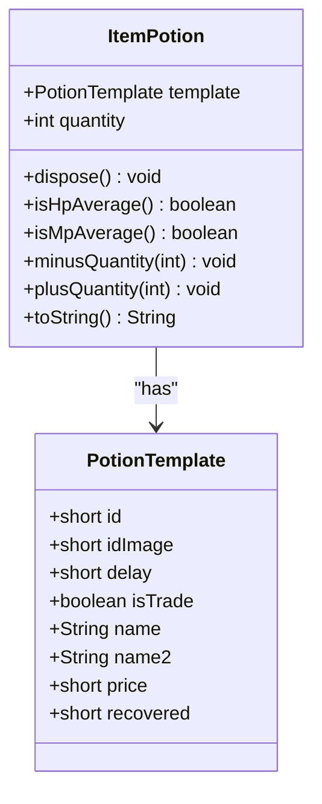
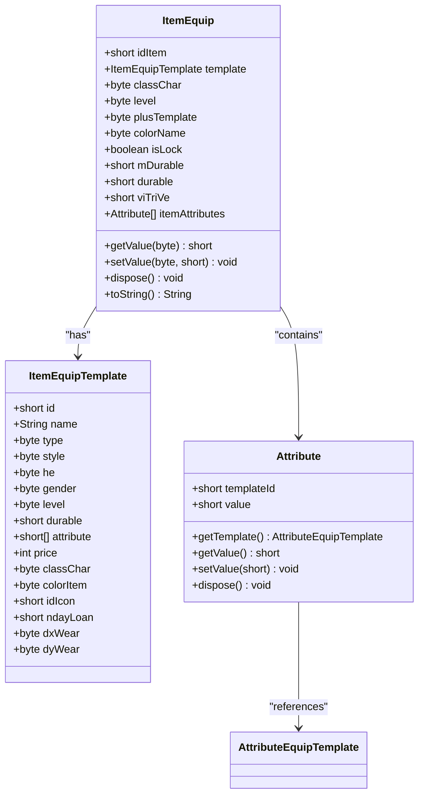
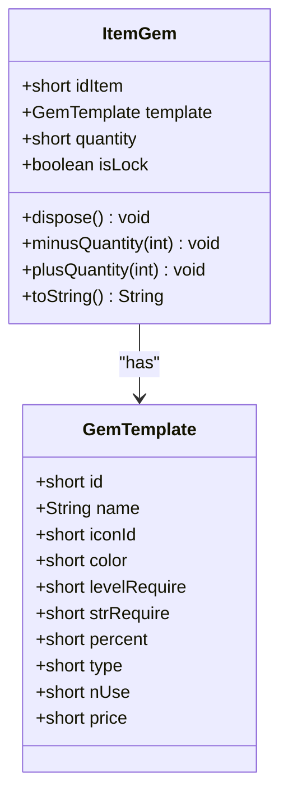
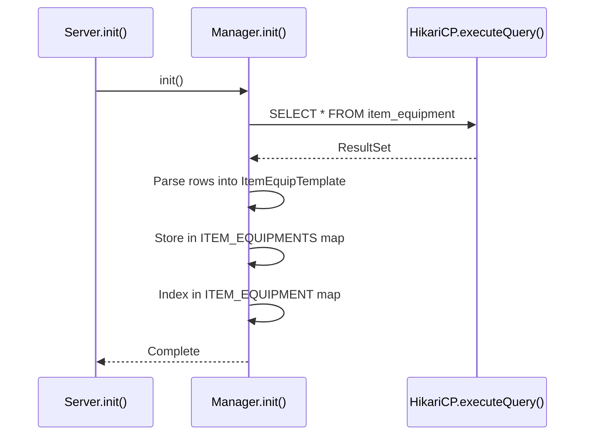
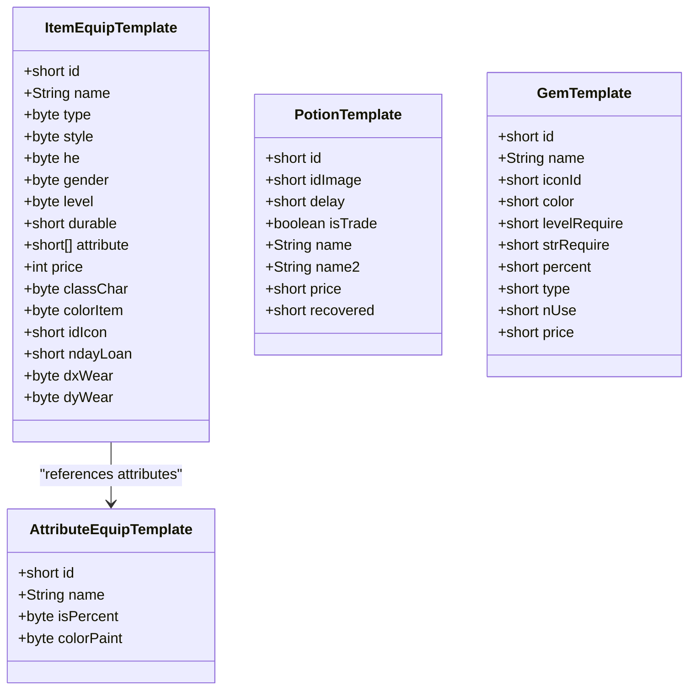
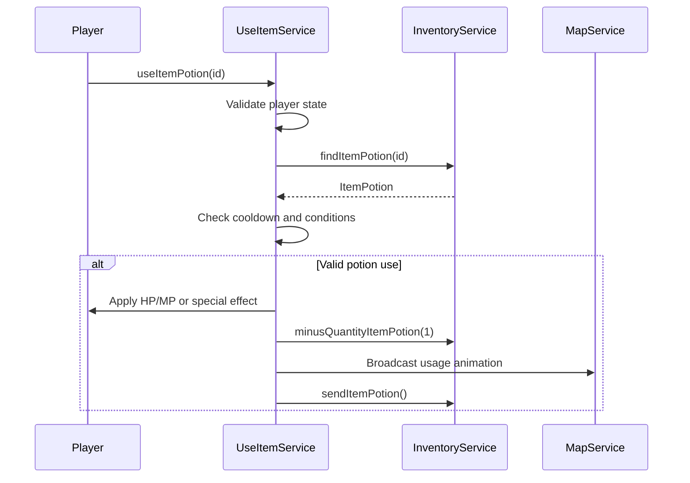
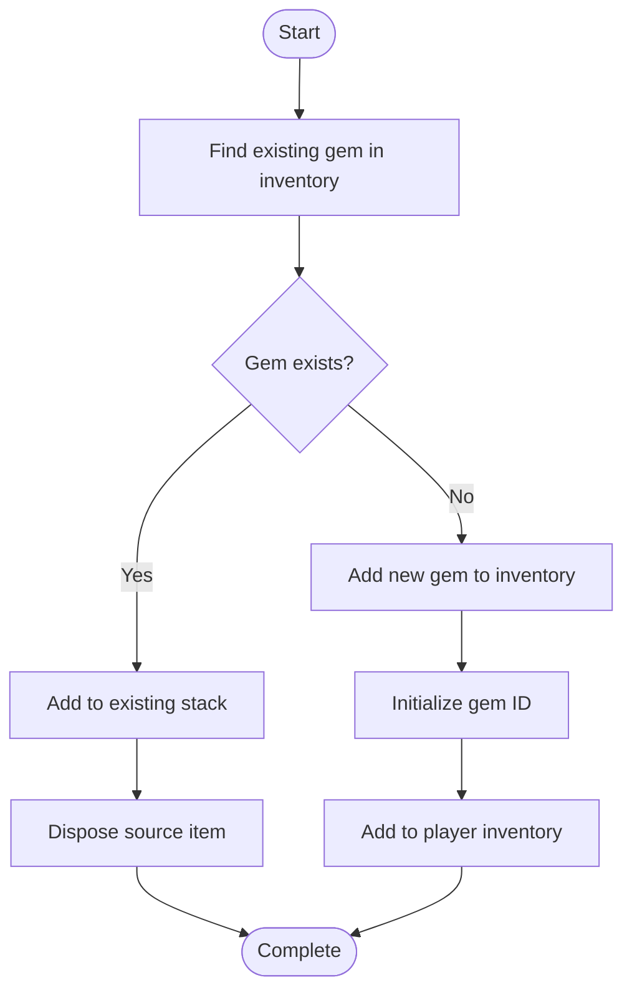

# Item Types and Behaviors

<cite>
**Referenced Files in This Document**   
- [ItemPotion.java](file://src/main/java/item/ItemPotion.java)
- [ItemEquip.java](file://src/main/java/item/ItemEquip.java)
- [ItemGem.java](file://src/main/java/item/ItemGem.java)
- [UseItemService.java](file://src/main/java/services/UseItemService.java)
- [ItemService.java](file://src/main/java/services/ItemService.java)
- [Manager.java](file://src/main/java/manager/Manager.java)
- [PotionTemplate.java](file://src/main/java/template/PotionTemplate.java)
- [ItemEquipTemplate.java](file://src/main/java/template/ItemEquipTemplate.java)
- [GemTemplate.java](file://src/main/java/template/GemTemplate.java)
</cite>

## Table of Contents
1. [Introduction](#introduction)
2. [Base Item Class Structure](#base-item-class-structure)
3. [Item Type Hierarchy and Behaviors](#item-type-hierarchy-and-behaviors)
4. [Item Templates and Property Definitions](#item-templates-and-property-definitions)
5. [Usage Workflows](#usage-workflows)
6. [Common Issues and Troubleshooting](#common-issues-and-troubleshooting)
7. [Conclusion](#conclusion)

## Introduction
This document provides a comprehensive analysis of the item system architecture, focusing on the hierarchy of item types, their behaviors, and interaction mechanisms within the game. It details how different item categories inherit from base structures, how templates define item properties, and how services manage item usage. The documentation covers potions, gems, and equipment as primary item types, explaining their distinct behaviors and integration points within the system.

## Base Item Class Structure

The item system follows an inheritance-based object model where specialized item types extend common base functionality. While the base `Item` class is not explicitly visible in the provided code, its structural patterns are evident through the shared design of concrete item classes such as `ItemPotion`, `ItemEquip`, and `ItemGem`. These classes follow a consistent pattern of encapsulating template data, managing state, and providing lifecycle methods.

All item types share common characteristics:
- Reference to a template object that defines static properties
- State management for mutable attributes (quantity, durability, etc.)
- Resource cleanup via `dispose()` method
- JSON serialization through `toString()` for network transmission

The base structure enables polymorphic handling of items while allowing specialization through type-specific methods and behaviors.

**Section sources**
- [ItemPotion.java](file://src/main/java/item/ItemPotion.java#L1-L60)
- [ItemEquip.java](file://src/main/java/item/ItemEquip.java#L1-L169)
- [ItemGem.java](file://src/main/java/item/ItemGem.java#L1-L52)

## Item Type Hierarchy and Behaviors

### Potion Items
Potions represent consumable items that provide immediate effects when used. The `ItemPotion` class contains logic to determine effect type based on template ID, distinguishing between HP restoration, MP restoration, and special functional effects.

Key behaviors:
- Quantity tracking with automatic removal when depleted
- Effect classification via `isHpAverage()` and `isMpAverage()` methods
- Immediate consumption workflow managed by `UseItemService`



**Diagram sources**
- [ItemPotion.java](file://src/main/java/item/ItemPotion.java#L1-L60)
- [PotionTemplate.java](file://src/main/java/template/PotionTemplate.java#L1-L21)

### Equipment Items
Equipment items provide stat modifications through attribute bonuses. The `ItemEquip` class manages a collection of `Attribute` objects that modify player characteristics when equipped.

Key behaviors:
- Attribute value retrieval with conditional logic for color painting
- Dynamic value calculation based on percentage flags
- Proper resource disposal to prevent memory leaks



**Diagram sources**
- [ItemEquip.java](file://src/main/java/item/ItemEquip.java#L1-L169)
- [ItemEquipTemplate.java](file://src/main/java/template/ItemEquipTemplate.java#L1-L29)

### Gem Items
Gems serve as enhancement components that can be applied to equipment or used as crafting materials. The `ItemGem` class focuses on stackable quantity management.

Key behaviors:
- Stackable quantity with safe arithmetic operations
- Template-based property lookup
- Efficient memory management through disposal



**Diagram sources**
- [ItemGem.java](file://src/main/java/item/ItemGem.java#L1-L52)
- [GemTemplate.java](file://src/main/java/template/GemTemplate.java#L1-L21)

## Item Templates and Property Definitions

### Template Loading Mechanism
Item templates are loaded from database sources during server initialization through the `Manager` class. The loading process follows a consistent pattern across all template types:

1. Execute SQL query to retrieve template data
2. Parse result set and construct template objects
3. Store templates in static ConcurrentHashMap for O(1) lookup
4. Index templates for specialized queries (e.g., by level and gender)



**Diagram sources**
- [Manager.java](file://src/main/java/manager/Manager.java#L742-L765)

### Template Types and Relationships
The system uses specialized template classes to define item properties:



**Diagram sources**
- [ItemEquipTemplate.java](file://src/main/java/template/ItemEquipTemplate.java#L1-L29)
- [PotionTemplate.java](file://src/main/java/template/PotionTemplate.java#L1-L21)
- [GemTemplate.java](file://src/main/java/template/GemTemplate.java#L1-L21)
- [Manager.java](file://src/main/java/manager/Manager.java#L742-L765)

## Usage Workflows

### Potion Consumption Workflow
The potion usage process involves validation, effect application, and inventory updates:



**Diagram sources**
- [UseItemService.java](file://src/main/java/services/UseItemService.java#L0-L294)
- [InventoryService.java](file://src/main/java/services/InventoryService.java#L191-L228)

### Gem Application Workflow
Gems are managed through inventory operations that handle stacking and removal:



**Diagram sources**
- [InventoryService.java](file://src/main/java/services/InventoryService.java#L191-L228)
- [ItemGem.java](file://src/main/java/item/ItemGem.java#L1-L52)

### Item Destruction Process
Items are properly disposed to prevent memory leaks:

```mermaid
flowchart TD
A([dispose()]) --> B{Check template}
B --> |NotNull| C["Set template = null"]
B --> |Null| D[Skip]
C --> E{Check attributes}
E --> |NotNull| F["Dispose each attribute"]
E --> |Null| G[Skip]
F --> H["Clear attributes list"]
H --> I["Set attributes = null"]
I --> J([Complete])
G --> J
D --> J
```

**Diagram sources**
- [ItemEquip.java](file://src/main/java/item/ItemEquip.java#L124-L169)
- [ItemPotion.java](file://src/main/java/item/ItemPotion.java#L1-L60)

## Common Issues and Troubleshooting

### Incorrect Effect Application
**Symptoms**: Potions not restoring HP/MP or applying wrong values  
**Causes**:
- Template ID mismatch in `isHpAverage()`/`isMpAverage()` checks
- Incorrect `recovered` value in `PotionTemplate`
- Missing entry in `TYPE_MP_HP` and `VALUE_MP_HP` arrays in `Manager`

**Resolution**: Verify template data consistency and ensure `getMpHpPlus()` returns correct values.

### Template Loading Failures
**Symptoms**: Items not appearing or having missing properties  
**Causes**:
- Database connection issues during `Manager.init()`
- Schema mismatches between code and database
- Missing entries in item tables

**Resolution**: Check database connectivity and validate table schemas against template classes.

### Item Behavior Inconsistencies
**Symptoms**: Equipment attributes not applying correctly or gems not stacking  
**Causes**:
- Attribute template ID mismatches
- Percentage flag (`isPercent`) not properly handled
- Quantity overflow/underflow in stackable items

**Resolution**: Validate attribute mappings and ensure proper arithmetic bounds checking.

**Section sources**
- [UseItemService.java](file://src/main/java/services/UseItemService.java#L0-L294)
- [Manager.java](file://src/main/java/manager/Manager.java#L356-L389)
- [ItemEquip.java](file://src/main/java/item/ItemEquip.java#L124-L169)

## Conclusion
The item system demonstrates a well-structured hierarchy with clear separation between template definitions and instance data. The design effectively supports various item types through specialized classes while maintaining consistent patterns for resource management and state handling. The template loading mechanism provides efficient data access, and the usage workflows ensure proper validation and effect application. Addressing the identified issues requires careful attention to data consistency between templates and runtime behavior, particularly in effect calculation and attribute application logic.