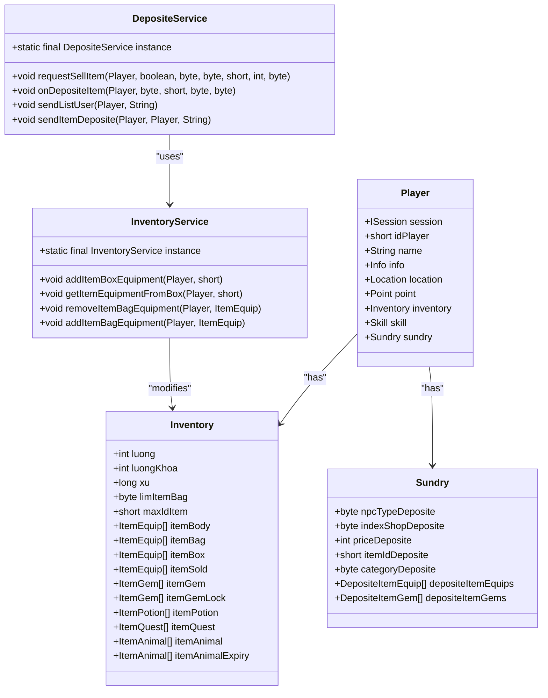
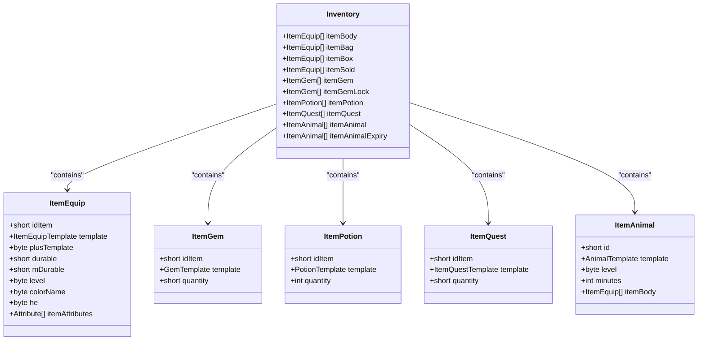
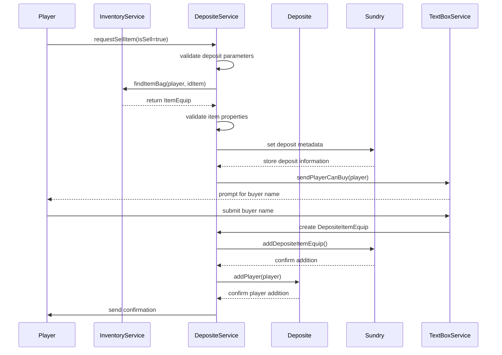
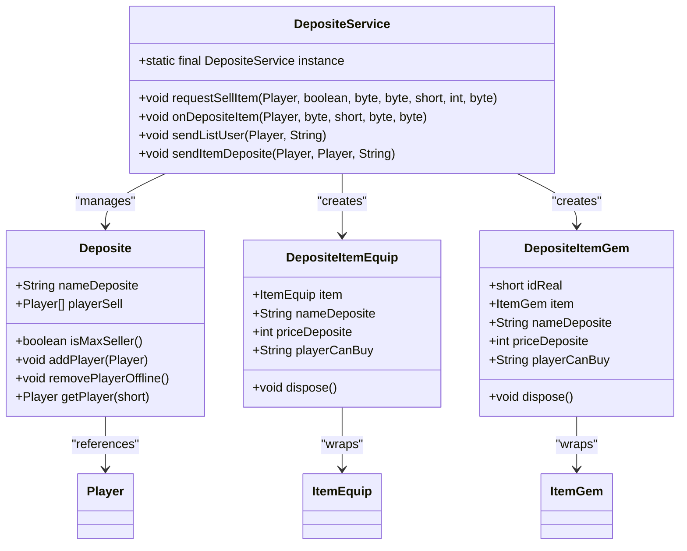
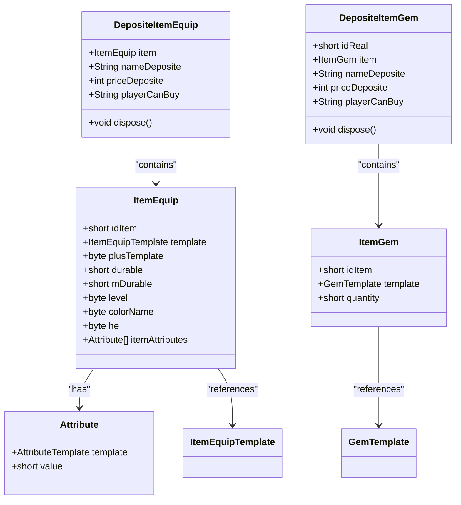
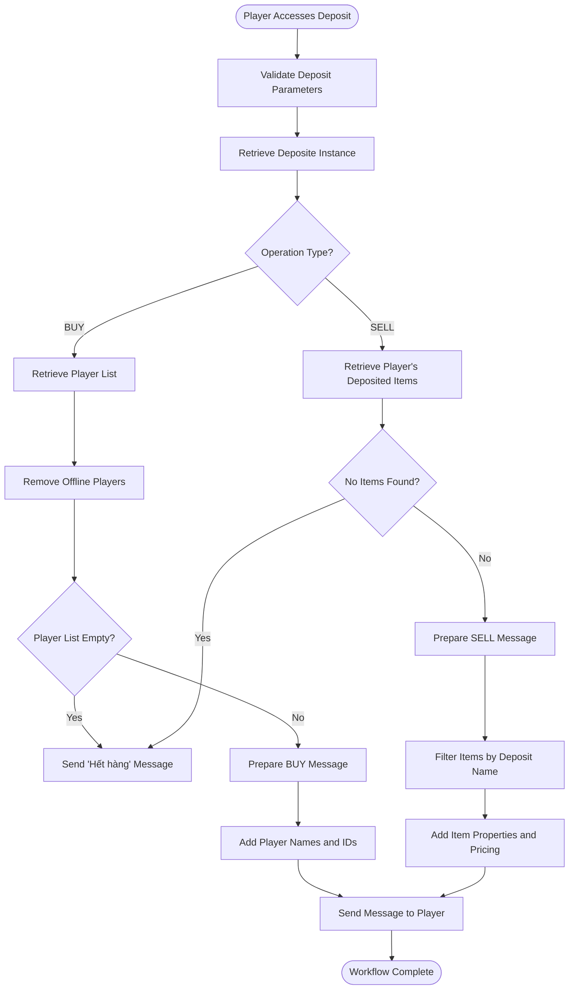
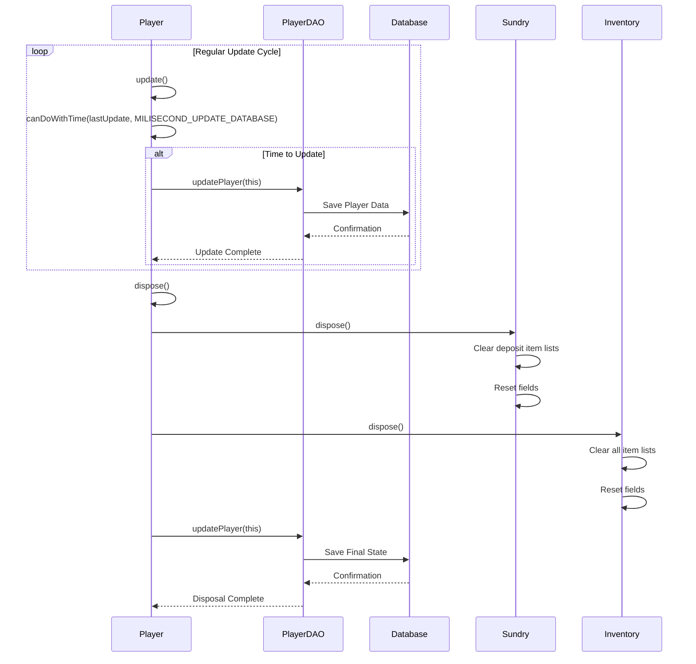
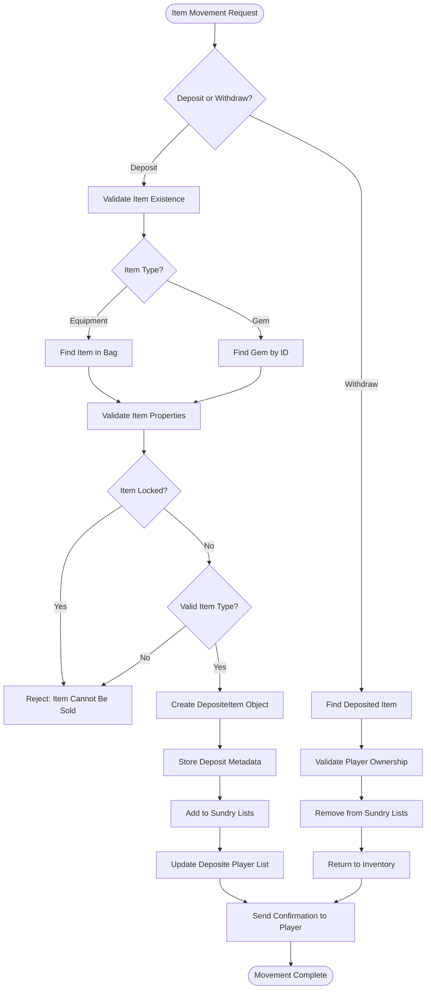
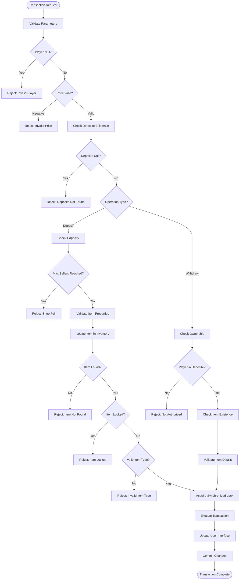
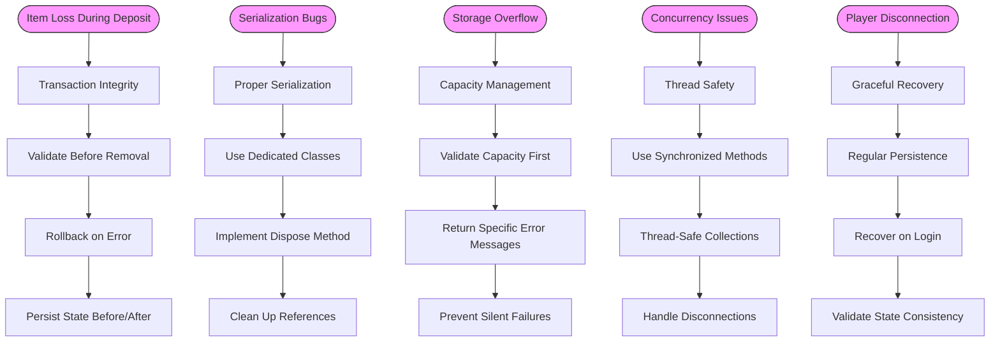

# Storage and Inventory Expansion

<cite>
**Referenced Files in This Document**   
- [Inventory.java](file://src/main/java/player/Inventory.java)
- [Deposite.java](file://src/main/java/deposite/Deposite.java)
- [DepositeItemEquip.java](file://src/main/java/deposite/DepositeItemEquip.java)
- [DepositeItemGem.java](file://src/main/java/deposite/DepositeItemGem.java)
- [DepositeService.java](file://src/main/java/services/DepositeService.java)
- [Sundry.java](file://src/main/java/player/Sundry.java)
- [InventoryService.java](file://src/main/java/services/InventoryService.java)
</cite>

## Table of Contents
1. [Introduction](#introduction)
2. [Inventory System Architecture](#inventory-system-architecture)
3. [Slot-Based Inventory Structure](#slot-based-inventory-structure)
4. [Deposit System Overview](#deposit-system-overview)
5. [Deposit Class Hierarchy](#deposit-class-hierarchy)
6. [Item Serialization in Deposit System](#item-serialization-in-deposit-system)
7. [Deposit Access Workflows](#deposit-access-workflows)
8. [Inventory Capacity and Expansion](#inventory-capacity-and-expansion)
9. [Data Persistence Strategies](#data-persistence-strategies)
10. [Item Movement Between Inventory and Deposit](#item-movement-between-inventory-and-deposit)
11. [Validation and Concurrency Handling](#validation-and-concurrency-handling)
12. [Common Issues and Edge Cases](#common-issues-and-edge-cases)

## Introduction
This document provides a comprehensive analysis of the storage subsystems in the game, focusing on the player inventory bag, box, and deposit systems. The inventory system implements a slot-based structure that manages various item types including equipment, gems, potions, and quest items. The deposit system serves as a long-term storage solution that allows players to store and trade items through NPC-managed shops. This documentation details the architecture, implementation, and interaction between these systems, with emphasis on capacity limits, expansion mechanics, data persistence, and common edge cases.

## Inventory System Architecture



**Diagram sources**
- [Player.java](file://src/main/java/player/Player.java#L1-L310)
- [Inventory.java](file://src/main/java/player/Inventory.java#L1-L246)
- [Sundry.java](file://src/main/java/player/Sundry.java#L1-L169)
- [DepositeService.java](file://src/main/java/services/DepositeService.java#L1-L279)
- [InventoryService.java](file://src/main/java/services/InventoryService.java#L1-L714)

**Section sources**
- [Player.java](file://src/main/java/player/Player.java#L1-L310)
- [Inventory.java](file://src/main/java/player/Inventory.java#L1-L246)
- [Sundry.java](file://src/main/java/player/Sundry.java#L1-L169)

## Slot-Based Inventory Structure

The inventory system implements a comprehensive slot-based structure that organizes items into distinct categories based on their type and usage. The `Inventory` class contains multiple lists that represent different storage areas and item types:

- **itemBody**: Equipment currently worn by the player (weapons, armor, accessories)
- **itemBag**: Main inventory storage for equipment items
- **itemBox**: Secondary storage container with limited capacity
- **itemSold**: Temporary storage for items being sold
- **itemGem**: Gems and jewels that can be equipped or used
- **itemGemLock**: Locked gems that cannot be moved or used
- **itemPotion**: Consumable items like healing potions and buffs
- **itemQuest**: Quest-specific items required for mission completion
- **itemAnimal**: Permanent pets and companions
- **itemAnimalExpiry**: Time-limited pets and companions

The inventory capacity is dynamically calculated based on the `limItemBag` field, which determines the maximum number of slots available. The total inventory capacity is calculated as 42 multiplied by the `limItemBag` value, providing a scalable storage system that can be expanded through gameplay mechanics.



**Diagram sources**
- [Inventory.java](file://src/main/java/player/Inventory.java#L1-L246)
- [ItemEquip.java](file://src/main/java/item/ItemEquip.java#L1-L100)
- [ItemGem.java](file://src/main/java/item/ItemGem.java#L1-L50)
- [ItemPotion.java](file://src/main/java/item/ItemPotion.java#L1-L40)
- [ItemQuest.java](file://src/main/java/item/ItemQuest.java#L1-L35)
- [ItemAnimal.java](file://src/main/java/item/ItemAnimal.java#L1-L60)

**Section sources**
- [Inventory.java](file://src/main/java/player/Inventory.java#L1-L246)

## Deposit System Overview

The deposit system provides a long-term storage solution that allows players to store valuable items safely and trade with other players through NPC-managed shops. Unlike the personal inventory, the deposit system is designed for extended storage and facilitates player-to-player transactions. The system is organized around NPC shops, where each shop has a unique deposit associated with it, identified by a combination of NPC type and shop index.

Players can deposit items into these shops for safekeeping or to sell to other players. The deposit system maintains references to players who have items stored in a particular shop, allowing for efficient retrieval and management of stored items. When a player deposits an item, it is removed from their personal inventory and added to the deposit system, where it becomes accessible to other players who visit the same shop.

The deposit system also handles the financial aspects of item storage and trading, including price setting for items being sold and tracking of transaction details. This creates a comprehensive marketplace where players can buy and sell items through NPC intermediaries, reducing the risk of fraud and ensuring secure transactions.



**Diagram sources**
- [DepositeService.java](file://src/main/java/services/DepositeService.java#L1-L279)
- [InventoryService.java](file://src/main/java/services/InventoryService.java#L1-L714)
- [Sundry.java](file://src/main/java/player/Sundry.java#L1-L169)
- [Deposite.java](file://src/main/java/deposite/Deposite.java#L1-L44)

**Section sources**
- [DepositeService.java](file://src/main/java/services/DepositeService.java#L1-L279)

## Deposit Class Hierarchy

The deposit system is implemented with a hierarchical class structure that separates concerns and provides extensibility for different item types. At the core of this hierarchy is the `Deposite` class, which represents a specific deposit location associated with an NPC shop. This class maintains a list of players who have items stored in the deposit and provides methods for managing player access and item retrieval.

Extending this foundation are two specialized classes: `DepositeItemEquip` and `DepositeItemGem`, which handle the serialization and storage of equipment and gem items respectively. These classes inherit from a common pattern but are tailored to the specific requirements of their respective item types. The hierarchy allows for consistent handling of deposit operations while accommodating the unique characteristics of different item categories.

The `DepositeService` class serves as the controller for the entire deposit system, coordinating interactions between players, inventory, and deposit storage. It validates deposit requests, manages item movement between inventory and deposit, and handles the communication protocols required for player interactions with the deposit system.



**Diagram sources**
- [Deposite.java](file://src/main/java/deposite/Deposite.java#L1-L44)
- [DepositeItemEquip.java](file://src/main/java/deposite/DepositeItemEquip.java#L1-L27)
- [DepositeItemGem.java](file://src/main/java/deposite/DepositeItemGem.java#L1-L28)
- [DepositeService.java](file://src/main/java/services/DepositeService.java#L1-L279)

**Section sources**
- [Deposite.java](file://src/main/java/deposite/Deposite.java#L1-L44)
- [DepositeItemEquip.java](file://src/main/java/deposite/DepositeItemEquip.java#L1-L27)
- [DepositeItemGem.java](file://src/main/java/deposite/DepositeItemGem.java#L1-L28)

## Item Serialization in Deposit System

The deposit system implements specialized serialization mechanisms for different item types to ensure that all relevant data is preserved when items are moved from inventory to deposit storage. For equipment items, the `DepositeItemEquip` class wraps the `ItemEquip` object and includes additional metadata such as the deposit name, price, and authorized buyer. This serialization approach allows the system to maintain the complete state of the equipment item while adding deposit-specific information.

For gem items, the `DepositeItemGem` class provides similar serialization capabilities with the addition of a `idReal` field that serves as a unique identifier for the deposited gem. This is particularly important for gems, which may have stackable quantities and require precise tracking when multiple instances of the same gem type are deposited. The serialization process ensures that all attributes, durability, level, and other properties of the original item are preserved in the deposit system.

Both serialization classes implement a `dispose` method that properly cleans up references and resets fields when an item is removed from the deposit system. This prevents memory leaks and ensures that deposited items are properly managed throughout their lifecycle in the deposit system.



**Diagram sources**
- [DepositeItemEquip.java](file://src/main/java/deposite/DepositeItemEquip.java#L1-L27)
- [DepositeItemGem.java](file://src/main/java/deposite/DepositeItemGem.java#L1-L28)
- [ItemEquip.java](file://src/main/java/item/ItemEquip.java#L1-L100)
- [ItemGem.java](file://src/main/java/item/ItemGem.java#L1-L50)
- [Attribute.java](file://src/main/java/item/Attribute.java#L1-L40)

**Section sources**
- [DepositeItemEquip.java](file://src/main/java/deposite/DepositeItemEquip.java#L1-L27)
- [DepositeItemGem.java](file://src/main/java/deposite/DepositeItemGem.java#L1-L28)

## Deposit Access Workflows

The deposit system implements a comprehensive workflow for accessing and managing deposited items through the `DepositeService` class. The primary access methods are `onDepositeItem` and `sendItemDeposite`, which handle player requests to view and interact with deposit contents. When a player accesses a deposit, the system first validates the deposit parameters and retrieves the appropriate deposit instance based on the NPC type and shop index.

For viewing available items (BUY operation), the system retrieves the list of players who have items stored in the deposit and sends this information to the requesting player. This allows the player to see which players have items available for purchase. For viewing their own deposited items (SELL operation), the system retrieves the specific items associated with the player and sends detailed information about each item, including its properties, price, and buyer restrictions.

The workflow includes several validation steps to ensure data integrity and prevent unauthorized access. The system checks whether the deposit exists, validates player credentials, and ensures that players can only access their own deposited items or view items available for purchase. The `removePlayerOffline` method periodically cleans up the deposit by removing players who are no longer online or who have no items in the deposit, maintaining system efficiency.



**Diagram sources**
- [DepositeService.java](file://src/main/java/services/DepositeService.java#L1-L279)
- [Deposite.java](file://src/main/java/deposite/Deposite.java#L1-L44)
- [Sundry.java](file://src/main/java/player/Sundry.java#L1-L169)

**Section sources**
- [DepositeService.java](file://src/main/java/services/DepositeService.java#L1-L279)

## Inventory Capacity and Expansion

The inventory system implements a dynamic capacity model that balances player convenience with game balance considerations. The primary capacity determinant is the `limItemBag` field in the `Inventory` class, which serves as a multiplier for the base inventory size. The total inventory capacity is calculated as 42 multiplied by the `limItemBag` value, providing a scalable storage system that can be expanded through gameplay progression.

The system defines several capacity limits for different storage areas:
- **Item Box**: Limited to 15 items maximum
- **Deposit Sellers**: Limited to 15 players per deposit
- **Sold Items**: Limited to 60 items in temporary storage

These limits prevent system abuse and ensure server performance remains stable even with high player activity. When attempting to add items to a full container, the system returns appropriate error messages to the player, such as "Rương đầy" (Box full) for the item box or "Gian hàng đã hết chỗ đăng bán" (Shop has no more space for listing) for deposit slots.

Inventory expansion mechanics are implemented through gameplay progression, where players can increase their `limItemBag` value by completing quests, purchasing upgrades, or achieving specific milestones. This creates a progression system that rewards active play while maintaining balance in the game economy. The capacity calculation in the `isFullInventory` method ensures that the system accurately tracks inventory usage across all categories, preventing overflow and maintaining data integrity.

```mermaid
classDiagram
class Inventory {
+byte limItemBag
+boolean isFullInventory()
+int fullInventory()
}
class InventoryService {
+void addItemBoxEquipment(Player, short)
+void getItemEquipmentFromBox(Player, short)
}
class Deposite {
+boolean isMaxSeller()
}
class Sundry {
+DepositeItemEquip[] depositeItemEquips
+DepositeItemGem[] depositeItemGems
}
Inventory --> InventoryService : "capacity validation"
InventoryService --> Inventory : "modifies"
Deposite --> Sundry : "references"
note right of Inventory
Base capacity : 42 slots
Total capacity : 42 * limItemBag
Dynamic expansion through gameplay
end
note right of InventoryService
ItemBox capacity : 15 items max
Validation prevents overflow
Error messages for full containers
end
note right of Deposite
Maximum sellers : 15 players
Prevents system abuse
Maintains server performance
end
```

**Diagram sources**
- [Inventory.java](file://src/main/java/player/Inventory.java#L1-L246)
- [InventoryService.java](file://src/main/java/services/InventoryService.java#L1-L714)
- [Deposite.java](file://src/main/java/deposite/Deposite.java#L1-L44)
- [Sundry.java](file://src/main/java/player/Sundry.java#L1-L169)

**Section sources**
- [Inventory.java](file://src/main/java/player/Inventory.java#L1-L246)
- [InventoryService.java](file://src/main/java/services/InventoryService.java#L1-L714)

## Data Persistence Strategies

The storage subsystem implements a comprehensive data persistence strategy that ensures player items are safely stored and recovered across sessions. The primary persistence mechanism is integrated with the player update cycle, where the `Player` class's `update` method periodically saves player data to the database. This occurs when the time since the last update exceeds the `MILISECOND_UPDATE_DATABASE` threshold, ensuring regular persistence without excessive database load.

The `PlayerDAO.updatePlayer` method is responsible for persisting the complete player state, including inventory contents and deposit information. This method is called during the player's disposal process and during regular update cycles, providing multiple opportunities for data persistence. The inventory system also implements proper cleanup through the `dispose` method, which clears all item references and prevents memory leaks when players log out or disconnect.

For deposit items, persistence is handled through the player's `Sundry` class, which maintains references to deposited items in the `depositeItemEquips` and `depositeItemGems` lists. These references are saved along with the rest of the player data, ensuring that deposit information survives server restarts and player logouts. The system also implements cleanup mechanisms like `removePlayerOffline` to remove references to players who are no longer active, preventing orphaned data and maintaining database integrity.



**Diagram sources**
- [Player.java](file://src/main/java/player/Player.java#L1-L310)
- [PlayerDAO.java](file://src/main/java/daos/PlayerDAO.java#L1-L100)
- [Sundry.java](file://src/main/java/player/Sundry.java#L1-L169)
- [Inventory.java](file://src/main/java/player/Inventory.java#L1-L246)

**Section sources**
- [Player.java](file://src/main/java/player/Player.java#L1-L310)
- [PlayerDAO.java](file://src/main/java/daos/PlayerDAO.java#L1-L100)

## Item Movement Between Inventory and Deposit

The system implements a comprehensive workflow for moving items between the player's inventory and the deposit system. The primary method for this operation is `requestSellItem` in the `DepositeService` class, which handles both depositing items into the deposit system and removing items from it. When depositing an item, the system first validates that the deposit has available space by checking `isMaxSeller()`.

For equipment items, the process involves finding the item in the player's bag using `findItemBag`, validating that it is not locked or on loan, and checking that it matches the deposit's item type restrictions (weapon, armor, or jewelry). Once validated, the item is wrapped in a `DepositeItemEquip` object with metadata including the deposit name, price, and authorized buyer, then added to the player's `depositeItemEquips` list in the `Sundry` class.

For gem items, a similar process occurs using `findItemGemByItemId` to locate the item, then creating a `DepositeItemGem` object with a unique `idReal` identifier. The system ensures that only available gems are deposited by checking the quantity against items already in the deposit. When removing items from the deposit, the system reverses this process, removing the item from the deposit lists and returning it to the player's inventory through the appropriate inventory service methods.



**Diagram sources**
- [DepositeService.java](file://src/main/java/services/DepositeService.java#L1-L279)
- [InventoryService.java](file://src/main/java/services/InventoryService.java#L1-L714)
- [Sundry.java](file://src/main/java/player/Sundry.java#L1-L169)
- [Inventory.java](file://src/main/java/player/Inventory.java#L1-L246)

**Section sources**
- [DepositeService.java](file://src/main/java/services/DepositeService.java#L1-L279)

## Validation and Concurrency Handling

The storage subsystem implements robust validation and concurrency handling to ensure data integrity during item transactions. The system uses synchronized methods and thread-safe operations to prevent race conditions when multiple players access the same deposit or when a player performs rapid inventory operations. The `@Synchronized` annotation is used on critical methods in the `InventoryService` class to ensure atomic operations when modifying inventory contents.

Validation occurs at multiple levels, starting with basic parameter validation in the `requestSellItem` method, which checks for negative prices and invalid item IDs. The system then performs item-specific validation, checking whether equipment items are locked or on loan, and whether they match the deposit's allowed item types. For gems, the system validates that the requested quantity is available and not already partially deposited.

The deposit system also implements player state validation through the `removePlayerOffline` method, which periodically checks whether players in the deposit are still online and have items to sell. This prevents orphaned listings and ensures that only active players can maintain items in the deposit system. The system uses `ClientManager.containsPlayers(p)` to verify player connectivity and checks that players still have items in their deposit before retaining them in the seller list.



**Diagram sources**
- [DepositeService.java](file://src/main/java/services/DepositeService.java#L1-L279)
- [InventoryService.java](file://src/main/java/services/InventoryService.java#L1-L714)
- [Deposite.java](file://src/main/java/deposite/Deposite.java#L1-L44)
- [Sundry.java](file://src/main/java/player/Sundry.java#L1-L169)

**Section sources**
- [DepositeService.java](file://src/main/java/services/DepositeService.java#L1-L279)
- [InventoryService.java](file://src/main/java/services/InventoryService.java#L1-L714)

## Common Issues and Edge Cases

The storage subsystem addresses several common issues and edge cases that could lead to data corruption or player dissatisfaction. One critical issue is item loss during deposit operations, which is prevented through transactional integrity and proper error handling. The system ensures that items are only removed from the player's inventory after successful deposit registration, and implements rollback mechanisms when errors occur.

Serialization bugs are mitigated through the use of dedicated serialization classes (`DepositeItemEquip` and `DepositeItemGem`) that properly encapsulate item state and metadata. These classes implement the `dispose` method to clean up references and prevent memory leaks, addressing a common source of serialization issues in long-running game sessions.

Storage overflow edge cases are handled through comprehensive capacity checks and appropriate user feedback. When attempting to add items to a full container, the system returns specific error messages like "Rương đầy" (Box full) or "Hành trang không đủ ô trống" (Inventory lacks empty slots), helping players understand the cause of the failure. The system also implements graceful degradation for deposit operations, allowing players to view available items even when their own inventory is full.

Concurrency issues are addressed through synchronized methods and thread-safe collections, preventing race conditions when multiple players access the same deposit simultaneously. The system also handles player disconnections during transactions by persisting the player state before and after critical operations, ensuring that items are not lost even if the player disconnects mid-transaction.



**Diagram sources**
- [DepositeService.java](file://src/main/java/services/DepositeService.java#L1-L279)
- [DepositeItemEquip.java](file://src/main/java/deposite/DepositeItemEquip.java#L1-L27)
- [DepositeItemGem.java](file://src/main/java/deposite/DepositeItemGem.java#L1-L28)
- [InventoryService.java](file://src/main/java/services/InventoryService.java#L1-L714)
- [Sundry.java](file://src/main/java/player/Sundry.java#L1-L169)

**Section sources**
- [DepositeService.java](file://src/main/java/services/DepositeService.java#L1-L279)
- [DepositeItemEquip.java](file://src/main/java/deposite/DepositeItemEquip.java#L1-L27)
- [DepositeItemGem.java](file://src/main/java/deposite/DepositeItemGem.java#L1-L28)