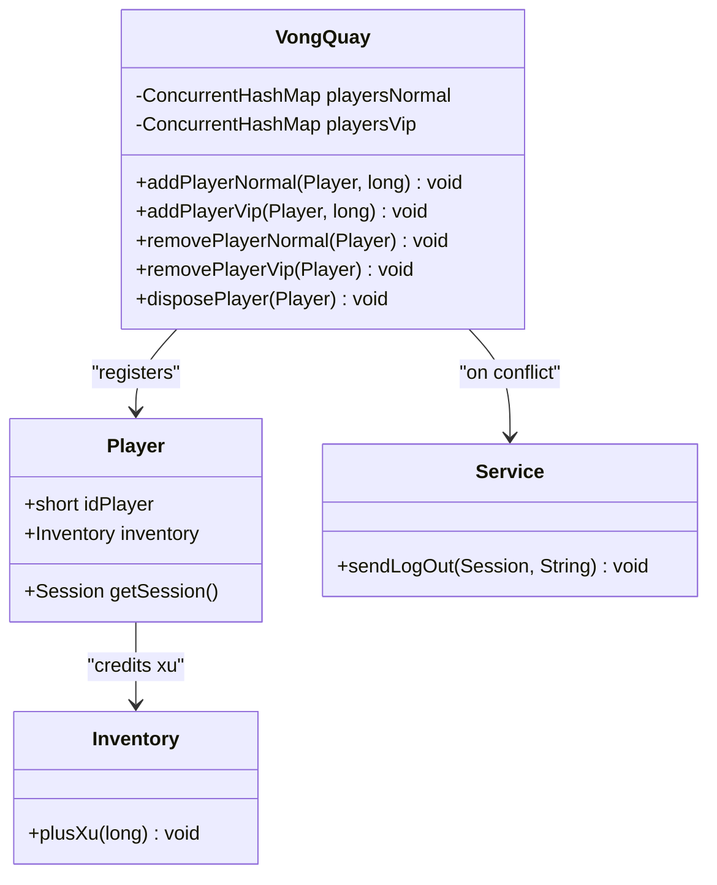
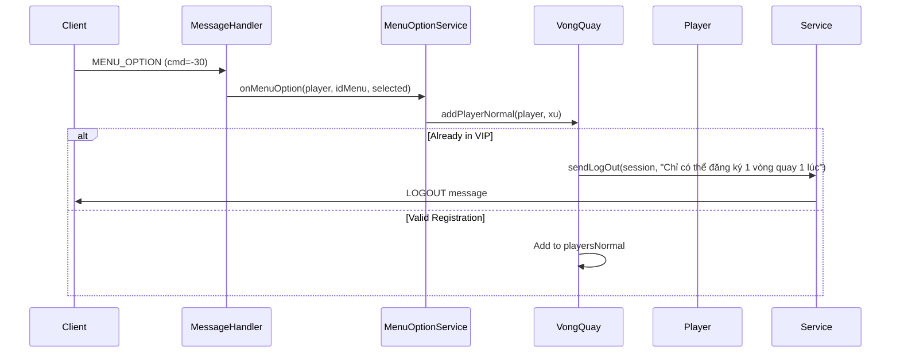

# Mini-games

<cite>
**Referenced Files in This Document**   
- [VongQuay.java](file://src/main/java/minigame/VongQuay.java)
- [MenuOptionService.java](file://src/main/java/services/MenuOptionService.java)
- [Player.java](file://src/main/java/player/Player.java)
- [Service.java](file://src/main/java/services/Service.java)
- [CommandMessage.java](file://src/main/java/utils/CommandMessage.java)
- [MessageHandler.java](file://src/main/java/network/MessageHandler.java)
</cite>

## Table of Contents
1. [Introduction](#introduction)
2. [Game Mechanics and Rules](#game-mechanics-and-rules)
3. [Server-Side Implementation](#server-side-implementation)
4. [Economy Integration](#economy-integration)
5. [Gameplay Flow and Network Communication](#gameplay-flow-and-network-communication)
6. [Fairness and Anti-Cheating Measures](#fairness-and-anti-cheating-measures)
7. [Conclusion](#conclusion)

## Introduction
The VongQuay (Wheel of Fortune) mini-game is a core feature in the game system that provides players with opportunities to earn rewards through participation. This document details the implementation and mechanics of the VongQuay system, focusing on its integration within the broader game architecture. The system supports two participation tiers—normal and VIP—with distinct registration and reward mechanisms. Players interact with the system through menu options, and the server manages state, player eligibility, and prize distribution. The design emphasizes fairness, concurrency safety, and seamless integration with the game's economy.

## Game Mechanics and Rules
The VongQuay mini-game operates on a registration-based participation model where players can join either the normal or VIP tier, but not both simultaneously. Each tier maintains a separate registry of participants and associated stakes, measured in in-game currency (xu). Once registered, players are locked from switching tiers until they withdraw. The game mechanics enforce mutual exclusivity between participation types to prevent exploitation. Rewards are distributed upon withdrawal, with the accumulated xu returned to the player's inventory. The system does not currently implement a spinning or random selection mechanism in the provided code, suggesting that reward determination may occur externally or in unprovided components.

**Section sources**
- [VongQuay.java](file://src/main/java/minigame/VongQuay.java#L15-L67)

## Server-Side Implementation
The server-side implementation of VongQuay is centered around state management using thread-safe collections. The `VongQuay` class maintains two `ConcurrentHashMap` instances—`playersNormal` and `playersVip`—to track participants and their respective stakes. All modification methods are annotated with `@Synchronized` to ensure atomic operations, preventing race conditions in a multi-threaded environment. Player registration is handled through `addPlayerNormal` and `addPlayerVip`, which validate eligibility by checking cross-tier registration. If a player attempts to register in both tiers, the server disconnects them with a descriptive message. Withdrawal is managed via `removePlayerNormal` and `removePlayerVip`, which credit the accumulated xu to the player's inventory before removing them from the registry. The `disposePlayer` method provides a cleanup mechanism during player logout or session termination, ensuring no state leakage.

**Diagram sources**
- [VongQuay.java](file://src/main/java/minigame/VongQuay.java#L15-L67)
- [Player.java](file://src/main/java/player/Player.java#L15-L310)
- [Service.java](file://src/main/java/services/Service.java#L15-L246)

**Section sources**
- [VongQuay.java](file://src/main/java/minigame/VongQuay.java#L15-L67)
- [Player.java](file://src/main/java/player/Player.java#L15-L310)
- [Service.java](file://src/main/java/services/Service.java#L15-L246)

## Economy Integration
The VongQuay system is tightly integrated with the game's economy through the use of xu as both stake and reward currency. Players register with a specified amount of xu, which is held in the VongQuay registry until withdrawal. Upon withdrawal, the accumulated xu is directly added to the player's inventory via the `plusXu` method, ensuring seamless currency flow. The system does not consume or redistribute xu during registration, indicating that rewards may be funded externally or through separate game systems. The integration with the `Player` and `Inventory` components ensures that all transactions are reflected in the player's persistent state, with updates synchronized to the client. No direct interaction with premium currency (e.g., lượng) is evident in the provided code, limiting economic interaction to the base currency.

**Section sources**
- [VongQuay.java](file://src/main/java/minigame/VongQuay.java#L15-L67)
- [Player.java](file://src/main/java/player/Player.java#L15-L310)

## Gameplay Flow and Network Communication
Player interaction with the VongQuay system is initiated through menu options, specifically "Vòng quay thường" (Normal Wheel) and "Vòng quay vip" (VIP Wheel). The `MenuOptionService` handles these selections by invoking `sendMenuVongQuayThuong` and `sendMenuVongQuayVip`, which present participation options to the player. Selections are transmitted to the server via the `MENU_OPTION` command (value -30), processed in `MessageHandler`. The handler routes the command to `MenuOptionService.onMenuOption`, which validates the player's state and invokes the appropriate VongQuay registration method. Network messages follow a structured format: command byte, menu ID, and selection index. The server responds with confirmation or error messages using the `LOGOUT` command for immediate feedback, though this results in disconnection, suggesting a need for refinement in user experience.

**Diagram sources**
- [MenuOptionService.java](file://src/main/java/services/MenuOptionService.java#L392-L422)
- [MessageHandler.java](file://src/main/java/network/MessageHandler.java#L15-L672)
- [VongQuay.java](file://src/main/java/minigame/VongQuay.java#L15-L67)
- [CommandMessage.java](file://src/main/java/utils/CommandMessage.java#L15-L363)

**Section sources**
- [MenuOptionService.java](file://src/main/java/services/MenuOptionService.java#L392-L422)
- [MessageHandler.java](file://src/main/java/network/MessageHandler.java#L15-L672)
- [CommandMessage.java](file://src/main/java/utils/CommandMessage.java#L15-L363)

## Fairness and Anti-Cheating Measures
The VongQuay system implements several measures to ensure fairness and prevent cheating. The primary mechanism is the mutual exclusion rule: players cannot participate in both normal and VIP tiers simultaneously, enforced through cross-registry checks during registration. This prevents players from duplicating stakes or exploiting tier-specific advantages. Thread safety is ensured through the use of `ConcurrentHashMap` and `@Synchronized` annotations, preventing race conditions during concurrent access. The system also validates player state before registration, rejecting attempts from disconnected or invalid sessions. However, the current implementation lacks a formal randomization algorithm or audit trail for reward distribution, relying instead on external systems or future implementation. The use of `sendLogOut` for error conditions, while effective at preventing invalid states, may be overly punitive and could be replaced with non-disruptive error messaging.

**Section sources**
- [VongQuay.java](file://src/main/java/minigame/VongQuay.java#L15-L67)
- [Service.java](file://src/main/java/services/Service.java#L15-L246)

## Conclusion
The VongQuay mini-game system provides a structured framework for player participation and reward distribution, with robust state management and economy integration. Its design prioritizes concurrency safety and rule enforcement, ensuring fair play through mutual exclusion and validation. While the current implementation focuses on registration and withdrawal mechanics, the actual reward selection and distribution logic appears to be incomplete or located in unprovided components. Future enhancements should include a formal randomization algorithm, non-disruptive error handling, and integration with premium currency systems to enrich the gameplay experience.