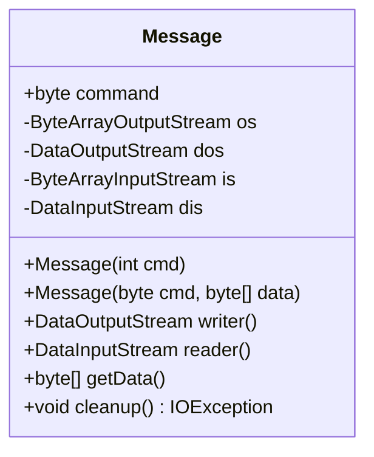
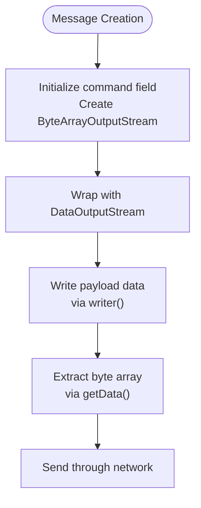
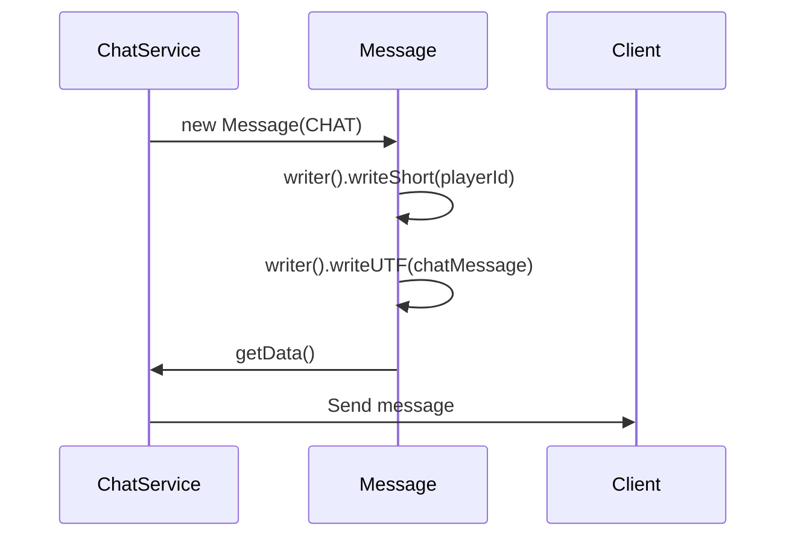
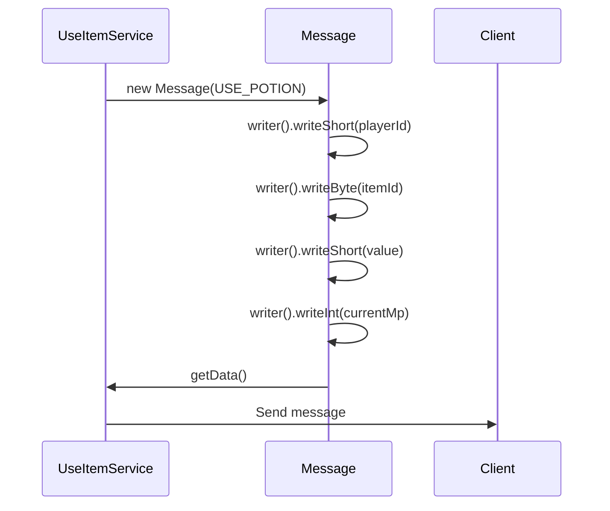
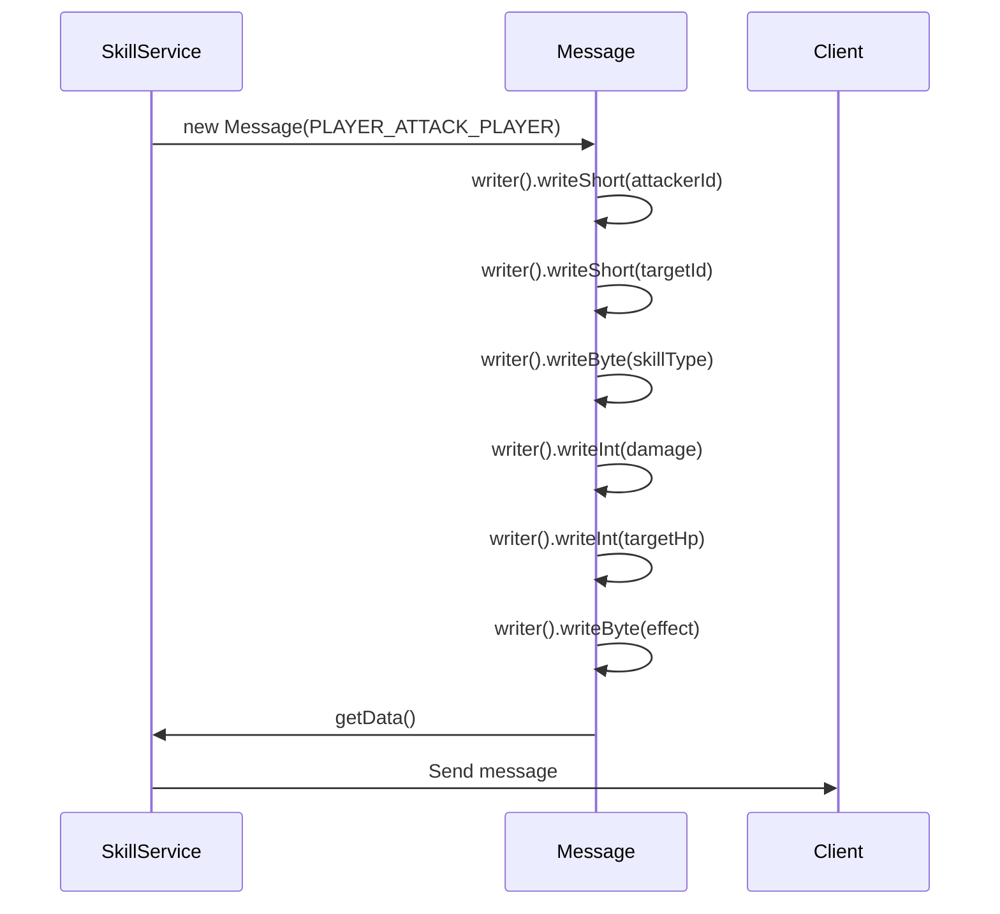
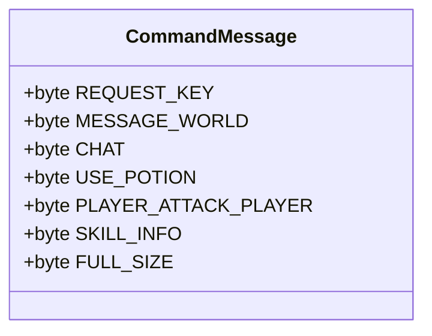
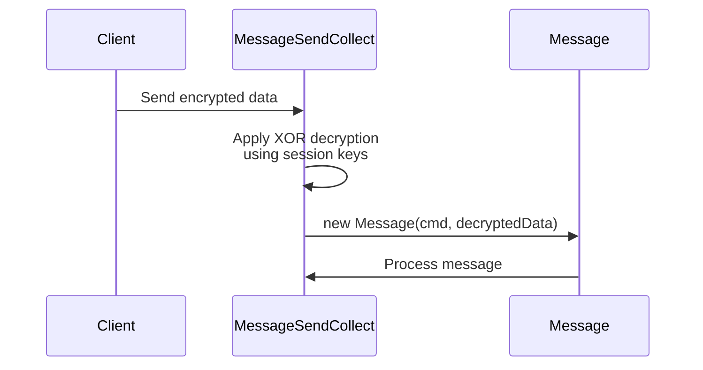
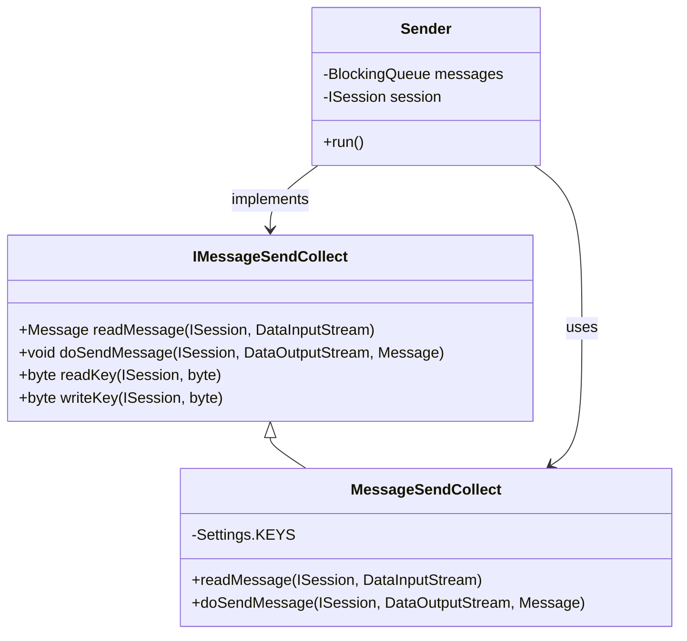

# Message Protocol

<cite>
**Referenced Files in This Document**   
- [Message.java](file://src/main/java/network/Message.java)
- [CommandMessage.java](file://src/main/java/utils/CommandMessage.java)
- [ChatService.java](file://src/main/java/services/ChatService.java)
- [UseItemService.java](file://src/main/java/services/UseItemService.java)
- [SkillService.java](file://src/main/java/services/SkillService.java)
- [MessageSendCollect.java](file://src/main/java/network/MessageSendCollect.java)
</cite>

## Table of Contents
1. [Introduction](#introduction)
2. [Message Class Structure](#message-class-structure)
3. [Field Purpose and Functionality](#field-purpose-and-functionality)
4. [Message Construction Flows](#message-construction-flows)
5. [Data Stream Wrappers](#data-stream-wrappers)
6. [Message Assembly Examples](#message-assembly-examples)
7. [Resource Management and Cleanup](#resource-management-and-cleanup)
8. [Message Validation and Security](#message-validation-and-security)
9. [Protocol Extensibility](#protocol-extensibility)
10. [Integration with Network Layer](#integration-with-network-layer)

## Introduction
The Message class serves as the fundamental data structure for the binary communication protocol in the KPAH game server. It encapsulates both the command identifier (opcode) and the associated payload data, enabling structured message exchange between client and server. This documentation provides a comprehensive analysis of the Message class design, usage patterns, and integration within the game's networking architecture.

**Section sources**
- [Message.java](file://src/main/java/network/Message.java#L1-L54)

## Message Class Structure
The Message class implements a dual-mode design pattern, supporting both outbound message creation and inbound message parsing through two distinct constructors. This design enables efficient serialization and deserialization of game state updates, player actions, and system events.



**Diagram sources**
- [Message.java](file://src/main/java/network/Message.java#L8-L54)

**Section sources**
- [Message.java](file://src/main/java/network/Message.java#L8-L54)

## Field Purpose and Functionality
The Message class contains several key fields that enable its dual functionality:

- **command**: Stores the opcode that identifies the message type and determines how the payload should be interpreted
- **os (ByteArrayOutputStream)**: Buffer for constructing outbound message payloads
- **dos (DataOutputStream)**: Wrapper for writing primitive data types to the output stream
- **is (ByteArrayInputStream)**: Buffer for parsing inbound message payloads
- **dis (DataInputStream)**: Wrapper for reading primitive data types from the input stream

The command field acts as a discriminator that routes messages to appropriate handlers, while the stream objects provide type-safe serialization of complex game data.

**Section sources**
- [Message.java](file://src/main/java/network/Message.java#L8-L54)

## Message Construction Flows
The Message class supports two primary construction flows:

### Outbound Message Flow
For creating messages to send to clients, the constructor `Message(int cmd)` initializes the output stream components:


**Diagram sources**
- [Message.java](file://src/main/java/network/Message.java#L15-L20)

### Inbound Message Flow
For parsing messages received from clients, the constructor `Message(byte cmd, byte[] data)` initializes the input stream components:
```mermaid
flowchart TD
Receive([Message Received]) --> Extract["Extract command and data"]) --> Initialize["Initialize command field<br/>Create ByteArrayInputStream"] --> Wrap["Wrap with DataInputStream"] --> Read["Read payload data<br/>via reader()"] --> Process["Process message content"]
```

**Diagram sources**
- [Message.java](file://src/main/java/network/Message.java#L22-L26)

**Section sources**
- [Message.java](file://src/main/java/network/Message.java#L15-L30)

## Data Stream Wrappers
The Message class utilizes Java's DataOutputStream and DataInputStream wrappers to provide type-safe serialization of primitive data types:

### DataOutputStream Wrapper
The `writer()` method returns the DataOutputStream instance, enabling:
- Writing of primitive types (byte, short, int, long, float, double)
- UTF-8 encoded string serialization via `writeUTF()`
- Structured payload assembly in network byte order

### DataInputStream Wrapper
The `reader()` method returns the DataInputStream instance, enabling:
- Reading of primitive types with proper byte order handling
- String deserialization via `readUTF()`
- Sequential extraction of structured payload data

These wrappers ensure consistent data representation across different client and server platforms.

**Section sources**
- [Message.java](file://src/main/java/network/Message.java#L32-L39)

## Message Assembly Examples
The following examples demonstrate common message assembly patterns used throughout the game server:

### Chat Message


**Diagram sources**
- [ChatService.java](file://src/main/java/services/ChatService.java#L49-L54)

### Item Usage


**Diagram sources**
- [UseItemService.java](file://src/main/java/services/UseItemService.java#L262-L268)

### Skill Casting


**Diagram sources**
- [SkillService.java](file://src/main/java/services/SkillService.java#L322-L334)

**Section sources**
- [ChatService.java](file://src/main/java/services/ChatService.java#L49-L54)
- [UseItemService.java](file://src/main/java/services/UseItemService.java#L262-L268)
- [SkillService.java](file://src/main/java/services/SkillService.java#L322-L334)

## Resource Management and Cleanup
Proper resource management is critical to prevent memory leaks in the long-running game server. The `cleanup()` method ensures all stream resources are properly closed:

```mermaid
flowchart TD
Start([cleanup() called]) --> CheckOS["os != null?"] --> CloseOS["os.close()"]
CheckOS --> |No| CheckIS["is != null?"]
CloseOS --> CheckIS
CheckIS --> |Yes| CloseIS["is.close()"]
CheckIS --> |No| CheckDIS["dis != null?"]
CloseIS --> CheckDIS
CheckDIS --> |Yes| CloseDIS["dis.close()"]
CheckDIS --> |No| CheckDOS["dos != null?"]
CloseDIS --> CheckDOS
CheckDOS --> |Yes| CloseDOS["dos.close()"]
CheckDOS --> |No| End([Cleanup complete])
CloseDOS --> End
```

This method should be called after message processing is complete, particularly for inbound messages where the streams are initialized from received data.

**Section sources**
- [Message.java](file://src/main/java/network/Message.java#L41-L54)

## Message Validation and Security
The message protocol incorporates several validation and security measures:

### Opcode Validation
The CommandMessage class defines a comprehensive set of opcodes that serve as a contract between client and server:


**Diagram sources**
- [CommandMessage.java](file://src/main/java/utils/CommandMessage.java#L1-L362)

### Payload Protection
The MessageSendCollect class implements payload encryption/decryption using a key-based XOR cipher:


**Diagram sources**
- [MessageSendCollect.java](file://src/main/java/network/MessageSendCollect.java#L10-L80)

Malformed payloads are rejected during the decryption process, preventing invalid data from reaching message handlers.

**Section sources**
- [CommandMessage.java](file://src/main/java/utils/CommandMessage.java#L1-L362)
- [MessageSendCollect.java](file://src/main/java/network/MessageSendCollect.java#L10-L80)

## Protocol Extensibility
The message protocol is designed for extensibility to support new game features:

### New Message Types
New opcodes can be added to the CommandMessage class:
```java
public static final byte NEW_FEATURE = 110;
```

### Backward Compatibility
The protocol maintains backward compatibility through:
- Reserved opcode ranges for future expansion
- Optional payload fields that can be ignored by older clients
- Version negotiation during session initialization

### Handler Registration
New message types are automatically supported by extending the existing service architecture, where each service class handles specific message types relevant to its domain.

**Section sources**
- [CommandMessage.java](file://src/main/java/utils/CommandMessage.java#L1-L362)

## Integration with Network Layer
The Message class integrates with the network layer through the MessageSendCollect interface:



This architecture ensures reliable message delivery with proper queuing and error handling.

**Diagram sources**
- [MessageSendCollect.java](file://src/main/java/network/MessageSendCollect.java#L1-L124)
- [Sender.java](file://src/main/java/network/Sender.java#L1-L50)

**Section sources**
- [MessageSendCollect.java](file://src/main/java/network/MessageSendCollect.java#L1-L124)
- [Sender.java](file://src/main/java/network/Sender.java#L1-L50)