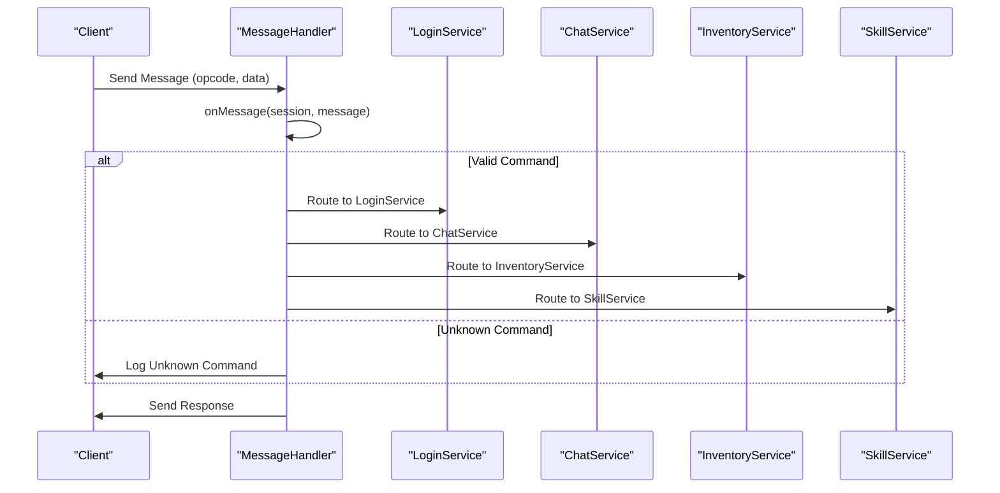
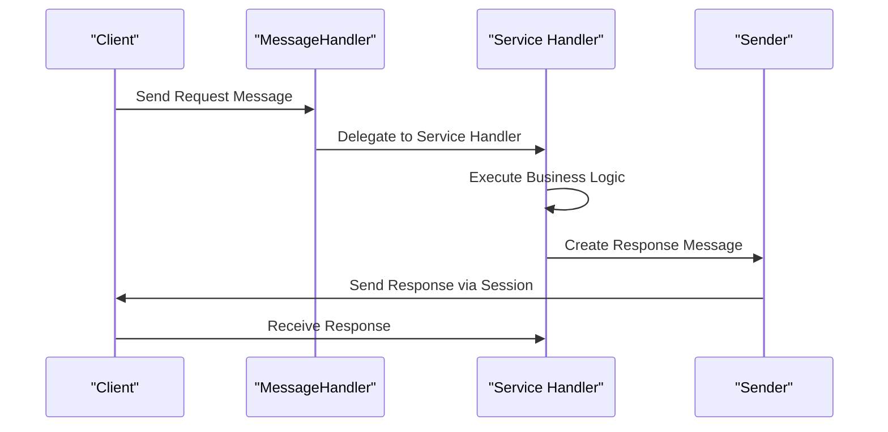
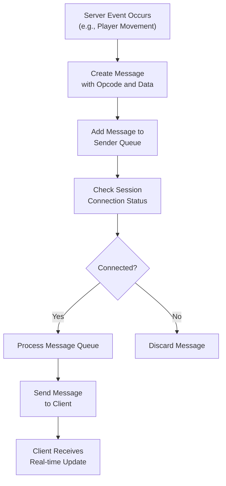
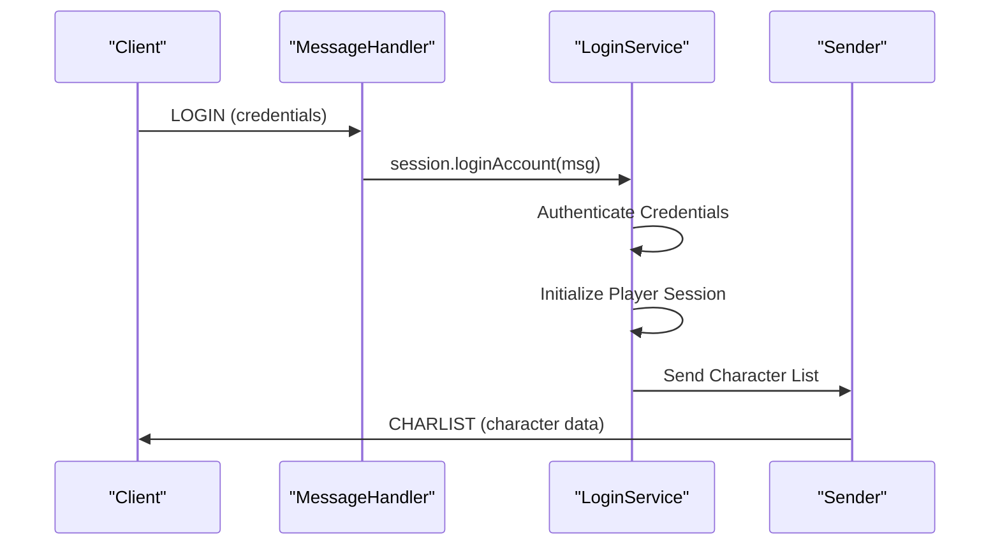
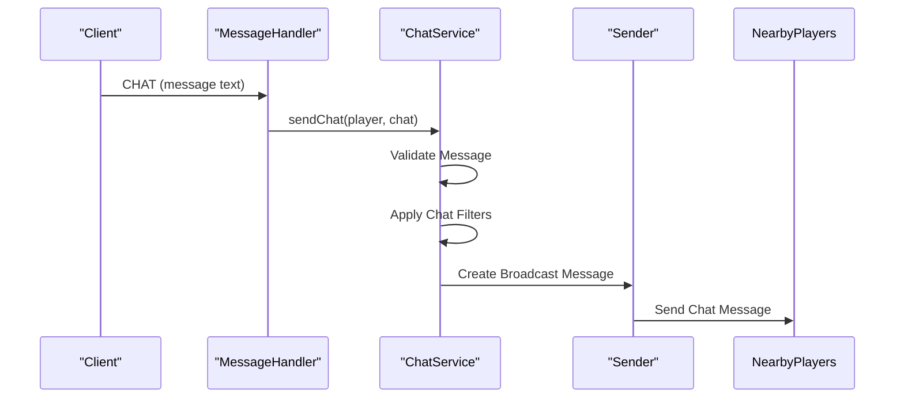
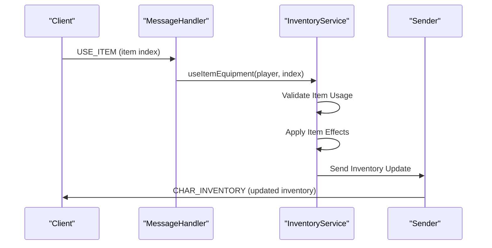
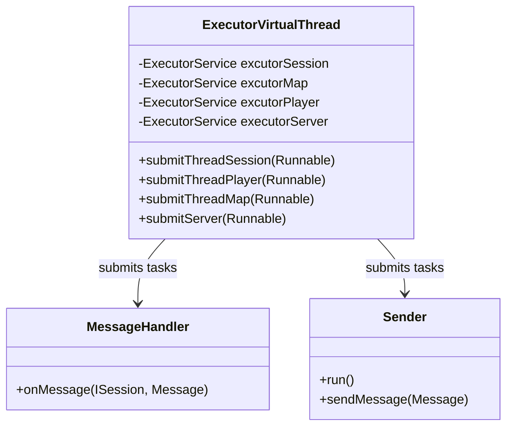
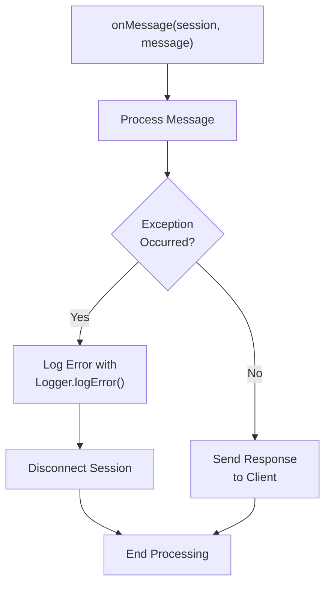
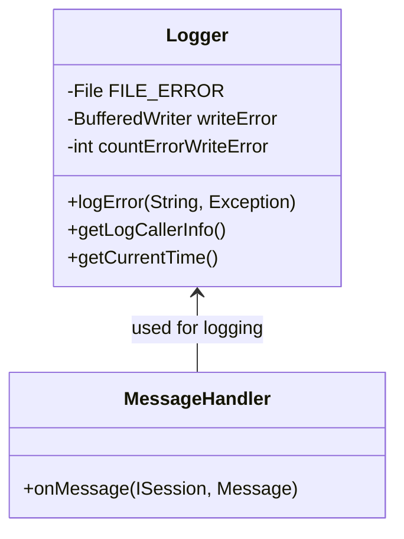

# Message Routing

<cite>
**Referenced Files in This Document**   
- [MessageHandler.java](file://src/main/java/network/MessageHandler.java)
- [Sender.java](file://src/main/java/network/Sender.java)
- [Logger.java](file://src/main/java/utils/Logger.java)
- [ExecutorVirtualThread.java](file://src/main/java/manager/ExecutorVirtualThread.java)
- [LoginService.java](file://src/main/java/services/LoginService.java)
- [ChatService.java](file://src/main/java/services/ChatService.java)
- [InventoryService.java](file://src/main/java/services/InventoryService.java)
- [SkillService.java](file://src/main/java/services/SkillService.java)
- [Message.java](file://src/main/java/network/Message.java)
- [CommandMessage.java](file://src/main/java/utils/CommandMessage.java)
</cite>

## Table of Contents
1. [Introduction](#introduction)
2. [Message Routing Architecture](#message-routing-architecture)
3. [Request-Response Pattern Implementation](#request-response-pattern-implementation)
4. [Asynchronous Message Pushing](#asynchronous-message-pushing)
5. [Routing Examples](#routing-examples)
6. [Scalability with Virtual Threads](#scalability-with-virtual-threads)
7. [Error Handling and Logging](#error-handling-and-logging)
8. [Conclusion](#conclusion)

## Introduction
The message routing system serves as the central nervous system for client-server communication in the game server architecture. It processes incoming client commands and dispatches them to appropriate service handlers based on message opcodes. This document details the implementation of the routing mechanism, request-response patterns, asynchronous message pushing, and error handling strategies that enable efficient and reliable communication between clients and server-side services.

## Message Routing Architecture

The message routing system is centered around the `MessageHandler.onMessage()` method, which acts as the primary router for all incoming client commands. This method receives messages from connected clients and routes them to the appropriate service handlers based on the message opcode (command).

**Diagram sources**
- [MessageHandler.java](file://src/main/java/network/MessageHandler.java#L15-L671)

**Section sources**
- [MessageHandler.java](file://src/main/java/network/MessageHandler.java#L15-L671)

## Request-Response Pattern Implementation

The system implements a robust request-response pattern where incoming messages trigger business logic execution and generate appropriate response messages via the Sender component. Each service processes the request and uses the player's session to send back responses to the client.

The request-response flow begins when a client sends a message with a specific opcode and associated data. The `MessageHandler` interprets the opcode and delegates to the appropriate service method. After processing, the service generates a response message containing the results of the operation, which is then sent back to the client through the `Sender` component associated with the player's session.

**Section sources**
- [MessageHandler.java](file://src/main/java/network/MessageHandler.java#L15-L671)
- [Sender.java](file://src/main/java/network/Sender.java#L1-L97)

## Asynchronous Message Pushing

The system supports server-initiated updates through asynchronous message pushing, enabling real-time notifications for events such as player movement, combat actions, and other game state changes. This is achieved through the `Sender` class, which manages a message queue for each client session.

The `Sender` class runs as a separate thread for each client session, continuously checking its message queue and sending messages to the client when available. This allows the server to push updates to clients without requiring explicit client requests, enabling real-time gameplay experiences.

**Diagram sources**
- [Sender.java](file://src/main/java/network/Sender.java#L1-L97)

**Section sources**
- [Sender.java](file://src/main/java/network/Sender.java#L1-L97)

## Routing Examples

### Login Operations
The message routing system handles login operations by processing the `LOGIN` opcode and delegating to the `LoginService`. When a client sends a login request, the system authenticates the credentials and initializes the player session.

**Section sources**
- [MessageHandler.java](file://src/main/java/network/MessageHandler.java#L550-L555)
- [LoginService.java](file://src/main/java/services/LoginService.java#L1-L228)

### Chat Operations
Chat functionality is implemented through the `ChatService`, which processes chat messages and broadcasts them to appropriate recipients based on the message type (private, clan, or world chat).

**Section sources**
- [MessageHandler.java](file://src/main/java/network/MessageHandler.java#L450-L455)
- [ChatService.java](file://src/main/java/services/ChatService.java#L1-L150)

### Inventory Operations
Inventory management operations are handled by the `InventoryService`, which processes requests to manipulate items in the player's inventory, equipment, and storage.

**Section sources**
- [MessageHandler.java](file://src/main/java/network/MessageHandler.java#L540-L545)
- [InventoryService.java](file://src/main/java/services/InventoryService.java#L1-L713)

## Scalability with Virtual Threads

The system leverages virtual threads through the `ExecutorVirtualThread` class to handle concurrent message processing efficiently. This approach allows the server to manage thousands of concurrent client connections with minimal resource overhead.

The `ExecutorVirtualThread` class maintains separate virtual thread pools for different types of operations (session, player, map, and server), allowing for efficient resource allocation and isolation of concerns. When a message is received, the system can submit the processing task to the appropriate virtual thread pool, ensuring that message handling does not block other operations.

**Diagram sources**
- [ExecutorVirtualThread.java](file://src/main/java/manager/ExecutorVirtualThread.java#L1-L36)

**Section sources**
- [ExecutorVirtualThread.java](file://src/main/java/manager/ExecutorVirtualThread.java#L1-L36)
- [MessageHandler.java](file://src/main/java/network/MessageHandler.java#L15-L671)

## Error Handling and Logging

The system implements comprehensive error handling and logging mechanisms to ensure reliability and facilitate debugging. When exceptions occur during message processing, they are caught and logged using the `Logger` class, and the client connection is terminated to prevent further issues.

The error handling mechanism wraps the entire message processing logic in a try-catch block. When an exception is caught, it is logged with detailed information including the error message, stack trace, and the location where the error occurred. After logging, the client session is disconnected to prevent potential security vulnerabilities or data corruption.

**Diagram sources**
- [Logger.java](file://src/main/java/utils/Logger.java#L1-L100)
- [MessageHandler.java](file://src/main/java/network/MessageHandler.java#L15-L671)

**Section sources**
- [Logger.java](file://src/main/java/utils/Logger.java#L1-L100)
- [MessageHandler.java](file://src/main/java/network/MessageHandler.java#L15-L671)

## Conclusion
The message routing system provides a robust foundation for client-server communication in the game server architecture. By centralizing message handling in the `MessageHandler` class and delegating to specialized service classes, the system achieves a clean separation of concerns while maintaining high performance through the use of virtual threads. The request-response pattern ensures reliable communication, while asynchronous message pushing enables real-time gameplay experiences. Comprehensive error handling and logging mechanisms contribute to system stability and facilitate debugging. This architecture effectively balances scalability, maintainability, and performance requirements for a multiplayer game environment.