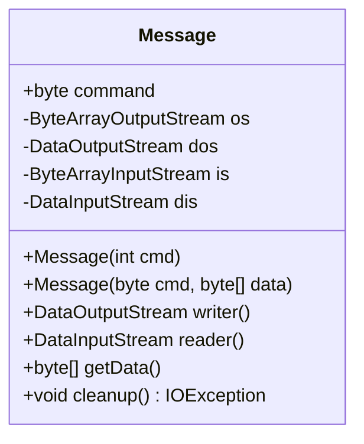
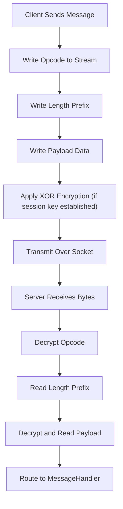
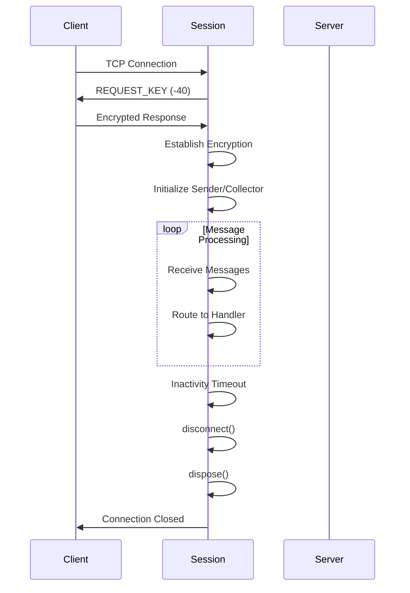
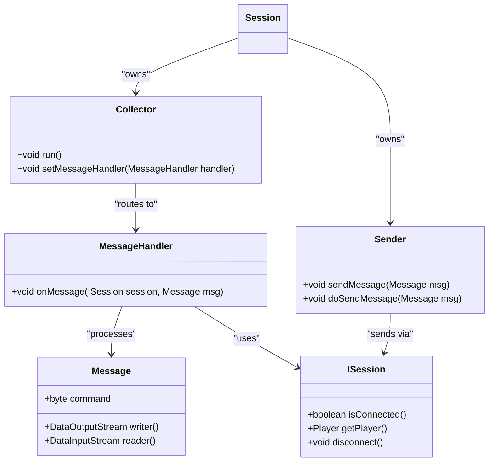
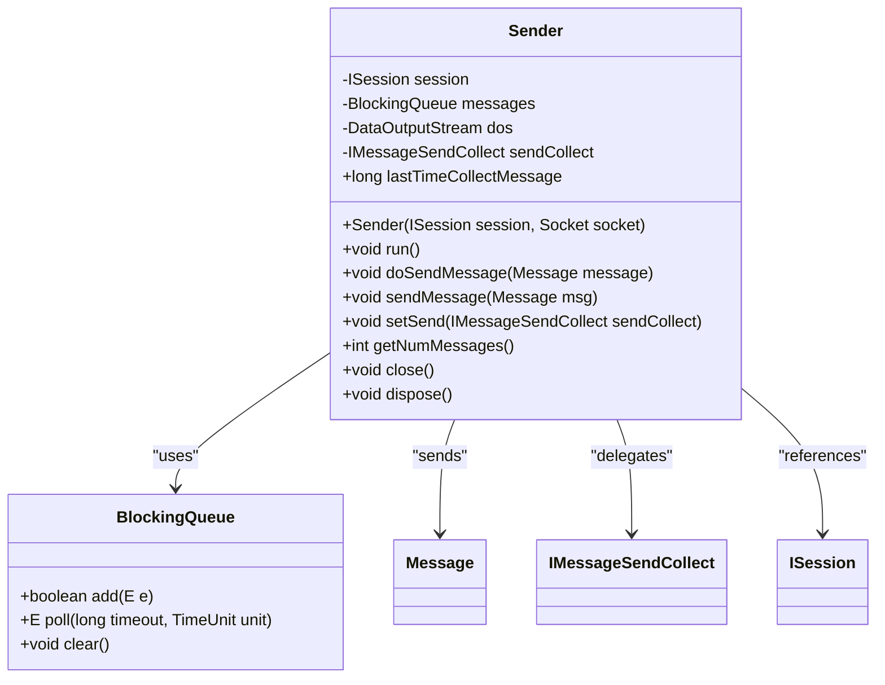
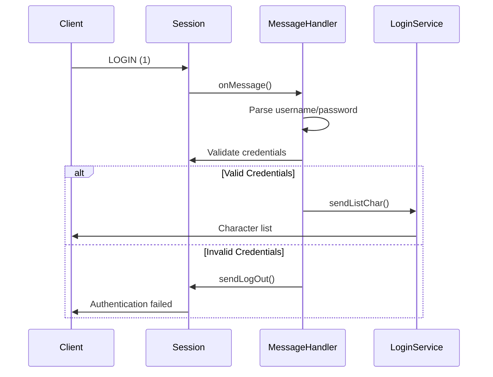
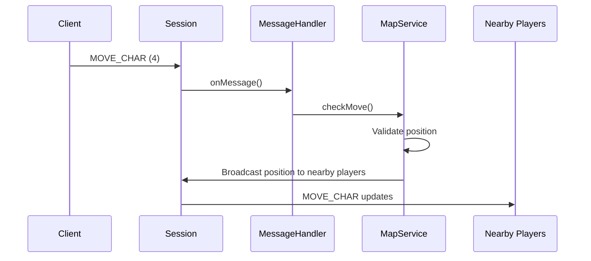
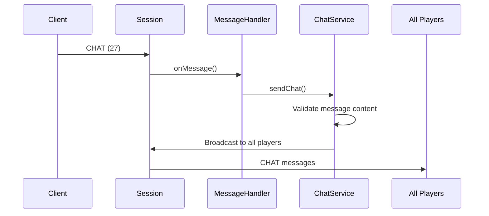
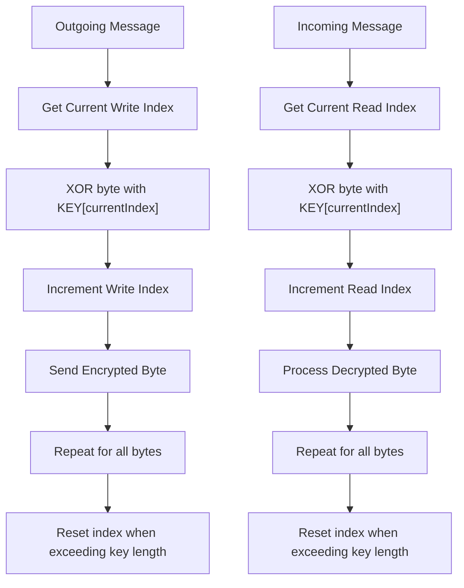

# Network Communication

<cite>
**Referenced Files in This Document**   
- [Message.java](file://src/main/java/network/Message.java)
- [Session.java](file://src/main/java/network/Session.java)
- [MessageHandler.java](file://src/main/java/network/MessageHandler.java)
- [Sender.java](file://src/main/java/network/Sender.java)
- [Collector.java](file://src/main/java/network/Collector.java)
- [CommandMessage.java](file://src/main/java/utils/CommandMessage.java)
- [IMessageSendCollect.java](file://src/main/java/interfaces/IMessageSendCollect.java)
- [MessageSendCollect.java](file://src/main/java/network/MessageSendCollect.java)
- [Settings.java](file://src/main/java/manager/Settings.java)
- [ISession.java](file://src/main/java/interfaces/ISession.java)
</cite>

## Table of Contents
1. [Introduction](#introduction)
2. [Binary Message Protocol Structure](#binary-message-protocol-structure)
3. [Client Connection Lifecycle](#client-connection-lifecycle)
4. [Message Handling and Routing](#message-handling-and-routing)
5. [Request-Response and Asynchronous Messaging](#request-response-and-asynchronous-messaging)
6. [Common Message Exchanges](#common-message-exchanges)
7. [Security and Validation](#security-and-validation)
8. [Conclusion](#conclusion)

## Introduction
This document provides comprehensive API documentation for the socket-based network communication system used in the KPAH game server. The system implements a binary protocol for efficient client-server interaction, supporting real-time gameplay features such as character movement, combat, chat, and inventory management. The architecture is built around a session-based model with dedicated message handling, encryption, and routing mechanisms to ensure secure and reliable communication between clients and the game server.

**Section sources**
- [Session.java](file://src/main/java/network/Session.java#L1-L50)
- [Message.java](file://src/main/java/network/Message.java#L1-L10)

## Binary Message Protocol Structure

The network communication system uses a custom binary message protocol designed for efficiency and security in real-time game interactions. Each message follows a structured format with opcode, length prefix, and encrypted payload.

### Message Format
The binary message structure consists of three main components:
1. **Opcode (1 byte)**: Identifies the message type and determines how the payload should be processed
2. **Length Prefix (2 or 4 bytes)**: Specifies the size of the payload data
3. **Payload (variable length)**: Contains the actual message data in serialized form

For encrypted connections (after key exchange), both the opcode and payload are XOR-encrypted using a rotating key sequence defined in Settings.KEYS.

### Message Class Implementation
The `Message` class serves as the fundamental container for network communication, providing methods to write data to outgoing messages and read data from incoming messages.

**Diagram sources**
- [Message.java](file://src/main/java/network/Message.java#L1-L55)

### Opcode System
The system uses a comprehensive opcode system defined in CommandMessage.java, where each constant represents a specific client-server interaction. Opcodes are represented as signed bytes, allowing values from -128 to 127.

Common opcode categories include:
- **Authentication**: LOGIN (1), LOGOUT (2)
- **Character Management**: CREATE_CHAR (14), CHARLIST (13)
- **Movement**: MOVE_CHAR (4), CHANGE_MAP (12)
- **Combat**: PLAYER_ATTACK_MONSTER (9), USE_BUFF (51)
- **Chat**: CHAT (27), MESSAGE_PRIVATE (-5)
- **Inventory**: USE_ITEM (29), SELL_ITEM (28)

**Diagram sources**
- [CommandMessage.java](file://src/main/java/utils/CommandMessage.java#L1-L362)
- [MessageSendCollect.java](file://src/main/java/network/MessageSendCollect.java#L10-L40)

**Section sources**
- [Message.java](file://src/main/java/network/Message.java#L1-L55)
- [CommandMessage.java](file://src/main/java/utils/CommandMessage.java#L1-L362)
- [MessageSendCollect.java](file://src/main/java/network/MessageSendCollect.java#L1-L124)

## Client Connection Lifecycle

The client connection lifecycle is managed through the Session class, which handles the complete process from initial connection to disconnection and resource cleanup.

### Session Creation
When a client connects to the server, a new Session object is created and associated with the client's socket connection. The session is assigned a unique ID and initial connection properties are configured.

### Key Exchange Process
The connection begins with a security key exchange to enable encrypted communication:

1. Server sends REQUEST_KEY (-40) message containing the key sequence
2. Client and server establish XOR encryption using the shared key
3. Subsequent messages are encrypted/decrypted using rotating key indices

### Connection States
The session maintains several state variables to track connection status:
- **connected**: Boolean flag indicating active connection
- **sendKeyComplete**: Flag indicating successful key exchange
- **player**: Reference to the authenticated player object
- **listChar**: Collection of player characters associated with the account

### Disconnection and Cleanup
When a client disconnects (intentionally or due to timeout), the session performs comprehensive cleanup:
- Terminates sender and collector threads
- Closes socket connection
- Disposes of player resources
- Removes session from client manager

**Diagram sources**
- [Session.java](file://src/main/java/network/Session.java#L1-L398)
- [ISession.java](file://src/main/java/interfaces/ISession.java#L1-L85)

**Section sources**
- [Session.java](file://src/main/java/network/Session.java#L1-L398)
- [ISession.java](file://src/main/java/interfaces/ISession.java#L1-L85)

## Message Handling and Routing

The message handling system is centered around the MessageHandler class, which routes incoming messages to appropriate service handlers based on the message opcode.

### MessageHandler Architecture
The MessageHandler uses a switch-case pattern to route messages to specific service methods based on the command opcode. Each case corresponds to a particular game functionality.

### Routing Process
1. Message is received by Collector thread
2. MessageHandler.onMessage() is invoked with session and message
3. Switch statement routes based on message.command
4. Appropriate service method is called with parsed parameters
5. Service processes the request and may send response messages

### Thread Safety
The message handling system operates on dedicated threads to ensure non-blocking processing:
- **Collector**: Runs in a separate thread to continuously read incoming messages
- **Sender**: Runs in a separate thread to queue and send outgoing messages
- **Virtual Threads**: Uses ExecutorVirtualThread for efficient thread management

**Diagram sources**
- [MessageHandler.java](file://src/main/java/network/MessageHandler.java#L1-L671)
- [Session.java](file://src/main/java/network/Session.java#L1-L398)
- [Collector.java](file://src/main/java/network/Collector.java#L1-L82)

**Section sources**
- [MessageHandler.java](file://src/main/java/network/MessageHandler.java#L1-L671)
- [Session.java](file://src/main/java/network/Session.java#L1-L398)
- [Collector.java](file://src/main/java/network/Collector.java#L1-L82)

## Request-Response and Asynchronous Messaging

The communication system supports both request-response patterns and asynchronous message pushing through the Sender component.

### Request-Response Pattern
The typical request-response flow follows these steps:
1. Client sends a message with specific opcode and parameters
2. Server processes the request through the appropriate service
3. Server sends one or more response messages back to the client
4. Client processes the response and updates UI/game state

### Asynchronous Message Pushing
The Sender class enables the server to push messages to clients without waiting for a request:

**Diagram sources**
- [Sender.java](file://src/main/java/network/Sender.java#L1-L97)
- [Message.java](file://src/main/java/network/Message.java#L1-L55)

### Message Queue Management
The Sender implements a thread-safe message queue using LinkedBlockingQueue:
- Messages are added to the queue via sendMessage()
- The run() method continuously processes the queue
- Messages are sent in order of arrival
- Empty queue is handled with 5ms sleep to prevent CPU spinning

### Heartbeat and Timeout
The system includes connection monitoring through:
- **lastTimeCollectMessage**: Updated when messages are sent
- **MILISECOND_WAIT_KICK_SESSION**: 60-second timeout for unauthenticated sessions
- **MILISECOND_WAIT_KICK_PLAYER**: 600-second timeout for authenticated players

**Section sources**
- [Sender.java](file://src/main/java/network/Sender.java#L1-L97)
- [Session.java](file://src/main/java/network/Session.java#L1-L398)
- [Settings.java](file://src/main/java/manager/Settings.java#L1-L58)

## Common Message Exchanges

This section documents examples of common message exchanges in the system.

### Login Sequence

**Diagram sources**
- [Session.java](file://src/main/java/network/Session.java#L250-L300)
- [MessageHandler.java](file://src/main/java/network/MessageHandler.java#L650-L670)

### Movement Exchange

**Diagram sources**
- [MessageHandler.java](file://src/main/java/network/MessageHandler.java#L580-L590)
- [MapService.java](file://src/main/java/services/MapService.java#L1-L10)

### Chat Communication

**Diagram sources**
- [MessageHandler.java](file://src/main/java/network/MessageHandler.java#L560-L570)
- [ChatService.java](file://src/main/java/services/ChatService.java#L1-L10)

**Section sources**
- [MessageHandler.java](file://src/main/java/network/MessageHandler.java#L1-L671)
- [Session.java](file://src/main/java/network/Session.java#L1-L398)

## Security and Validation

The network communication system implements several security measures to protect against common network attacks.

### Message Encryption
After the initial key exchange, all messages are encrypted using XOR cipher with a rotating key:

**Diagram sources**
- [MessageSendCollect.java](file://src/main/java/network/MessageSendCollect.java#L40-L80)
- [Settings.java](file://src/main/java/manager/Settings.java#L1-L58)

### Input Validation
The system performs validation at multiple levels:
- **Session-level**: Connection timeouts and inactivity detection
- **Message-level**: Proper command and data format checking
- **Service-level**: Business logic validation (e.g., inventory limits)

### Attack Protection
The system includes protections against common network attacks:

| Protection Mechanism | Implementation | Purpose |
|---------------------|----------------|---------|
| Packet Flooding | MILISECOND_WAIT_KICK_SESSION (60s) | Prevents denial-of-service from unauthenticated clients |
| Session Hijacking | Unique session IDs and player association | Prevents unauthorized access |
| Data Tampering | XOR encryption with rotating keys | Prevents message interception and modification |
| Resource Exhaustion | Limited character count (max 3) | Prevents account abuse |

**Section sources**
- [MessageSendCollect.java](file://src/main/java/network/MessageSendCollect.java#L1-L124)
- [Session.java](file://src/main/java/network/Session.java#L1-L398)
- [Settings.java](file://src/main/java/manager/Settings.java#L1-L58)

## Conclusion
The socket-based network communication system provides a robust foundation for real-time game interactions in the KPAH server. The binary message protocol with opcode-based routing enables efficient and secure communication between clients and server. The architecture separates concerns through dedicated components for message handling, encryption, and connection management, allowing for scalable and maintainable code. The system supports both request-response patterns and asynchronous message pushing, accommodating various gameplay needs from login sequences to real-time combat. Security features including XOR encryption and connection monitoring protect against common network threats while maintaining performance for real-time gameplay.