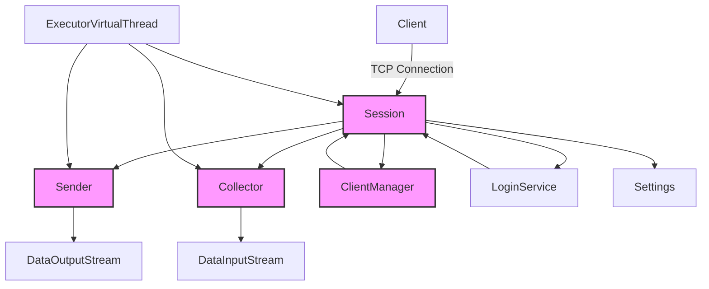
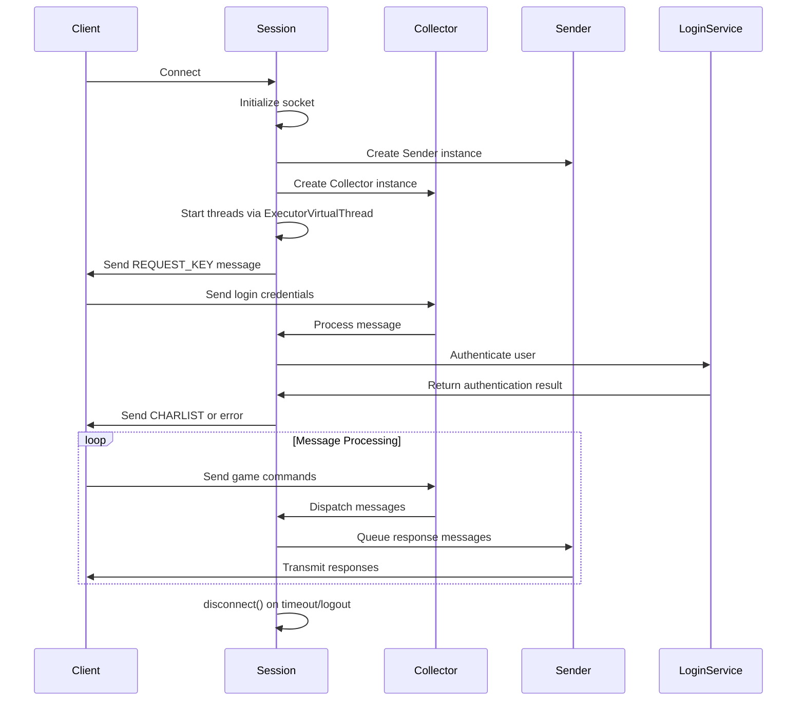
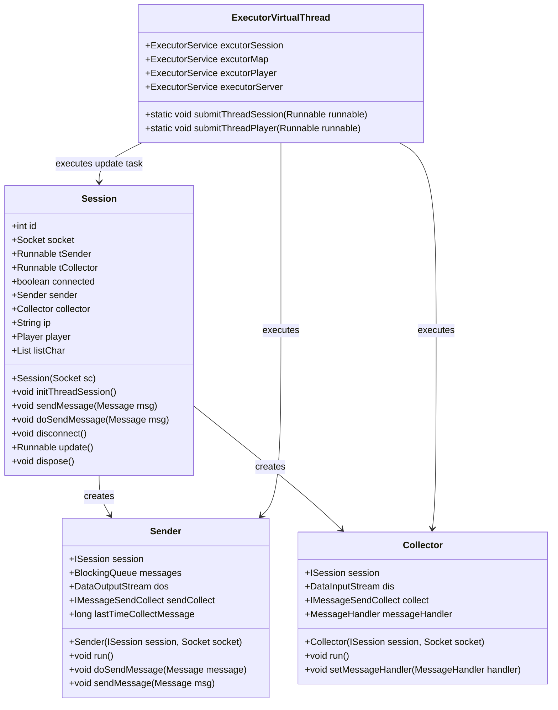

# Session Management

<cite>
**Referenced Files in This Document**   
- [Session.java](file://src/main/java/network/Session.java)
- [ISession.java](file://src/main/java/interfaces/ISession.java)
- [Sender.java](file://src/main/java/network/Sender.java)
- [Collector.java](file://src/main/java/network/Collector.java)
- [Settings.java](file://src/main/java/manager/Settings.java)
- [ClientManager.java](file://src/main/java/manager/ClientManager.java)
- [LoginService.java](file://src/main/java/services/LoginService.java)
- [ExecutorVirtualThread.java](file://src/main/java/manager/ExecutorVirtualThread.java)
- [CommandMessage.java](file://src/main/java/utils/CommandMessage.java)
- [Message.java](file://src/main/java/network/Message.java)
</cite>

## Table of Contents
1. [Introduction](#introduction)
2. [Core Components](#core-components)
3. [Architecture Overview](#architecture-overview)
4. [Session Lifecycle Management](#session-lifecycle-management)
5. [Communication Protocol and Message Handling](#communication-protocol-and-message-handling)
6. [Thread Safety and Concurrency Model](#thread-safety-and-concurrency-model)
7. [Security Considerations](#security-considerations)
8. [Error Handling and Timeout Management](#error-handling-and-timeout-management)
9. [Integration with Player Management](#integration-with-player-management)
10. [Conclusion](#conclusion)

## Introduction
The Session class is a fundamental component of the KPAH server architecture, responsible for managing individual client connections in a high-concurrency environment supporting over 40,000 players. This document provides comprehensive documentation of the Session implementation, focusing on its role in establishing, maintaining, and terminating client connections. The class implements the ISession interface to ensure standardized communication contracts across the system. Key responsibilities include connection lifecycle management, secure handshake initialization via sendKey(), message dispatch through doSendMessage(), and integration with player authentication and game state management systems.

**Section sources**
- [Session.java](file://src/main/java/network/Session.java#L1-L398)
- [ISession.java](file://src/main/java/interfaces/ISession.java#L1-L85)

## Core Components

The Session class works in conjunction with several key components to manage client connections effectively. The Sender and Collector classes handle outbound and inbound message processing respectively, while the ISession interface defines the contract for session operations. The ClientManager maintains global tracking of active sessions and players, and the ExecutorVirtualThread class provides the concurrency infrastructure. Settings contains configuration parameters that govern session behavior, including timeout thresholds and maximum player limits.

**Section sources**
- [Session.java](file://src/main/java/network/Session.java#L1-L398)
- [Sender.java](file://src/main/java/network/Sender.java#L1-L97)
- [Collector.java](file://src/main/java/network/Collector.java#L1-L82)
- [ClientManager.java](file://src/main/java/manager/ClientManager.java#L1-L93)
- [ExecutorVirtualThread.java](file://src/main/java/manager/ExecutorVirtualThread.java#L1-L36)
- [Settings.java](file://src/main/java/manager/Settings.java#L1-L58)

## Architecture Overview



**Diagram sources**
- [Session.java](file://src/main/java/network/Session.java#L1-L398)
- [Sender.java](file://src/main/java/network/Sender.java#L1-L97)
- [Collector.java](file://src/main/java/network/Collector.java#L1-L82)
- [ClientManager.java](file://src/main/java/manager/ClientManager.java#L1-L93)
- [ExecutorVirtualThread.java](file://src/main/java/manager/ExecutorVirtualThread.java#L1-L36)

## Session Lifecycle Management

The Session lifecycle begins with connection establishment through the constructor, which initializes the socket connection and sets up basic session properties including IP address and connection status. The lifecycle progresses through several key phases: connection initialization, authentication, player association, and eventual disconnection. The sendKey() method initiates a security handshake by sending encryption keys to the client, while loginAccount() handles credential verification and user authentication. Upon successful login, the session associates with a Player object through setPlayer(), integrating the connection with game state. The disconnect() method terminates the session, closing all resources and removing the session from active tracking. The update() method implements timeout detection, automatically disconnecting idle sessions based on Settings.MILISECOND_WAIT_KICK_SESSION and Settings.MILISECOND_WAIT_KICK_PLAYER thresholds.

**Section sources**
- [Session.java](file://src/main/java/network/Session.java#L25-L398)
- [Settings.java](file://src/main/java/manager/Settings.java#L1-L58)
- [LoginService.java](file://src/main/java/services/LoginService.java#L1-L228)

## Communication Protocol and Message Handling

The Session class implements a robust message handling system through its integration with Sender and Collector components. The sendKey() method initiates communication by sending a REQUEST_KEY message containing obfuscated encryption keys from Settings.KEYS. The Collector runs in a separate thread, continuously reading incoming messages and dispatching them to the appropriate handlers. When a REQUEST_KEY command is received, the session responds by calling sendKey() to complete the handshake. Message dispatch is handled through the sendMessage() and doSendMessage() methods, which queue messages for asynchronous transmission by the Sender component. The IMessageSendCollect interface enables centralized message processing, allowing for consistent handling of message serialization and deserialization across all sessions.



**Diagram sources**
- [Session.java](file://src/main/java/network/Session.java#L1-L398)
- [Sender.java](file://src/main/java/network/Sender.java#L1-L97)
- [Collector.java](file://src/main/java/network/Collector.java#L1-L82)
- [LoginService.java](file://src/main/java/services/LoginService.java#L1-L228)
- [CommandMessage.java](file://src/main/java/utils/CommandMessage.java#L1-L362)

## Thread Safety and Concurrency Model

The Session implementation leverages Java's virtual threads through the ExecutorVirtualThread class to handle high-concurrency demands. Each session spawns two dedicated threads: one for sending messages (tSender) and one for collecting incoming messages (tCollector). These threads are submitted to virtual thread executors, enabling efficient handling of tens of thousands of concurrent connections. The @Synchronized annotation from Lombok ensures thread-safe execution of critical methods like emptyListChar() and reloadChar(). The Sender and Collector components use blocking queues and synchronized methods to prevent race conditions during message processing. The ClientManager uses ConcurrentHashMap instances to safely manage shared collections of players and sessions across threads. This architecture allows the server to maintain 40,000+ simultaneous connections while ensuring data consistency and preventing race conditions.



**Diagram sources**
- [Session.java](file://src/main/java/network/Session.java#L1-L398)
- [Sender.java](file://src/main/java/network/Sender.java#L1-L97)
- [Collector.java](file://src/main/java/network/Collector.java#L1-L82)
- [ExecutorVirtualThread.java](file://src/main/java/manager/ExecutorVirtualThread.java#L1-L36)

## Security Considerations

The Session class implements multiple security measures to protect against common threats in online gaming environments. The sendKey() method establishes a secure communication channel by exchanging encryption keys, helping prevent session hijacking. The loginAccount() method includes protection against concurrent logins by checking ClientManager.getPlayerByUserID() and disconnecting existing sessions for the same user. Rate limiting is implicitly enforced through the message processing architecture, as each session has dedicated threads and bounded queues, preventing any single client from overwhelming server resources. The system prevents account sharing by allowing only one active session per user ID. Additionally, the dispose() method ensures proper cleanup of session resources, reducing the risk of information leakage between sessions.

**Section sources**
- [Session.java](file://src/main/java/network/Session.java#L1-L398)
- [ClientManager.java](file://src/main/java/manager/ClientManager.java#L1-L93)
- [Settings.java](file://src/main/java/manager/Settings.java#L1-L58)

## Error Handling and Timeout Management

The Session class implements comprehensive error handling and timeout management to maintain server stability. Network interruptions are handled gracefully in the disconnect() method, which safely closes all resources regardless of the error condition. The update() method implements a watchdog mechanism that monitors player activity and disconnects idle sessions based on configurable timeouts from Settings. Two different timeout thresholds are applied: a shorter timeout (MILISECOND_WAIT_KICK_SESSION) for unauthenticated sessions and a longer timeout (MILISECOND_WAIT_KICK_PLAYER) for authenticated players. Exception handling is implemented throughout the codebase with try-catch blocks that prevent individual session errors from affecting the entire server. The Sender and Collector run() methods include exception handling to ensure thread resilience, allowing the session to continue functioning even if individual operations fail.

**Section sources**
- [Session.java](file://src/main/java/network/Session.java#L1-L398)
- [Settings.java](file://src/main/java/manager/Settings.java#L1-L58)
- [Sender.java](file://src/main/java/network/Sender.java#L1-L97)
- [Collector.java](file://src/main/java/network/Collector.java#L1-L82)

## Integration with Player Management

The Session class integrates closely with player management systems through the ClientManager and LoginService classes. During login, the loginAccount() method authenticates credentials against the database and populates the listChar collection with the player's characters. The setPlayer() method associates a specific Player object with the session and registers it with ClientManager.joinPlayer(). The emptyListChar() and reloadChar() methods manage character data persistence, updating the database when characters are added or removed. The findPlayer() method enables efficient lookup of player objects within the session's character list. This integration ensures that each active session maintains a complete view of the player's game state while providing the server with global visibility into all connected players.

```mermaid
flowchart TD
A[Client Connects] --> B[Session Created]
B --> C[sendKey() - Security Handshake]
C --> D[loginAccount() - Authentication]
D --> E{Authentication Success?}
E --> |Yes| F[Load Character List]
E --> |No| G[Send Error & Disconnect]
F --> H[sendListChar() to Client]
H --> I{Player Selects Character}
I --> J[selectChar() in LoginService]
J --> K[setPlayer() - Associate Player with Session]
K --> L[sendDataWhenLogin() - Initialize Game State]
L --> M[Start Game Loop]
M --> N{Session Active?}
N --> |Yes| O[Process Game Messages]
N --> |No| P[disconnect() - Cleanup Resources]
P --> Q[Session Terminated]
style K fill:#f9f,stroke:#333
style L fill:#f9f,stroke:#333
```

**Diagram sources**
- [Session.java](file://src/main/java/network/Session.java#L1-L398)
- [LoginService.java](file://src/main/java/services/LoginService.java#L1-L228)
- [ClientManager.java](file://src/main/java/manager/ClientManager.java#L1-L93)

## Conclusion

The Session class provides a robust foundation for managing client connections in the KPAH server, supporting high-concurrency requirements while maintaining security and reliability. By implementing the ISession interface, it ensures consistent behavior across the system. The architecture effectively separates concerns between message sending, receiving, and session management, while leveraging virtual threads for scalability. Security features like session hijacking prevention and concurrent login detection protect user accounts, and comprehensive error handling ensures server stability. The tight integration with player management systems enables seamless transition from connection to gameplay. This design successfully supports the server's requirement of handling 40,000+ simultaneous players while providing a responsive and secure gaming experience.