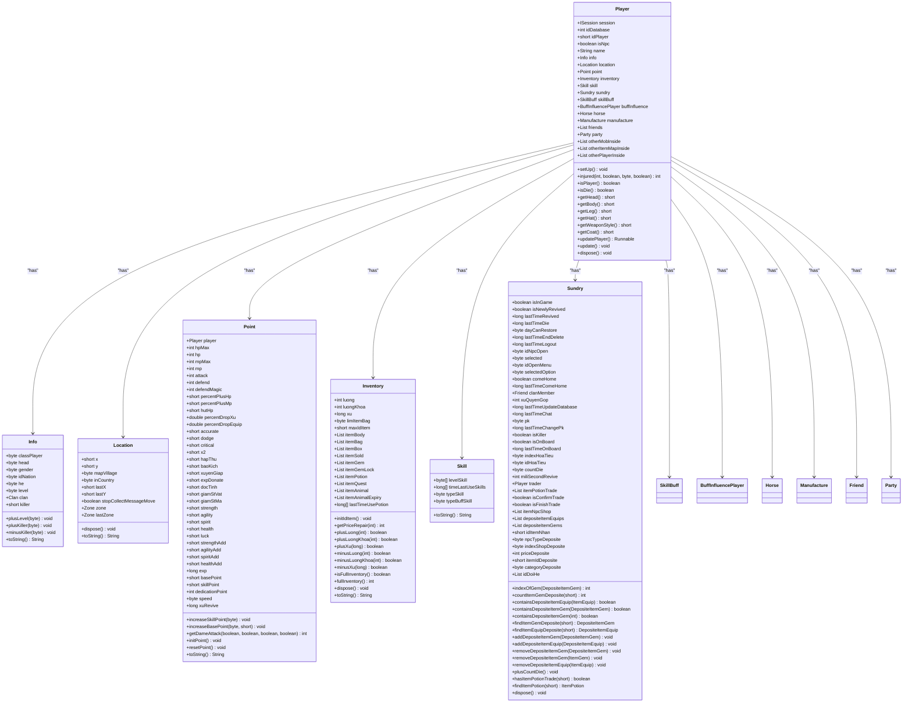
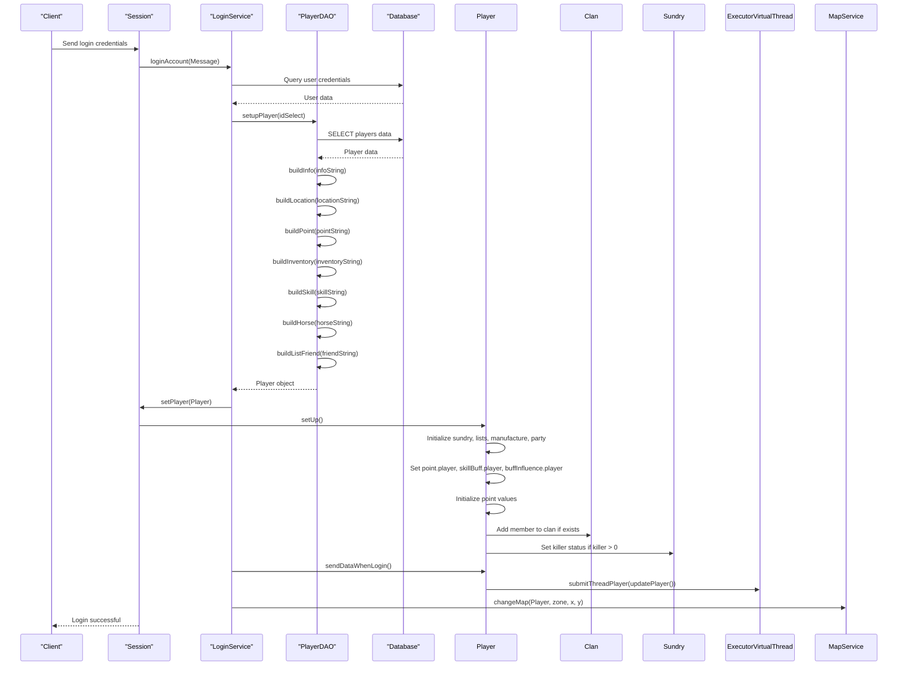
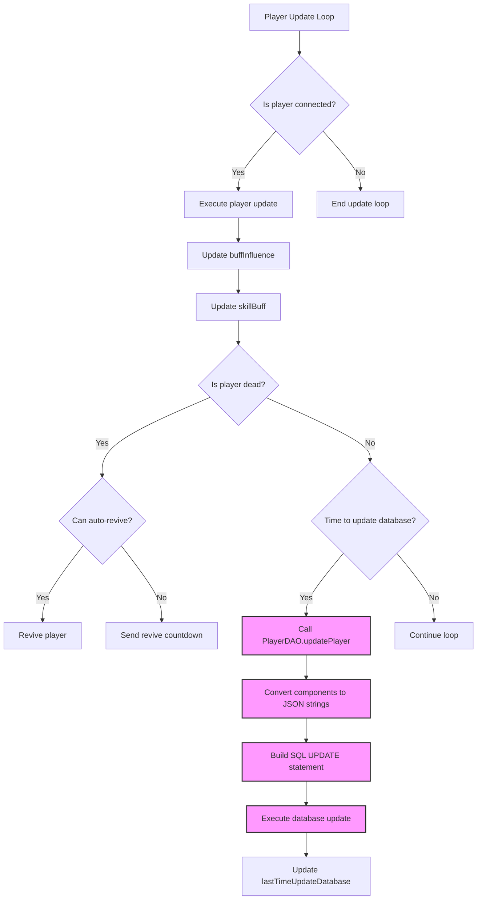
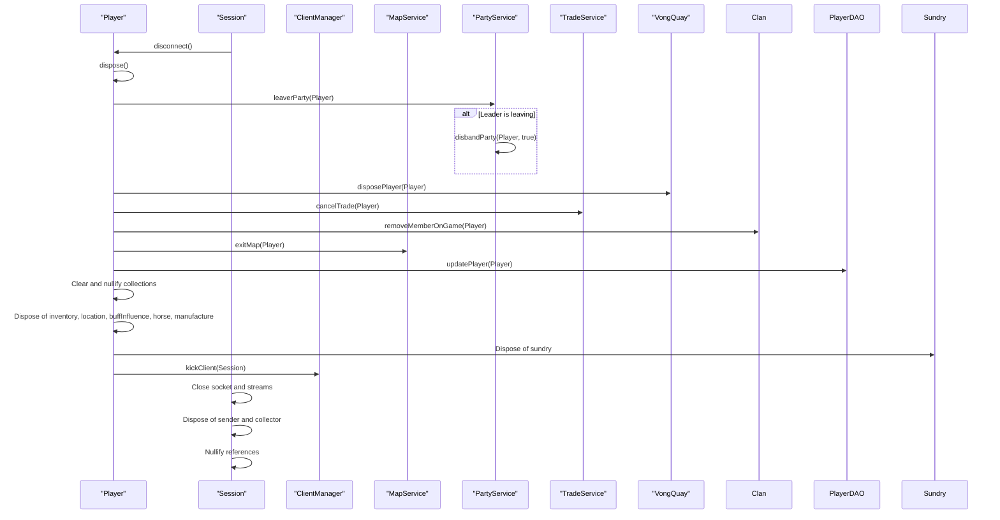

# Character Management

<cite>
**Referenced Files in This Document**   
- [Player.java](file://src/main/java/player/Player.java)
- [Info.java](file://src/main/java/player/Info.java)
- [Location.java](file://src/main/java/player/Location.java)
- [PlayerDAO.java](file://src/main/java/daos/PlayerDAO.java)
- [LoginService.java](file://src/main/java/services/LoginService.java)
- [Session.java](file://src/main/java/network/Session.java)
- [Point.java](file://src/main/java/player/Point.java)
- [Inventory.java](file://src/main/java/player/Inventory.java)
- [Skill.java](file://src/main/java/player/Skill.java)
- [Sundry.java](file://src/main/java/player/Sundry.java)
</cite>

## Table of Contents
1. [Introduction](#introduction)
2. [Core Character Components](#core-character-components)
3. [Character Initialization and Login Flow](#character-initialization-and-login-flow)
4. [State Persistence and Data Synchronization](#state-persistence-and-data-synchronization)
5. [Disconnection and Cleanup Handling](#disconnection-and-cleanup-handling)
6. [Common Issues and Security Risks](#common-issues-and-security-risks)
7. [Best Practices for Character Management](#best-practices-for-character-management)
8. [Conclusion](#conclusion)

## Introduction
This document provides a comprehensive analysis of character management in the KPAH game server, focusing on the core entity Player.java and its associated components. The Player class serves as the central representation of a player's character, aggregating personal data, status, and session state throughout the game lifecycle. This documentation details the architecture, initialization process, state persistence mechanisms, and disconnection handling procedures that ensure robust character management. It also addresses common issues such as race conditions during login, session hijacking risks, and memory bloat from inactive player instances, providing best practices for extending character attributes and optimizing load times.

## Core Character Components

The character management system in KPAH is built around several core components that work together to represent and manage player characters. The Player.java class serves as the primary entity, aggregating various sub-components that handle specific aspects of character data and behavior.



**Diagram sources**
- [Player.java](file://src/main/java/player/Player.java#L1-L310)
- [Info.java](file://src/main/java/player/Info.java#L1-L64)
- [Location.java](file://src/main/java/player/Location.java#L1-L48)
- [Point.java](file://src/main/java/player/Point.java#L1-L593)
- [Inventory.java](file://src/main/java/player/Inventory.java#L1-L246)
- [Skill.java](file://src/main/java/player/Skill.java#L1-L31)
- [Sundry.java](file://src/main/java/player/Sundry.java#L1-L169)

**Section sources**
- [Player.java](file://src/main/java/player/Player.java#L1-L310)
- [Info.java](file://src/main/java/player/Info.java#L1-L64)
- [Location.java](file://src/main/java/player/Location.java#L1-L48)

## Character Initialization and Login Flow

The character initialization process in KPAH begins with the login sequence, where player data is loaded from the database and the Player object is constructed. The PlayerDAO.setupPlayer method is responsible for creating a Player instance by retrieving data from the database and populating the various components.



**Diagram sources**
- [PlayerDAO.java](file://src/main/java/daos/PlayerDAO.java#L1-L556)
- [LoginService.java](file://src/main/java/services/LoginService.java#L1-L229)
- [Session.java](file://src/main/java/network/Session.java#L1-L399)
- [Player.java](file://src/main/java/player/Player.java#L1-L310)

**Section sources**
- [PlayerDAO.java](file://src/main/java/daos/PlayerDAO.java#L1-L556)
- [LoginService.java](file://src/main/java/services/LoginService.java#L1-L229)
- [Session.java](file://src/main/java/network/Session.java#L1-L399)

## State Persistence and Data Synchronization

The KPAH game server implements a robust state persistence mechanism to ensure that player data is consistently saved to the database. The PlayerDAO.updatePlayer method is responsible for persisting player state, which is called periodically during gameplay and at critical moments such as character logout or disconnection.



The updatePlayer method in the Player class runs on a separate thread and is responsible for managing the player's state updates. It calls the update method periodically, which in turn checks various conditions and triggers appropriate actions. The update method handles buff and skill updates, auto-revive logic for dead players, and database persistence when the configured time interval has elapsed.

**Diagram sources**
- [Player.java](file://src/main/java/player/Player.java#L1-L310)
- [PlayerDAO.java](file://src/main/java/daos/PlayerDAO.java#L1-L556)

**Section sources**
- [Player.java](file://src/main/java/player/Player.java#L1-L310)
- [PlayerDAO.java](file://src/main/java/daos/PlayerDAO.java#L1-L556)

## Disconnection and Cleanup Handling

Proper disconnection and cleanup handling is critical for maintaining server stability and preventing resource leaks. The KPAH game server implements a comprehensive cleanup process that ensures all player-related resources are properly released when a player disconnects.



The dispose method in the Player class is responsible for cleaning up all player-related resources. It handles party management by removing the player from their party or disbanding the party if the player is the leader. It also cancels any ongoing trades, removes the player from their clan, exits the current map, and updates the player's data in the database. After these operations, it clears and nullifies all collections and disposes of sub-components to prevent memory leaks.

**Diagram sources**
- [Player.java](file://src/main/java/player/Player.java#L1-L310)
- [Session.java](file://src/main/java/network/Session.java#L1-L399)
- [PlayerDAO.java](file://src/main/java/daos/PlayerDAO.java#L1-L556)

**Section sources**
- [Player.java](file://src/main/java/player/Player.java#L1-L310)
- [Session.java](file://src/main/java/network/Session.java#L1-L399)

## Common Issues and Security Risks

The KPAH game server faces several common issues and security risks related to character management that must be addressed to ensure a stable and secure gaming environment.

### Race Conditions During Login
One potential race condition occurs during the login process when a player attempts to log in while already logged in from another session. The server handles this by checking if the player is already in the ClientManager's player list. If the player is found, the server disconnects both the current session and the existing session to prevent multiple instances of the same character.

```mermaid
flowchart TD
A[Player attempts login] --> B{Player already in ClientManager?}
B --> |Yes| C[Disconnect existing session]
C --> D[Disconnect current session]
C --> E[Send "account logged in elsewhere" message]
B --> |No| F[Proceed with login process]
F --> G[Add player to ClientManager]
G --> H[Complete login]
```

### Session Hijacking Risks
Session hijacking is mitigated through several mechanisms. The server verifies the user ID and username when processing character selection, ensuring that players can only access characters associated with their account. Additionally, the server checks for existing sessions with the same user ID and disconnects them if found, preventing concurrent logins.

### Memory Bloat from Inactive Player Instances
Memory bloat can occur if player instances are not properly cleaned up after disconnection. The server addresses this through the comprehensive dispose method in the Player class, which clears all collections, disposes of sub-components, and nullifies references. The ClientManager also removes disconnected players from its tracking lists to prevent memory leaks.

**Section sources**
- [LoginService.java](file://src/main/java/services/LoginService.java#L1-L229)
- [Session.java](file://src/main/java/network/Session.java#L1-L399)
- [Player.java](file://src/main/java/player/Player.java#L1-L310)

## Best Practices for Character Management

To ensure optimal performance and maintainability of the character management system in KPAH, several best practices should be followed when extending character attributes and optimizing load times.

### Extending Character Attributes
When adding new character attributes, consider the following guidelines:
- Add new fields to the appropriate component class (Info, Point, Inventory, etc.) based on the attribute type
- Ensure proper JSON serialization by updating the toString method in the component class
- If the attribute affects gameplay mechanics, update the relevant calculation methods in Point.java
- For persistent attributes, ensure they are included in the database schema and PlayerDAO methods

### Optimizing Load Times
To optimize character load times, consider the following strategies:
- Implement lazy loading for non-essential data that can be loaded after the initial character setup
- Optimize database queries by using indexed columns and minimizing the amount of data retrieved
- Consider caching frequently accessed data that doesn't change often
- Batch database operations when possible to reduce round-trip times

### Performance Monitoring
Implement monitoring to track character management performance:
- Log the time taken for player initialization and database operations
- Monitor memory usage to detect potential leaks
- Track the number of active player instances to identify scaling issues

### Error Handling
Robust error handling is essential for maintaining server stability:
- Implement comprehensive exception handling in database operations
- Validate data integrity when loading player data
- Provide meaningful error messages for debugging purposes
- Implement retry mechanisms for transient database errors

**Section sources**
- [Player.java](file://src/main/java/player/Player.java#L1-L310)
- [PlayerDAO.java](file://src/main/java/daos/PlayerDAO.java#L1-L556)
- [LoginService.java](file://src/main/java/services/LoginService.java#L1-L229)

## Conclusion
The character management system in the KPAH game server is a comprehensive and well-structured implementation that effectively handles player character representation, initialization, state persistence, and cleanup. The Player.java class serves as the central entity, aggregating various components that manage specific aspects of character data and behavior. The system demonstrates robust handling of the login process, state persistence, and disconnection cleanup, while addressing common issues such as race conditions and security risks. By following the best practices outlined in this document, developers can extend and optimize the character management system to meet evolving game requirements while maintaining performance and stability.