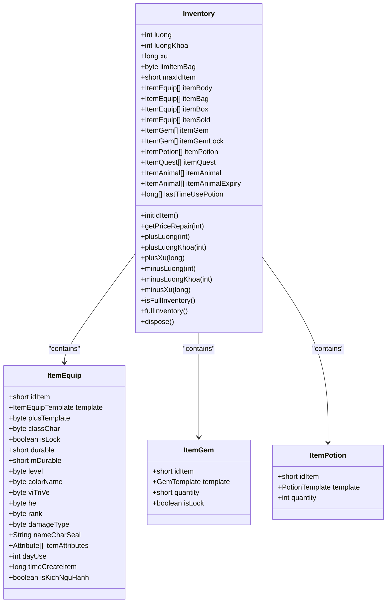
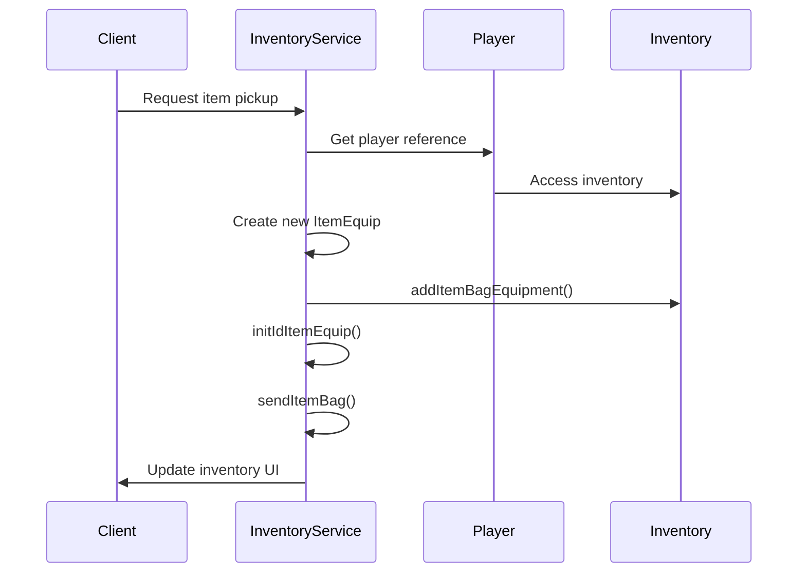
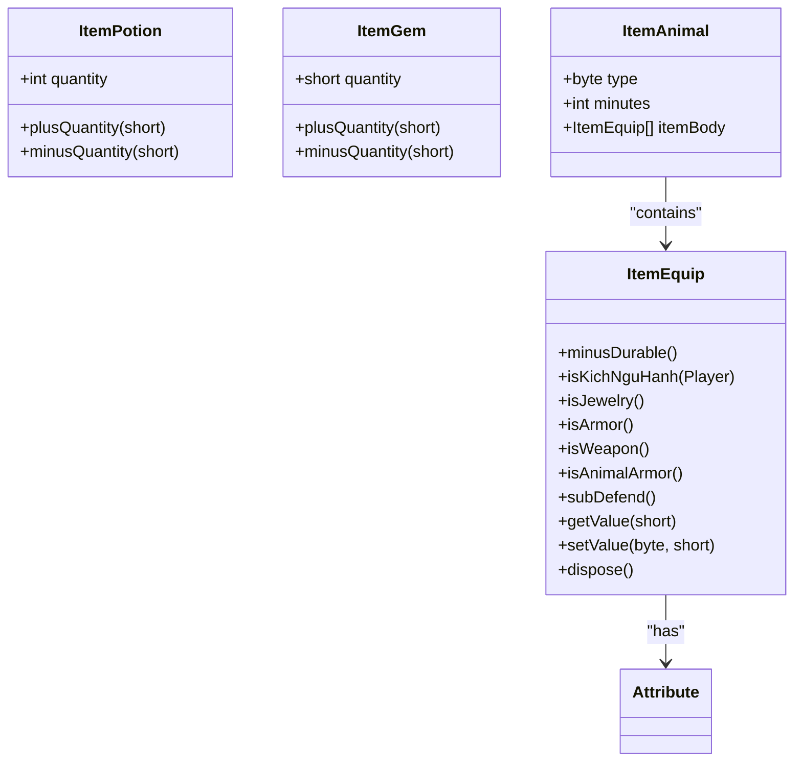
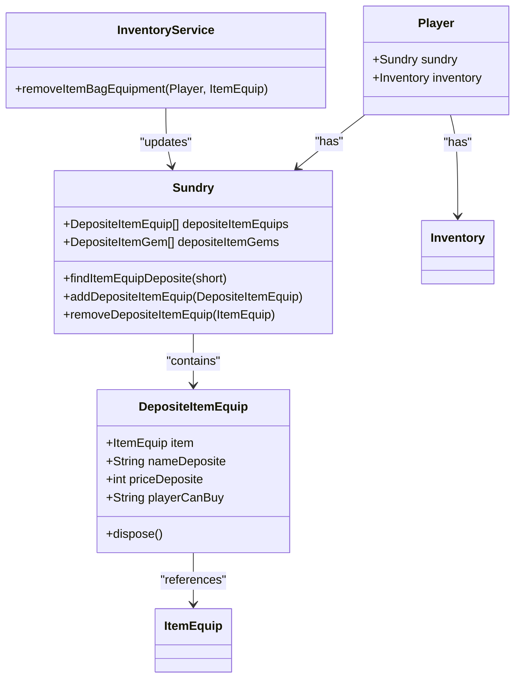

# Inventory Management

<cite>
**Referenced Files in This Document**   
- [Inventory.java](file://src/main/java/player/Inventory.java)
- [InventoryService.java](file://src/main/java/services/InventoryService.java)
- [ItemEquip.java](file://src/main/java/item/ItemEquip.java)
- [DepositeItemEquip.java](file://src/main/java/deposite/DepositeItemEquip.java)
- [Player.java](file://src/main/java/player/Player.java)
- [Sundry.java](file://src/main/java/player/Sundry.java)
</cite>

## Table of Contents
1. [Introduction](#introduction)
2. [Inventory Structure and Item Management](#inventory-structure-and-item-management)
3. [Inventory Service Operations](#inventory-service-operations)
4. [Specialized Item Handling](#specialized-item-handling)
5. [Item Ownership and Deposit System](#item-ownership-and-deposit-system)
6. [Common Issues and Error Handling](#common-issues-and-error-handling)
7. [Best Practices for Inventory Management](#best-practices-for-inventory-management)
8. [Conclusion](#conclusion)

## Introduction
The player inventory system is a core component of the game's item management framework, responsible for handling equipment, consumables, currency, and special items. This document provides a comprehensive analysis of the inventory architecture, focusing on the `Inventory.java` class and its integration with `InventoryService.java`. The system manages item slots, stack limits, ownership rules, and interactions with specialized item types such as equipment and deposited items. The documentation includes real-world examples of common operations like item pickup, equipment swapping, and stack merging, along with guidance on addressing common issues and implementing best practices for secure and efficient inventory management.

## Inventory Structure and Item Management

The `Inventory.java` class serves as the central data structure for player inventory management, organizing items into distinct categories based on their type and usage. The inventory system implements a comprehensive slot-based architecture with specific collections for different item types, including equipment worn on the body, items stored in the bag, and specialized containers for gems, potions, and quest items.

The inventory maintains several key fields for tracking player resources:
- **luong**: General currency
- **luongKhoa**: Locked currency
- **xu**: Secondary currency
- **limItemBag**: Bag capacity limit
- **maxIdItem**: Maximum item identifier for unique tracking

Item organization is implemented through dedicated lists for each item category:
- **itemBody**: Equipment currently worn by the player
- **itemBag**: Items stored in the player's inventory bag
- **itemBox**: Items stored in the personal storage box
- **itemPotion**: Consumable potion items
- **itemGem**: Gem items that can be equipped or used
- **itemQuest**: Quest-specific items

The system includes methods for managing inventory capacity and resource tracking, such as `isFullInventory()` which checks if the inventory has reached its capacity limit, and various methods for adding or subtracting currency amounts with validation to prevent negative balances.

**Diagram sources**
- [Inventory.java](file://src/main/java/player/Inventory.java#L15-L245)
- [ItemEquip.java](file://src/main/java/item/ItemEquip.java#L15-L183)

**Section sources**
- [Inventory.java](file://src/main/java/player/Inventory.java#L15-L245)

## Inventory Service Operations

The `InventoryService.java` class provides the operational interface for inventory management, implementing all business logic for item manipulation, equipment management, and inventory synchronization. As a singleton service, it ensures thread-safe operations through the `@Synchronized` annotation on critical methods, preventing race conditions during concurrent inventory modifications.

Key operations provided by the inventory service include:

### Item Addition and Removal
The service implements a comprehensive set of methods for adding and removing items from various inventory locations:
- **addItemBagEquipment()**: Adds an item to the player's inventory bag
- **addItemBodyEquipment()**: Equips an item on the player's character
- **addItemBoxEquipment()**: Stores an item in the personal storage box
- **addItemPotion()**: Adds potion items with automatic stack merging
- **removeItemBagEquipment()**: Removes an item from the inventory bag
- **removeItemBodyEquipment()**: Unequips an item from the player

The stack merging logic is particularly important for consumable items like potions and gems. When adding a new potion to the inventory, the system first checks if an identical potion already exists using `findItemPotion()`. If found, the quantities are merged by calling `plusQuantity()` on the existing item, and the new item is disposed of to prevent duplication.

### Equipment Management
The service provides specialized methods for equipment management, including:
- **swapItemBagToBody()**: Swaps an item between the bag and equipment slots
- **repairItem()**: Repairs damaged equipment based on type (weapon, armor, or all)
- **findItemBodyByType()**: Locates equipment by type (e.g., weapon, armor)

The equipment swapping process follows a transactional pattern: it first removes both items from their current locations, then adds them to their new locations. This ensures data consistency even if an error occurs during the operation.

### Inventory Synchronization
The service includes methods for synchronizing inventory state with clients:
- **sendItemBag()**: Sends the current bag contents to the client
- **sendItemBody()**: Sends equipped items to the client
- **sendItemPotion()**: Sends potion inventory to the client

These methods construct network messages containing the relevant inventory data and send them to the player's session, ensuring the client's UI reflects the current server state.

**Diagram sources**
- [InventoryService.java](file://src/main/java/services/InventoryService.java#L27-L712)

**Section sources**
- [InventoryService.java](file://src/main/java/services/InventoryService.java#L27-L712)

## Specialized Item Handling

The inventory system implements specialized handling for different item types through dedicated classes and methods. The `ItemEquip.java` class represents equipment items with enhanced functionality beyond basic item properties.

### Item Equipment Features
The `ItemEquip` class includes several specialized features:
- **Durability management**: The `minusDurable()` method reduces item durability based on usage
- **Attribute system**: Items can have multiple attributes that affect player stats
- **Five elements system**: The `isKichNguHanh()` method determines if an item activates five elements effects
- **Category identification**: Methods like `isWeapon()`, `isArmor()`, and `isJewelry()` classify items by type

The five elements system is particularly sophisticated, checking for specific combinations of equipment that trigger special effects. The method evaluates the item's element type, rank, and position to determine if it should activate special bonuses when paired with other elemental equipment.

### Potion and Gem Management
The inventory service implements specialized handling for stackable items:
- **Potions**: Managed in the `itemPotion` list with automatic stack merging
- **Gems**: Handled in both `itemGem` and `itemGemLock` lists, with the latter representing locked gems

The stack merging logic prevents inventory bloat by combining identical items. When adding a new potion or gem, the system first searches for an existing item with the same template ID. If found, the quantities are combined; otherwise, the new item is added to the inventory.

### Animal Items
The system supports special animal-related items through:
- **itemAnimal**: List of owned animals
- **itemAnimalExpiry**: List of time-limited animals
- Special handling in `addItemAnimal()` and `removeItemAnimal()` methods

The distinction between permanent and time-limited animals allows for different game mechanics, such as rental pets or event-limited companions.

**Diagram sources**
- [ItemEquip.java](file://src/main/java/item/ItemEquip.java#L15-L183)
- [InventoryService.java](file://src/main/java/services/InventoryService.java#L27-L712)

**Section sources**
- [ItemEquip.java](file://src/main/java/item/ItemEquip.java#L15-L183)

## Item Ownership and Deposit System

The inventory system implements a sophisticated ownership and deposit mechanism through the `DepositeItemEquip.java` class and related functionality in `Sundry.java`. This system enables secure trading, item storage, and ownership tracking for deposited items.

### Deposit Item Structure
The `DepositeItemEquip` class contains:
- **item**: Reference to the actual item being deposited
- **nameDeposite**: Name of the deposit location or owner
- **priceDeposite**: Price for purchasing the deposited item
- **playerCanBuy**: Identifier of the player authorized to purchase

This structure enables marketplace functionality where players can list items for sale with specific pricing and ownership rules.

### Ownership Management
The `Sundry.java` class manages deposit ownership through:
- **depositeItemEquips**: List of deposited equipment items
- **depositeItemGems**: List of deposited gem items
- **findItemEquipDeposite()**: Locates deposited items by ID
- **addDepositeItemEquip()**: Adds items to the deposit system
- **removeDepositeItemEquip()**: Removes items from the deposit system

When an item is removed from the inventory bag via `removeItemBagEquipment()`, the system automatically calls `player.getSundry().removeDepositeItemEquip(item)` to maintain consistency between inventory and deposit records.

### Security Considerations
The deposit system includes several security features:
- **Ownership verification**: The `playerCanBuy` field restricts who can purchase deposited items
- **Price protection**: The `priceDeposite` field prevents unauthorized price changes
- **Reference integrity**: The system maintains references between inventory items and deposit records

This ensures that deposited items cannot be accessed or modified by unauthorized players, preventing common exploits like item duplication or theft.

**Diagram sources**
- [DepositeItemEquip.java](file://src/main/java/deposite/DepositeItemEquip.java#L15-L26)
- [Sundry.java](file://src/main/java/player/Sundry.java#L15-L168)

**Section sources**
- [DepositeItemEquip.java](file://src/main/java/deposite/DepositeItemEquip.java#L15-L26)
- [Sundry.java](file://src/main/java/player/Sundry.java#L15-L168)

## Common Issues and Error Handling

The inventory system addresses several common issues that can arise in multiplayer game environments:

### Index-Out-of-Bounds Errors
These errors are prevented through comprehensive validation in all inventory operations:
- **Boundary checking**: Methods like `addItemBoxEquipment()` check container size limits before adding items
- **Null validation**: Find methods return null instead of throwing exceptions when items are not found
- **Capacity checks**: Operations verify available space before attempting to add items

For example, `addItemBoxEquipment()` checks if the box is full (15 items maximum) before proceeding, sending an appropriate message to the player if the container is at capacity.

### Item Duplication Bugs
The system prevents duplication through several mechanisms:
- **Synchronized methods**: Critical operations are marked with `@Synchronized` to prevent race conditions
- **Proper disposal**: Items are properly disposed of after being merged or removed
- **Reference management**: The system maintains consistent references between inventory and deposit records

The stack merging logic is particularly important for preventing duplication. When merging potion stacks, the system disposes of the new item after adding its quantity to the existing stack, ensuring only one instance remains.

### Database Sync Failures
The system implements several strategies to maintain data consistency:
- **Regular updates**: Player data is updated at regular intervals through the `update()` method in `Player.java`
- **Transaction safety**: Inventory operations are designed to be atomic, minimizing the window for data inconsistency
- **Error handling**: Network operations include try-catch blocks to handle IOExceptions

The `Player.dispose()` method ensures proper cleanup of all inventory resources when a player disconnects, including updating the database with the latest inventory state.

### Race Conditions
The system addresses race conditions through:
- **Synchronized annotations**: Critical inventory operations are thread-safe
- **Atomic operations**: Item addition and removal are designed as single, indivisible operations
- **Consistent state management**: The inventory maintains a consistent internal state throughout operations

These measures prevent common concurrency issues like double-spending currency or equipping the same item twice.

**Section sources**
- [InventoryService.java](file://src/main/java/services/InventoryService.java#L27-L712)
- [Player.java](file://src/main/java/player/Player.java#L15-L309)

## Best Practices for Inventory Management

Based on the analysis of the inventory system, the following best practices are recommended for secure and efficient inventory management:

### Validating Item Operations
- **Always validate inputs**: Check for null values and invalid parameters before processing
- **Verify ownership**: Ensure players have the necessary permissions to perform operations
- **Check capacity**: Verify sufficient space before adding items
- **Validate resources**: Confirm adequate currency before transactions

### Securing Inventory Transactions
- **Use synchronized methods**: Protect critical operations from race conditions
- **Implement proper disposal**: Always dispose of items that are no longer needed
- **Maintain reference integrity**: Keep inventory and deposit records consistent
- **Log critical operations**: Track important inventory changes for auditing

### Optimizing Memory Usage
- **Use efficient data structures**: ArrayLists provide good performance for typical inventory operations
- **Implement proper cleanup**: The `dispose()` method clears all inventory lists and sets references to null
- **Limit container sizes**: Fixed-size containers prevent memory bloat
- **Use object pooling**: Consider reusing item objects instead of creating new ones

### Performance Considerations
- **Minimize database updates**: Batch updates to reduce database load
- **Optimize network traffic**: Send only necessary inventory data to clients
- **Cache frequently accessed data**: Store commonly used values to reduce computation
- **Use efficient searching**: Stream operations provide efficient item lookup

These practices ensure the inventory system remains responsive and secure, even under heavy load or with large inventories.

**Section sources**
- [Inventory.java](file://src/main/java/player/Inventory.java#L15-L245)
- [InventoryService.java](file://src/main/java/services/InventoryService.java#L27-L712)
- [Player.java](file://src/main/java/player/Player.java#L15-L309)

## Conclusion
The player inventory system provides a robust framework for managing items, equipment, and resources within the game environment. Through the `Inventory.java` and `InventoryService.java` classes, the system implements comprehensive functionality for item management, equipment handling, and ownership tracking. The design incorporates important features like stack merging, durability management, and five elements effects, while addressing common issues such as race conditions and item duplication. By following the best practices outlined in this document, developers can ensure secure, efficient, and reliable inventory operations that enhance the overall player experience.