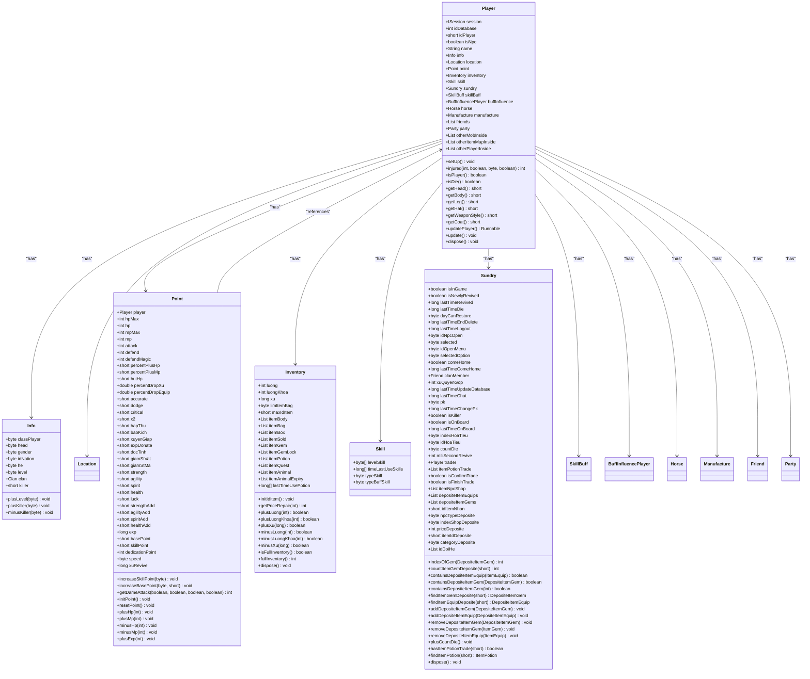
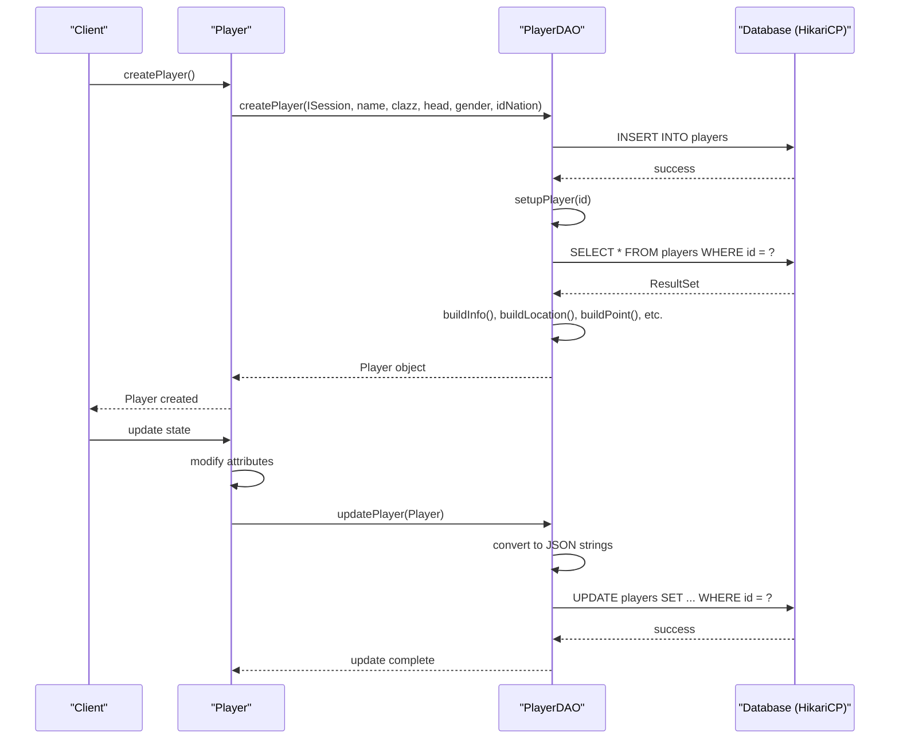
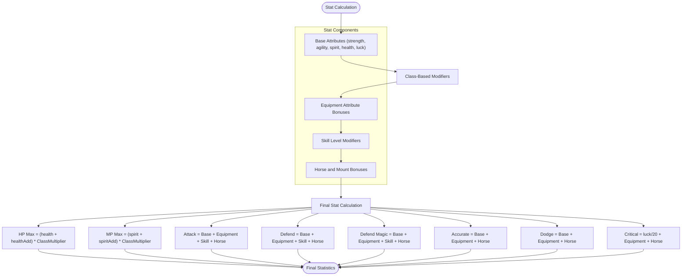
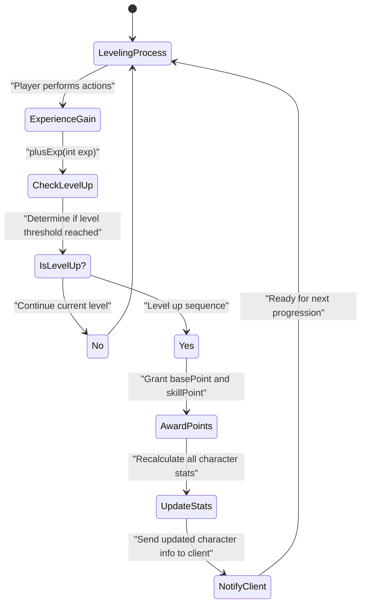
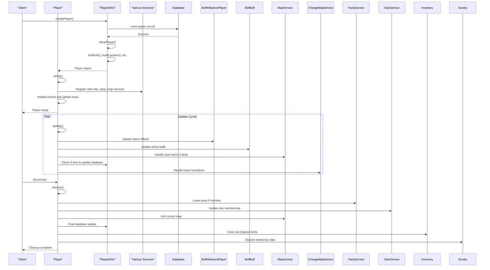

# Player System

<cite>
**Referenced Files in This Document**   
- [Player.java](file://src/main/java/player/Player.java)
- [Info.java](file://src/main/java/player/Info.java)
- [Point.java](file://src/main/java/player/Point.java)
- [Inventory.java](file://src/main/java/player/Inventory.java)
- [Sundry.java](file://src/main/java/player/Sundry.java)
- [Skill.java](file://src/main/java/player/Skill.java)
- [PlayerDAO.java](file://src/main/java/daos/PlayerDAO.java)
- [AttributeConst.java](file://src/main/java/consts/AttributeConst.java)
- [Const.java](file://src/main/java/consts/Const.java)
- [Settings.java](file://src/main/java/manager/Settings.java)
</cite>

## Table of Contents
1. [Introduction](#introduction)
2. [Player Entity Structure](#player-entity-structure)
3. [Data Persistence Mechanism](#data-persistence-mechanism)
4. [Attribute System and Stat Calculation](#attribute-system-and-stat-calculation)
5. [Leveling and Experience Progression](#leveling-and-experience-progression)
6. [Player Initialization and State Management](#player-initialization-and-state-management)
7. [Client Synchronization](#client-synchronization)
8. [Common Issues and Performance Optimization](#common-issues-and-performance-optimization)
9. [Conclusion](#conclusion)

## Introduction
The Player System forms the core entity representation in the game, serving as the central data structure for character state management. This document provides a comprehensive analysis of the player entity implementation, focusing on its structural composition, data persistence, attribute calculation, leveling mechanics, and synchronization patterns. The system is designed to aggregate various components such as inventory, skills, and attributes while maintaining efficient state management and data integrity.

## Player Entity Structure

The Player class serves as the central representation of a character, aggregating multiple components that define a player's state and capabilities. The entity is composed of several key components that work together to maintain a complete player state.

**Diagram sources**
- [Player.java](file://src/main/java/player/Player.java#L1-L310)
- [Info.java](file://src/main/java/player/Info.java#L1-L64)
- [Point.java](file://src/main/java/player/Point.java#L1-L593)
- [Inventory.java](file://src/main/java/player/Inventory.java#L1-L246)
- [Sundry.java](file://src/main/java/player/Sundry.java#L1-L169)
- [Skill.java](file://src/main/java/player/Skill.java#L1-L31)

**Section sources**
- [Player.java](file://src/main/java/player/Player.java#L1-L310)
- [Info.java](file://src/main/java/player/Info.java#L1-L64)
- [Point.java](file://src/main/java/player/Point.java#L1-L593)
- [Inventory.java](file://src/main/java/player/Inventory.java#L1-L246)
- [Sundry.java](file://src/main/java/player/Sundry.java#L1-L169)
- [Skill.java](file://src/main/java/player/Skill.java#L1-L31)

## Data Persistence Mechanism

The player state persistence system is implemented through a DAO (Data Access Object) pattern that handles both loading and saving player data to a relational database. The PlayerDAO class manages the serialization and deserialization of player entities, converting complex object structures into JSON strings for database storage.

The persistence mechanism uses JSON serialization to store complex nested objects as text fields in the database. Each component of the player entity (info, location, point, inventory, etc.) is converted to a JSON string representation and stored in separate columns. This approach allows for flexible schema design while maintaining relational database benefits.

**Diagram sources**
- [PlayerDAO.java](file://src/main/java/daos/PlayerDAO.java#L1-L556)
- [Player.java](file://src/main/java/player/Player.java#L1-L310)

**Section sources**
- [PlayerDAO.java](file://src/main/java/daos/PlayerDAO.java#L1-L556)
- [Player.java](file://src/main/java/player/Player.java#L1-L310)

## Attribute System and Stat Calculation

The attribute system implements a comprehensive stat calculation framework that combines base attributes, equipment bonuses, and skill effects. The Point class serves as the central calculation engine, aggregating various modifiers to determine final character statistics.

The system uses a layered approach to stat calculation, where base attributes are modified by multiple factors:
- **Base Attributes**: Strength, agility, spirit, health, and luck form the foundation of character stats
- **Equipment Bonuses**: Items in the inventory contribute additional attribute points through ItemEquip objects
- **Skill Effects**: Character class-specific skills provide percentage-based stat modifications
- **Horse/Mount Bonuses**: Mounted characters receive additional stat bonuses based on their mount type

The calculation process is triggered by the `initPoint()` method, which resets all calculated values and recomputes them based on current equipment, skills, and status effects.

**Diagram sources**
- [Point.java](file://src/main/java/player/Point.java#L1-L593)
- [AttributeConst.java](file://src/main/java/consts/AttributeConst.java#L1-L133)
- [Const.java](file://src/main/java/consts/Const.java#L1-L115)

**Section sources**
- [Point.java](file://src/main/java/player/Point.java#L1-L593)
- [AttributeConst.java](file://src/main/java/consts/AttributeConst.java#L1-L133)
- [Const.java](file://src/main/java/consts/Const.java#L1-L115)

## Leveling and Experience Progression

The leveling system implements a progressive experience-based advancement mechanism that allows players to improve their character capabilities through gameplay. The experience progression is managed through the Point class, which tracks accumulated experience points and handles level advancement.

The leveling mechanics are implemented through several key methods in the Point class:
- `plusExp(int exp)`: Adds experience points to the player's total
- `increaseBasePoint(byte type, short numIncrease)`: Allocates base points to primary attributes
- `increaseSkillPoint(byte type)`: Advances skill levels based on available skill points

When a player gains sufficient experience to level up, they are awarded both base points (for attribute improvement) and skill points (for ability enhancement). The system enforces level requirements for skill advancement through the `Manager.getLevelAddSkill(type, levelSkill)` method, ensuring balanced progression.

**Diagram sources**
- [Point.java](file://src/main/java/player/Point.java#L1-L593)
- [Info.java](file://src/main/java/player/Info.java#L1-L64)

**Section sources**
- [Point.java](file://src/main/java/player/Point.java#L1-L593)
- [Info.java](file://src/main/java/player/Info.java#L1-L64)

## Player Initialization and State Management

Player initialization and state management are handled through a comprehensive lifecycle system that ensures proper setup and cleanup of player entities. The system implements both creation and disposal patterns to maintain data integrity and resource efficiency.

The initialization process begins with player creation through the `createPlayer` method in PlayerDAO, which inserts a new record into the database with default values for all character components. Upon successful creation, the `setupPlayer` method loads the player data and constructs the complete player object with all nested components.

The `setUp()` method in the Player class performs post-creation initialization, including:
- Setting the last database update timestamp
- Initializing tracking lists for nearby entities
- Creating the manufacture system instance
- Setting up the party system
- Linking the player reference to dependent components
- Initializing the point system
- Registering with clan services if applicable

State management is handled through the `update()` method, which runs on a regular interval (approximately once per second) to:
- Update active buffs and status effects
- Handle auto-revive mechanics for low-level players
- Manage database synchronization timing
- Process map transitions

Resource cleanup is managed through the `dispose()` method, which systematically releases all references and clears data structures to prevent memory leaks.

**Diagram sources**
- [Player.java](file://src/main/java/player/Player.java#L1-L310)
- [PlayerDAO.java](file://src/main/java/daos/PlayerDAO.java#L1-L556)

**Section sources**
- [Player.java](file://src/main/java/player/Player.java#L1-L310)
- [PlayerDAO.java](file://src/main/java/daos/PlayerDAO.java#L1-L556)

## Client Synchronization

Client synchronization is implemented through a combination of periodic updates and event-driven messaging to maintain consistency between server state and client presentation. The system ensures that player state changes are properly communicated to the connected client.

The synchronization mechanism operates on multiple levels:
- **Initial Synchronization**: When a player logs in, the complete player state is sent to the client
- **Periodic Updates**: Player state is periodically saved to the database at intervals defined by `Settings.MILISECOND_UPDATE_DATABASE`
- **Event-Driven Updates**: Significant state changes trigger immediate synchronization messages
- **Final Synchronization**: Player state is saved when disconnecting

Key synchronization points include:
- Character information updates after stat or skill changes
- Inventory changes when items are added or removed
- Position updates when moving between map locations
- Status effect changes when buffs are applied or expire
- Combat state updates during battles

The system uses service classes like Service.instance to send targeted messages to clients, ensuring that only relevant information is transmitted. This approach minimizes network overhead while maintaining state consistency.

**Section sources**
- [Player.java](file://src/main/java/player/Player.java#L1-L310)
- [PlayerDAO.java](file://src/main/java/daos/PlayerDAO.java#L1-L556)
- [Settings.java](file://src/main/java/manager/Settings.java#L1-L59)

## Common Issues and Performance Optimization

The player system addresses several common issues related to data integrity, concurrency, and performance through careful design and implementation choices.

### Data Corruption Prevention
The system implements multiple safeguards against data corruption:
- **JSON Validation**: All serialized data is validated before processing
- **Null Checks**: Comprehensive null checks prevent NPEs during deserialization
- **Bounds Checking**: All numeric operations include bounds checking to prevent overflow
- **Transaction Safety**: Database operations are designed to be idempotent when possible

### Concurrency Management
Concurrency issues during stat updates are mitigated through:
- **Synchronized Methods**: Critical sections like `injured()` are marked with @Synchronized
- **Atomic Operations**: Database updates use atomic SQL operations
- **Thread-Safe Collections**: Concurrent collections are used where appropriate
- **Update Locking**: The update loop prevents concurrent modifications during processing

### Performance Optimization
Several performance optimizations are implemented for frequently accessed player data:
- **Caching**: Frequently accessed computed values are cached and only recalculated when necessary
- **Batch Updates**: Database updates are batched to reduce I/O operations
- **Lazy Loading**: Related entities are loaded only when needed
- **Object Pooling**: Temporary objects are reused where possible
- **Efficient Serialization**: JSON serialization is optimized for speed and size

The system also implements several configuration-driven optimizations:
- Database update frequency is configurable via `MILISECOND_UPDATE_DATABASE`
- Auto-revive behavior is limited to players below `LEVEL_CAN_AUTO_REVIVE`
- Session cleanup is enforced after `MILISECOND_WAIT_KICK_SESSION`
- Player cleanup occurs after `MILISECOND_WAIT_KICK_PLAYER`

These optimizations ensure that the player system can handle the maximum configured player count (`MAX_PLAYER`) while maintaining responsive performance and data integrity.

**Section sources**
- [Player.java](file://src/main/java/player/Player.java#L1-L310)
- [PlayerDAO.java](file://src/main/java/daos/PlayerDAO.java#L1-L556)
- [Settings.java](file://src/main/java/manager/Settings.java#L1-L59)

## Conclusion
The Player System represents a comprehensive implementation of character state management in a multiplayer game environment. By aggregating components like inventory, skills, and attributes into a cohesive entity, the system provides a robust foundation for player interaction and progression. The data persistence mechanism ensures reliable state storage, while the attribute calculation system enables complex stat interactions. The leveling and experience progression mechanics support long-term player engagement, and the synchronization patterns maintain consistency between server and client states. Through careful attention to data integrity, concurrency, and performance optimization, the system is designed to handle high player loads while providing a smooth gaming experience.