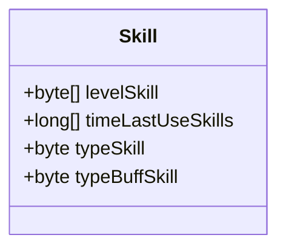
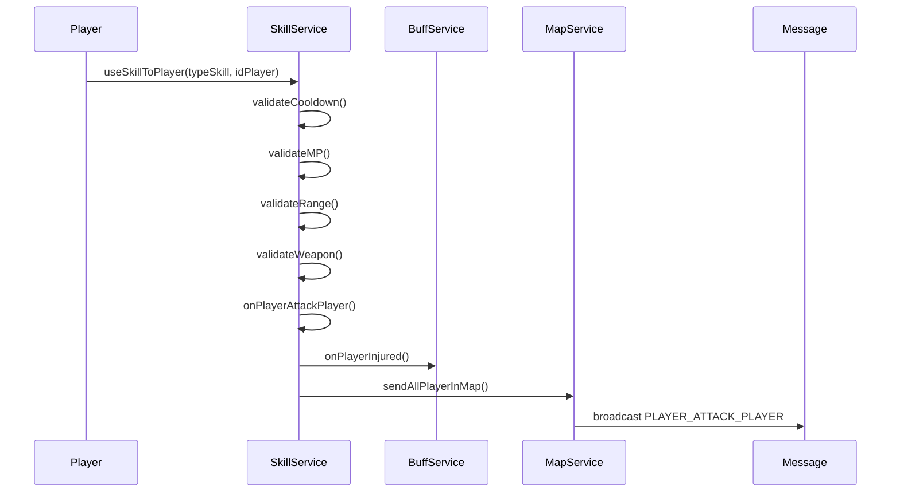
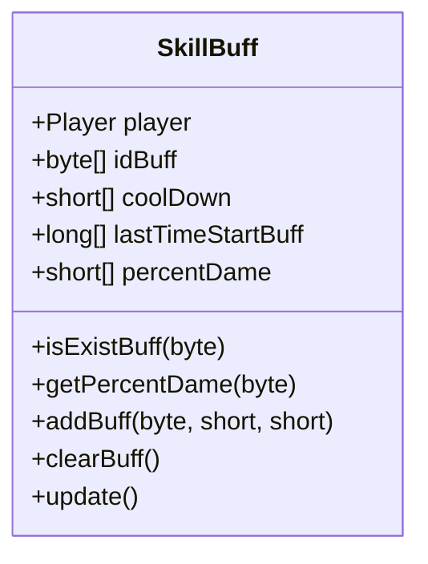
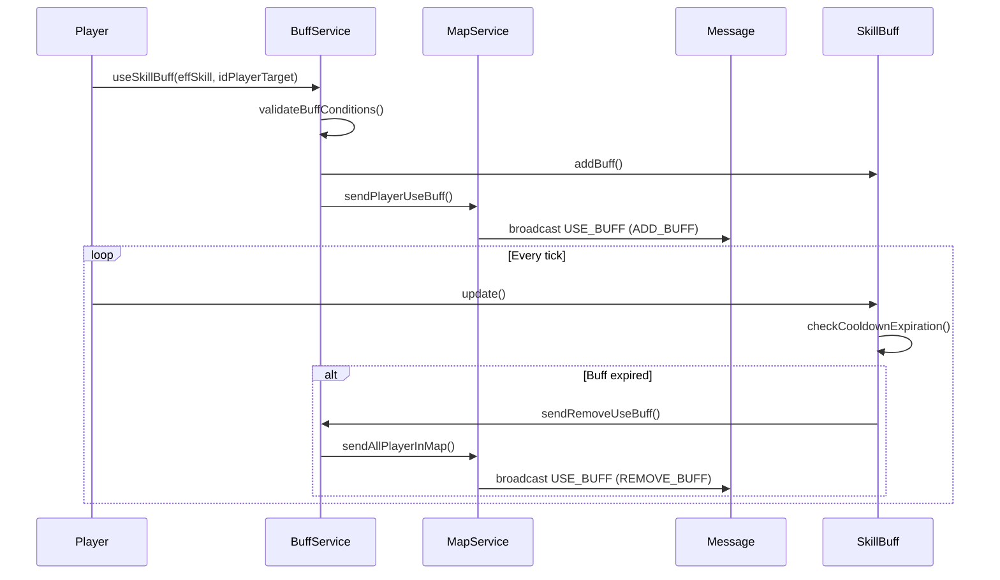
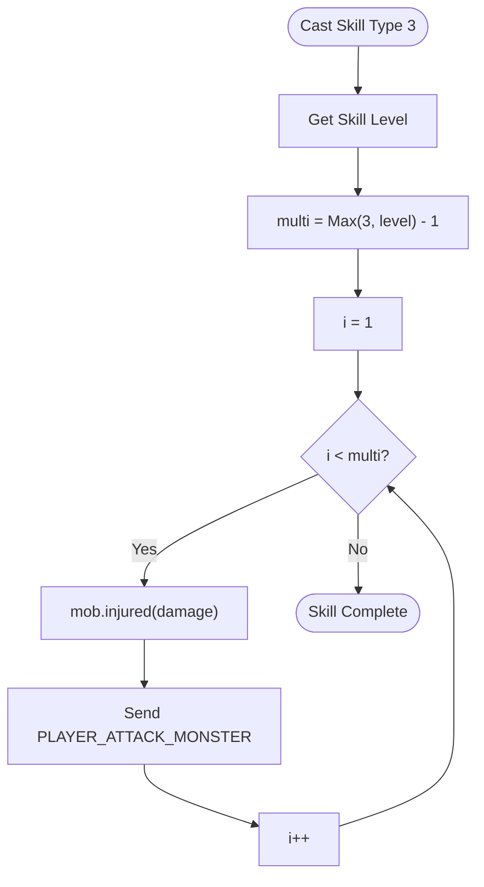
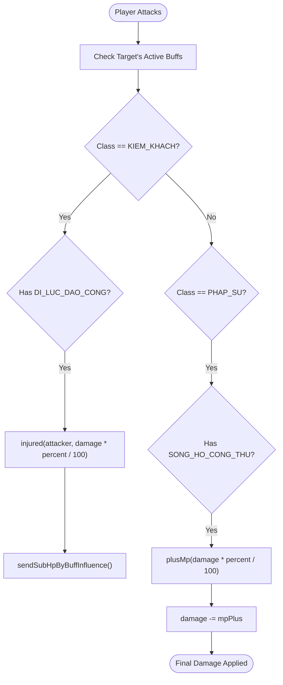
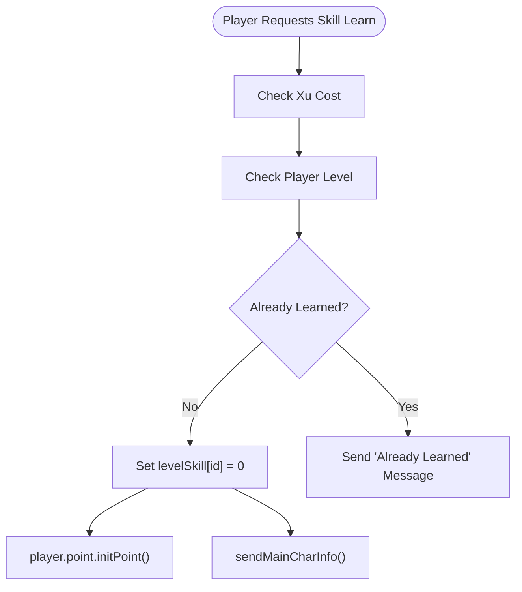

# Skills System

<cite>
**Referenced Files in This Document**   
- [Skill.java](file://src/main/java/player/Skill.java)
- [SkillService.java](file://src/main/java/services/SkillService.java)
- [SkillBuff.java](file://src/main/java/skill/SkillBuff.java)
- [BuffService.java](file://src/main/java/services/BuffService.java)
- [Player.java](file://src/main/java/player/Player.java)
- [Manager.java](file://src/main/java/manager/Manager.java)
- [BuffConst.java](file://src/main/java/consts/BuffConst.java)
- [SkillConst.java](file://src/main/java/consts/SkillConst.java)
</cite>

## Table of Contents
1. [Introduction](#introduction)
2. [Skill Data Model](#skill-data-model)
3. [Skill Execution and Validation](#skill-execution-and-validation)
4. [Skill Buffs and Stat Modifications](#skill-buffs-and-stat-modifications)
5. [Client Synchronization and Network Flow](#client-synchronization-and-network-flow)
6. [Skill Mechanics Examples](#skill-mechanics-examples)
7. [Common Issues and Exploit Prevention](#common-issues-and-exploit-prevention)
8. [Performance Considerations](#performance-considerations)
9. [Adding New Skills via Template Configuration](#adding-new-skills-via-template-configuration)

## Introduction
The skills system in the game enables players to utilize learned abilities that affect combat, healing, and status effects. This document details the implementation of the skill system, focusing on the `Skill.java` class for storing player skill data, the `SkillService.java` for handling skill execution, and `SkillBuff.java` for managing temporary stat modifications. The interaction between these components ensures proper validation, cooldown management, and synchronization across clients. The system supports various skill types, including offensive, defensive, and revival skills, with mechanics such as multi-target attacks, damage calculation, and buff stacking.

## Skill Data Model

The `Skill.java` class represents a player's learned abilities, storing skill levels, cooldown timestamps, and skill types. Each player has an instance of this class that tracks their current skill state.

**Diagram sources**  
- [Skill.java](file://src/main/java/player/Skill.java#L1-L30)

**Section sources**  
- [Skill.java](file://src/main/java/player/Skill.java#L1-L30)  
- [Player.java](file://src/main/java/player/Player.java#L50-L55)

## Skill Execution and Validation

The `SkillService.java` class handles the execution of skills, including validation of conditions such as cooldowns, MP cost, range, and weapon durability. It manages both player-to-player and player-to-monster skill usage.

**Diagram sources**  
- [SkillService.java](file://src/main/java/services/SkillService.java#L50-L387)  
- [BuffService.java](file://src/main/java/services/BuffService.java#L50-L287)  
- [MapService.java](file://src/main/java/services/MapService.java)

**Section sources**  
- [SkillService.java](file://src/main/java/services/SkillService.java#L50-L387)  
- [Manager.java](file://src/main/java/manager/Manager.java#L800-L1524)

## Skill Buffs and Stat Modifications

The `SkillBuff.java` class manages temporary stat modifications applied to players through active skills. It tracks active buffs, their durations, and percentage-based effects on damage or defense.

**Diagram sources**  
- [SkillBuff.java](file://src/main/java/skill/SkillBuff.java#L1-L93)  
- [BuffConst.java](file://src/main/java/consts/BuffConst.java#L1-L30)

**Section sources**  
- [SkillBuff.java](file://src/main/java/skill/SkillBuff.java#L1-L93)  
- [BuffService.java](file://src/main/java/services/BuffService.java#L50-L287)

## Client Synchronization and Network Flow

Skill effects and buff applications are synchronized across clients using message broadcasting. The `BuffService` sends `USE_BUFF` messages to notify all players in the map when a buff is applied or removed.

**Diagram sources**  
- [BuffService.java](file://src/main/java/services/BuffService.java#L50-L287)  
- [SkillBuff.java](file://src/main/java/skill/SkillBuff.java#L80-L93)  
- [MapService.java](file://src/main/java/services/MapService.java)

**Section sources**  
- [BuffService.java](file://src/main/java/services/BuffService.java#L50-L287)  
- [SkillBuff.java](file://src/main/java/skill/SkillBuff.java#L80-L93)

## Skill Mechanics Examples

### Multi-Target Skill (Type 3)
When a player uses a multi-target skill (e.g., type 3), the number of projectiles is determined by the skill level, with a minimum of 3.

**Diagram sources**  
- [SkillService.java](file://src/main/java/services/SkillService.java#L200-L250)

### Damage Calculation with Buffs
Damage is modified by active buffs such as `SONG_HO_CONG_THU` (MP recovery on hit) or `DI_LUC_DAO_CONG` (damage reflection).

**Diagram sources**  
- [BuffService.java](file://src/main/java/services/BuffService.java#L150-L200)  
- [Player.java](file://src/main/java/player/Player.java#L100-L150)

**Section sources**  
- [BuffService.java](file://src/main/java/services/BuffService.java#L150-L200)  
- [Player.java](file://src/main/java/player/Player.java#L100-L150)

## Common Issues and Exploit Prevention

### Cooldown Validation
The system prevents skill reuse before cooldown expiration using `Util.canDoWithTime()` to compare the last use timestamp with the required cooldown duration.

### Double-Casting Prevention
Skills are only executed if the player is not dead, has sufficient MP, and is within range. The `typeSkill` is set before validation to ensure consistency.

### Invalid State Transitions
The `@Synchronized` annotation on `SkillBuff` methods ensures thread-safe access to buff data, preventing race conditions during concurrent skill usage.

**Section sources**  
- [SkillService.java](file://src/main/java/services/SkillService.java#L50-L387)  
- [SkillBuff.java](file://src/main/java/skill/SkillBuff.java#L50-L93)  
- [Util.java](file://src/main/java/utils/Util.java)

## Performance Considerations

- **High-Frequency Skill Usage**: The `update()` method in `Player.java` calls `skillBuff.update()` every tick, checking for expired buffs. This is optimized by using `canDoWithTime()` with millisecond precision.
- **Message Broadcasting**: Skill effects are broadcast using `MapService.sendAllPlayerInMap()`, which limits network traffic to players in the same zone.
- **Thread Safety**: The `@Synchronized` annotation ensures that buff modifications are atomic, preventing data corruption in high-concurrency scenarios.

**Section sources**  
- [Player.java](file://src/main/java/player/Player.java#L300-L310)  
- [SkillBuff.java](file://src/main/java/skill/SkillBuff.java#L80-L93)  
- [MapService.java](file://src/main/java/services/MapService.java)

## Adding New Skills via Template Configuration

New skills are added through the `SkillNewTemplate` stored in the database. The `learnNewSkill()` method in `SkillService` validates prerequisites such as level and cost before granting the skill.

**Diagram sources**  
- [SkillService.java](file://src/main/java/services/SkillService.java#L300-L350)  
- [Manager.java](file://src/main/java/manager/Manager.java#L800-L1524)

**Section sources**  
- [SkillService.java](file://src/main/java/services/SkillService.java#L300-L350)  
- [Manager.java](file://src/main/java/manager/Manager.java#L800-L1524)