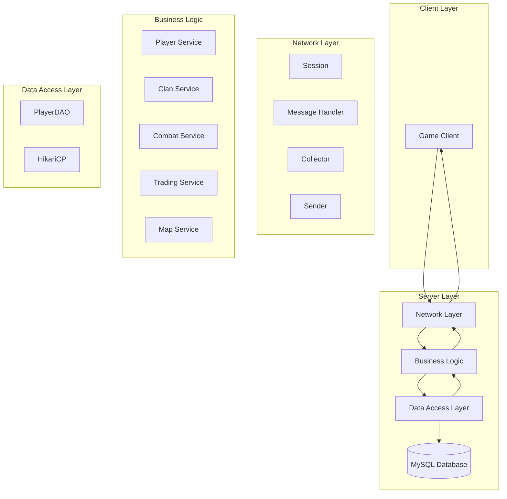

# Project Overview

<cite>
**Referenced Files in This Document**   
- [Server.java](file://src/main/java/server/Server.java)
- [Settings.java](file://src/main/java/manager/Settings.java)
- [ExecutorVirtualThread.java](file://src/main/java/manager/ExecutorVirtualThread.java)
- [Player.java](file://src/main/java/player/Player.java)
- [Session.java](file://src/main/java/network/Session.java)
- [ClientManager.java](file://src/main/java/manager/ClientManager.java)
- [LoginService.java](file://src/main/java/services/LoginService.java)
- [Manager.java](file://src/main/java/manager/Manager.java)
- [README.md](file://README.md)
</cite>

## Table of Contents
1. [Introduction](#introduction)
2. [Core Gameplay Features](#core-gameplay-features)
3. [Architectural Vision and Technology Stack](#architectural-vision-and-technology-stack)
4. [System Boundaries and Ecosystem Integration](#system-boundaries-and-ecosystem-integration)
5. [High-Level Architecture Diagram](#high-level-architecture-diagram)
6. [Concurrency Model and Virtual Threads](#concurrency-model-and-virtual-threads)

## Introduction

The KPAH-qoder game server is a high-concurrency MMORPG backend system designed to support up to 40,000 simultaneous players. Built on Java 21 with Maven project management, the server implements a scalable architecture optimized for massive multiplayer online gameplay. The system handles core game mechanics including player progression, combat systems, clan management, trading, and world navigation across a persistent game world. As the central component of the KPAH gaming ecosystem, this server processes all gameplay logic, maintains player state, manages database interactions, and coordinates real-time interactions between players and NPCs.

**Section sources**
- [Server.java](file://src/main/java/server/Server.java#L1-L118)
- [Settings.java](file://src/main/java/manager/Settings.java#L1-L58)
- [README.md](file://README.md#L1-L194)

## Core Gameplay Features

The KPAH-qoder server supports a comprehensive set of MMORPG gameplay features that enable rich player interactions and progression systems. Player progression is managed through a level-based system with experience points, skill development, and attribute enhancement. The combat system implements turn-based mechanics with damage calculation based on player attributes, equipment, and skill levels, including magic and physical damage types with corresponding defense calculations.

Clan functionality enables social gameplay through organized player groups with shared objectives, member management, and clan-specific progression. Trading systems facilitate player-to-player economic interactions, including item exchange and resource management. World navigation is implemented through a zone-based map system with waypoints, location transitions, and area-specific content. Additional features include inventory management, item equipment with durability systems, player customization through cosmetic items, and NPC interactions for quests and services.

The server also supports mini-games, player parties for cooperative gameplay, and special events like the VongQuay (Lucky Wheel) system. Player state is maintained across sessions with persistent data storage for character progression, inventory, and social connections.

**Section sources**
- [Player.java](file://src/main/java/player/Player.java#L1-L309)
- [services/LoginService.java](file://src/main/java/services/LoginService.java#L1-L228)
- [manager/Manager.java](file://src/main/java/manager/Manager.java#L1-L1524)

## Architectural Vision and Technology Stack

The KPAH-qoder server follows a layered architectural approach with clear separation between network handling, business logic, and data persistence. The technology stack is built on Java 21, leveraging preview features and virtual threads for high-concurrency performance. The server uses Maven for dependency management with key libraries including HikariCP for database connection pooling, MySQL Connector for database access, Lombok for code generation, and SLF4J/Log4j for logging.

The architectural vision emphasizes scalability and maintainability, with components organized into logical packages for clans, constants, data access, database operations, effects, interfaces, items, managers, maps, mini-games, networking, players, servers, services, shops, skills, templates, top rankings, and utilities. This modular structure enables focused development and testing of specific game systems while maintaining overall system cohesion.

The server implements a message-driven architecture where client requests are processed through a handler system that routes commands to appropriate service classes. Data access is centralized through DAO (Data Access Object) patterns, ensuring consistent database interactions across the application.

**Section sources**
- [README.md](file://README.md#L1-L194)
- [pom.xml](file://pom.xml)
- [Manager.java](file://src/main/java/manager/Manager.java#L1-L1524)

## System Boundaries and Ecosystem Integration

The KPAH-qoder server operates as the central backend component within a broader game ecosystem, with well-defined boundaries between client and server responsibilities. The server exposes its functionality through a TCP-based network interface on port 19129, handling authentication, game state synchronization, and command processing. Client applications connect to the server to access game content, with the server maintaining authoritative control over game state to prevent cheating and ensure consistency.

The server integrates with a MySQL database for persistent storage of player data, game configurations, and world state. Database interactions are managed through the HikariCP connection pool for optimal performance under high load. Game assets such as images, maps, and effects are stored in the resources directory and loaded into memory during server initialization for fast access during gameplay.

External integration points include command-line administration capabilities that allow operators to monitor server status, player counts, and thread usage. The server can be placed into maintenance mode, enabling controlled updates and maintenance without disrupting the overall game ecosystem. The system is designed to work with client applications that handle user interface rendering and input collection, while relying on the server for game logic execution and state validation.

**Section sources**
- [Server.java](file://src/main/java/server/Server.java#L1-L118)
- [database/HikariCP.java](file://src/main/java/database/HikariCP.java)
- [Settings.java](file://src/main/java/manager/Settings.java#L1-L58)

## High-Level Architecture Diagram

**Diagram sources**
- [Session.java](file://src/main/java/network/Session.java#L1-L398)
- [LoginService.java](file://src/main/java/services/LoginService.java#L1-L228)
- [Player.java](file://src/main/java/player/Player.java#L1-L309)
- [daos/PlayerDAO.java](file://src/main/java/daos/PlayerDAO.java)
- [database/HikariCP.java](file://src/main/java/database/HikariCP.java)

## Concurrency Model and Virtual Threads

The KPAH-qoder server leverages Java 21's virtual threads to achieve high concurrency with efficient resource utilization. The concurrency model is implemented through the ExecutorVirtualThread class, which creates dedicated virtual thread pools for different server subsystems including server operations, player processing, session management, and map operations. This approach allows the server to handle up to 40,000 concurrent players by efficiently managing thousands of lightweight virtual threads.

When a client connects, the server assigns a virtual thread to handle the session, enabling non-blocking I/O operations and responsive client interaction. Player updates are processed on dedicated virtual threads, ensuring that gameplay mechanics like movement, combat, and skill usage are handled independently without blocking other operations. The server's main loop accepts incoming connections and delegates them to virtual threads, preventing connection bottlenecks even under peak load.

The virtual thread model provides significant advantages over traditional platform threads by reducing memory overhead and context switching costs. Each player session and game entity can operate on its own virtual thread without the scalability limitations of native threads. This enables the server to maintain real-time game state for tens of thousands of players simultaneously while keeping system resource usage within acceptable limits.

**Section sources**
- [ExecutorVirtualThread.java](file://src/main/java/manager/ExecutorVirtualThread.java#L1-L36)
- [Server.java](file://src/main/java/server/Server.java#L1-L118)
- [Session.java](file://src/main/java/network/Session.java#L1-L398)
- [Player.java](file://src/main/java/player/Player.java#L1-L309)