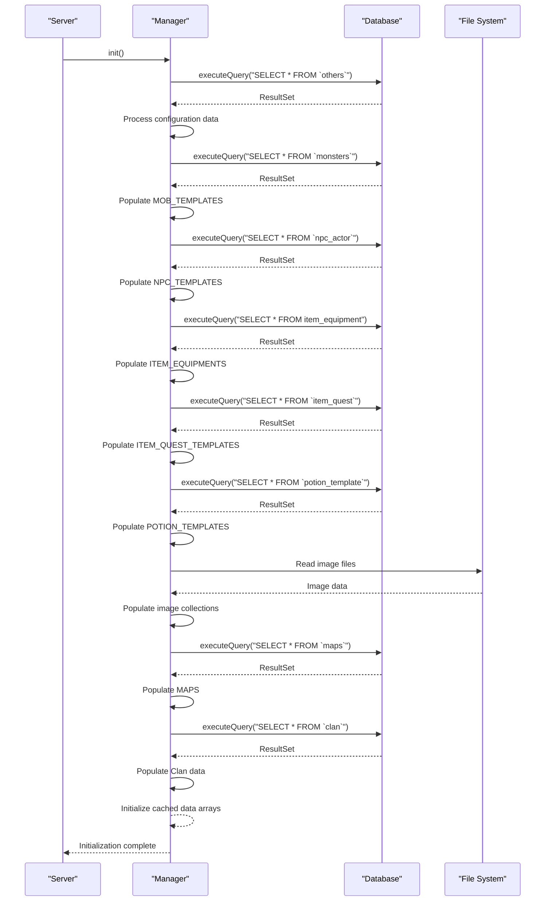

# Global Data & Template Management

<cite>
**Referenced Files in This Document**   
- [Manager.java](file://src/main/java/manager/Manager.java)
- [ClanManager.java](file://src/main/java/manager/ClanManager.java)
- [TopManager.java](file://src/main/java/manager/TopManager.java)
- [Server.java](file://src/main/java/server/Server.java)
- [ItemEquipTemplate.java](file://src/main/java/template/ItemEquipTemplate.java)
- [MonsterTemplate.java](file://src/main/java/template/MonsterTemplate.java)
- [NpcTemplate.java](file://src/main/java/template/NpcTemplate.java)
- [SkillNewTemplate.java](file://src/main/java/template/SkillNewTemplate.java)
- [PotionTemplate.java](file://src/main/java/template/PotionTemplate.java)
</cite>

## Table of Contents
1. [Introduction](#introduction)
2. [Core Components](#core-components)
3. [Architecture Overview](#architecture-overview)
4. [Detailed Component Analysis](#detailed-component-analysis)
5. [Dependency Analysis](#dependency-analysis)
6. [Performance Considerations](#performance-considerations)
7. [Troubleshooting Guide](#troubleshooting-guide)
8. [Conclusion](#conclusion)

## Introduction
The Global Data & Template Management system serves as the central repository for all shared game data in the KPAH-qoder server application. At its core is the `Manager` class, which acts as a singleton data container that holds template definitions for game entities such as items, monsters, skills, NPCs, and other shared resources. This documentation provides a comprehensive analysis of the Manager class and its role in the overall architecture, detailing its initialization process, data loading mechanisms, access patterns, and integration with other core components.

The system is designed to be initialized during server startup through the `Manager.init()` method, which loads all template data from both database sources and filesystem resources. This centralized approach ensures consistent access to game templates across all services and components, while also providing optimization opportunities through pre-loaded caches and static collections. The design emphasizes thread-safe access patterns suitable for virtual-threaded environments, making it resilient under high-concurrency scenarios typical of multiplayer game servers.

**Section sources**
- [Manager.java](file://src/main/java/manager/Manager.java#L1-L1525)

## Core Components

The core components of the global data management system revolve around the `Manager` class, which maintains static collections of various template types used throughout the game server. These collections include templates for items, monsters, skills, NPCs, potions, gems, and other game entities, all stored in thread-safe `ConcurrentHashMap` instances to ensure safe access from multiple threads.

The system also includes supporting manager classes such as `ClanManager` and `TopManager` that interact with the central Manager instance to access shared data. The `Server` class coordinates the initialization of the entire system, ensuring that the Manager is properly initialized before accepting client connections. Template classes in the `template` package define the structure of various game entities and are populated with data from the database during initialization.

**Section sources**
- [Manager.java](file://src/main/java/manager/Manager.java#L1-L1525)
- [ClanManager.java](file://src/main/java/manager/ClanManager.java#L1-L72)
- [TopManager.java](file://src/main/java/manager/TopManager.java#L1-L120)
- [Server.java](file://src/main/java/server/Server.java#L1-L119)

## Architecture Overview

```mermaid
graph TD
Server[Server] --> |Calls| Manager[Manager.init()]
Manager --> |Loads from DB| Database[(Database)]
Manager --> |Loads from FS| FileSystem[(File System)]
Manager --> |Provides Data| ClanManager[ClanManager]
Manager --> |Provides Data| TopManager[TopManager]
Manager --> |Provides Data| Services[Game Services]
ClanManager --> |Updates| Database
TopManager --> |Updates| Database
Services --> |Accesses| Manager
ClientManager --> |Manages| Clients[Clients]
ExecutorVirtualThread --> |Executes| UpdateTasks[Update Tasks]
subgraph "Data Sources"
Database
FileSystem
end
subgraph "Core Managers"
Manager
ClanManager
TopManager
end
subgraph "Server Components"
Server
ClientManager
ExecutorVirtualThread
end
```

**Diagram sources**
- [Manager.java](file://src/main/java/manager/Manager.java#L1-L1525)
- [Server.java](file://src/main/java/server/Server.java#L1-L119)
- [ClanManager.java](file://src/main/java/manager/ClanManager.java#L1-L72)
- [TopManager.java](file://src/main/java/manager/TopManager.java#L1-L120)

## Detailed Component Analysis

### Manager Class Analysis

#### For Object-Oriented Components:

```mermaid
classDiagram
class Manager {
+ConcurrentHashMap<Byte, ConcurrentHashMap<Short, IMap>> MAPS
+ConcurrentHashMap<Short, MonsterTemplate> MOB_TEMPLATES
+ConcurrentHashMap<Short, ItemEquipTemplate> ITEM_EQUIPMENTS
+ConcurrentHashMap<Byte, ItemQuestTemplate> ITEM_QUEST_TEMPLATES
+ConcurrentHashMap<Short, PotionTemplate> POTION_TEMPLATES
+ConcurrentHashMap<String, NpcShop> SHOP_NPC_TEMPLATES
+ConcurrentHashMap<Short, ShopTemplate> SHOP_TEMPLATES
+ConcurrentHashMap<Short, GemTemplate> GEM_TEMPLATES
+ConcurrentHashMap<Byte, TreeInfo> TREE_INFOS
+ConcurrentHashMap<Short, NpcServerTemplate> NPC_SERVER_TEMPLATES
+ConcurrentHashMap<Short, AttributeEquipTemplate> ITEM_ATTRIBUTE_TEMPLATES
+ConcurrentHashMap<Byte, HoaTieuTemplate> HOA_TIEU_TEMPLATES
+ConcurrentHashMap<Short, NpcTemplate> NPC_TEMPLATES
+List<int[]> TYPE_OF_TILE
+ConcurrentHashMap<Byte, XaPhuTemplate> XA_PHU_TEMPLATE
+ConcurrentHashMap<Short, SkillNewTemplate> SKILL_NEW_TEMPLATES
+List<EffectData> EFFECT_DATA
+List<PartChar> PART_CHAR
+List<XaPhu> XA_PHU
+ConcurrentHashMap<String, List<Short>> ITEM_EQUIPMENT
+ConcurrentHashMap<Short, byte[]> IMAGES_DEFAULT
+ConcurrentHashMap<Short, byte[][]> IMAGES_WEAPON
+ConcurrentHashMap<Byte, byte[]> IMAGES_TREE
+ConcurrentHashMap<Byte, ConcurrentHashMap<Byte, byte[]>> IMAGES_CLOTH
+ConcurrentHashMap<Byte, byte[]> IMAGES_ANIMAL
+ConcurrentHashMap<Short, byte[]> IMAGES_MONSTER
+ConcurrentHashMap<Short, AnimalTemplate> ANIMAL_TEMPLATES
+ConcurrentHashMap<Short, ValueAttributeAnimal> VALUE_ATTRIBUTE_ANIMAL
+ConcurrentHashMap<String, Deposite> DEPOSITE
+VongQuay vongQuay
+long[] exps
+byte[] DATA_LOCATION_HAC_HO
+byte[] DATA_LOCATION_THANH_LONG
+byte[] DATA_XA_PHU_TEMPLATE
+byte[] DATA_EFFECT
+short[][][] SKILL_DAM_PERCENT
+short[][] TIME_LIFE_BUFF_SKILL
+int[][][] SKILL_COOLDOWN
+short[][][] SKILL_MP
+short[][] SKILL_RANGE
+byte[][] SKILL_AEO
+byte[][] LEVEL_ADD_SKILL
+byte[] ICON_ANIMAL
+byte[][] ICON_SKILL
+byte[] ICON_POTION
+byte[] ICON_ITEM
+byte[][] DATA_HORSE
+byte[][][] HEAD_HORSE
+byte[] PERCENT_ATTRIBUTE
+short ID_MAP_PK
+byte[][] MAIN_ATTACK
+byte[][] MAIN_DEFEND
+byte[][] PERCENT_ATTACK
+byte[][] PERCENT_DEFEND
+byte[] ARENA
+String[] KHAM_PROPERTY
+byte[] ID_NGOC_KHAM
+byte[][] TYPE_MP_HP
+int[][] VALUE_MP_HP
+byte[][] DX_HORSE
+byte[][] DY_HORSE
+byte[][] DX_DY_WP
+byte[][] DX_DY_AVT
+byte[][] DX_DY_PP
+short[] POTION_SHOP
+byte[] ANIMAL_TRAIN_PRICE
+byte ANIMAL_CHANGE_SPECIAL_ATTRIBUTE_PRICE
+byte[] PRICE_UPGRADE_ANIMAL
+byte[][] EFF_BUFF_SKILL
+byte[][] SKILL_CAN_BUFF_TO_USER
+byte[] BUFF_TYPE
+byte[] NUM_SKILLS
+byte[] X_CHECK
+byte[] Y_CHECK
+byte[] X_FOWARD
+byte[] Y_FOWARD
+boolean[][] ATTRIBUTE_FOR_TYPE
+byte[] getImageCloth(byte, byte)
+IMap getMap(byte, short)
+Deposite getDeposite(String)
+HoaTieuTemplate getHoaTieuTemplate(byte)
+NpcServerTemplate getNpcServerTemplate(short)
+byte getPriceUpgradeAnimal(byte)
+byte getAnimalTrainPrice(byte)
+byte[] getImageAnimal(byte)
+byte[] getImageMonster(short)
+byte[] getImageTree(byte)
+byte[][] getImageWeapon(short)
+byte[] getImageDefault(short)
+short randomItemEquipment(byte, byte)
+boolean hasNameClan(String)
+boolean hasNameLeader(String)
+Clan getClan(short)
+NpcTemplate getNpcTemplate(short)
+NpcShop getItemsNpcShop(String)
+byte getCanBuffToUser(byte, byte)
+byte getTypeBuff(byte, byte)
+byte getIndexBuff(byte, byte)
+int getMpHpPlus(int, int)
+short getLevelAddSkill(int, int)
+boolean isSkillAeo(int, int)
+short getTimeLifeBuffSkill(int, int)
+short getSkillDamPercent(byte, byte, byte)
+short getSkillMP(byte, byte, byte)
+long getSkillCooldown(byte, byte, byte)
+short getSkillRange(byte, byte)
+TreeInfo getTreeInfo(byte)
+MonsterTemplate getMobTemplate(short)
+ValueAttributeAnimal getValueAttributeAnimal(byte)
+short getMaxValueAttributeAnimal(short, byte)
+PotionTemplate getPotionTemplate(short)
+ItemQuestTemplate getItemQuestTemplate(byte)
+ItemEquipTemplate getItemEquipment(byte, byte, byte)
+ItemEquipTemplate getItemEquipment(byte, byte)
+ItemEquipTemplate getItemEquipment(short)
+AttributeEquipTemplate getAttributeTemplate(short)
+GemTemplate getGemTemplate(short)
+AnimalTemplate getAnimalTemplate(short)
+ShopTemplate getShopTemplate(short)
+List<SkillNewTemplate> getListSkillNew(byte)
+List<EffectData> getEffectData(byte)
+PartChar getPartCharData(byte, byte)
+EffectData getEffectData(byte, short)
+void init()
}
class ItemEquipTemplate {
+short id
+String name
+byte type
+byte style
+byte he
+byte gender
+byte level
+short durable
+short[] attribute
+int price
+byte classChar
+byte colorItem
+short idIcon
+short ndayLoan
+byte dxWear
+byte dyWear
}
class MonsterTemplate {
+short id
+String name
+byte type
+int maxHp
+short level
+byte palate
+byte spalate
+byte moveType
+byte speed
+byte height
+byte w
+byte h
+byte xCenter
+byte yCenter
+boolean isNewMonster
}
class NpcTemplate {
+short id
+String name
+short head
+short[] itemEquipment
+short[] idModels
}
class SkillNewTemplate {
+short id
+String name
+String decript
+byte idSkill
+byte classChar
+int price
}
class PotionTemplate {
+short id
+short idImage
+short delay
+boolean isTrade
+String name
+String name2
+short price
+short recovered
}
Manager --> ItemEquipTemplate : "contains"
Manager --> MonsterTemplate : "contains"
Manager --> NpcTemplate : "contains"
Manager --> SkillNewTemplate : "contains"
Manager --> PotionTemplate : "contains"
```


**Diagram sources**
- [Manager.java](file://src/main/java/manager/Manager.java#L1-L1525)
- [ItemEquipTemplate.java](file://src/main/java/template/ItemEquipTemplate.java#L1-L31)
- [MonsterTemplate.java](file://src/main/java/template/MonsterTemplate.java#L1-L32)
- [NpcTemplate.java](file://src/main/java/template/NpcTemplate.java#L1-L20)
- [SkillNewTemplate.java](file://src/main/java/template/SkillNewTemplate.java#L1-L21)
- [PotionTemplate.java](file://src/main/java/template/PotionTemplate.java#L1-L23)

#### For API/Service Components:


**Diagram sources**
- [Manager.java](file://src/main/java/manager/Manager.java#L1-L1525)
- [Server.java](file://src/main/java/server/Server.java#L1-L119)

### Conceptual Overview
The global data management system follows a centralized repository pattern where all shared game data is loaded into memory at server startup and made available through static access methods. This approach eliminates the need for repeated database queries during runtime, significantly improving performance for frequently accessed template data.

The system leverages Java's `ConcurrentHashMap` for all data collections, ensuring thread-safe access from multiple virtual threads without requiring explicit synchronization. This is particularly important in the game server context where hundreds or thousands of concurrent players may be accessing template data simultaneously through various game services.

Data is loaded from multiple sources including MySQL database tables and filesystem resources such as images and configuration files. The initialization process in `Manager.init()` coordinates the loading of all data types in a specific sequence, ensuring dependencies are resolved appropriately. For example, map data loading depends on previously loaded template data for NPCs and monsters.

[No sources needed since this section doesn't analyze specific source files]

## Dependency Analysis

```mermaid
graph TD
Manager[Manager] --> HikariCP[HikariCP]
Manager --> Util[Util]
Manager --> Printer[Printer]
Manager --> Logger[Logger]
Manager --> ResultSetImpl[ResultSetImpl]
Manager --> JSONArray[JSONArray]
Manager --> JSONObject[JSONObject]
Manager --> IMap[IMap]
Manager --> Map[Map]
Manager --> ChildMap[ChildMap]
Manager --> WayPoint[WayPoint]
Manager --> Actor[Actor]
Manager --> LoctionWayPoint[LoctionWayPoint]
Manager --> PlayerDAO[PlayerDAO]
Manager --> NpcTemplate[NpcTemplate]
Manager --> MonsterTemplate[MonsterTemplate]
Manager --> ItemEquipTemplate[ItemEquipTemplate]
Manager --> ItemQuestTemplate[ItemQuestTemplate]
Manager --> PotionTemplate[PotionTemplate]
Manager --> GemTemplate[GemTemplate]
Manager --> ShopTemplate[ShopTemplate]
Manager --> NpcServerTemplate[NpcServerTemplate]
Manager --> AttributeEquipTemplate[AttributeEquipTemplate]
Manager --> HoaTieuTemplate[HoaTieuTemplate]
Manager --> XaPhuTemplate[XaPhuTemplate]
Manager --> SkillNewTemplate[SkillNewTemplate]
Manager --> TreeInfo[TreeInfo]
Manager --> EffectData[EffectData]
Manager --> PartChar[PartChar]
Manager --> XaPhu[XaPhu]
Manager --> VongQuay[VongQuay]
Manager --> Deposite[Deposite]
Manager --> Clan[Clan]
Manager --> Const[Const]
Manager --> NpcConst[NpcConst]
Server[Server] --> Manager[Manager]
Server --> ClientManager[ClientManager]
Server --> ExecutorVirtualThread[ExecutorVirtualThread]
Server --> Settings[Settings]
Server --> MessageHandler[MessageHandler]
Server --> MessageSendCollect[MessageSendCollect]
Server --> Printer[Printer]
Server --> Logger[Logger]
ClanManager[ClanManager] --> HikariCP[HikariCP]
ClanManager --> Logger[Logger]
ClanManager --> Util[Util]
ClanManager --> TimeUnit[TimeUnit]
TopManager[TopManager] --> HikariCP[HikariCP]
TopManager --> ResultSetImpl[ResultSetImpl]
TopManager --> JSONArray[JSONArray]
TopManager --> JSONException[JSONException]
TopManager --> ClanManager[ClanManager]
TopManager --> Printer[Printer]
TopManager --> Logger[Logger]
TopManager --> Manager[Manager]
TopManager --> PlayerDAO[PlayerDAO]
TopManager --> TopPlayer[TopPlayer]
TopManager --> ClanInfo[ClanInfo]
```



**Diagram sources**
- [Manager.java](file://src/main/java/manager/Manager.java#L1-L1525)
- [Server.java](file://src/main/java/server/Server.java#L1-L119)
- [ClanManager.java](file://src/main/java/manager/ClanManager.java#L1-L72)
- [TopManager.java](file://src/main/java/manager/TopManager.java#L1-L120)

## Performance Considerations

The global data management system has been designed with performance optimization as a primary concern, particularly for large-scale deployments with high player concurrency. The use of static collections in the Manager class eliminates the need for repeated database queries during gameplay, reducing database load and improving response times for template retrieval operations.

Data loading is optimized through batch processing of database results, with each template type loaded in a single query operation. The initialization process loads approximately 15 different template types from the database, along with filesystem resources such as images and configuration files, creating a comprehensive in-memory cache of all shared game data.

Memory usage is optimized through the use of primitive arrays for frequently accessed data such as skill parameters, cooldowns, and damage percentages. These arrays are populated during initialization and provide O(1) access time for game mechanics that require frequent lookups. The system also employs data compression techniques for certain collections, such as the cached location data arrays (DATA_LOCATION_HAC_HO, DATA_LOCATION_THANH_LONG) that are serialized into byte arrays for efficient storage and transmission.

For virtual-threaded environments, the system leverages `ConcurrentHashMap` for all shared collections, ensuring thread-safe access without the performance penalties of synchronized blocks. This allows multiple virtual threads to concurrently read template data without contention, which is critical for maintaining high throughput in a multiplayer game server context.

The initialization process includes several optimization steps, such as pre-computing derived data structures and caching frequently accessed combinations. For example, the ITEM_EQUIPMENT map is constructed during initialization to enable quick random selection of equipment items based on level and gender, avoiding the need for filtering operations during gameplay.

**Section sources**
- [Manager.java](file://src/main/java/manager/Manager.java#L1-L1525)

## Troubleshooting Guide

When troubleshooting issues with the global data management system, the first step is to examine the server logs for any error messages during the Manager initialization process. The `init()` method includes comprehensive logging that indicates the successful loading of each template type, with messages such as "Finish Load Monsters Template [X]" where X is the count of loaded templates.

Common issues include database connectivity problems, missing or malformed data in database tables, and filesystem permission issues when loading image resources. These typically manifest as exceptions during the initialization process, which are caught and logged by the Manager class before terminating the server process.

If template data appears to be missing or incorrect, verify that the corresponding database tables contain the expected data and that the table schemas match the expected structure. The Manager class assumes specific column names and data types when reading from the database, and any discrepancies can result in data loading failures.

For performance issues related to template retrieval, ensure that the appropriate getter methods are being used. The Manager class provides specialized methods for different access patterns, such as `getItemEquipment(short itemId)` for direct ID lookup versus `getItemEquipment(byte type, byte level)` for filtered searches. Using the most specific method for the use case ensures optimal performance.

When extending the system with new template types, follow the established pattern of adding a new static collection to the Manager class, creating a corresponding template class in the template package, and adding the appropriate database loading logic in the `init()` method. Ensure that the new collection uses `ConcurrentHashMap` or another thread-safe collection type to maintain compatibility with the virtual-threaded environment.

**Section sources**
- [Manager.java](file://src/main/java/manager/Manager.java#L1-L1525)
- [Server.java](file://src/main/java/server/Server.java#L1-L119)

## Conclusion

The Global Data & Template Management system provides a robust and efficient solution for centralized data storage and retrieval in the KPAH-qoder game server. By loading all shared game data into memory at startup and providing thread-safe access through static methods, the system optimizes performance while maintaining data consistency across all server components.

The Manager class serves as the central hub for game templates, coordinating the loading of data from both database and filesystem sources during server initialization. Its design emphasizes performance through the use of optimized data structures and access patterns, while also ensuring thread safety in a high-concurrency virtual-threaded environment.

Integration with other core components such as ClanManager, TopManager, and various game services demonstrates the system's role as the primary source of truth for shared game data. The comprehensive initialization process ensures that all template data is available before the server begins accepting client connections, preventing runtime errors due to missing data.

For future development, the system provides a clear pattern for extending with new template types while maintaining performance and thread safety. The existing architecture supports large-scale deployments through efficient memory usage and optimized data access patterns, making it well-suited for the demands of a multiplayer game server environment.

[No sources needed since this section summarizes without analyzing specific files]