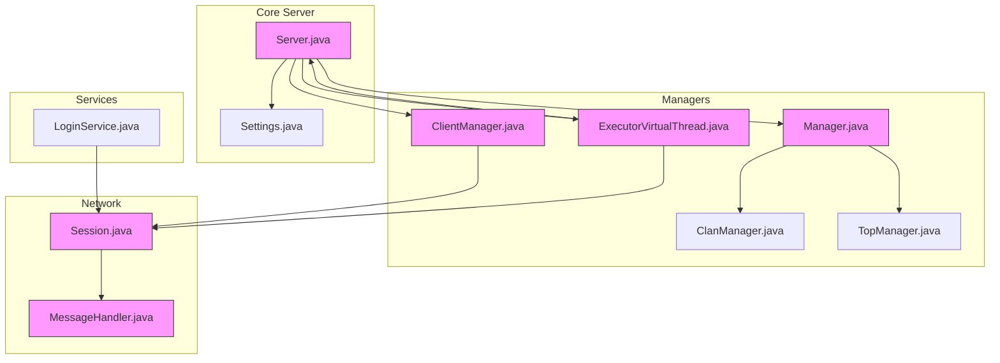
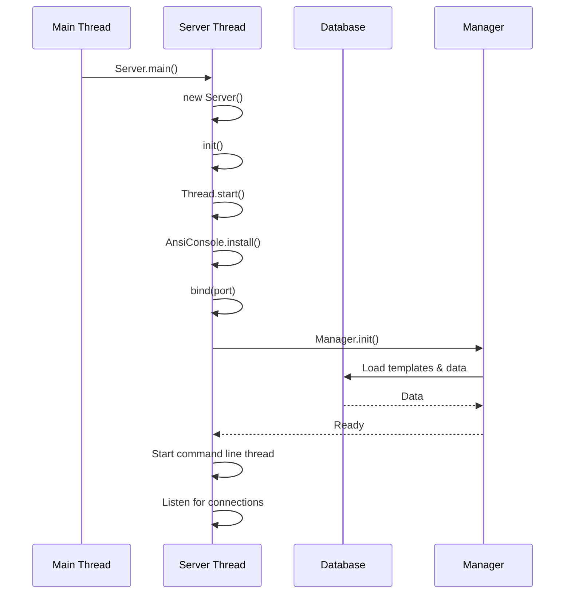
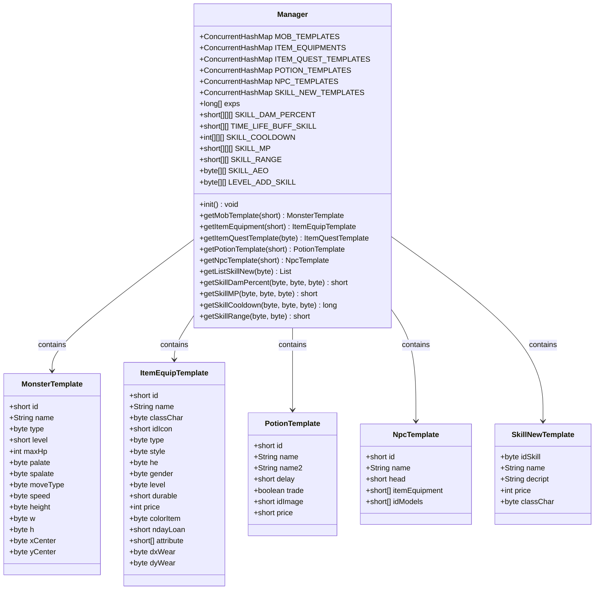
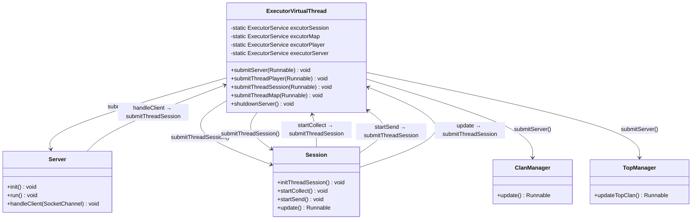
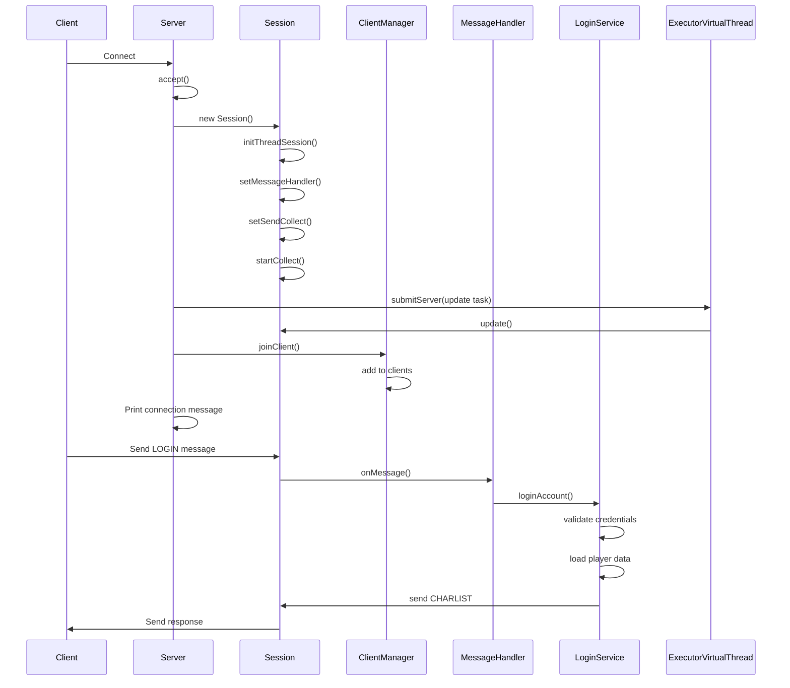
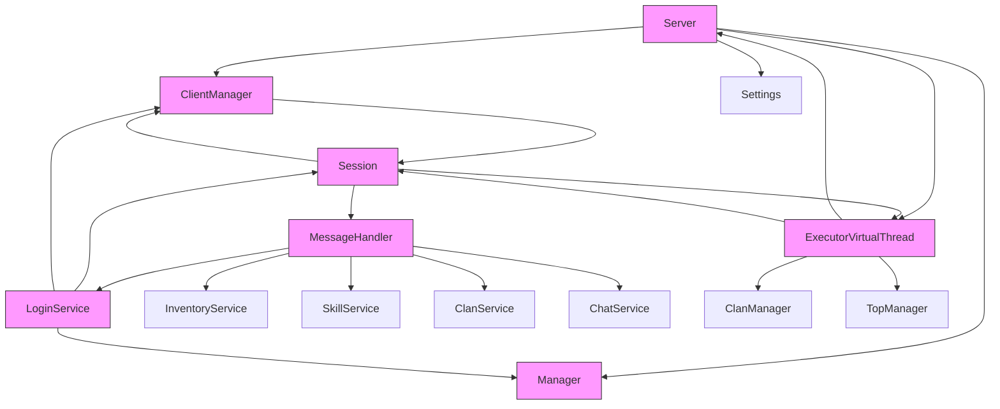

# Server Architecture

<cite>
**Referenced Files in This Document**   
- [Server.java](file://src/main/java/server/Server.java)
- [Manager.java](file://src/main/java/manager/Manager.java)
- [ExecutorVirtualThread.java](file://src/main/java/manager/ExecutorVirtualThread.java)
- [ClientManager.java](file://src/main/java/manager/ClientManager.java)
- [Session.java](file://src/main/java/network/Session.java)
- [MessageHandler.java](file://src/main/java/network/MessageHandler.java)
- [Settings.java](file://src/main/java/manager/Settings.java)
- [ClanManager.java](file://src/main/java/manager/ClanManager.java)
- [TopManager.java](file://src/main/java/manager/TopManager.java)
- [LoginService.java](file://src/main/java/services/LoginService.java)
</cite>

## Table of Contents
1. [Introduction](#introduction)
2. [Project Structure](#project-structure)
3. [Core Components](#core-components)
4. [Architecture Overview](#architecture-overview)
5. [Detailed Component Analysis](#detailed-component-analysis)
6. [Dependency Analysis](#dependency-analysis)
7. [Performance Considerations](#performance-considerations)
8. [Troubleshooting Guide](#troubleshooting-guide)
9. [Conclusion](#conclusion)

## Introduction
This document provides comprehensive architectural documentation for the core server infrastructure of the KPAH gaming server. It details the boot sequence, service initialization, virtual thread executor startup, and the role of the Manager as the central data repository and template registry. The document explains the virtual thread concurrency model that enables handling 40,000 concurrent connections efficiently, illustrates component interactions between Server, ClientManager, Session, and MessageHandler, and includes a sequence diagram for client connection handling. It also addresses scalability considerations, thread management strategies, shutdown procedures, and design trade-offs between virtual threads and traditional thread pools in the gaming context.

## Project Structure
The project follows a modular structure with packages organized by functionality. The core server components are located in the `server` package, while managers for various game systems are in the `manager` package. Network-related classes are in the `network` package, and game services are organized in the `services` package. Data templates and constants are stored in dedicated packages, ensuring separation of concerns and maintainable code organization.



**Diagram sources**
- [Server.java](file://src/main/java/server/Server.java)
- [Manager.java](file://src/main/java/manager/Manager.java)
- [ClientManager.java](file://src/main/java/manager/ClientManager.java)
- [ExecutorVirtualThread.java](file://src/main/java/manager/ExecutorVirtualThread.java)
- [Session.java](file://src/main/java/network/Session.java)
- [MessageHandler.java](file://src/main/java/network/MessageHandler.java)

**Section sources**
- [Server.java](file://src/main/java/server/Server.java)
- [Manager.java](file://src/main/java/manager/Manager.java)

## Core Components
The server architecture is built around several core components that work together to handle game clients, manage game state, and process player actions. The Server class serves as the entry point and connection listener, while the Manager class acts as the central repository for game templates and configuration data. The ClientManager maintains active player sessions, and the Session class represents individual client connections. The MessageHandler processes incoming player commands, and the ExecutorVirtualThread manages the virtual thread pool for concurrent operations.

**Section sources**
- [Server.java](file://src/main/java/server/Server.java#L1-L118)
- [Manager.java](file://src/main/java/manager/Manager.java#L1-L799)
- [ClientManager.java](file://src/main/java/manager/ClientManager.java#L1-L93)
- [Session.java](file://src/main/java/network/Session.java#L1-L398)
- [MessageHandler.java](file://src/main/java/network/MessageHandler.java#L1-L671)

## Architecture Overview
The server architecture follows a reactive, event-driven model with virtual threads enabling high concurrency. At startup, the Server initializes and binds to a listening port, then spawns a dedicated thread to accept incoming connections. The Manager loads all game templates and configuration data into memory, serving as a central repository accessible to all components. When a client connects, the Server creates a Session object and delegates it to a virtual thread for processing. Each Session maintains its own message collector and sender threads, allowing for independent communication with the client.

The virtual thread model enables the server to handle up to 40,000 concurrent connections efficiently, as specified in Settings.MAX_PLAYER. This approach eliminates the overhead of traditional thread pools while maintaining the simplicity of thread-per-connection programming. The architecture separates concerns between connection handling (Server), session management (ClientManager), message processing (MessageHandler), and game state management (various services).

```mermaid
graph TD
A[Client Connection] --> B[Server.accept()]
B --> C{Client Count < MAX_PLAYER?}
C --> |Yes| D[Create Session]
C --> |No| E[Reject Connection]
D --> F[Submit to Virtual Thread]
F --> G[Session.initThreadSession()]
G --> H[Start Collector & Sender]
H --> I[Set MessageHandler]
I --> J[ClientManager.joinClient()]
J --> K[Client Connected]
style A fill:#ccf,stroke:#333
style K fill:#cfc,stroke:#333
style D fill:#f9f,stroke:#333
style F fill:#f9f,stroke:#333
style G fill:#f9f,stroke:#333
style J fill:#f9f,stroke:#333
classDef component fill:#f9f,stroke:#333;
class D,F,G,J component;
```

**Diagram sources**
- [Server.java](file://src/main/java/server/Server.java#L1-L118)
- [Session.java](file://src/main/java/network/Session.java#L1-L398)
- [ClientManager.java](file://src/main/java/manager/ClientManager.java#L1-L93)
- [ExecutorVirtualThread.java](file://src/main/java/manager/ExecutorVirtualThread.java#L1-L36)

## Detailed Component Analysis

### Server Boot Sequence and Initialization
The server boot sequence begins with the main method in the Server class, which creates a Server instance and calls its init method. This starts a dedicated thread that binds to the configured port and begins accepting client connections. During initialization, the server sets up ANSI console output, displays the game logo, and initializes the Manager component which loads all game templates and configuration data from the database.

The Server.run method contains the main event loop that continuously accepts new connections. For each accepted connection, it checks if the maximum player count has been reached before creating a new Session and submitting the client handling task to the virtual thread executor. The server also starts a virtual thread for command line input processing, allowing administrators to monitor server status and initiate maintenance mode.



**Diagram sources**
- [Server.java](file://src/main/java/server/Server.java#L15-L30)
- [Manager.java](file://src/main/java/manager/Manager.java#L750-L799)

**Section sources**
- [Server.java](file://src/main/java/server/Server.java#L1-L118)
- [Manager.java](file://src/main/java/manager/Manager.java#L1-L799)

### Manager as Central Data Repository
The Manager class serves as the central data repository and template registry for the entire game server. It maintains static ConcurrentHashMaps for various game templates including monsters, items, NPCs, skills, and maps. During initialization, Manager loads all template data from the database and stores it in memory for fast access by game services.

The Manager also stores configuration data such as skill parameters, potion effects, and game mechanics in static arrays and collections. This centralized approach ensures consistency across the server and eliminates redundant database queries. Game components access templates through Manager's getter methods, which provide thread-safe retrieval from the concurrent collections.



**Diagram sources**
- [Manager.java](file://src/main/java/manager/Manager.java#L1-L799)

**Section sources**
- [Manager.java](file://src/main/java/manager/Manager.java#L1-L799)

### Virtual Thread Concurrency Model
The server employs a virtual thread concurrency model to efficiently handle up to 40,000 concurrent connections. The ExecutorVirtualThread class wraps Java's virtual thread executor service, providing specialized executors for different types of tasks: server operations, player updates, session management, and map processing.

This model allows the server to use a thread-per-connection approach without the memory overhead of platform threads. Each client connection runs in its own virtual thread, enabling simple, synchronous code while achieving high concurrency. The virtual threads are managed by the JVM's carrier threads, which automatically schedule and context-switch between virtual threads as needed.

The design enables the server to handle 40,000 concurrent connections efficiently because virtual threads have minimal memory footprint (approximately 1KB stack) compared to platform threads (typically 1MB stack). This allows the server to maintain all client connections in memory without exhausting system resources.



**Diagram sources**
- [ExecutorVirtualThread.java](file://src/main/java/manager/ExecutorVirtualThread.java#L1-L36)
- [Server.java](file://src/main/java/server/Server.java#L1-L118)
- [Session.java](file://src/main/java/network/Session.java#L1-L398)
- [ClanManager.java](file://src/main/java/manager/ClanManager.java#L1-L71)
- [TopManager.java](file://src/main/java/manager/TopManager.java#L1-L119)

**Section sources**
- [ExecutorVirtualThread.java](file://src/main/java/manager/ExecutorVirtualThread.java#L1-L36)

### Component Interactions
The server components interact through well-defined interfaces and patterns. The Server accepts client connections and creates Session objects, which are managed by ClientManager. Each Session processes incoming messages through MessageHandler, which delegates to appropriate game services based on the command type.

The interaction flow begins when a client connects to the server. The Server creates a Session, initializes its threads, sets up the MessageHandler and message collector, and submits the session update task to the virtual thread executor. The Session is then added to ClientManager's collection of active clients.



**Diagram sources**
- [Server.java](file://src/main/java/server/Server.java#L1-L118)
- [Session.java](file://src/main/java/network/Session.java#L1-L398)
- [ClientManager.java](file://src/main/java/manager/ClientManager.java#L1-L93)
- [MessageHandler.java](file://src/main/java/network/MessageHandler.java#L1-L671)
- [LoginService.java](file://src/main/java/services/LoginService.java#L1-L228)

**Section sources**
- [Server.java](file://src/main/java/server/Server.java#L1-L118)
- [Session.java](file://src/main/java/network/Session.java#L1-L398)
- [ClientManager.java](file://src/main/java/manager/ClientManager.java#L1-L93)
- [MessageHandler.java](file://src/main/java/network/MessageHandler.java#L1-L671)

## Dependency Analysis
The server architecture demonstrates a clear dependency hierarchy with well-defined component responsibilities. The Server class depends on Manager for game data, ClientManager for session tracking, and ExecutorVirtualThread for concurrency. Session depends on MessageHandler for command processing and ClientManager for player management. MessageHandler depends on various game services for implementing game mechanics.

The dependency graph shows a mostly unidirectional flow from the server entry point through network components to game services, with Manager serving as a central hub for data access. This design promotes loose coupling and makes the system easier to maintain and extend.



**Diagram sources**
- [Server.java](file://src/main/java/server/Server.java)
- [Manager.java](file://src/main/java/manager/Manager.java)
- [ClientManager.java](file://src/main/java/manager/ClientManager.java)
- [ExecutorVirtualThread.java](file://src/main/java/manager/ExecutorVirtualThread.java)
- [Session.java](file://src/main/java/network/Session.java)
- [MessageHandler.java](file://src/main/java/network/MessageHandler.java)
- [LoginService.java](file://src/main/java/services/LoginService.java)

**Section sources**
- [Server.java](file://src/main/java/server/Server.java)
- [Manager.java](file://src/main/java/manager/Manager.java)
- [ClientManager.java](file://src/main/java/manager/ClientManager.java)
- [ExecutorVirtualThread.java](file://src/main/java/manager/ExecutorVirtualThread.java)
- [Session.java](file://src/main/java/network/Session.java)
- [MessageHandler.java](file://src/main/java/network/MessageHandler.java)
- [LoginService.java](file://src/main/java/services/LoginService.java)

## Performance Considerations
The server's performance is optimized through several key design decisions. The use of virtual threads enables handling 40,000 concurrent connections with minimal memory overhead, as each virtual thread consumes only about 1KB of memory compared to 1MB for platform threads. This allows the server to maintain all client connections in memory without exhausting system resources.

The Manager class loads all game templates into memory at startup, eliminating the need for repeated database queries during gameplay. This in-memory data store provides fast access to game data and reduces database load. The ConcurrentHashMap collections used in Manager provide thread-safe access without requiring explicit synchronization.

The separation of concerns between components allows for efficient resource utilization. Network I/O is handled by dedicated collector and sender threads within each Session, while game logic is processed by the MessageHandler. This design prevents blocking operations in one area from affecting others.

The server also includes periodic background tasks for clan and top player data updates, which run on virtual threads and persist changes to the database at regular intervals. This batch processing approach reduces database transaction overhead and improves overall performance.

**Section sources**
- [ExecutorVirtualThread.java](file://src/main/java/manager/ExecutorVirtualThread.java)
- [Manager.java](file://src/main/java/manager/Manager.java)
- [Settings.java](file://src/main/java/manager/Settings.java)

## Troubleshooting Guide
When troubleshooting server issues, consider the following common problems and their solutions:

1. **Port already in use**: If the server fails to start with "Port Is Already Open" error, ensure no other process is using the configured port (default 19129). Use system tools to identify and terminate conflicting processes.

2. **Database connection issues**: Verify database credentials in Settings.java and ensure the MySQL server is running and accessible. Check firewall settings if connecting to a remote database.

3. **Client connection limits**: The server limits connections to 40,000 players as defined in Settings.MAX_PLAYER. If clients are being rejected, check if this limit has been reached.

4. **Virtual thread performance**: Monitor system resources when under load. While virtual threads are efficient, excessive CPU-bound operations can still impact performance. Ensure long-running tasks are properly optimized.

5. **Memory usage**: The server loads all game templates into memory. If memory usage is too high, consider optimizing template data or increasing heap size.

6. **Command line interface**: Use the built-in command line interface (baotri, thread, player, session commands) to monitor server status and initiate maintenance mode.

**Section sources**
- [Server.java](file://src/main/java/server/Server.java#L1-L118)
- [Settings.java](file://src/main/java/manager/Settings.java#L1-L58)
- [ExecutorVirtualThread.java](file://src/main/java/manager/ExecutorVirtualThread.java#L1-L36)

## Conclusion
The KPAH server architecture demonstrates a well-designed, high-performance gaming server implementation. By leveraging Java's virtual threads, the server achieves exceptional concurrency, handling up to 40,000 simultaneous connections efficiently. The centralized Manager component serves as a comprehensive data repository and template registry, providing fast access to game data while maintaining consistency across the system.

The clean separation of concerns between components—Server for connection handling, Session for client communication, MessageHandler for command processing, and various services for game mechanics—results in a maintainable and extensible architecture. The use of virtual threads eliminates the complexity of traditional thread pool management while providing the scalability needed for a multiplayer gaming environment.

The design trade-offs favor simplicity and performance, using a thread-per-connection model made feasible by virtual threads. This approach allows developers to write straightforward, synchronous code while achieving the concurrency typically associated with complex asynchronous or event-driven architectures. The result is a robust server infrastructure capable of supporting a large player base with responsive gameplay and reliable performance.