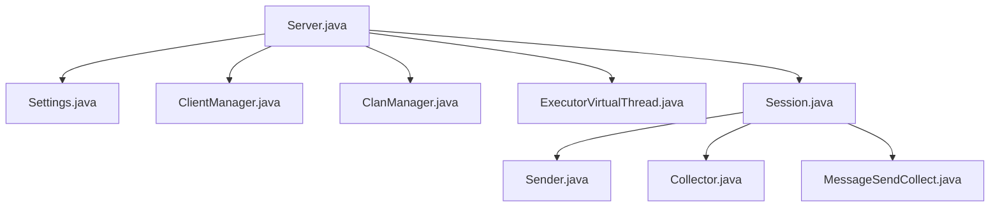
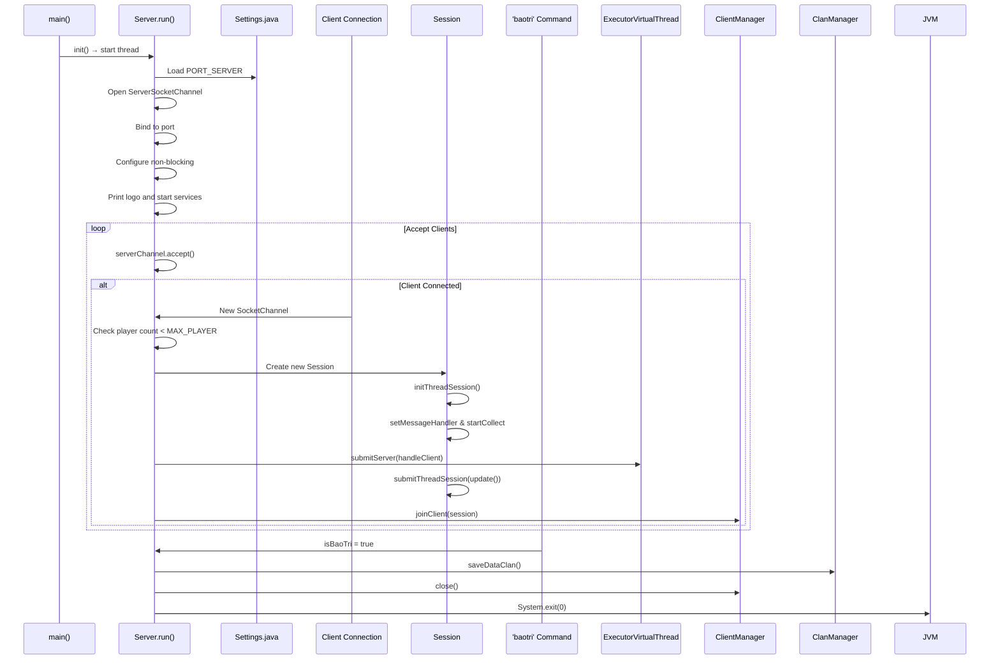
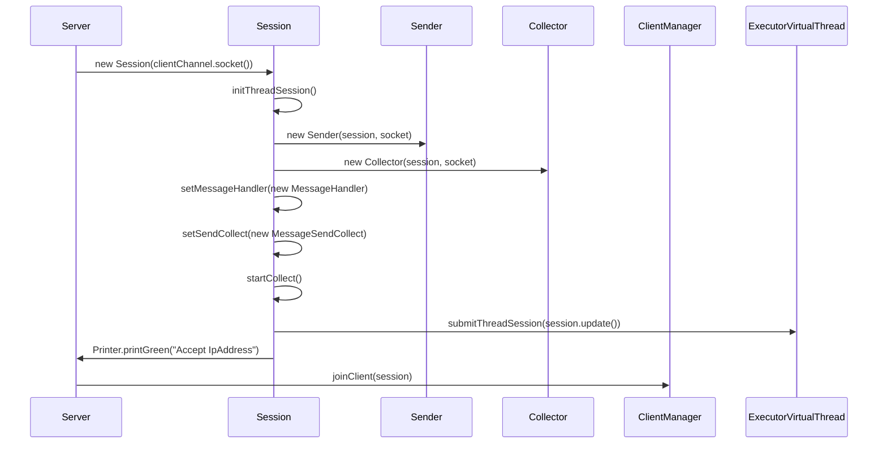
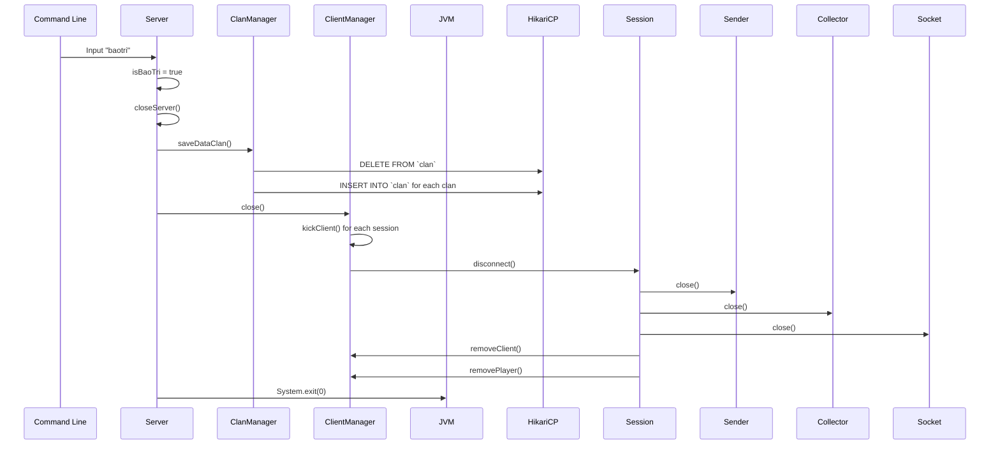
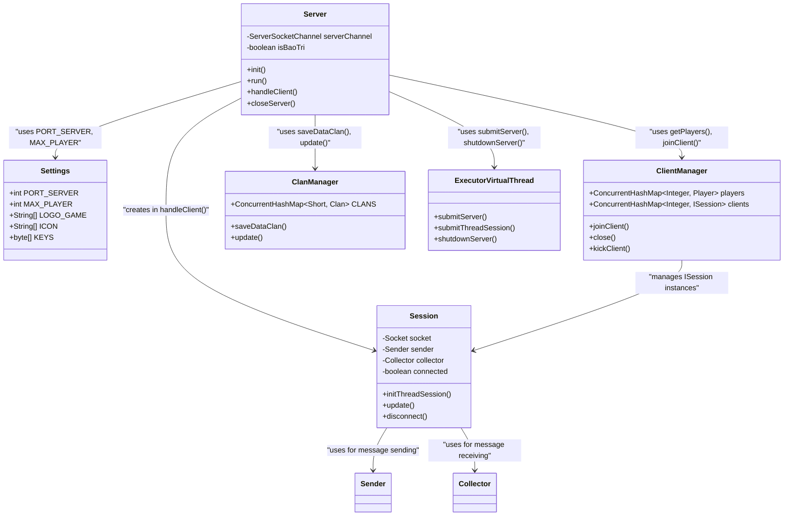

# Server Lifecycle Management

<cite>
**Referenced Files in This Document**   
- [Server.java](file://src/main/java/server/Server.java)
- [Settings.java](file://src/main/java/manager/Settings.java)
- [ClanManager.java](file://src/main/java/manager/ClanManager.java)
- [ClientManager.java](file://src/main/java/manager/ClientManager.java)
- [ExecutorVirtualThread.java](file://src/main/java/manager/ExecutorVirtualThread.java)
- [Session.java](file://src/main/java/network/Session.java)
- [MessageSendCollect.java](file://src/main/java/network/MessageSendCollect.java)
- [Collector.java](file://src/main/java/network/Collector.java)
- [Sender.java](file://src/main/java/network/Sender.java)
</cite>

## Table of Contents
1. [Introduction](#introduction)
2. [Project Structure](#project-structure)
3. [Core Components](#core-components)
4. [Architecture Overview](#architecture-overview)
5. [Detailed Component Analysis](#detailed-component-analysis)
6. [Dependency Analysis](#dependency-analysis)
7. [Performance Considerations](#performance-considerations)
8. [Troubleshooting Guide](#troubleshooting-guide)
9. [Conclusion](#conclusion)

## Introduction
This document provides a comprehensive analysis of the server lifecycle management system in the KPAH game server. It details the startup sequence, client connection handling, and shutdown procedures, with a focus on non-blocking I/O operations, connection acceptance logic, and graceful termination. The integration with configuration settings and data persistence mechanisms is also covered.

## Project Structure
The server lifecycle is primarily managed within the `server` package, with critical dependencies on the `manager`, `network`, and `utils` packages. Configuration is centralized in `Settings.java`, while session and client management are handled through dedicated classes.



**Diagram sources**  
- [Server.java](file://src/main/java/server/Server.java#L1-L118)
- [Settings.java](file://src/main/java/manager/Settings.java#L1-L58)
- [Session.java](file://src/main/java/network/Session.java#L1-L224)

**Section sources**  
- [Server.java](file://src/main/java/server/Server.java#L1-L118)
- [Settings.java](file://src/main/java/manager/Settings.java#L1-L58)

## Core Components
The core components of the server lifecycle include the `Server` class for bootstrapping, `Session` for client communication, `ClientManager` for tracking connected clients, and `ClanManager` for data persistence during shutdown. Configuration is managed through `Settings.java`, and threading is handled via `ExecutorVirtualThread`.

**Section sources**  
- [Server.java](file://src/main/java/server/Server.java#L1-L118)
- [ClientManager.java](file://src/main/java/manager/ClientManager.java#L1-L93)
- [ClanManager.java](file://src/main/java/manager/ClanManager.java#L1-L71)

## Architecture Overview
The server follows a non-blocking I/O model using `ServerSocketChannel` and virtual threads for scalability. Upon startup, it binds to a configured port and enters a loop to accept incoming connections. Each client session is managed independently with dedicated sender and collector threads. The shutdown process is triggered by a command-line input and ensures data consistency before termination.



**Diagram sources**  
- [Server.java](file://src/main/java/server/Server.java#L40-L117)
- [Session.java](file://src/main/java/network/Session.java#L45-L173)
- [ClientManager.java](file://src/main/java/manager/ClientManager.java#L60-L75)
- [ClanManager.java](file://src/main/java/manager/ClanManager.java#L50-L55)

## Detailed Component Analysis

### Server Boot Sequence Analysis
The server lifecycle begins with the `main()` method instantiating and initializing the `Server` object. The `init()` method starts a dedicated thread that executes the `run()` method, which handles all socket operations.

#### Boot Process Flowchart
```mermaid
flowchart TD
Start([main()]) --> Init[server.init()]
Init --> Run[New Thread: run()]
Run --> Ansi[AnsiConsole.systemInstall()]
Run --> OpenChannel[serverChannel = ServerSocketChannel.open()]
Run --> Bind[serverChannel.bind(PORT_SERVER)]
Run --> NonBlocking[serverChannel.configureBlocking(false)]
Run --> Logo[Print LOGO_GAME and ICON]
Run --> ManagerInit[Manager.init()]
Run --> CommandLine[activeCommandLine()]
Run --> PrintPort["Listen Port " + PORT_SERVER]
Run --> SubmitTasks[Submit ClanManager.update() and TopManager.updateTopClan()]
Run --> AcceptLoop{while !isBaoTri}
AcceptLoop --> Accept[serverChannel.accept()]
Accept --> CheckNull{clientChannel != null?}
CheckNull --> |Yes| CheckPlayerLimit{players.size() < MAX_PLAYER?}
CheckNull --> |No| ContinueLoop
CheckPlayerLimit --> |Yes| HandleClient[submitServer(handleClient)]
CheckPlayerLimit --> |No| CloseChannel[clientChannel.close()]
HandleClient --> End
CloseChannel --> End
ContinueLoop --> End
```

**Diagram sources**  
- [Server.java](file://src/main/java/server/Server.java#L40-L75)

**Section sources**  
- [Server.java](file://src/main/java/server/Server.java#L40-L75)
- [Settings.java](file://src/main/java/manager/Settings.java#L8)
- [Settings.java](file://src/main/java/manager/Settings.java#L15)

### Client Connection Handling
When a client connects, the server checks the current player count against `MAX_PLAYER`. If under the limit, a new `Session` is created and registered with `ClientManager`. The session initializes its sender and collector threads for message handling.

#### Session Initialization Sequence


**Diagram sources**  
- [Server.java](file://src/main/java/server/Server.java#L73-L101)
- [Session.java](file://src/main/java/network/Session.java#L45-L95)
- [Session.java](file://src/main/java/network/Session.java#L92-L138)

**Section sources**  
- [Server.java](file://src/main/java/server/Server.java#L73-L101)
- [Session.java](file://src/main/java/network/Session.java#L45-L138)

### Shutdown Procedure Analysis
The shutdown process is initiated by the 'baotri' command entered via the command line interface. This sets the `isBaoTri` flag to true, breaking the main accept loop and triggering the `closeServer()` method.

#### Shutdown Sequence Diagram


**Diagram sources**  
- [Server.java](file://src/main/java/server/Server.java#L101-L117)
- [ClanManager.java](file://src/main/java/manager/ClanManager.java#L50-L55)
- [ClientManager.java](file://src/main/java/manager/ClientManager.java#L55-L65)

**Section sources**  
- [Server.java](file://src/main/java/server/Server.java#L101-L117)
- [ClanManager.java](file://src/main/java/manager/ClanManager.java#L50-L55)
- [ClientManager.java](file://src/main/java/manager/ClientManager.java#L55-L75)

## Dependency Analysis
The server lifecycle components are tightly integrated with configuration, session management, and data persistence systems. The use of virtual threads enables high concurrency while maintaining simplicity in the code structure.



**Diagram sources**  
- [Server.java](file://src/main/java/server/Server.java#L1-L118)
- [Settings.java](file://src/main/java/manager/Settings.java#L1-L58)
- [Session.java](file://src/main/java/network/Session.java#L1-L224)
- [ClientManager.java](file://src/main/java/manager/ClientManager.java#L1-L93)
- [ClanManager.java](file://src/main/java/manager/ClanManager.java#L1-L71)
- [ExecutorVirtualThread.java](file://src/main/java/manager/ExecutorVirtualThread.java#L1-L36)

**Section sources**  
- [Server.java](file://src/main/java/server/Server.java#L1-L118)
- [Settings.java](file://src/main/java/manager/Settings.java#L1-L58)
- [Session.java](file://src/main/java/network/Session.java#L1-L224)

## Performance Considerations
The server utilizes virtual threads (Project Loom) for high concurrency with low overhead. The non-blocking I/O model allows a single thread to manage thousands of connections efficiently. Connection limits and timeout mechanisms prevent resource exhaustion.

The use of `ConcurrentHashMap` in `ClientManager` ensures thread-safe access to player and session data. The periodic clan update task runs independently, minimizing impact on the main server loop.

## Troubleshooting Guide
Common issues in the server lifecycle can be diagnosed and resolved using the following guidance:

### Port Conflict Resolution
If the server fails to start with "Port Is Already Open" error:
1. Verify no other instance is running
2. Check for processes using the configured port (19129 by default)
3. Use `netstat -an | findstr 19129` (Windows) or `lsof -i :19129` (Linux/Mac) to identify conflicting processes
4. Either terminate the conflicting process or modify `Settings.PORT_SERVER`

### Failed Socket Binding
If socket binding fails:
1. Ensure the port number is within valid range (1-65535)
2. Verify the server has sufficient privileges to bind to the port
3. Check firewall settings that might block the port
4. Confirm the IP address in `InetSocketAddress` is correct

### Unresponsive Shutdown
If the server does not respond to 'baotri' command:
1. Verify the command is entered exactly as 'baotri' (case-sensitive)
2. Check if the command line scanner thread is active
3. Ensure no blocking operations prevent the main server loop from exiting
4. Verify `System.exit(0)` is not being intercepted by security managers

### Connection Rejection Issues
If clients are being rejected unexpectedly:
1. Monitor player count with 'player' command
2. Verify `Settings.MAX_PLAYER` value (40000 by default)
3. Check if maintenance mode (`isBaoTri`) is accidentally enabled
4. Review `ClientManager.getPlayers().size()` accuracy

**Section sources**  
- [Server.java](file://src/main/java/server/Server.java#L55-L60)
- [Server.java](file://src/main/java/server/Server.java#L68-L72)
- [Server.java](file://src/main/java/server/Server.java#L101-L117)
- [Settings.java](file://src/main/java/manager/Settings.java#L8)
- [Settings.java](file://src/main/java/manager/Settings.java#L15)

## Conclusion
The server lifecycle management system demonstrates a well-structured approach to handling game server operations. The use of non-blocking I/O combined with virtual threads enables high scalability, while the clear separation of concerns between components enhances maintainability. The graceful shutdown procedure ensures data integrity through proper persistence and session cleanup. Configuration through `Settings.java` provides flexibility without requiring code changes. This architecture effectively balances performance, reliability, and ease of maintenance for a multiplayer game server environment.