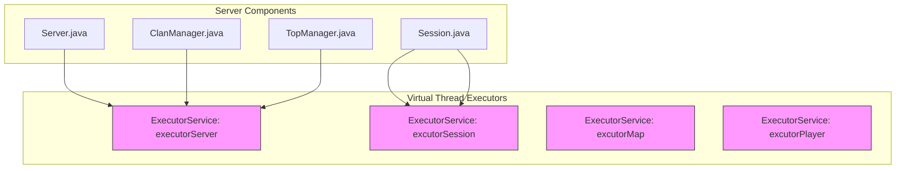
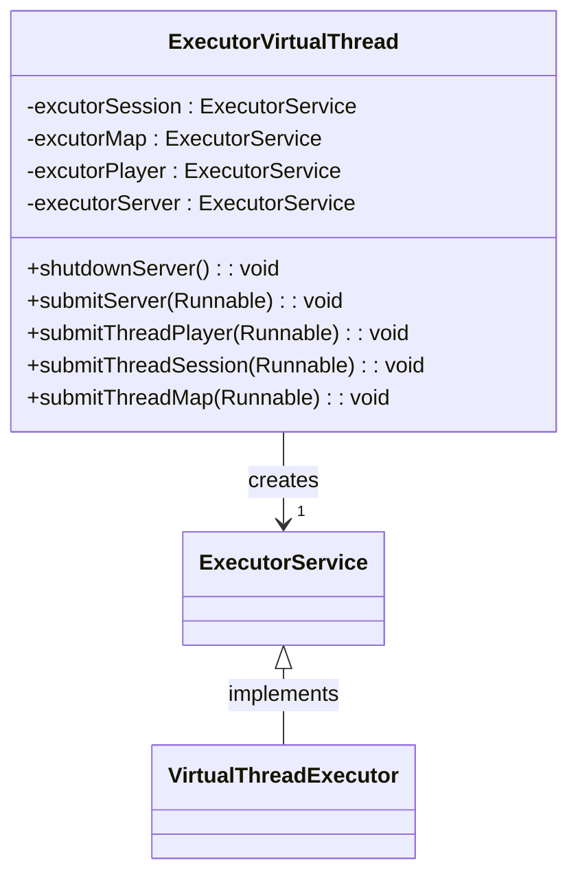
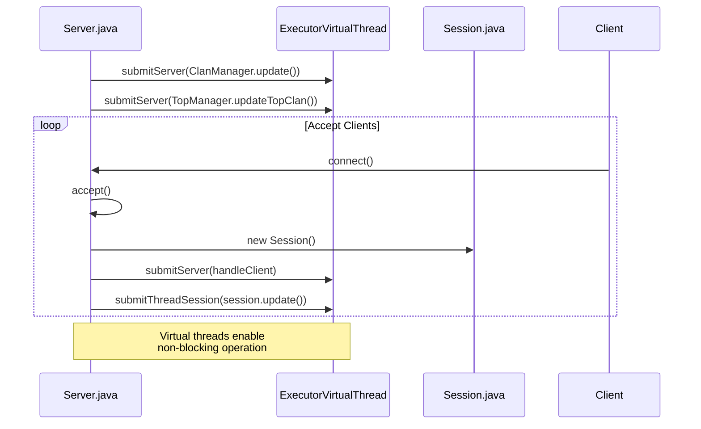
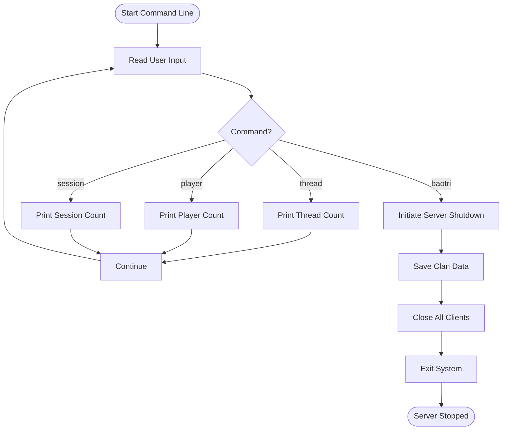

# Virtual Thread Concurrency Model

<cite>
**Referenced Files in This Document**   
- [ExecutorVirtualThread.java](file://src/main/java/manager/ExecutorVirtualThread.java)
- [Server.java](file://src/main/java/server/Server.java)
- [Session.java](file://src/main/java/network/Session.java)
- [Settings.java](file://src/main/java/manager/Settings.java)
- [ClanManager.java](file://src/main/java/manager/ClanManager.java)
- [TopManager.java](file://src/main/java/manager/TopManager.java)
</cite>

## Table of Contents
1. [Introduction](#introduction)
2. [Virtual Thread Architecture](#virtual-thread-architecture)
3. [ExecutorVirtualThread Implementation](#executorvirtualthread-implementation)
4. [Integration Points in Server.java](#integration-points-in-serverjava)
5. [Session Management with Virtual Threads](#session-management-with-virtual-threads)
6. [Performance Benefits](#performance-benefits)
7. [Thread Management and Monitoring](#thread-management-and-monitoring)
8. [Best Practices for High-Concurrency Game Servers](#best-practices-for-high-concurrency-game-servers)
9. [Limitations and Bottlenecks](#limitations-and-bottlenecks)
10. [Conclusion](#conclusion)

## Introduction
This document provides comprehensive documentation for the virtual thread concurrency model implemented in the game server using Java 21's virtual threads. The system is designed to efficiently handle up to 40,000 concurrent connections by leveraging lightweight virtual threads instead of traditional platform threads. This approach significantly reduces memory footprint and improves context switching efficiency, making it ideal for high-concurrency game server environments.

The virtual thread model is implemented through the ExecutorVirtualThread class, which provides specialized thread pools for different server components. The integration enables efficient handling of client connections, periodic clan updates, and session management tasks. This documentation details the implementation, performance benefits, integration points, and best practices for managing virtual threads in this high-performance gaming environment.

## Virtual Thread Architecture
The virtual thread architecture in this game server leverages Java 21's Project Loom features to create a highly scalable concurrency model. Unlike traditional platform threads that are expensive in terms of memory and context switching overhead, virtual threads are lightweight fibers managed by the JVM. Each virtual thread consumes only a few kilobytes of memory compared to megabytes for platform threads, enabling the server to handle tens of thousands of concurrent connections efficiently.

The architecture employs multiple specialized virtual thread executors for different subsystems, ensuring isolation and optimal resource allocation. This design allows the server to maintain high throughput even under heavy load conditions. The virtual threads are particularly effective for I/O-bound operations common in game servers, such as network communication, database queries, and file operations.

**Diagram sources**
- [ExecutorVirtualThread.java](file://src/main/java/manager/ExecutorVirtualThread.java#L11-L14)
- [Server.java](file://src/main/java/server/Server.java#L73-L101)

**Section sources**
- [ExecutorVirtualThread.java](file://src/main/java/manager/ExecutorVirtualThread.java#L1-L35)
- [Server.java](file://src/main/java/server/Server.java#L1-L118)

## ExecutorVirtualThread Implementation
The ExecutorVirtualThread class serves as the central component for managing virtual threads in the game server. It implements a factory pattern with four distinct virtual thread executors, each dedicated to specific types of tasks. The implementation uses Java 21's newVirtualThreadPerTaskExecutor() method to create lightweight virtual threads that are managed efficiently by the JVM.

The class provides static methods for submitting tasks to each executor, abstracting the complexity of thread management from other components. The four executors serve different purposes: executorServer handles server-level tasks like periodic updates, excutorSession manages session-related operations, excutorMap handles map updates, and excutorPlayer manages player-specific tasks. This separation ensures that different types of workloads don't interfere with each other.

The implementation also includes a shutdown mechanism to gracefully terminate the server executor when the game server is shutting down. This ensures proper cleanup of resources and prevents potential memory leaks.

**Diagram sources**
- [ExecutorVirtualThread.java](file://src/main/java/manager/ExecutorVirtualThread.java#L11-L35)

**Section sources**
- [ExecutorVirtualThread.java](file://src/main/java/manager/ExecutorVirtualThread.java#L1-L35)

## Integration Points in Server.java
The Server.java class integrates virtual threads at multiple critical points in the server lifecycle. During initialization, the server submits periodic update tasks for clan management and top player/clan rankings to the server executor. These background tasks run independently without blocking the main server thread, ensuring smooth operation.

When handling new client connections, the server creates a new Session object and submits its update task to the session executor. This allows each client session to be managed by a dedicated virtual thread, enabling the server to handle thousands of concurrent connections efficiently. The accept loop continues processing new connections without being blocked by existing client operations.

The server also implements a command-line interface using a virtual thread, allowing administrators to monitor server status and perform maintenance operations without affecting game performance. Commands like "thread", "player", and "session" provide real-time insights into server load and resource usage.

**Diagram sources**
- [Server.java](file://src/main/java/server/Server.java#L73-L101)
- [ExecutorVirtualThread.java](file://src/main/java/manager/ExecutorVirtualThread.java#L20-L22)

**Section sources**
- [Server.java](file://src/main/java/server/Server.java#L1-L118)

## Session Management with Virtual Threads
The Session class leverages virtual threads to manage individual client connections efficiently. When a new session is created, it initializes sender and collector threads for handling outgoing and incoming messages. The session's update method, which monitors connection status and handles timeouts, is submitted to the session executor, ensuring it runs on a lightweight virtual thread.

Each session can handle multiple players (characters) associated with a single account. The virtual thread model allows the server to maintain thousands of active sessions without exhausting system resources. The session update task periodically checks for inactivity and disconnects idle clients, preventing resource leaks.

The implementation includes proper cleanup mechanisms to dispose of session resources when a client disconnects. This includes closing network sockets, cleaning up player data, and removing the session from the client manager. The virtual thread executor automatically handles thread lifecycle management, reducing the risk of thread leaks.

**Section sources**
- [Session.java](file://src/main/java/network/Session.java#L1-L398)
- [ExecutorVirtualThread.java](file://src/main/java/manager/ExecutorVirtualThread.java#L28-L30)

## Performance Benefits
The virtual thread implementation provides significant performance benefits compared to traditional thread-based concurrency models. The most notable advantage is the dramatically reduced memory footprint. With virtual threads consuming only a few kilobytes each, the server can handle up to 40,000 concurrent connections within reasonable memory limits, as defined by the MAX_PLAYER constant in Settings.java.

Context switching efficiency is another major benefit. Virtual threads are scheduled by the JVM rather than the operating system, resulting in much faster context switches. This is particularly important for game servers where thousands of clients may be sending and receiving messages simultaneously. The reduced overhead allows the server to maintain high throughput even under heavy load.

The implementation also improves scalability by eliminating the need for complex thread pooling strategies. With virtual threads, the server can create a dedicated thread for each task without worrying about pool exhaustion. This simplifies the code and reduces the likelihood of deadlocks and other concurrency issues.

Additionally, the separation of concerns through specialized executors ensures that different types of workloads don't interfere with each other. For example, periodic clan updates won't impact the responsiveness of client sessions, and map updates won't affect player interactions.

**Section sources**
- [Settings.java](file://src/main/java/manager/Settings.java#L5-L6)
- [ExecutorVirtualThread.java](file://src/main/java/manager/ExecutorVirtualThread.java#L11-L14)

## Thread Management and Monitoring
The server provides built-in mechanisms for monitoring and managing virtual threads. The command-line interface includes a "thread" command that displays the current active thread count using Thread.activeCount(). This allows administrators to monitor the server's concurrency level and identify potential issues.

The activeCommandLine method in Server.java runs on a virtual thread, ensuring that administrative operations don't block the main server loop. This design allows administrators to perform maintenance tasks without affecting game performance. The command processor supports several monitoring commands, including "player" for checking the number of connected players and "session" for viewing active sessions.

Proper shutdown procedures are implemented to ensure graceful termination of all virtual threads. The shutdownServer method in ExecutorVirtualThread initiates a clean shutdown of the server executor, allowing ongoing tasks to complete before the server terminates. This prevents data corruption and ensures that player data is properly saved.

The system also includes error handling and logging mechanisms to detect and report thread-related issues. Exceptions in virtual threads are caught and logged using the Logger utility, providing visibility into potential problems without crashing the server.

**Diagram sources**
- [Server.java](file://src/main/java/server/Server.java#L103-L118)

**Section sources**
- [Server.java](file://src/main/java/server/Server.java#L103-L118)
- [ExecutorVirtualThread.java](file://src/main/java/manager/ExecutorVirtualThread.java#L16-L18)

## Best Practices for High-Concurrency Game Servers
Implementing virtual threads in high-concurrency game servers requires adherence to several best practices. First, tasks submitted to virtual threads should be designed to be short-lived and non-blocking whenever possible. For operations that involve blocking I/O, such as database calls, consider using asynchronous alternatives or dedicated thread pools to prevent virtual thread parking.

Proper error handling is crucial when working with virtual threads. Since exceptions in virtual threads can terminate the thread silently, comprehensive logging and monitoring are essential. The implementation should include try-catch blocks around critical operations and use the Logger utility to record errors for troubleshooting.

Resource cleanup should be prioritized to prevent memory leaks. The Session class demonstrates this principle by implementing a dispose method that properly cleans up network resources and player data when a session ends. Similar cleanup mechanisms should be implemented for other components that manage resources.

Monitoring and metrics collection are vital for maintaining server health. The built-in command interface provides basic monitoring capabilities, but additional metrics such as response times, error rates, and database query performance should be collected and analyzed regularly.

Finally, capacity planning is important to ensure the server can handle expected loads. The MAX_PLAYER setting in Settings.java establishes a clear limit on concurrent connections, preventing the server from becoming overwhelmed. This limit should be tuned based on available hardware resources and performance testing.

**Section sources**
- [Settings.java](file://src/main/java/manager/Settings.java#L5)
- [Session.java](file://src/main/java/network/Session.java#L378-L398)
- [Logger.java](file://src/main/java/utils/Logger.java)

## Limitations and Bottlenecks
While virtual threads provide significant advantages, they are not without limitations and potential bottlenecks. One major limitation is their interaction with blocking I/O operations. When a virtual thread encounters a blocking operation, such as a synchronous database call, it becomes "parked" and cannot be scheduled until the operation completes. This can reduce the effectiveness of the virtual thread model if not properly managed.

Database calls represent a potential bottleneck in the current implementation. Methods in ClanManager and TopManager that interact with the database using HikariCP may block virtual threads, especially under heavy load. To mitigate this, consider implementing asynchronous database access or using a dedicated thread pool for database operations.

Another potential bottleneck is the use of synchronized methods in critical paths. The @Synchronized annotation in ClanManager and TopManager methods can create contention when multiple virtual threads attempt to access shared resources simultaneously. This can negate some of the performance benefits of virtual threads.

Memory usage, while significantly reduced compared to platform threads, can still become an issue with tens of thousands of concurrent connections. Each session maintains player data, message queues, and network buffers, which can accumulate over time. Proper resource cleanup and connection timeout mechanisms are essential to prevent memory exhaustion.

Finally, monitoring and debugging virtual threads can be more challenging than traditional threads. Standard profiling tools may not provide detailed insights into virtual thread behavior, requiring specialized tools and techniques to diagnose performance issues.

**Section sources**
- [ClanManager.java](file://src/main/java/manager/ClanManager.java#L45-L55)
- [TopManager.java](file://src/main/java/manager/TopManager.java#L45-L100)
- [HikariCP.java](file://src/main/java/database/HikariCP.java)

## Conclusion
The virtual thread concurrency model implemented in this game server represents a significant advancement in handling high-concurrency workloads. By leveraging Java 21's virtual threads through the ExecutorVirtualThread class, the server can efficiently manage up to 40,000 concurrent connections with minimal resource overhead. The architecture demonstrates the power of Project Loom in creating scalable, high-performance applications.

The integration of virtual threads in key components like Server.java and Session.java enables non-blocking operation and efficient resource utilization. The performance benefits in terms of reduced memory footprint and improved context switching efficiency make this approach ideal for modern game servers. However, careful attention must be paid to potential bottlenecks, particularly around blocking I/O operations and database access.

Best practices for thread management, monitoring, and resource cleanup are essential for maintaining server stability and performance. The built-in monitoring commands provide valuable insights into server operation, while proper shutdown procedures ensure data integrity. As virtual thread technology continues to evolve, further optimizations and enhancements will likely become available, making this concurrency model even more powerful for high-performance gaming applications.