# Clan System

<cite>
**Referenced Files in This Document**   
- [Clan.java](file://src/main/java/clan/Clan.java)
- [ClanMessage.java](file://src/main/java/clan/ClanMessage.java)
- [ClanService.java](file://src/main/java/services/ClanService.java)
- [ClanConst.java](file://src/main/java/consts/ClanConst.java)
- [ClanManager.java](file://src/main/java/manager/ClanManager.java)
- [PlayerDAO.java](file://src/main/java/daos/PlayerDAO.java)
- [Player.java](file://src/main/java/player/Player.java)
- [Friend.java](file://src/main/java/player/Friend.java)
- [Sundry.java](file://src/main/java/player/Sundry.java)
- [Manager.java](file://src/main/java/manager/Manager.java)
</cite>

## Table of Contents
1. [Introduction](#introduction)
2. [Clan Class Structure](#clan-class-structure)
3. [Clan Service Operations](#clan-service-operations)
4. [Clan Messaging System](#clan-messaging-system)
5. [Membership Management](#membership-management)
6. [Leadership Roles and Hierarchy](#leadership-roles-and-hierarchy)
7. [Clan Creation and Dissolution](#clan-creation-and-dissolution)
8. [Data Consistency and Persistence](#data-consistency-and-persistence)
9. [Scalability and Performance](#scalability-and-performance)
10. [Integration with Game Systems](#integration-with-game-systems)
11. [Workflow Examples](#workflow-examples)

## Introduction
The Clan System provides a comprehensive social framework for players to form, manage, and interact within organized groups. This system enables players to create clans, manage membership, establish leadership hierarchies, and communicate within their clan. The implementation supports thousands of concurrent clans with up to 40,000 concurrent players, maintaining data consistency and performance through efficient data structures and persistence mechanisms. The system integrates with chat, combat, and other game systems to support clan-based activities and events.

## Clan Class Structure
The Clan class serves as the central data structure for clan information, encapsulating all relevant attributes and providing methods for clan management. The class uses Lombok annotations for boilerplate code reduction and thread-safe operations.

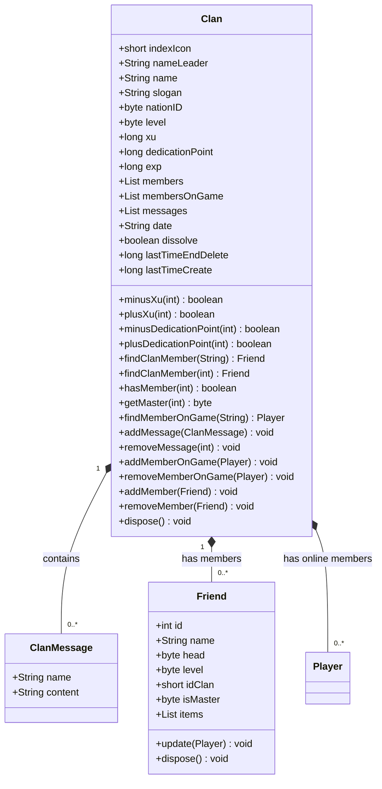

**Diagram sources**
- [Clan.java](file://src/main/java/clan/Clan.java#L1-L151)
- [ClanMessage.java](file://src/main/java/clan/ClanMessage.java#L1-L16)
- [Friend.java](file://src/main/java/player/Friend.java#L1-L59)

**Section sources**
- [Clan.java](file://src/main/java/clan/Clan.java#L1-L151)
- [ClanMessage.java](file://src/main/java/clan/ClanMessage.java#L1-L16)

## Clan Service Operations
The ClanService class provides the business logic for all clan-related operations, implementing methods for clan registration, membership management, messaging, and leadership actions. The service follows a singleton pattern with static instance access.

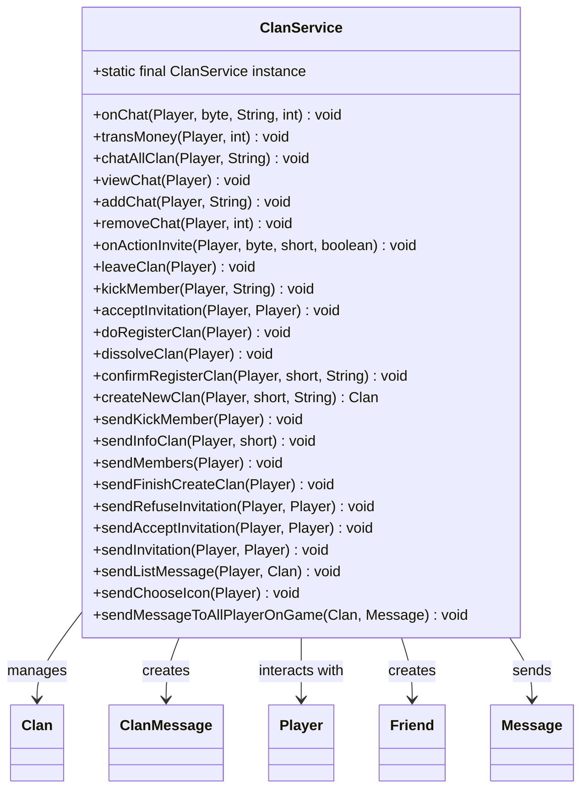

**Diagram sources**
- [ClanService.java](file://src/main/java/services/ClanService.java#L1-L404)

**Section sources**
- [ClanService.java](file://src/main/java/services/ClanService.java#L1-L404)

## Clan Messaging System
The clan messaging system enables intra-clan communication through a persistent message history with automatic cleanup. The system limits message storage to 50 messages per clan, implementing a FIFO (first-in, first-out) removal policy when the limit is exceeded.

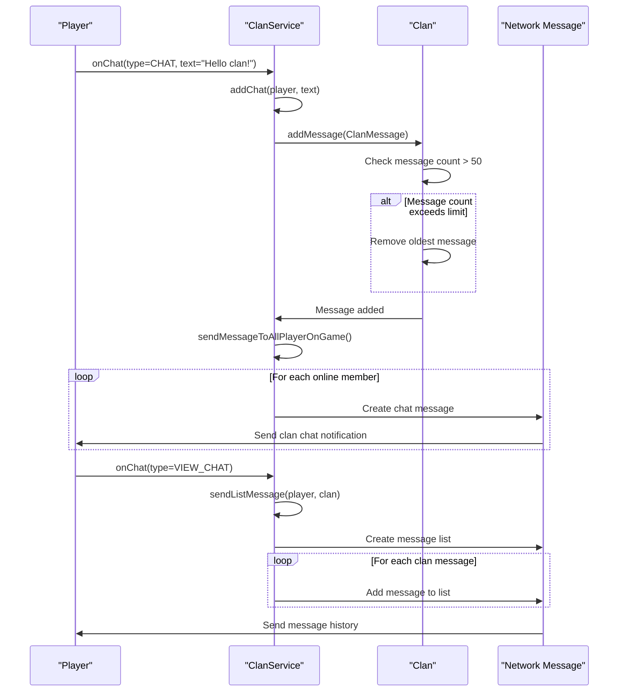

**Diagram sources**
- [ClanService.java](file://src/main/java/services/ClanService.java#L1-L404)
- [Clan.java](file://src/main/java/clan/Clan.java#L1-L151)
- [ClanMessage.java](file://src/main/java/clan/ClanMessage.java#L1-L16)

**Section sources**
- [ClanService.java](file://src/main/java/services/ClanService.java#L1-L404)
- [Clan.java](file://src/main/java/clan/Clan.java#L1-L151)

## Membership Management
The clan system implements comprehensive membership management functionality, allowing players to join, leave, and be invited to clans. The system maintains both persistent member data and real-time online status tracking.

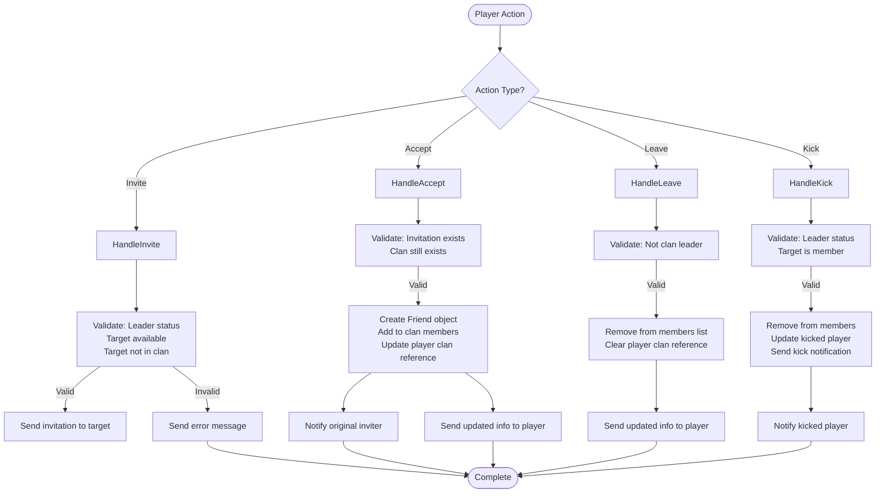

**Diagram sources**
- [ClanService.java](file://src/main/java/services/ClanService.java#L1-L404)
- [Clan.java](file://src/main/java/clan/Clan.java#L1-L151)
- [Player.java](file://src/main/java/player/Player.java#L1-L309)

**Section sources**
- [ClanService.java](file://src/main/java/services/ClanService.java#L1-L404)
- [Clan.java](file://src/main/java/clan/Clan.java#L1-L151)

## Leadership Roles and Hierarchy
The clan system implements a four-tier leadership hierarchy with distinct roles and permissions. Each role has specific privileges for clan management and communication, enabling structured governance within clans.

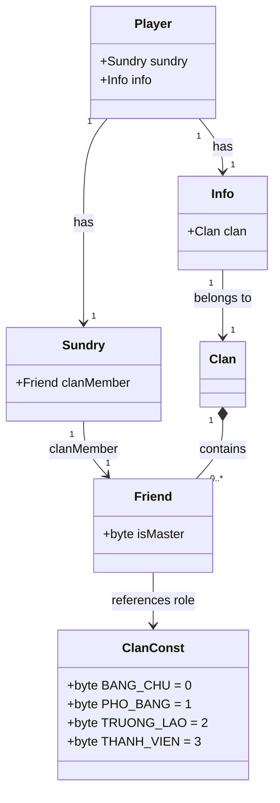

The leadership hierarchy consists of:
- **Bang Chu (Leader)**: Full clan management privileges, can disband the clan
- **Pho Bang (Vice Leader)**: Can invite members and manage some clan functions
- **Truong Lao (Elder)**: Limited management capabilities, primarily for communication
- **Thanh Vien (Member)**: Basic clan member with no management privileges

Role prefixes are displayed in clan chat:
- BC: Bang Chu (Leader)
- PB: Pho Bang (Vice Leader)
- TL: Truong Lao (Elder)
- TV: Thanh Vien (Member)

**Diagram sources**
- [ClanConst.java](file://src/main/java/consts/ClanConst.java#L1-L84)
- [Friend.java](file://src/main/java/player/Friend.java#L1-L59)
- [Sundry.java](file://src/main/java/player/Sundry.java#L1-L168)

**Section sources**
- [ClanConst.java](file://src/main/java/consts/ClanConst.java#L1-L84)
- [ClanService.java](file://src/main/java/services/ClanService.java#L1-L404)

## Clan Creation and Dissolution
The clan creation and dissolution process involves multiple validation steps and resource requirements to ensure meaningful clan formation and prevent abuse. The system implements a grace period for clan dissolution to prevent accidental disbanding.

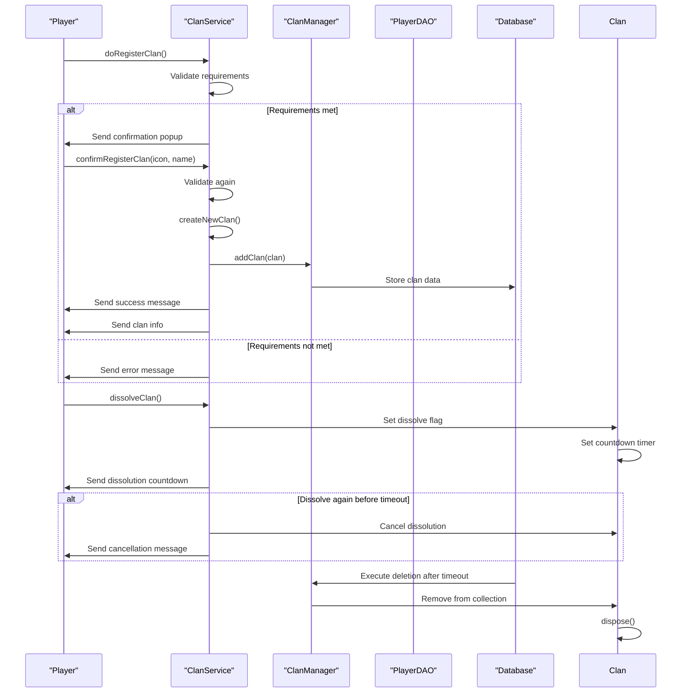

Clan creation requires:
- Level 50 or higher
- 100,000,000 xu (in-game currency)
- A Kim Bai item (item ID 31)
- Unique clan name and leader name
- Available clan icon from predefined list

Clan dissolution implements a 4320-minute (3-day) countdown, allowing leaders to cancel the dissolution during this period.

**Diagram sources**
- [ClanService.java](file://src/main/java/services/ClanService.java#L1-L404)
- [ClanManager.java](file://src/main/java/manager/ClanManager.java#L1-L71)
- [ClanConst.java](file://src/main/java/consts/ClanConst.java#L1-L84)

**Section sources**
- [ClanService.java](file://src/main/java/services/ClanService.java#L1-L404)
- [ClanManager.java](file://src/main/java/manager/ClanManager.java#L1-L71)

## Data Consistency and Persistence
The clan system maintains data consistency between Clan and Player objects through bidirectional references and synchronized updates. The persistence strategy uses a combination of in-memory storage for performance and periodic database synchronization.

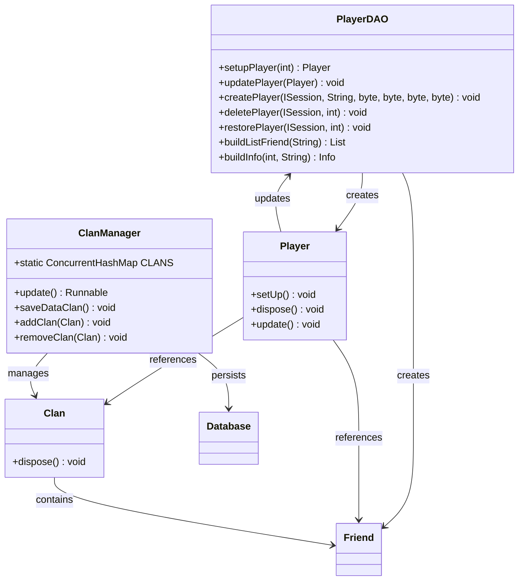

Data consistency is maintained through:
- Bidirectional references between Player and Clan objects
- Synchronized collection modifications using @Synchronized annotation
- Automatic cleanup in dispose() methods
- Periodic database synchronization every second
- Validation of clan membership during player loading

The system uses ConcurrentHashMap for thread-safe clan storage, enabling concurrent access from multiple game threads without race conditions.

**Diagram sources**
- [PlayerDAO.java](file://src/main/java/daos/PlayerDAO.java#L1-L555)
- [ClanManager.java](file://src/main/java/manager/ClanManager.java#L1-L71)
- [Player.java](file://src/main/java/player/Player.java#L1-L309)
- [Clan.java](file://src/main/java/clan/Clan.java#L1-L151)

**Section sources**
- [PlayerDAO.java](file://src/main/java/daos/PlayerDAO.java#L1-L555)
- [ClanManager.java](file://src/main/java/manager/ClanManager.java#L1-L71)

## Scalability and Performance
The clan system is designed to handle thousands of clans with up to 40,000 concurrent players through efficient data structures, asynchronous operations, and optimized persistence strategies. The system implements several performance optimizations to maintain responsiveness under heavy load.

```mermaid
flowchart TD
subgraph "Performance Optimizations"
A[ConcurrentHashMap for Clan Storage] --> B[O(1) Clan Access]
C[Message Limit of 50] --> D[Controlled Memory Usage]
E[Asynchronous Database Updates] --> F[Non-blocking Operations]
G[Selective Data Synchronization] --> H[Reduced Network Traffic]
I[Batch Database Operations] --> J[Efficient Persistence]
end
subgraph "Scalability Features"
K[Thread-Safe Collections] --> L[Concurrent Access]
M[Virtual Threads] --> N[High Concurrency]
O[Incremental Updates] --> P[Reduced Processing Load]
Q[Client-Side Caching] --> R[Reduced Server Load]
end
subgraph "Resource Management"
S[Automatic Cleanup] --> T[Memory Efficiency]
U[Connection Pooling] --> V[Database Efficiency]
W[Object Reuse] --> X[Reduced GC Pressure]
end
A --> Performance
C --> Performance
E --> Performance
G --> Performance
I --> Performance
K --> Scalability
M --> Scalability
O --> Scalability
Q --> Scalability
S --> ResourceManagement
U --> ResourceManagement
W --> ResourceManagement
```

Key scalability features include:
- **ConcurrentHashMap**: Thread-safe clan storage enabling concurrent access
- **Message limiting**: Fixed-size message history prevents memory bloat
- **Asynchronous operations**: Non-blocking database updates and network communication
- **Incremental synchronization**: Only changed data is persisted periodically
- **Efficient indexing**: Clans indexed by icon ID for O(1) lookup performance

The system handles 40,000 concurrent players by distributing load across multiple virtual threads and minimizing blocking operations, ensuring responsive clan interactions even during peak usage.

**Section sources**
- [ClanManager.java](file://src/main/java/manager/ClanManager.java#L1-L71)
- [Clan.java](file://src/main/java/clan/Clan.java#L1-L151)
- [PlayerDAO.java](file://src/main/java/daos/PlayerDAO.java#L1-L555)

## Integration with Game Systems
The clan system integrates with various game systems to enable clan-based activities and provide contextual information. These integrations enhance the gameplay experience by connecting clan functionality with core game mechanics.

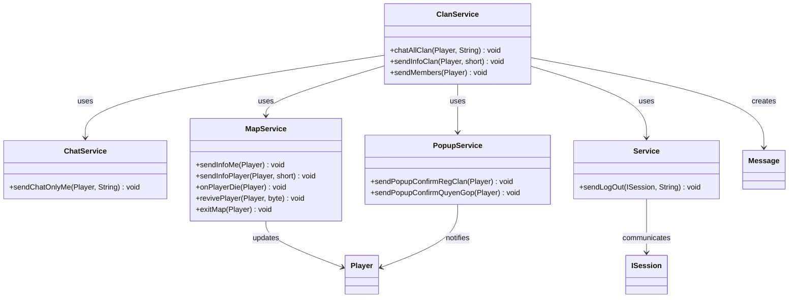

Key integrations include:
- **Chat System**: Enables clan-wide messaging with role-based prefixes
- **Map System**: Updates player appearance and status when joining/leaving clans
- **Combat System**: Potential integration for clan vs. clan events
- **UI System**: Displays clan information, member lists, and messaging interfaces
- **Notification System**: Sends popups for clan invitations and status changes

These integrations ensure that clan membership affects multiple aspects of the player experience, from communication to visual representation in the game world.

**Diagram sources**
- [ClanService.java](file://src/main/java/services/ClanService.java#L1-L404)
- [ChatService.java](file://src/main/java/services/ChatService.java)
- [MapService.java](file://src/main/java/services/MapService.java)
- [Service.java](file://src/main/java/services/Service.java)

**Section sources**
- [ClanService.java](file://src/main/java/services/ClanService.java#L1-L404)
- [MapService.java](file://src/main/java/services/MapService.java)
- [ChatService.java](file://src/main/java/services/ChatService.java)

## Workflow Examples
This section illustrates common clan interaction workflows, demonstrating the sequence of operations for key clan activities.

### Clan Creation Workflow
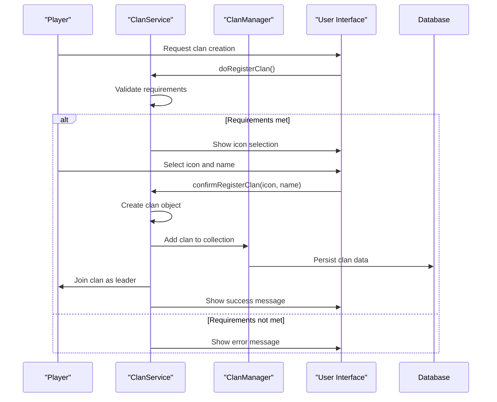

### Member Invitation Workflow
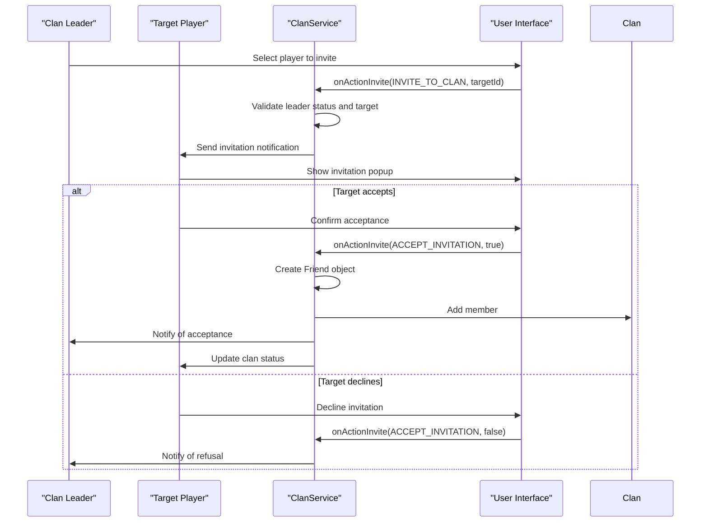

### Clan vs. Clan Event Workflow
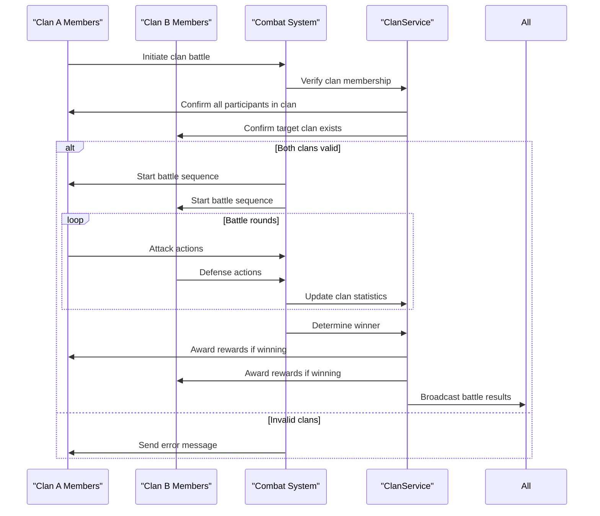

**Section sources**
- [ClanService.java](file://src/main/java/services/ClanService.java#L1-L404)
- [Clan.java](file://src/main/java/clan/Clan.java#L1-L151)
- [Player.java](file://src/main/java/player/Player.java#L1-L309)