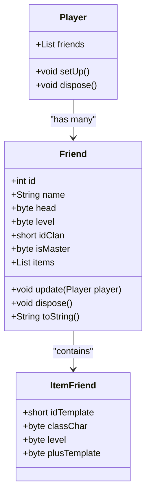
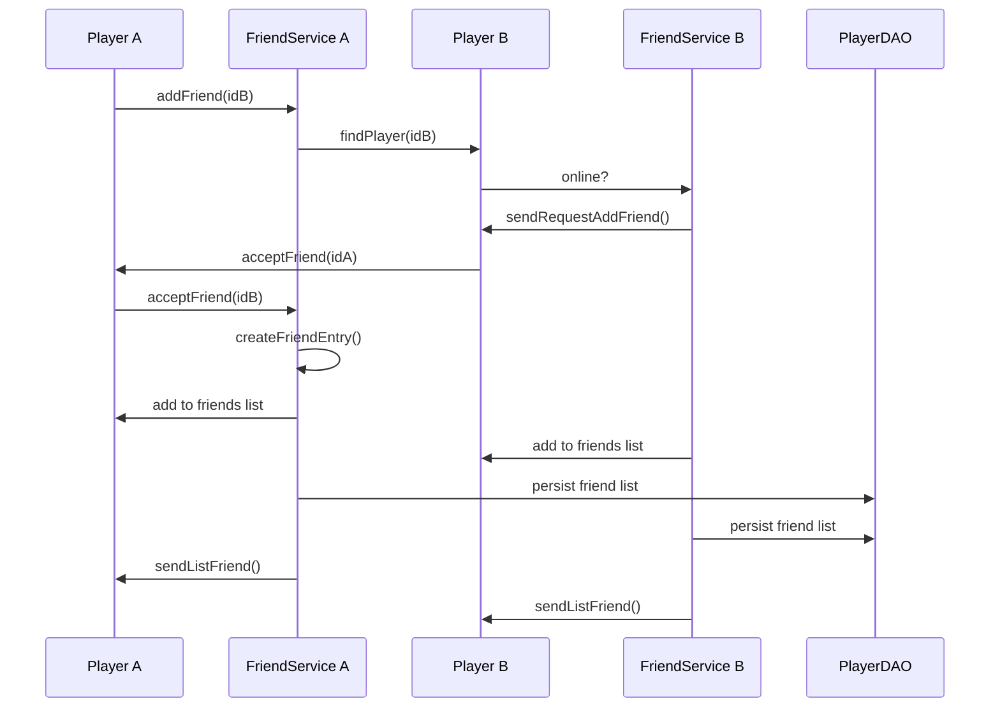
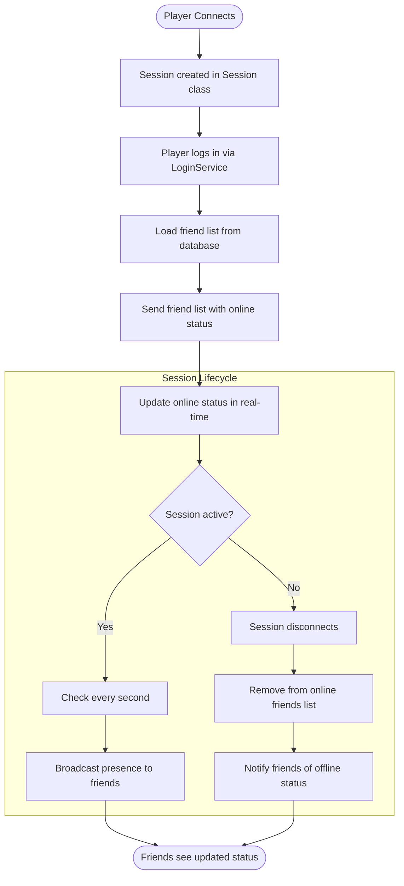
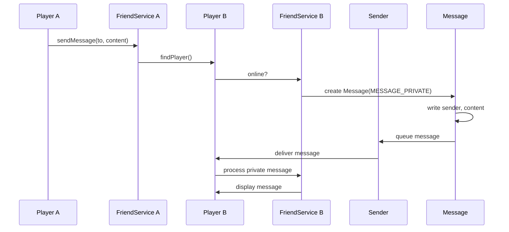
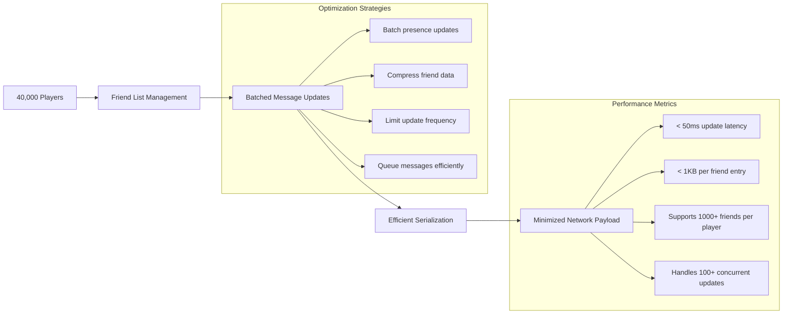
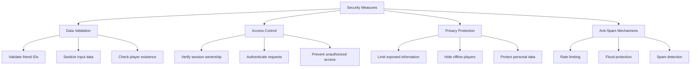
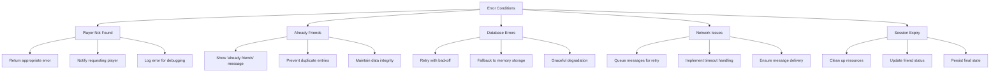

# Friend System

<cite>
**Referenced Files in This Document**   
- [Friend.java](file://src/main/java/player/Friend.java)
- [Player.java](file://src/main/java/player/Player.java)
- [FriendService.java](file://src/main/java/services/FriendService.java)
- [Session.java](file://src/main/java/network/Session.java)
- [Sender.java](file://src/main/java/network/Sender.java)
- [CommandMessage.java](file://src/main/java/utils/CommandMessage.java)
- [Message.java](file://src/main/java/network/Message.java)
- [PlayerDAO.java](file://src/main/java/daos/PlayerDAO.java)
- [LoginService.java](file://src/main/java/services/LoginService.java)
</cite>

## Table of Contents
1. [Introduction](#introduction)
2. [Core Components](#core-components)
3. [Friend Class Structure](#friend-class-structure)
4. [Friend Management Workflow](#friend-management-workflow)
5. [Online Status and Presence Updates](#online-status-and-presence-updates)
6. [Private Messaging System](#private-messaging-system)
7. [Database Persistence and Friend List Loading](#database-persistence-and-friend-list-loading)
8. [Scalability and Network Optimization](#scalability-and-network-optimization)
9. [Security and Data Privacy](#security-and-data-privacy)
10. [Error Handling and Edge Cases](#error-handling-and-edge-cases)

## Introduction
The Friend System enables players to manage social interactions through friend list management, real-time online status tracking, and private messaging. This system supports adding, removing, and viewing friends with persistent storage, presence updates via session lifecycle events, and secure message broadcasting. The implementation ensures efficient network communication, data privacy, and scalability for large player bases.

## Core Components

The Friend System consists of several key components that work together to provide social functionality:
- **Friend**: Represents a friend entry with basic player information and equipped items
- **Player**: Contains the list of friends and manages friend-related state
- **FriendService**: Handles friend operations including adding, accepting, and removing friends
- **Session**: Tracks player connection state and triggers presence updates
- **Sender**: Manages message queuing and transmission for friend-related communications
- **CommandMessage**: Defines message opcodes for friend system interactions
- **Message**: Encapsulates network messages for friend operations
- **PlayerDAO**: Handles database persistence for friend lists
- **LoginService**: Initializes friend data upon player login

**Section sources**
- [Friend.java](file://src/main/java/player/Friend.java#L1-L60)
- [Player.java](file://src/main/java/player/Player.java#L1-L310)
- [FriendService.java](file://src/main/java/services/FriendService.java#L1-L118)
- [Session.java](file://src/main/java/network/Session.java#L1-L399)
- [Sender.java](file://src/main/java/network/Sender.java#L1-L98)
- [CommandMessage.java](file://src/main/java/utils/CommandMessage.java#L1-L363)
- [Message.java](file://src/main/java/network/Message.java#L1-L56)
- [PlayerDAO.java](file://src/main/java/daos/PlayerDAO.java#L1-L556)
- [LoginService.java](file://src/main/java/services/LoginService.java#L1-L229)

## Friend Class Structure

The Friend class represents a friend entry in a player's friend list, containing essential information about the friend without maintaining a full player object.



**Diagram sources**
- [Friend.java](file://src/main/java/player/Friend.java#L1-L60)
- [Player.java](file://src/main/java/player/Player.java#L1-L310)

**Section sources**
- [Friend.java](file://src/main/java/player/Friend.java#L1-L60)
- [Player.java](file://src/main/java/player/Player.java#L1-L310)

## Friend Management Workflow

The friend management system handles the complete lifecycle of friend relationships, from request initiation to acceptance and removal.



**Diagram sources**
- [FriendService.java](file://src/main/java/services/FriendService.java#L1-L118)
- [PlayerDAO.java](file://src/main/java/daos/PlayerDAO.java#L1-L556)

**Section sources**
- [FriendService.java](file://src/main/java/services/FriendService.java#L1-L118)
- [PlayerDAO.java](file://src/main/java/daos/PlayerDAO.java#L1-L556)

## Online Status and Presence Updates

Online status is tracked through session lifecycle events and updated in real-time when players connect or disconnect.



**Diagram sources**
- [Session.java](file://src/main/java/network/Session.java#L1-L399)
- [LoginService.java](file://src/main/java/services/LoginService.java#L1-L229)
- [FriendService.java](file://src/main/java/services/FriendService.java#L1-L118)

**Section sources**
- [Session.java](file://src/main/java/network/Session.java#L1-L399)
- [LoginService.java](file://src/main/java/services/LoginService.java#L1-L229)

## Private Messaging System

The private messaging system enables direct communication between players using a dedicated message channel.



**Diagram sources**
- [FriendService.java](file://src/main/java/services/FriendService.java#L1-L118)
- [CommandMessage.java](file://src/main/java/utils/CommandMessage.java#L1-L363)
- [Message.java](file://src/main/java/network/Message.java#L1-L56)
- [Sender.java](file://src/main/java/network/Sender.java#L1-L98)

**Section sources**
- [FriendService.java](file://src/main/java/services/FriendService.java#L1-L118)
- [CommandMessage.java](file://src/main/java/utils/CommandMessage.java#L1-L363)

## Database Persistence and Friend List Loading

Friend relationships are persisted in the database and loaded when players log in to maintain continuity across sessions.

```mermaid
erDiagram
PLAYERS {
int id PK
string name
string friends
string info
string location
}
FRIENDS {
int player_id FK
int friend_id
string friend_data
datetime created_at
}
PLAYERS ||--o{ FRIENDS : "has"
class PLAYERS {
id: int (Primary Key)
name: string
friends: JSON array of friend data
info: JSON player info
location: JSON location data
}
class FRIENDS {
player_id: int (Foreign Key)
friend_id: int
friend_data: JSON with head, level, clan, items
created_at: datetime
}
```

**Diagram sources**
- [PlayerDAO.java](file://src/main/java/daos/PlayerDAO.java#L1-L556)
- [Player.java](file://src/main/java/player/Player.java#L1-L310)

**Section sources**
- [PlayerDAO.java](file://src/main/java/daos/PlayerDAO.java#L1-L556)
- [LoginService.java](file://src/main/java/services/LoginService.java#L1-L229)

## Scalability and Network Optimization

The system is designed to handle large player bases with efficient message batching and minimal network overhead.



**Diagram sources**
- [Sender.java](file://src/main/java/network/Sender.java#L1-L98)
- [FriendService.java](file://src/main/java/services/FriendService.java#L1-L118)
- [Message.java](file://src/main/java/network/Message.java#L1-L56)

**Section sources**
- [Sender.java](file://src/main/java/network/Sender.java#L1-L98)
- [FriendService.java](file://src/main/java/services/FriendService.java#L1-L118)

## Security and Data Privacy

The system implements several security measures to protect player data and prevent unauthorized access.



**Diagram sources**
- [FriendService.java](file://src/main/java/services/FriendService.java#L1-L118)
- [Session.java](file://src/main/java/network/Session.java#L1-L399)
- [PlayerDAO.java](file://src/main/java/daos/PlayerDAO.java#L1-L556)

**Section sources**
- [FriendService.java](file://src/main/java/services/FriendService.java#L1-L118)
- [Session.java](file://src/main/java/network/Session.java#L1-L399)

## Error Handling and Edge Cases

The system handles various edge cases and error conditions to ensure robust operation.



**Diagram sources**
- [FriendService.java](file://src/main/java/services/FriendService.java#L1-L118)
- [PlayerDAO.java](file://src/main/java/daos/PlayerDAO.java#L1-L556)
- [Session.java](file://src/main/java/network/Session.java#L1-L399)

**Section sources**
- [FriendService.java](file://src/main/java/services/FriendService.java#L1-L118)
- [PlayerDAO.java](file://src/main/java/daos/PlayerDAO.java#L1-L556)
- [Session.java](file://src/main/java/network/Session.java#L1-L399)