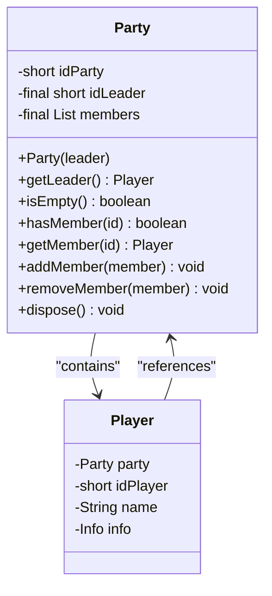
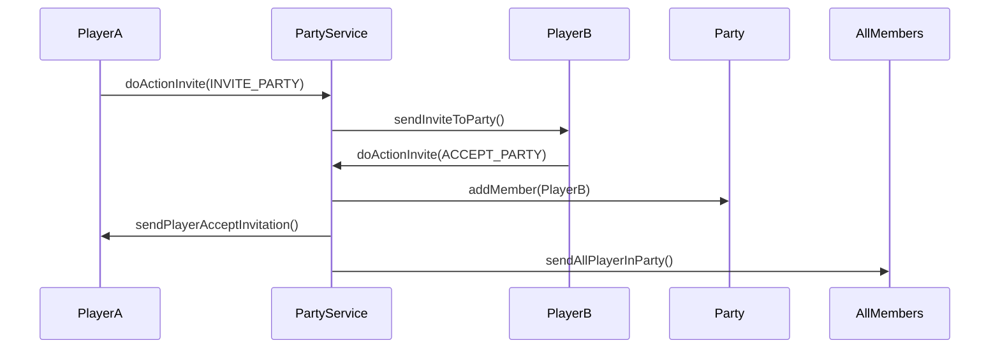
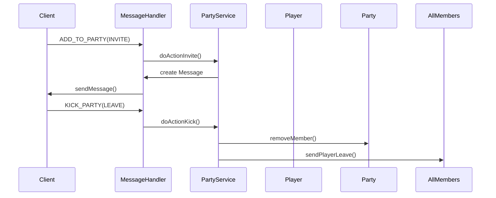
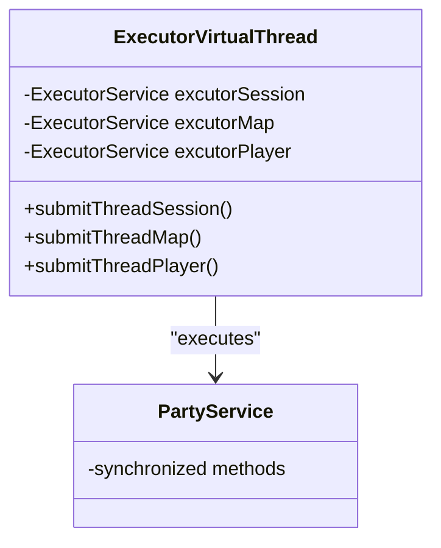

# Party System

<cite>
**Referenced Files in This Document**   
- [Party.java](file://src/main/java/player/Party.java)
- [Player.java](file://src/main/java/player/Player.java)
- [PartyService.java](file://src/main/java/services/PartyService.java)
- [MessageHandler.java](file://src/main/java/network/MessageHandler.java)
- [Zone.java](file://src/main/java/map/Zone.java)
- [ExecutorVirtualThread.java](file://src/main/java/manager/ExecutorVirtualThread.java)
</cite>

## Table of Contents
1. [Introduction](#introduction)
2. [Party Class Design](#party-class-design)
3. [Party Service Operations](#party-service-operations)
4. [Network Message Handling](#network-message-handling)
5. [Zone and Map Integration](#zone-and-map-integration)
6. [Concurrency and Performance](#concurrency-and-performance)
7. [Conclusion](#conclusion)

## Introduction
The Party System enables cooperative gameplay by allowing players to form groups for shared exploration, combat, and resource distribution. This document details the implementation of party mechanics including formation, member management, leader transfer, and integration with spatial systems. The system supports real-time synchronization across zones, handles network communication for invitations and updates, and ensures thread-safe operations using virtual threads.

## Party Class Design

The `Party` class serves as the core data structure for managing player groups. It maintains a collection of `Player` references, designates a leader, and provides methods for membership management.

**Diagram sources**
- [Party.java](file://src/main/java/player/Party.java#L15-L60)
- [Player.java](file://src/main/java/player/Player.java#L53-L57)

The party is initialized with a leader, whose `idPlayer` becomes both the `idLeader` and the negative value of `idParty`. The `members` list is synchronized to prevent concurrent modification exceptions during add/remove operations. The `getLeader()` method safely retrieves the leader by matching the `idLeader` against active members.

**Section sources**
- [Party.java](file://src/main/java/player/Party.java#L15-L60)
- [Player.java](file://src/main/java/player/Player.java#L53-L57)

## Party Service Operations

The `PartyService` class implements all business logic for party management, including creation, invitations, member removal, and disbanding. It validates conditions such as zone proximity, player status, and party capacity before executing actions.

### Party Creation and Invitation
Players can create parties or invite others through the `doActionInvite` method, which handles four operation types:
- `CREATE_PARTY`: Initializes a new party for the player
- `INVITE_PARTY`: Sends an invitation to another player in the same zone
- `ACCEPT_PARTY`: Adds the invited player to the inviter's party
- `REFUSE_PARTY`: Notifies the inviter of rejection

When inviting, the system checks that:
- Both players are in the same zone
- The invitee is not a killer or PK player
- The invitee's party is empty
- The target party has not reached `Settings.MAX_PLAYER` capacity

**Diagram sources**
- [PartyService.java](file://src/main/java/services/PartyService.java#L38-L146)
- [Zone.java](file://src/main/java/map/Zone.java#L87-L95)

### Member Management
The `doActionKick` method handles three removal operations:
- `KICK_MEMBER`: Leader removes a member
- `DISBAND_PARTY`: Leader dissolves the entire party
- `LEAVE_PARTY`: Member voluntarily exits

Leadership transfer is implicitly handled during disbanding or leaving, as the leader cannot leave without disbanding. When a member is kicked or leaves, they are assigned a new single-member party instance.

**Section sources**
- [PartyService.java](file://src/main/java/services/PartyService.java#L0-L81)
- [PartyService.java](file://src/main/java/services/PartyService.java#L76-L115)

## Network Message Handling

Party interactions are mediated through the `MessageHandler`, which processes incoming network commands and delegates to `PartyService`.

**Diagram sources**
- [MessageHandler.java](file://src/main/java/network/MessageHandler.java#L261-L287)
- [PartyService.java](file://src/main/java/services/PartyService.java#L0-L44)

The handler intercepts `ADD_TO_PARTY` and `KICK_PARTY` commands, validates player and zone state, then invokes the appropriate `PartyService` method with the operation type and target player ID. All party state changes result in broadcast messages to affected members.

**Section sources**
- [MessageHandler.java](file://src/main/java/network/MessageHandler.java#L261-L287)
- [PartyService.java](file://src/main/java/services/PartyService.java#L0-L44)

## Zone and Map Integration

Parties are tightly integrated with the spatial systems to maintain coherence during exploration and combat. The `Zone` class provides `findPlayer` methods that enable party invitations between players in the same zone.

When a player changes maps via `ChangeMapService`, the system updates their spatial context, ensuring party operations only affect players in shared zones. The `MapService` synchronizes item and mob visibility within a configurable distance, which indirectly affects party coordination during combat and loot collection.

Party members must remain in the same zone for invitations and real-time interaction. The system prevents cross-zone party operations by checking `player.getLocation().getZone()` before processing any party action.

**Section sources**
- [Zone.java](file://src/main/java/map/Zone.java#L87-L95)
- [MapService.java](file://src/main/java/services/MapService.java#L603-L638)

## Concurrency and Performance

The system employs virtual threads through `ExecutorVirtualThread` to handle concurrent party operations without blocking the main game loop.

**Diagram sources**
- [ExecutorVirtualThread.java](file://src/main/java/manager/ExecutorVirtualThread.java#L10-L36)
- [Party.java](file://src/main/java/player/Party.java#L45-L55)

The `@Synchronized` annotation on `addMember` and `removeMember` methods ensures atomic operations on the members list. Virtual threads allow simultaneous processing of multiple party actions across different sessions, maps, and players, enabling scalable performance for large-scale multiplayer interactions.

Race conditions during leadership changes are prevented by restricting disband and kick operations to the current leader (`idLeader == idPlayer`). The system avoids explicit leader transfer, instead requiring disbanding and re-creation for leadership changes, eliminating potential race conditions.

**Section sources**
- [ExecutorVirtualThread.java](file://src/main/java/manager/ExecutorVirtualThread.java#L10-L36)
- [PartyService.java](file://src/main/java/services/PartyService.java#L76-L115)

## Conclusion
The Party System provides a robust framework for cooperative gameplay with comprehensive member management, real-time synchronization, and spatial awareness. By leveraging virtual threads and synchronized collections, it maintains data integrity under concurrent access while enabling responsive party interactions. The tight integration with zone and map systems ensures that party mechanics align with the game's spatial constraints, creating a cohesive multiplayer experience.