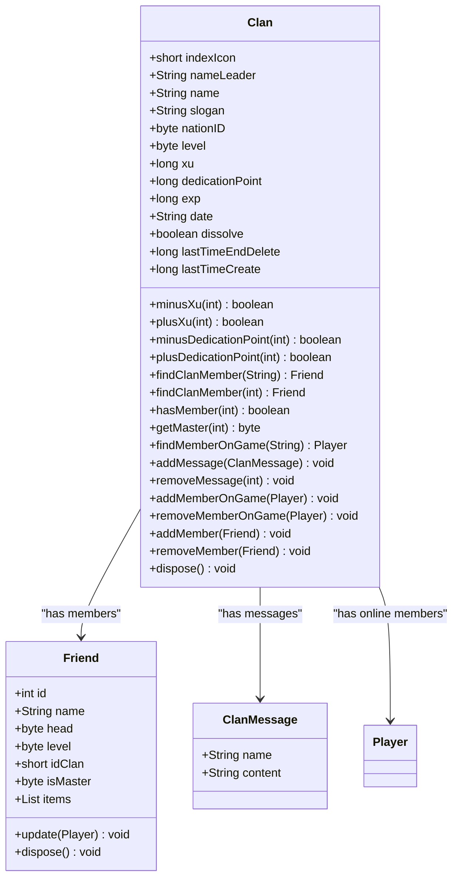
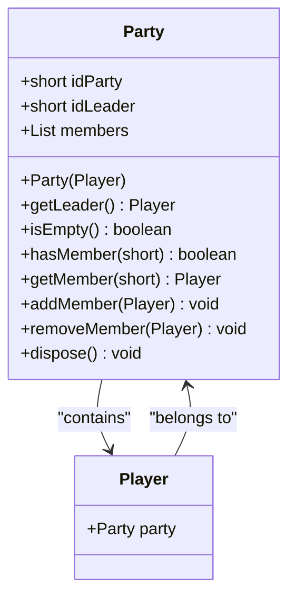
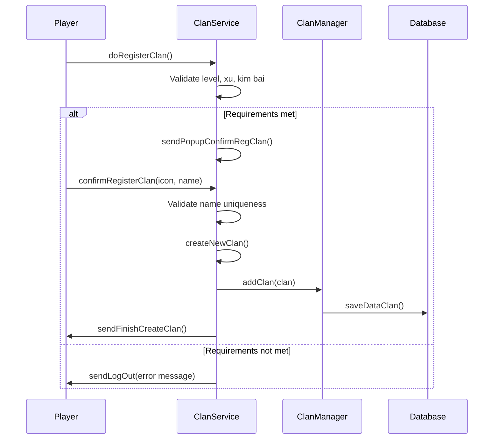
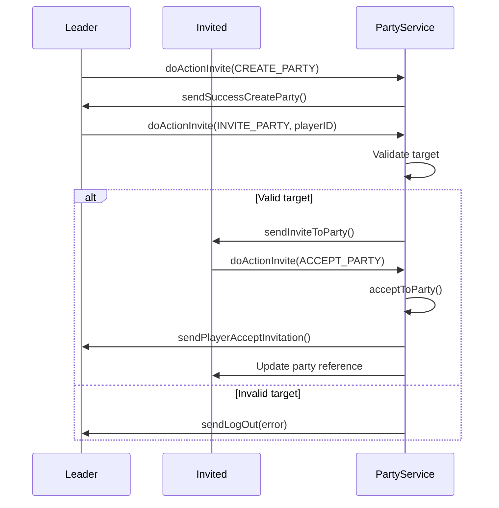
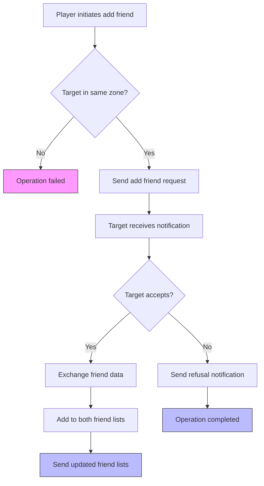
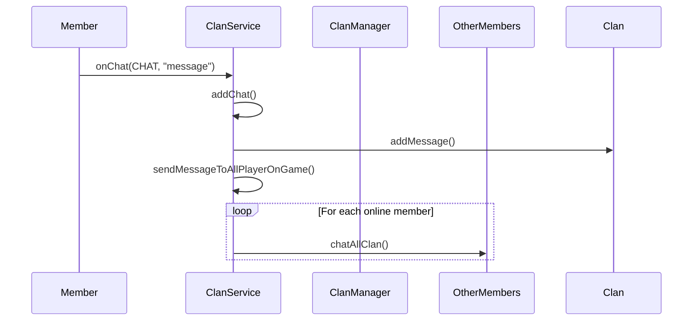
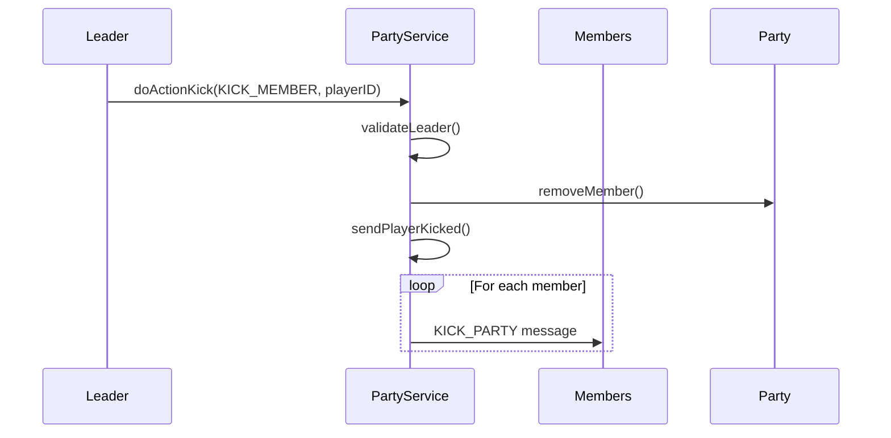

# Social System

<cite>
**Referenced Files in This Document**   
- [Clan.java](file://src/main/java/clan/Clan.java)
- [ClanMessage.java](file://src/main/java/clan/ClanMessage.java)
- [ClanConst.java](file://src/main/java/consts/ClanConst.java)
- [ClanManager.java](file://src/main/java/manager/ClanManager.java)
- [ClanService.java](file://src/main/java/services/ClanService.java)
- [Friend.java](file://src/main/java/player/Friend.java)
- [Party.java](file://src/main/java/player/Party.java)
- [PartyService.java](file://src/main/java/services/PartyService.java)
- [FriendService.java](file://src/main/java/services/FriendService.java)
- [Player.java](file://src/main/java/player/Player.java)
</cite>

## Table of Contents
1. [Introduction](#introduction)
2. [Core Social Entities and Data Models](#core-social-entities-and-data-models)
3. [Clan System](#clan-system)
4. [Party System](#party-system)
5. [Friend System](#friend-system)
6. [Network Message Flows](#network-message-flows)
7. [Scalability and Data Consistency](#scalability-and-data-consistency)
8. [Conclusion](#conclusion)

## Introduction
This document provides a comprehensive analysis of the social system in the game, focusing on clans, parties, and friend systems. It details the data models, workflows, and network interactions for each social feature. The implementation supports player collaboration through structured groups (clans and parties) and personal connections (friends), with mechanisms for communication, hierarchy management, and shared gameplay.

**Section sources**
- [Clan.java](file://src/main/java/clan/Clan.java#L1-L151)
- [Party.java](file://src/main/java/player/Party.java#L1-L62)
- [Friend.java](file://src/main/java/player/Friend.java#L1-L59)

## Core Social Entities and Data Models

### Clan Data Model
The `Clan` class represents a player guild with the following attributes:

| Field | Type | Description |
|-------|------|-------------|
| indexIcon | short | Unique identifier and visual icon for the clan |
| nameLeader | String | Name of the clan leader |
| name | String | Clan name |
| slogan | String | Clan motto or description |
| nationID | byte | Affiliated nation identifier |
| level | byte | Clan level |
| xu | long | Clan currency |
| dedicationPoint | long | Member contribution points |
| exp | long | Clan experience |
| members | List<Friend> | Registered clan members |
| membersOnGame | List<Player> | Currently online members |
| messages | List<ClanMessage> | Recent clan chat history |
| date | String | Creation date |
| dissolve | boolean | Dissolution status |
| lastTimeEndDelete | long | Timestamp for dissolution countdown |
| lastTimeCreate | long | Timestamp of clan creation |

**Diagram sources**
- [Clan.java](file://src/main/java/clan/Clan.java#L1-L151)
- [ClanMessage.java](file://src/main/java/clan/ClanMessage.java#L1-L16)
- [Friend.java](file://src/main/java/player/Friend.java#L1-L59)

### Party Data Model
The `Party` class represents a temporary player group for cooperative gameplay:

| Field | Type | Description |
|-------|------|-------------|
| idParty | short | Unique party identifier |
| idLeader | short | Player ID of the party leader |
| members | List<Player> | Current party members |

**Diagram sources**
- [Party.java](file://src/main/java/player/Party.java#L1-L62)
- [Player.java](file://src/main/java/player/Player.java#L1-L309)

### Friend Data Model
The `Friend` class represents a player's social connection:

| Field | Type | Description |
|-------|------|-------------|
| id | int | Database ID of the friend |
| name | String | Friend's display name |
| head | byte | Character head style |
| level | byte | Friend's current level |
| idClan | short | Clan ID (or -1 if not in clan) |
| isMaster | byte | Clan hierarchy role |
| items | List<ItemFriend> | Equipped items snapshot |

**Section sources**
- [Friend.java](file://src/main/java/player/Friend.java#L1-L59)
- [Clan.java](file://src/main/java/clan/Clan.java#L1-L151)

## Clan System

### Clan Creation Workflow
The clan creation process requires specific conditions and follows this sequence:

1. **Prerequisites Check**: Player must meet level requirement (50) and have sufficient currency (100,000,000 xu)
2. **Item Verification**: Player must possess a "kim bai" item (item ID 31)
3. **Name and Icon Selection**: Player chooses a unique clan name and selects from available icons
4. **Database Registration**: Clan is created and stored in the database with leader privileges

**Diagram sources**
- [ClanService.java](file://src/main/java/services/ClanService.java#L150-L250)
- [ClanManager.java](file://src/main/java/manager/ClanManager.java#L1-L71)
- [ClanConst.java](file://src/main/java/consts/ClanConst.java#L1-L84)

### Clan Hierarchy and Management
The clan system implements a four-tier hierarchy:

| Role | Constant | Permissions |
|------|----------|-------------|
| Clan Leader (Bang Chu) | BANG_CHU (0) | Full management, dissolution, kicking |
| Deputy Leader (Pho Bang) | PHO_BANG (1) | Invite members, chat management |
| Elder (Truong Lao) | TRUONG_LAO (2) | View members, chat |
| Member (Thanh Vien) | THANH_VIEN (3) | Chat only |

Key management operations:
- **Member Invitation**: Leaders can invite players within the same zone
- **Member Removal**: Only the clan leader can kick members
- **Clan Dissolution**: Leader can initiate dissolution with a 4320-minute (72-hour) countdown
- **Automatic Dissolution**: Clans with fewer than 10 members are automatically dissolved

**Section sources**
- [ClanConst.java](file://src/main/java/consts/ClanConst.java#L1-L84)
- [ClanService.java](file://src/main/java/services/ClanService.java#L1-L404)
- [Clan.java](file://src/main/java/clan/Clan.java#L1-L151)

## Party System

### Party Formation and Management
The party system enables temporary player grouping for cooperative gameplay:

**Diagram sources**
- [PartyService.java](file://src/main/java/services/PartyService.java#L1-L234)
- [Party.java](file://src/main/java/player/Party.java#L1-L62)

### Party Leadership and Disbanding
The party system includes mechanisms for leadership transfer and group management:

- **Leader Transfer**: Not directly supported; new leader must create a new party
- **Member Removal**: Leader can kick members from the party
- **Party Disbanding**: Leader can disband the entire party
- **Voluntary Leave**: Members can leave the party voluntarily

Key constraints:
- Maximum party size limited by `Settings.MAX_PLAYER`
- Players with positive PK status cannot be invited
- Players already in a party cannot join another

**Section sources**
- [PartyService.java](file://src/main/java/services/PartyService.java#L1-L234)
- [Party.java](file://src/main/java/player/Party.java#L1-L62)

## Friend System

### Friend Management Workflow
The friend system enables players to establish and manage social connections:

**Diagram sources**
- [FriendService.java](file://src/main/java/services/FriendService.java#L1-L117)
- [Friend.java](file://src/main/java/player/Friend.java#L1-L59)

### Friend Data Synchronization
When a friendship is established, both players exchange comprehensive character data:

- Basic information (name, level, head style)
- Clan affiliation and hierarchy role
- Equipment snapshot (items worn by the player)
- Real-time status updates when friends come online

The system maintains friend data consistency through the `Friend.update(Player)` method, which synchronizes information when players interact.

**Section sources**
- [FriendService.java](file://src/main/java/services/FriendService.java#L1-L117)
- [Friend.java](file://src/main/java/player/Friend.java#L1-L59)

## Network Message Flows

### Clan Communication Flow
Clan chat messages follow a publish-subscribe pattern:

**Diagram sources**
- [ClanService.java](file://src/main/java/services/ClanService.java#L1-L404)
- [Clan.java](file://src/main/java/clan/Clan.java#L1-L151)

### Party Interaction Flow
Party actions generate broadcast messages to all members:

**Diagram sources**
- [PartyService.java](file://src/main/java/services/PartyService.java#L1-L234)
- [Party.java](file://src/main/java/player/Party.java#L1-L62)

## Scalability and Data Consistency

### Scalability Challenges at 40,000 Concurrent Players
The social system faces several scalability challenges at high concurrency:

**Memory Usage**
- Clan storage uses `ConcurrentHashMap<Short, Clan>` with potential for 65,536 clans
- Each clan maintains lists of members and online members, creating O(n) memory complexity
- Friend lists stored in `List<Friend>` per player, leading to O(n²) total memory usage

**Performance Bottlenecks**
- Clan chat history limited to 50 messages, but message broadcasting affects all online members
- Party operations require iteration through all members for message distribution
- Friend list synchronization occurs on every friendship action

**Database Operations**
- Clan data saved periodically via `ClanManager.saveDataClan()`
- Individual player updates occur every `Settings.MILISECOND_UPDATE_DATABASE`
- No batch operations for friend or party data persistence

### Data Consistency Issues
The system exhibits several data consistency challenges:

**Race Conditions**
- Clan member operations use `@Synchronized` but may still have race conditions in distributed scenarios
- Party membership changes lack transactional integrity
- Friend list updates occur independently on each player

**State Synchronization**
- Clan member status updated only when players are online
- Friend equipment snapshots may become stale
- Party membership not persisted to database

**Error Handling**
- Partial failure scenarios not handled (e.g., message sent to some but not all party members)
- No retry mechanism for failed network messages
- Silent failures in member removal operations

**Section sources**
- [ClanManager.java](file://src/main/java/manager/ClanManager.java#L1-L71)
- [Clan.java](file://src/main/java/clan/Clan.java#L1-L151)
- [Party.java](file://src/main/java/player/Party.java#L1-L62)
- [Player.java](file://src/main/java/player/Player.java#L1-L309)

## Conclusion
The social system provides robust clan, party, and friend features that enable player collaboration and community building. The implementation effectively handles core social interactions but faces scalability challenges at 40,000 concurrent players. Key areas for improvement include optimizing memory usage, implementing batch database operations, and enhancing data consistency mechanisms. The system's modular design with clear separation between data models and service logic provides a solid foundation for future enhancements.