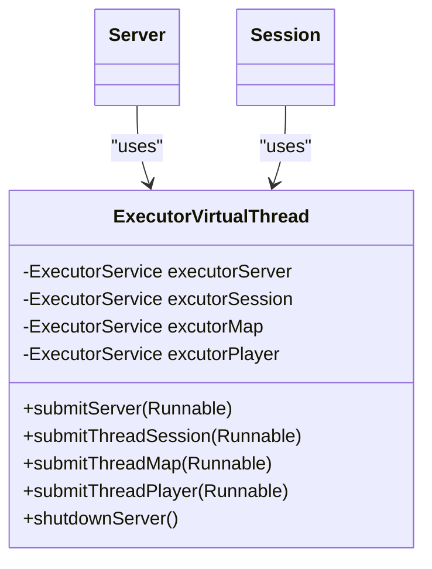
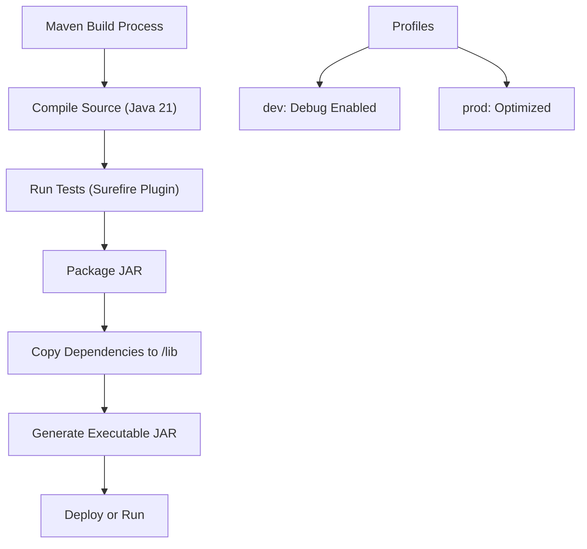
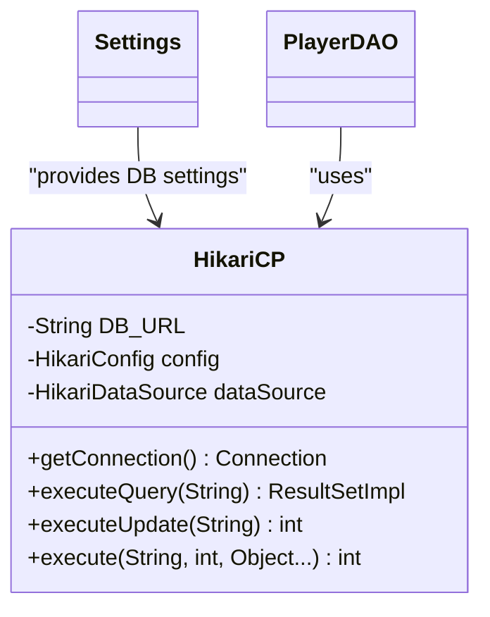
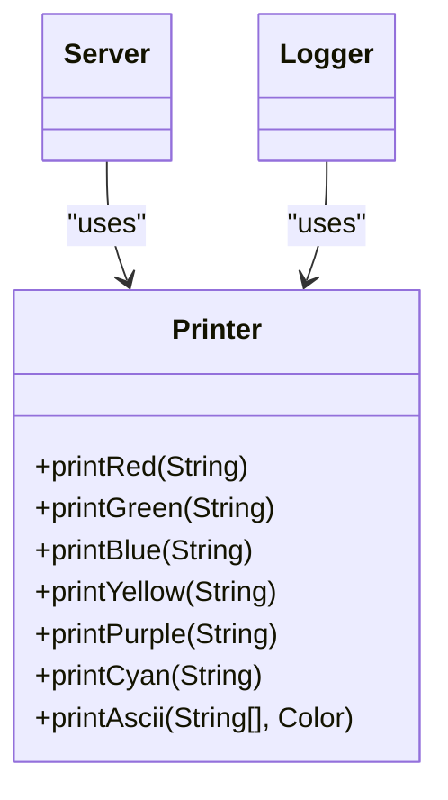

# Technology Stack & Dependencies

<cite>
**Referenced Files in This Document**  
- [pom.xml](file://pom.xml)
- [ExecutorVirtualThread.java](file://src/main/java/manager/ExecutorVirtualThread.java)
- [HikariCP.java](file://src/main/java/database/HikariCP.java)
- [Logger.java](file://src/main/java/utils/Logger.java)
- [Printer.java](file://src/main/java/utils/Printer.java)
- [Settings.java](file://src/main/java/manager/Settings.java)
- [Server.java](file://src/main/java/server/Server.java)
- [Session.java](file://src/main/java/network/Session.java)
</cite>

## Table of Contents
1. [Java 21 with Virtual Threads](#java-21-with-virtual-threads)  
2. [Maven Build & Dependency Management](#maven-build--dependency-management)  
3. [HikariCP for Database Connection Pooling](#hikaricp-for-database-connection-pooling)  
4. [Lombok for Code Simplification](#lombok-for-code-simplification)  
5. [JSON Processing Library](#json-processing-library)  
6. [Jansi for Colored Console Output](#jansi-for-colored-console-output)  
7. [Integration Patterns & Configuration Best Practices](#integration-patterns--configuration-best-practices)  
8. [Performance Implications](#performance-implications)  
9. [Troubleshooting Common Dependency Issues](#troubleshooting-common-dependency-issues)

## Java 21 with Virtual Threads

The KPAH-qoder server leverages **Java 21** as its runtime environment, taking full advantage of **virtual threads**—a major concurrency enhancement introduced in Java 21 under Project Loom. Virtual threads enable high-throughput, scalable server applications by drastically reducing the overhead associated with traditional platform threads.

Instead of allocating a dedicated OS thread per task, virtual threads are lightweight, user-mode threads managed by the JVM. This allows the server to handle tens of thousands of concurrent connections efficiently, which is essential for a multiplayer game server.

The `ExecutorVirtualThread` class encapsulates the use of virtual threads through `Executors.newVirtualThreadPerTaskExecutor()`, providing dedicated thread pools for different subsystems:
- `executorServer`: For server-level background tasks
- `excutorSession`: For handling client session logic
- `excutorMap`: For map and zone updates
- `excutorPlayer`: For player-specific operations

This design ensures isolation and prevents one subsystem from blocking others under load.

**Diagram sources**  
- [ExecutorVirtualThread.java](file://src/main/java/manager/ExecutorVirtualThread.java#L1-L36)  
- [Server.java](file://src/main/java/server/Server.java#L1-L118)  

**Section sources**  
- [ExecutorVirtualThread.java](file://src/main/java/manager/ExecutorVirtualThread.java#L1-L36)  
- [Server.java](file://src/main/java/server/Server.java#L1-L118)  

## Maven Build & Dependency Management

The project uses **Apache Maven** as its build automation and dependency management tool. The `pom.xml` file defines the project structure, dependencies, build plugins, and execution profiles.

Key configurations include:
- **Java 21** as both source and target version
- **UTF-8 encoding** for consistent character handling
- **Executable JAR packaging** with embedded dependencies
- **Development and production profiles** for different build behaviors

Maven plugins are configured to:
- Compile with Java 21 via `maven-compiler-plugin`
- Package a runnable JAR with all dependencies in `/lib` using `maven-dependency-plugin`
- Support execution via `exec-maven-plugin`
- Generate a standalone JAR with dependencies using `maven-assembly-plugin`

The `dev` profile is active by default and enables debugging information, while the `prod` profile disables debug output for optimized performance.

**Diagram sources**  
- [pom.xml](file://pom.xml#L1-L215)  

**Section sources**  
- [pom.xml](file://pom.xml#L1-L215)  

## HikariCP for Database Connection Pooling

**HikariCP 6.3.0** is used as the production-grade database connection pool, providing high-performance, low-latency access to the MySQL database. It is configured in the `HikariCP.java` class using `HikariConfig` and `HikariDataSource`.

Key configuration parameters:
- **JDBC URL**: Dynamically built from `Settings.HOST` and `Settings.DATABASE`
- **Driver**: `com.mysql.cj.jdbc.Driver`
- **Pool Size**: Min 5, Max 10 connections
- **Timeouts**: 30s connection, 60s idle, 30min max lifetime
- **Statement Caching**: Enabled with prepStmtCacheSize=250

The `getConnection()` method provides thread-safe access to database connections, while utility methods like `executeQuery()` and `executeUpdate()` abstract common operations and ensure proper resource cleanup via try-with-resources.

**Diagram sources**  
- [HikariCP.java](file://src/main/java/database/HikariCP.java#L1-L124)  
- [Settings.java](file://src/main/java/manager/Settings.java#L1-L58)  

**Section sources**  
- [HikariCP.java](file://src/main/java/database/HikariCP.java#L1-L124)  
- [Settings.java](file://src/main/java/manager/Settings.java#L1-L58)  

## Lombok for Code Simplification

**Lombok 1.18.38** is included as a `provided` dependency to reduce boilerplate code. It is used to automatically generate getters, setters, constructors, and logging utilities via annotations.

For example, in `ValueAttributeAnimal.java`, the `@Data` and `@Builder` annotations eliminate the need for manual implementation of:
- `toString()`
- `equals()` and `hashCode()`
- Getter/setter methods
- Builder pattern implementation

This improves code readability and reduces the risk of human error in repetitive code structures.

**Section sources**  
- [template/ValueAttributeAnimal.java](file://src/main/java/template/ValueAttributeAnimal.java#L1-L15)  

## JSON Processing Library

The **org.json:json 20231013** library is used for JSON parsing and generation. It is utilized in network communication, particularly in `Session.java` and various service classes, to handle message payloads.

The library supports:
- Parsing JSON strings into `JSONArray` and `JSONObject`
- Serializing game state data for transmission
- Handling nested structures for complex game objects

It is lightweight and well-suited for real-time game server use where performance and simplicity are critical.

**Section sources**  
- [Session.java](file://src/main/java/network/Session.java#L1-L50)  
- [Manager.java](file://src/main/java/manager/Manager.java#L559-L583)  

## Jansi for Colored Console Output

**Jansi 2.4.1** enables colored console output on Windows and Unix systems, enhancing log readability and operational visibility. It is initialized in `Server.java` via `AnsiConsole.systemInstall()`.

The `Printer` utility class wraps Jansi functionality to provide color-coded output:
- `printRed()`: Errors and warnings
- `printGreen()`: Success messages
- `printBlue()`: Informational logs
- `printAscii()`: Colored ASCII art for branding

This improves debugging and monitoring during server operation, especially in development and testing environments.

**Diagram sources**  
- [Printer.java](file://src/main/java/utils/Printer.java#L1-L48)  
- [Server.java](file://src/main/java/server/Server.java#L1-L118)  

**Section sources**  
- [Printer.java](file://src/main/java/utils/Printer.java#L1-L48)  
- [Server.java](file://src/main/java/server/Server.java#L1-L118)  

## Integration Patterns & Configuration Best Practices

The technology stack is integrated using the following patterns:
- **Separation of Concerns**: Each technology serves a distinct role (e.g., HikariCP for DB, Lombok for code gen)
- **Configuration Centralization**: All settings in `Settings.java` are static and globally accessible
- **Resource Management**: Try-with-resources ensures database connections are closed
- **Thread Isolation**: Dedicated virtual thread pools per subsystem
- **Error Logging**: `Logger.java` captures stack traces and writes to timestamped log files

Best practices followed:
- Use of `provided` scope for Lombok to avoid runtime inclusion
- Connection pooling with reasonable defaults for game server load
- UTF-8 encoding throughout for consistent text handling
- Modular packaging with Maven profiles for dev/prod separation

**Section sources**  
- [Settings.java](file://src/main/java/manager/Settings.java#L1-L58)  
- [Logger.java](file://src/main/java/utils/Logger.java#L1-L100)  

## Performance Implications

The chosen stack delivers strong performance:
- **Virtual threads** enable massive concurrency with minimal memory overhead
- **HikariCP** reduces database latency through connection reuse and statement caching
- **Jansi and Logger** use virtual threads for non-blocking log output
- **JSON library** is efficient for small, frequent payloads typical in game servers
- **Lombok** reduces bytecode size and improves JIT optimization

The server is capable of supporting up to 40,000 concurrent players (`Settings.MAX_PLAYER`), with background tasks scheduled efficiently via virtual thread executors.

## Troubleshooting Common Dependency Issues

### Classpath Conflicts
Ensure no duplicate JSON or logging libraries are present. The current setup uses:
- `org.json:json` (no overlap with Jackson/Gson)
- `log4j-core` with `slf4j` bridge (no JUL or Logback conflicts)

### Version Mismatches
All dependencies are fixed versions (no ranges). Verify compatibility:
- Java 21 + virtual threads (requires JDK 21+)
- MySQL Connector 8.0.33 compatible with MySQL 8.x
- HikariCP 6.3.0 supports Java 17+, fully compatible with Java 21

### Build Issues
- Ensure Lombok is enabled in IDE
- Run `mvn clean install` to resolve dependency conflicts
- Use `mvn dependency:tree` to inspect transitive dependencies

### Runtime Issues
- If Jansi colors don't work, ensure `AnsiConsole.systemInstall()` is called
- If HikariCP fails, verify MySQL is running and credentials in `Settings.java` are correct
- If virtual threads underperform, ensure `-XX:+UseZGC` or `-XX:+UseShenandoahGC` is used for low-pause GC

**Section sources**  
- [pom.xml](file://pom.xml#L1-L215)  
- [Settings.java](file://src/main/java/manager/Settings.java#L1-L58)  
- [HikariCP.java](file://src/main/java/database/HikariCP.java#L1-L124)