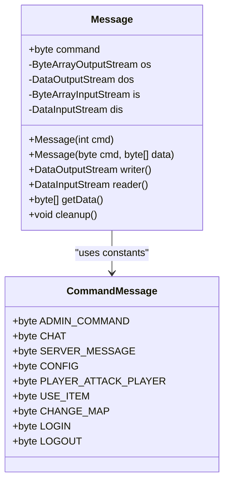
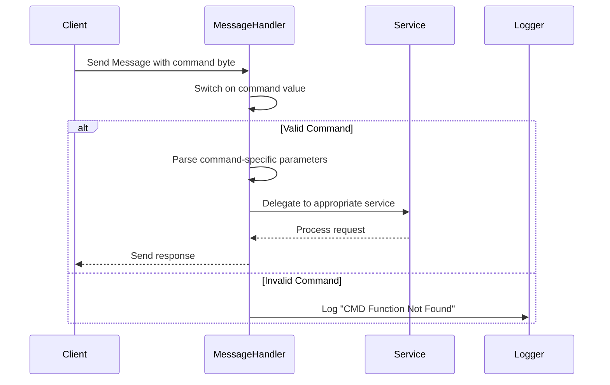
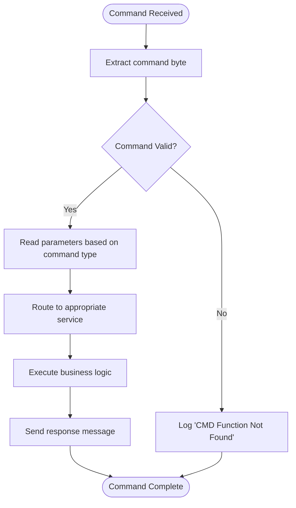
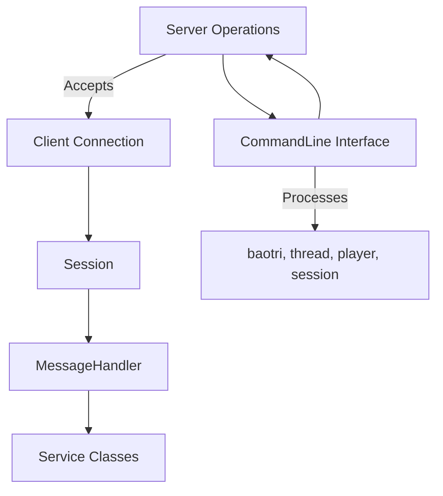
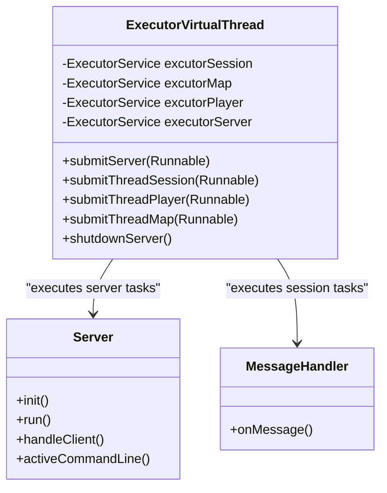
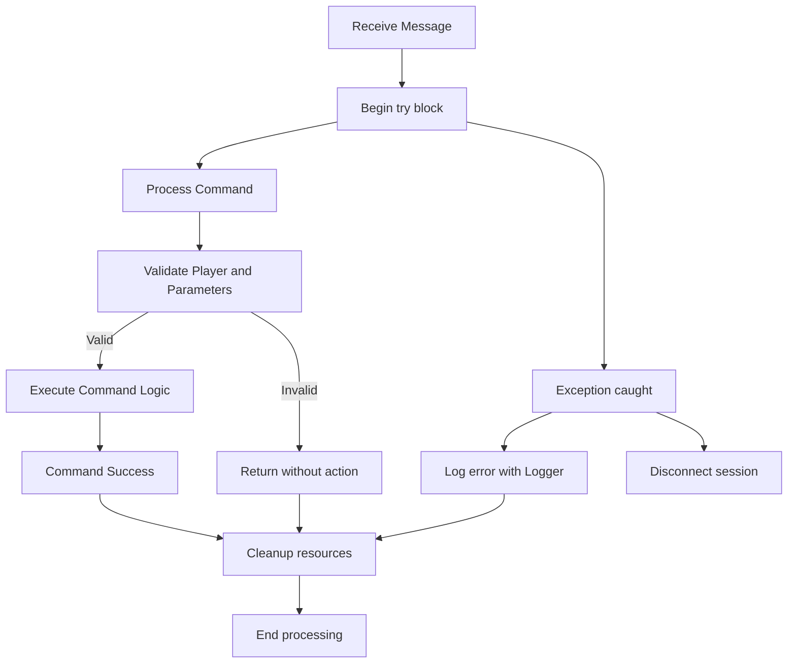
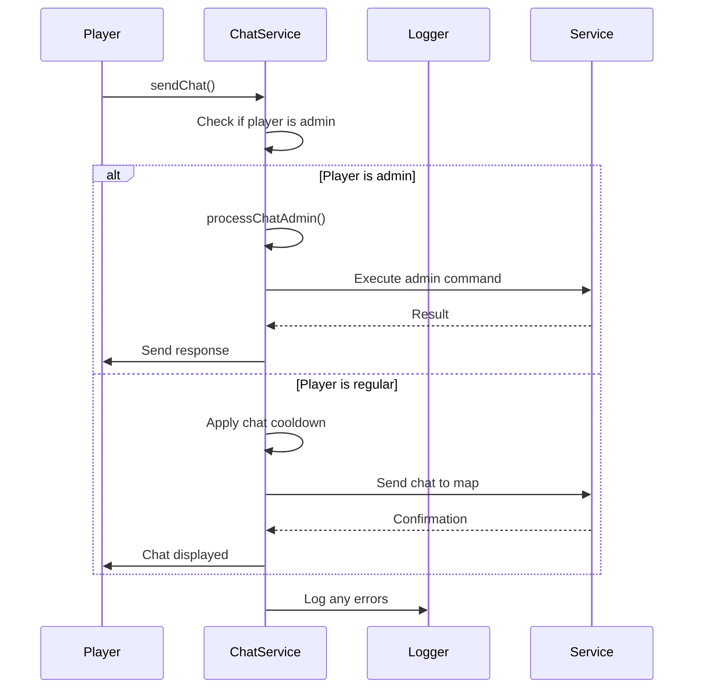

# Command Message System

<cite>
**Referenced Files in This Document**   
- [CommandMessage.java](file://src/main/java/utils/CommandMessage.java)
- [MessageHandler.java](file://src/main/java/network/MessageHandler.java)
- [Server.java](file://src/main/java/server/Server.java)
- [Message.java](file://src/main/java/network/Message.java)
- [ChatService.java](file://src/main/java/services/ChatService.java)
- [ExecutorVirtualThread.java](file://src/main/java/manager/ExecutorVirtualThread.java)
</cite>

## Table of Contents
1. [Introduction](#introduction)
2. [Command Message Structure](#command-message-structure)
3. [Command Parsing and Routing](#command-parsing-and-routing)
4. [Built-in Commands and Syntax](#built-in-commands-and-syntax)
5. [Command Registration and Extension](#command-registration-and-extension)
6. [Integration with Server Loop](#integration-with-server-loop)
7. [Thread Safety and Concurrency](#thread-safety-and-concurrency)
8. [Error Handling and Validation](#error-handling-and-validation)
9. [Permission Checks and Audit Logging](#permission-checks-and-audit-logging)
10. [Best Practices for Custom Operations](#best-practices-for-custom-operations)

## Introduction
The Command Message System enables server console interaction by parsing and routing text-based commands from administrators for server control. This system allows operations such as reloading configurations, broadcasting messages, and managing players through a structured command protocol. The implementation uses byte-identified message types to route administrative and player actions efficiently within the game server architecture.

**Section sources**
- [CommandMessage.java](file://src/main/java/utils/CommandMessage.java#L6-L361)
- [MessageHandler.java](file://src/main/java/network/MessageHandler.java#L0-L671)

## Command Message Structure
The command system is built around the `Message` class which encapsulates command data with a byte identifier and associated payload. Each message contains a `command` field of type byte that determines the action to be performed. The system uses predefined byte constants in `CommandMessage` class to represent different command types, including administrative operations, player actions, and system events.

**Diagram sources**
- [Message.java](file://src/main/java/network/Message.java#L10-L54)
- [CommandMessage.java](file://src/main/java/utils/CommandMessage.java#L6-L361)

**Section sources**
- [Message.java](file://src/main/java/network/Message.java#L0-L54)
- [CommandMessage.java](file://src/main/java/utils/CommandMessage.java#L6-L361)

## Command Parsing and Routing
Command parsing occurs in the `MessageHandler.onMessage()` method, which uses a switch statement on the message command byte to route execution to appropriate service handlers. The system reads additional parameters from the message payload using DataInputStream methods like `readUTF()`, `readByte()`, and `readShort()` based on the expected command structure.

**Diagram sources**
- [MessageHandler.java](file://src/main/java/network/MessageHandler.java#L0-L671)

**Section sources**
- [MessageHandler.java](file://src/main/java/network/MessageHandler.java#L0-L671)

## Built-in Commands and Syntax
The system defines numerous built-in commands as static byte constants in the `CommandMessage` class. Administrative commands include `ADMIN_COMMAND`, `SERVER_MESSAGE`, and `CONFIG`. Player interaction commands include `CHAT`, `USE_ITEM`, `CHANGE_MAP`, and `PLAYER_ATTACK_PLAYER`. Each command follows a specific syntax pattern where the command byte is followed by parameters in a defined order and format.

**Diagram sources**
- [CommandMessage.java](file://src/main/java/utils/CommandMessage.java#L6-L361)
- [MessageHandler.java](file://src/main/java/network/MessageHandler.java#L0-L671)

**Section sources**
- [CommandMessage.java](file://src/main/java/utils/CommandMessage.java#L6-L361)
- [MessageHandler.java](file://src/main/java/network/MessageHandler.java#L0-L671)

## Command Registration and Extension
New commands are registered by adding static byte constants to the `CommandMessage` class and implementing corresponding cases in the `MessageHandler.onMessage()` switch statement. The system does not use dynamic registration but relies on compile-time command definitions. To extend the system, developers add new byte constants and implement handling logic that delegates to appropriate service classes.

**Section sources**
- [CommandMessage.java](file://src/main/java/utils/CommandMessage.java#L6-L361)
- [MessageHandler.java](file://src/main/java/network/MessageHandler.java#L0-L671)

## Integration with Server Loop
The command system integrates with the main server loop through the `Server` class which accepts client connections and creates `Session` objects. Each session processes incoming messages and passes them to the `MessageHandler`. The server's command line interface also processes text commands like "baotri", "thread", "player", and "session" for server administration.

**Diagram sources**
- [Server.java](file://src/main/java/server/Server.java#L0-L118)
- [MessageHandler.java](file://src/main/java/network/MessageHandler.java#L0-L671)

**Section sources**
- [Server.java](file://src/main/java/server/Server.java#L0-L118)
- [MessageHandler.java](file://src/main/java/network/MessageHandler.java#L0-L671)

## Thread Safety and Concurrency
The system ensures thread safety through Java's virtual thread executor service implemented in `ExecutorVirtualThread`. Each client session runs in its own virtual thread, preventing blocking and ensuring concurrent command processing. The executor uses separate thread pools for server, session, player, and map operations to isolate concerns and prevent resource contention.

**Diagram sources**
- [ExecutorVirtualThread.java](file://src/main/java/manager/ExecutorVirtualThread.java#L0-L35)
- [Server.java](file://src/main/java/server/Server.java#L0-L118)

**Section sources**
- [ExecutorVirtualThread.java](file://src/main/java/manager/ExecutorVirtualThread.java#L0-L35)
- [Server.java](file://src/main/java/server/Server.java#L0-L118)

## Error Handling and Validation
The system implements comprehensive error handling through try-catch blocks in the `MessageHandler.onMessage()` method. Unrecognized commands are logged with "CMD Function Not Found" messages. Input validation occurs within service methods, such as checking for null players or invalid parameters. The system also validates player state, such as ensuring players are in a valid zone before processing map-related commands.

**Diagram sources**
- [MessageHandler.java](file://src/main/java/network/MessageHandler.java#L0-L671)
- [Logger.java](file://src/main/java/utils/Logger.java)

**Section sources**
- [MessageHandler.java](file://src/main/java/network/MessageHandler.java#L0-L671)

## Permission Checks and Audit Logging
Administrative commands are processed through permission checks in service methods. For example, the `ChatService.processChatAdmin()` method checks if a player is an admin before processing administrative chat commands. The system logs all errors and important events using the `Logger` class, providing audit trails for administrative actions and system events.

**Diagram sources**
- [ChatService.java](file://src/main/java/services/ChatService.java#L38-L72)
- [MessageHandler.java](file://src/main/java/network/MessageHandler.java#L0-L671)

**Section sources**
- [ChatService.java](file://src/main/java/services/ChatService.java#L38-L72)
- [MessageHandler.java](file://src/main/java/network/MessageHandler.java#L0-L671)

## Best Practices for Custom Operations
When extending the command system with custom operations, follow these best practices:
1. Define new command constants with unique byte values in `CommandMessage`
2. Implement handling logic in appropriate service classes rather than in `MessageHandler`
3. Validate all input parameters and player state before processing
4. Use existing executor services for asynchronous operations
5. Log important operations and errors using the `Logger` class
6. Follow the same error handling pattern with try-catch blocks
7. Ensure thread safety by avoiding shared mutable state
8. Use descriptive constant names that clearly indicate the command's purpose

**Section sources**
- [CommandMessage.java](file://src/main/java/utils/CommandMessage.java#L6-L361)
- [MessageHandler.java](file://src/main/java/network/MessageHandler.java#L0-L671)
- [ExecutorVirtualThread.java](file://src/main/java/manager/ExecutorVirtualThread.java#L0-L35)