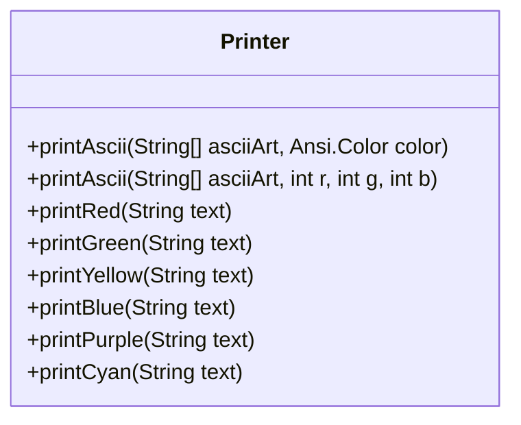
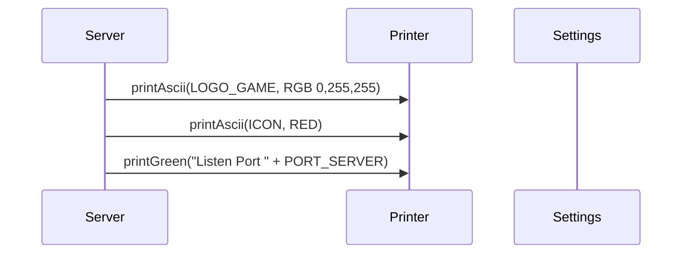
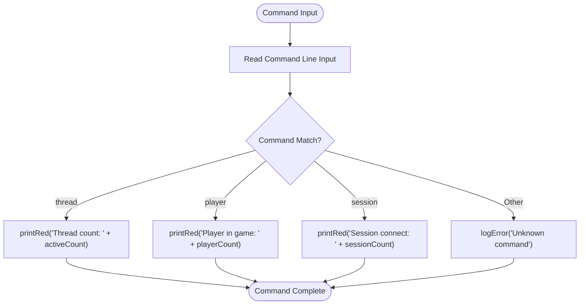

# Console Output Formatting

<cite>
**Referenced Files in This Document**   
- [Printer.java](file://src/main/java/utils/Printer.java)
- [Server.java](file://src/main/java/server/Server.java)
- [Settings.java](file://src/main/java/manager/Settings.java)
- [Logger.java](file://src/main/java/utils/Logger.java)
- [Session.java](file://src/main/java/network/Session.java)
- [CommandMessage.java](file://src/main/java/utils/CommandMessage.java)
</cite>

## Table of Contents
1. [Introduction](#introduction)
2. [Printer Class Overview](#printer-class-overview)
3. [ANSI Color and Formatting System](#ansi-color-and-formatting-system)
4. [Startup Sequence Output](#startup-sequence-output)
5. [Runtime Notifications and Client Events](#runtime-notifications-and-client-events)
6. [Command Line Interface Integration](#command-line-interface-integration)
7. [Error Handling and Logging Integration](#error-handling-and-logging-integration)
8. [Integration with CommandMessage System](#integration-with-commandmessage-system)
9. [Accessibility and Terminal Compatibility](#accessibility-and-terminal-compatibility)
10. [Performance Considerations](#performance-considerations)
11. [Conclusion](#conclusion)

## Introduction
The console output formatting system in the KPAH server is designed to provide server operators with clear, structured, and color-coded feedback during server operation. This documentation details the Printer utility class and its role in generating human-readable console output, using ANSI color codes to differentiate message types such as system alerts, client connections, and error conditions. The system integrates with server startup, runtime monitoring, and administrative command processing to provide real-time operational visibility.

## Printer Class Overview
The Printer class serves as the central utility for formatted console output in the server application. It provides static methods for printing colored text and ASCII art using the Jansi library for ANSI escape code handling. The class abstracts low-level console formatting details, allowing other components to generate visually distinct messages without direct manipulation of ANSI sequences.

**Section sources**
- [Printer.java](file://src/main/java/utils/Printer.java#L1-L48)

## ANSI Color and Formatting System
The Printer class implements a color-coded messaging system using ANSI escape sequences through the Jansi library. Each message type is assigned a specific color to enable rapid visual identification:

- **Red**: Critical errors and warnings
- **Green**: Successful operations and connections
- **Yellow**: Informational messages and status updates
- **Blue**: Detailed error logging and stack traces
- **Purple**: Session lifecycle events
- **Cyan**: System initialization and loading progress

The class supports both standard ANSI colors and custom RGB values for ASCII art rendering, allowing for branded startup sequences with precise color matching.

**Diagram sources**
- [Printer.java](file://src/main/java/utils/Printer.java#L1-L48)

**Section sources**
- [Printer.java](file://src/main/java/utils/Printer.java#L1-L48)

## Startup Sequence Output
During server initialization, the Printer class is used to display branding elements and startup progress. The server displays two ASCII art elements at startup: the game logo in custom cyan (RGB 0,255,255) and a server icon in red. These visual elements provide immediate feedback that the server process has started correctly.

Following the ASCII art, the server outputs a green confirmation message indicating the listening port, providing operators with immediate confirmation of successful network binding. This color-coding allows operators to quickly assess startup status at a glance.

**Diagram sources**
- [Server.java](file://src/main/java/server/Server.java#L43-L47)
- [Settings.java](file://src/main/java/manager/Settings.java#L50-L58)

**Section sources**
- [Server.java](file://src/main/java/server/Server.java#L43-L47)
- [Settings.java](file://src/main/java/manager/Settings.java#L50-L58)

## Runtime Notifications and Client Events
The Printer class is integrated throughout the server's runtime operation to provide feedback on client connections and disconnections. When a new client connects, the system logs an acceptance message in green, including the client's IP address. This allows operators to monitor connection patterns and verify that the server is accepting connections.

When a client session disconnects, the system logs a purple message indicating the disconnection event and the client's IP address. This color differentiation helps operators distinguish between connection and disconnection events in the console output.

**Section sources**
- [Server.java](file://src/main/java/server/Server.java#L78-L79)
- [Session.java](file://src/main/java/network/Session.java#L136-L140)

## Command Line Interface Integration
The server includes an interactive command line interface that allows operators to query server status in real-time. The Printer class is used to format responses to administrative commands, with all output displayed in red for high visibility. Available commands include:

- `thread`: Displays current thread count
- `player`: Shows number of players in game
- `session`: Reports number of active sessions

This consistent red coloring ensures that command responses stand out from other console output, making it easy for operators to locate their requested information in potentially busy console logs.

**Diagram sources**
- [Server.java](file://src/main/java/server/Server.java#L98-L102)

**Section sources**
- [Server.java](file://src/main/java/server/Server.java#L95-L102)

## Error Handling and Logging Integration
The Printer class plays a critical role in the server's error handling system. Error conditions are displayed in red text, providing immediate visual alerts to operators. The system distinguishes between different types of errors:

- Red messages for operational errors (e.g., port conflicts, client handling failures)
- Blue messages for detailed error logging, which include stack traces and are also written to log files

The Logger class integrates with Printer by displaying error summaries in blue while writing complete details to disk. This dual approach provides immediate console feedback while preserving detailed information for later analysis.

**Section sources**
- [Server.java](file://src/main/java/server/Server.java#L61-L66)
- [Logger.java](file://src/main/java/utils/Logger.java#L45-L55)

## Integration with CommandMessage System
While the Printer class handles console output formatting, it works in conjunction with the CommandMessage system that defines protocol constants for client-server communication. Although Printer does not directly process CommandMessage constants, both systems use consistent color-coding principles:

- System alerts (analogous to SERVER_MESSAGE) use green
- Error conditions (similar to ERROR responses) use red
- Informational updates (like STATUS messages) use yellow

This parallel design ensures that operators can develop consistent expectations about message significance, whether viewing console logs or analyzing network traffic patterns.

**Section sources**
- [CommandMessage.java](file://src/main/java/utils/CommandMessage.java#L1-L362)
- [Printer.java](file://src/main/java/utils/Printer.java#L1-L48)

## Accessibility and Terminal Compatibility
The console formatting system relies on ANSI escape codes through the Jansi library, which automatically detects terminal capabilities. The system includes several compatibility features:

- Automatic installation of ANSI support via AnsiConsole.systemInstall()
- Graceful degradation when color is not supported
- Use of standard color names that map to terminal-appropriate values

For terminals without color support, the system falls back to plain text output without formatting codes. The message content remains fully intact, ensuring that critical information is never lost due to display limitations.

**Section sources**
- [Server.java](file://src/main/java/server/Server.java#L42)
- [Printer.java](file://src/main/java/utils/Printer.java#L1-L48)

## Performance Considerations
The Printer class is designed for minimal performance impact during high-concurrency operation:

- Static methods avoid object instantiation overhead
- Direct System.out.println() calls without intermediate buffering
- Simple color mappings without complex formatting calculations

Under high load, the console output system may become a bottleneck if too many messages are generated. The server mitigates this by:
- Limiting verbose output in production
- Using virtual threads for non-critical logging operations
- Avoiding expensive string concatenation in performance-critical paths

The integration with the virtual threading system ensures that console output operations do not block critical server processes.

**Section sources**
- [Server.java](file://src/main/java/server/Server.java#L41)
- [Printer.java](file://src/main/java/utils/Printer.java#L1-L48)

## Conclusion
The Printer class provides an essential interface between the server application and human operators, transforming raw operational events into a structured, color-coded console output system. By leveraging ANSI color codes and consistent formatting conventions, it enables rapid diagnosis of server status and immediate recognition of critical events. The integration with startup sequences, runtime monitoring, and administrative commands creates a comprehensive operational visibility system that supports effective server management.