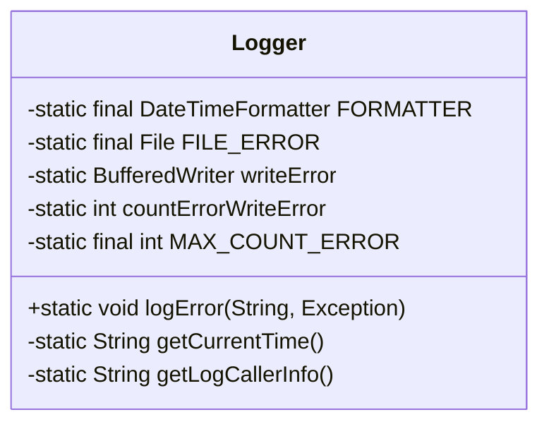
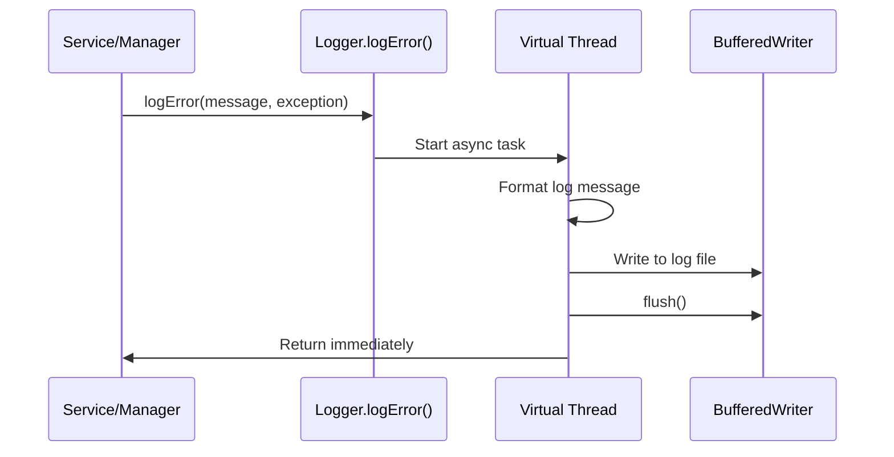
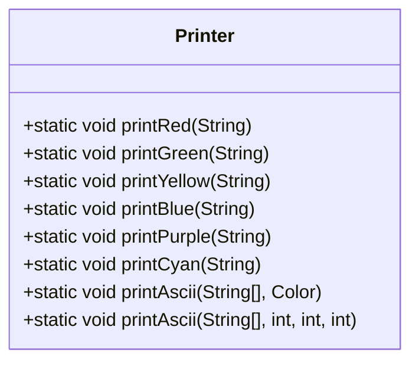

# Logging Utilities

<cite>
**Referenced Files in This Document**   
- [Logger.java](file://src/main/java/utils/Logger.java)
- [Printer.java](file://src/main/java/utils/Printer.java)
- [Server.java](file://src/main/java/server/Server.java)
- [pom.xml](file://pom.xml)
</cite>

## Table of Contents
1. [Introduction](#introduction)
2. [Logger Class Implementation](#logger-class-implementation)
3. [Log Levels and Output Formatting](#log-levels-and-output-formatting)
4. [Thread-Safety and Asynchronous Logging](#thread-safety-and-asynchronous-logging)
5. [Error Logging and Stack Trace Handling](#error-logging-and-stack-trace-handling)
6. [Caller Information and Debug Context](#caller-information-and-debug-context)
7. [Color-Coded Console Output via Jansi](#color-coded-console-output-via-jansi)
8. [Usage in Services and Managers](#usage-in-services-and-managers)
9. [Structured Logging Examples](#structured-logging-examples)
10. [Best Practices for Logging](#best-practices-for-logging)
11. [Log File Management and Rotation](#log-file-management-and-rotation)
12. [Performance Considerations](#performance-considerations)
13. [Integration with External Monitoring](#integration-with-external-monitoring)
14. [Conclusion](#conclusion)

## Introduction
The logging utility in this codebase provides a lightweight, thread-safe mechanism for capturing runtime errors and system events. It is primarily used for debugging, monitoring server operations, and tracking player actions within the game environment. The core implementation resides in the `Logger` class, which leverages Java NIO, virtual threads, and Jansi for colored console output. This document details its architecture, usage patterns, and best practices to ensure effective and efficient logging across services and managers.

**Section sources**
- [Logger.java](file://src/main/java/utils/Logger.java#L1-L100)

## Logger Class Implementation
The `Logger` class is a utility designed to capture and persist error-level logs with contextual metadata. It initializes a log file at startup using a timestamped filename and ensures the log directory exists. Logs are written to a file located in the `log/` directory with a `.log` extension. The class uses `BufferedWriter` wrapped around `FileWriter` for efficient file I/O operations. A static initializer block handles file creation and stream setup, exiting the application if initialization fails.



**Diagram sources**
- [Logger.java](file://src/main/java/utils/Logger.java#L14-L99)

**Section sources**
- [Logger.java](file://src/main/java/utils/Logger.java#L14-L99)

## Log Levels and Output Formatting
Currently, the logging system supports only the ERROR level through the `logError()` method. Each log entry is formatted with:
- Log level prefix: `[ERROR]`
- Timestamp in `yyyy-MM-dd HH:mm:ss` format
- Custom message
- Caller class and method with filename and line number
- Full stack trace of the exception

Log entries are structured for readability and debugging, with clear separation between message, source, and exception details. While INFO, WARN, and DEBUG levels are not implemented, the current design could be extended to support them.

**Section sources**
- [Logger.java](file://src/main/java/utils/Logger.java#L74-L99)

## Thread-Safety and Asynchronous Logging
The `logError()` method uses `Thread.ofVirtual().start()` to offload log writing to a virtual thread, ensuring non-blocking behavior and maintaining application responsiveness under high load. This approach leverages Project Loom’s virtual threads for lightweight concurrency. The `writeError` writer and `countErrorWriteError` counter are accessed within this thread, minimizing contention. Although not explicitly synchronized, the single-writer model (only one thread writes at a time) avoids race conditions.



**Diagram sources**
- [Logger.java](file://src/main/java/utils/Logger.java#L74-L99)

**Section sources**
- [Logger.java](file://src/main/java/utils/Logger.java#L74-L99)

## Error Logging and Stack Trace Handling
The `logError()` method captures both a descriptive message and an `Exception` object. It uses `StringWriter` and `PrintWriter` to serialize the full stack trace into a string, which is then included in the log output under the label "Chi tiết lỗi" (Error Details). This ensures complete exception context is preserved for post-mortem analysis. The method is typically invoked in catch blocks across critical components like `Server`, `Session`, and various managers.

**Section sources**
- [Logger.java](file://src/main/java/utils/Logger.java#L74-L99)
- [Server.java](file://src/main/java/server/Server.java#L82)
- [Server.java](file://src/main/java/server/Server.java#L107)

## Caller Information and Debug Context
The `getLogCallerInfo()` method uses `Thread.currentThread().getStackTrace()` to extract the calling class, method, file, and line number. It inspects the fourth element in the stack trace to skip internal logger frames and identify the actual caller. This information is appended to the log message, enabling developers to quickly locate the source of errors without relying solely on external debugging tools.

**Section sources**
- [Logger.java](file://src/main/java/utils/Logger.java#L90-L99)

## Color-Coded Console Output via Jansi
Console output is enhanced using the Jansi library, which enables ANSI color codes in terminal output. The `Printer` class provides static methods like `printBlue()`, `printRed()`, and others that wrap text with ANSI color sequences. In the `Logger`, error messages are printed in blue using `Printer.printBlue()`, making them visually distinct from other console output. Jansi is initialized in `Server.main()` via `AnsiConsole.systemInstall()`.



**Diagram sources**
- [Printer.java](file://src/main/java/utils/Printer.java#L2-L48)

**Section sources**
- [Printer.java](file://src/main/java/utils/Printer.java#L2-L48)
- [Server.java](file://src/main/java/server/Server.java#L17-L18)

## Usage in Services and Managers
The `Logger` is used across multiple system components to capture critical failures:
- `Server.handleClient()` logs network handling errors
- `Session.loginAccount()` logs authentication issues
- `Manager.init()` logs data loading failures
- `ClanManager.update()` logs clan update errors
- `TopManager.updateTopClan()` logs leaderboard update issues
- `Map.update()` and `ChildMap.update()` log map processing errors

These usages follow a consistent pattern: catching exceptions and calling `Logger.logError()` with a localized message and the caught exception.

**Section sources**
- [Server.java](file://src/main/java/server/Server.java#L82)
- [Session.java](file://src/main/java/network/Session.java#L274)
- [Manager.java](file://src/main/java/manager/Manager.java#L1519)
- [ClanManager.java](file://src/main/java/manager/ClanManager.java#L37)
- [TopManager.java](file://src/main/java/manager/TopManager.java#L41)
- [Map.java](file://src/main/java/map/Map.java#L117)
- [ChildMap.java](file://src/main/java/map/ChildMap.java#L79)

## Structured Logging Examples
Example log message structure:
```
[ERROR] 2024-01-15 14:23:05 - Lỗi Handle Client
	from: server.Server.handleClient(Server.java:82)
Chi tiết lỗi:
	java.io.IOException: Connection reset
		at java.base/sun.nio.ch.SocketDispatcher.read(SocketDispatcher.java:40)
		...
```
This format includes timestamp, message, caller context, and full stack trace, making it suitable for both human reading and log parsing tools.

**Section sources**
- [Logger.java](file://src/main/java/utils/Logger.java#L74-L99)

## Best Practices for Logging
- **Avoid excessive logging**: Only log errors and critical events; avoid logging in high-frequency loops.
- **Use lazy evaluation**: Not applicable currently, as string construction is eager, but could be improved by accepting suppliers.
- **Ensure searchability**: Messages use consistent Vietnamese phrases (e.g., "Lỗi Handle Client"), which should be standardized.
- **Actionable messages**: Include sufficient context (caller info, stack trace) to enable quick diagnosis.
- **Do not log sensitive data**: No evidence of PII or credentials being logged.

**Section sources**
- [Logger.java](file://src/main/java/utils/Logger.java#L74-L99)

## Log File Management and Rotation
Log files are created with a timestamped name (e.g., `log/15-01-2024 _ 14-23-05.log`) at server startup. No rotation mechanism exists; each server instance generates one log file. For long-running servers, this could lead to large files. A production system should implement log rotation based on size or time, possibly using Log4j (present in dependencies) instead of the custom logger.

**Section sources**
- [Logger.java](file://src/main/java/utils/Logger.java#L20-L35)

## Performance Considerations
The use of virtual threads ensures logging does not block game logic. However, synchronous file I/O within the virtual thread could still cause delays under high error volume. The `flush()` call after each write ensures durability but impacts performance. For high-throughput scenarios, consider batching writes or using asynchronous file channels. The current implementation is suitable for moderate loads but may need optimization under sustained high error rates.

**Section sources**
- [Logger.java](file://src/main/java/utils/Logger.java#L74-L99)

## Integration with External Monitoring
While the current logger writes only to files and console, the project includes SLF4J and Log4j dependencies, suggesting potential for integration with external monitoring tools. Future enhancements could route logs to centralized systems like ELK, Splunk, or cloud-based observability platforms via Log4j appenders. Structured logging (e.g., JSON format) would improve compatibility with such systems.

**Section sources**
- [pom.xml](file://pom.xml#L50-L68)

## Conclusion
The logging utility provides a functional foundation for error tracking and debugging in the game server. Its use of virtual threads ensures non-blocking behavior, while Jansi enables readable colored output. However, it lacks support for multiple log levels, structured formats, and log rotation. Migrating to a standard framework like Log4j or SLF4J with a proper appender model would enhance flexibility, performance, and monitoring integration. Until then, developers should use the existing `logError()` method consistently for critical failures and avoid logging in performance-sensitive paths.